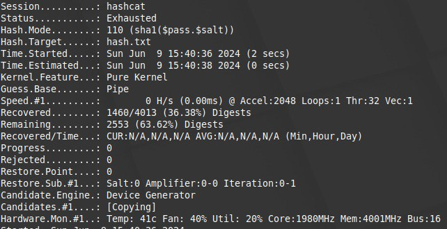

随着新一届的学代会即将在 5 月底召开, 我在科协的 ~~任期~~ ~~折腾~~ ~~被折腾~~ 的日子也差不多到头了 (大雾). 这两年里我到底干了什么事情, 究竟有什么成就 (感觉没啥) 呢? 不妨在此梳理一下.


<!-- more -->


## 开端

加入科协的时候我才刚从电机系转系过来. 那个时候的我还没有被老贵狠狠调教 (大雾), 觉得浑身充满了力量 (大雾), 听说科协都是大佬 (被忽悠惨了), 于是选择了加入看看. 当时我在计算机系认识的人不多 (现在也不多), 主要是 [孙迅](https://www.unidy.cn/), 而他是之前的科协智能体部的副部长. 于是我就糊里糊涂地加入了.

我还记得的第一件事是网络部的面试, 当时我简述了自己的经历和经验, 疑似吓到了部分学长 (笑), 于是毫无悬念就通过了.

第二件事是网络部的第一次 (唯一一次, 乐) 部会, 大家在南区地下吃麦当劳, ayf 激动地阐述了他宏伟的要把 308 改造成网咖的计划 Approval9 (结果是 308 成了寝室, 乐) 和宏伟的要找教学实验室拿到 10 台服务器搞 K8s 集群给同学们提供数据库服务的计划 Database9 (结果服务器跳票了, 乐). 我真是被忽悠瘸了 ()

这时候我听说科协有一些服务器可以玩, 于是我就迈步走向了运维的大坑.

科协网络部有个 Telegram 群, 得益于 Telegram 可以云端保存聊天记录, 我得以查找这两年来发生的事情, 以免依赖于我并不准确的记忆.


### 学生节的网

上溯到 2023 年 9 月 30 号, 我试图把已经无人知道怎么回事的学生节的网扬了重造, 卡在了不知道密码. [Papersnake](https://pka.moe/) 把咱拉进了 Telegram 群. 不过我的聊天记录并非从此开始. 在此之前, Abmfy 在 2023 年 6 月 4 日进群; 2023 年 7 月 26 日, Rug 上有盘 SMART 告警; 2023 年 8 月 5 号, stu.cs. 由于 Hera 的存储池满了而崩溃; 2023 年 8 月 16 日, 科协的校园网账号被封号...

然后 9 月 30 号, 我一天干出了这个群前半年的消息数. 我试图研究了当年宇翔学长留下来的硬件弹幕机 (没有看懂). 然后我当时试图给我们的 WLC 升级固件, 结果我们 WLC 停止支持了官网没法下载固件, 于是去群里捞捞, 得到回复是:

> 不重要

> 系里交换机固件还是2011年的

不过后来我通过神奇的渠道找到了最新的固件, 遂打算升级. 结果学长表示:

> 哈哈，harry上次升级cisco交换机，然后就boot fail了
>
> 解决办法是把flash吹下来，从另一台好的重新烧进去

> 从此我都不敢动 cisco
>
> 成功治好了我的升级强迫症

> 原因是引导新的 image->新的 image 发现 bootrom 旧->刷写 bootrom->刷到一半，另一个 systemd 启动的 service 挂了->那个 service 配置了 fail = reboot ->于是重启了

不过我还是有升级强迫症, 后来还是升级了. 升级解决了一些奇怪的 WebUI 的问题, 还算有点用.

我当时还完全不会配 Linux 的网, 趁着十一假期狠狠学习并轰炸学长. 一开始我配了个 OpenWRT, 被学长蛐蛐说是 "家用级设备" (我现在也这么觉得了); 于是迎着头皮开始重新配 Debian 软路由 (当时我还在担心 Hyper-V 虚拟机能不能跑满千兆). 我在群里表示我配不明白 iptables 啥的, Harry 表示:

> 我的建议是不要依赖工具，你还是得知道它们怎么工作，要怎么配

也对. 于是在 ~3k 条消息之后, 我成功搓出了第一版全是 Bug 但是 it just works 的 .

在这个过程中我一直在群里问一些我现在看十分愚蠢的问题 (x) 学长也觉得十分愚蠢 (x) 但是至少我问了, 我在学, 所以学长们还是很愿意教的.


### 接入 Tinc

这之后我试图给学生节的路由接入管理网, 去问学长们怎么整, 学长表示科协有一个 Tinc 内网. 当时各个服务器的 Tinc 还是用的原始脚本. 我给我自己也开了一个 Tinc 的内网节点, 方便折腾. 在这样的情况下, 可以说已经拿到了核心权限 (吗?).


### 更新 Gitlab

那时候我们讨论的过程中提到了科协的 [Gitlab](https://git.net9.org) (现在因为实在没人用已经给关了), 那时已经落后主线相当多的版本了. 当时清华 Git 也是.

于是后来我就尝试升级了我们的 Gitlab. 这时我已经拿到了 60% 的科协服务的权限, 在 Hera 上新建了一个虚拟机, 折腾了几天, 成功按照 Upgrade Path 升级到了当时的最新版. 详见 . 当时正巧学长们也决定对清华 Git 动土, 也算是探了个路.


### 在 308 淘宝

那时候我还在 308 淘宝, 翻箱倒柜, 想看看能不能找到什么神奇的东西. 我还真找到了. 308 有 82.3GB 容量的机械硬盘, 有一万个各种奇怪的大小和电压的充电器, 榨汁机 (科协活动室为什么有榨汁机?), 有 IDE 和 SCSI 接口的硬盘 (比我年龄大, 可惜没有照片), 谭浩强文选, 酒井文集 (现在得改叫九井文集了), 比显卡大的 CPU (对, Pentium Xeon II)...... 也是开眼了!


### 折腾旧服务器

然后我当时热衷于折腾旧服务器, 先是把一个古老的奔腾拿来当存储池, 研究 zfs; 然后又是把旧服务器到底干嘛用的刨了个遍. 对此 Harry 表示

> 你非要盯着旧服务器干啥。。。

> 真的别用旧的了，对 308 的电费好

但是我就要折腾, 还是找了 4 块 4T 的盘组 RAID5, 后来被神奇的 RAID 卡折腾了一阵之后决定改用 ZFS, 又被 Harry 拷打了一阵之后算是弄好了 (当时的 4 块盘甚至有两块是 SMR)


### 归档旧虚拟机

这之后由于 Hera 之前的存储池要满了, 我在 Server4 建好之后把 Hera 上面的 FTP9 等几个虚拟机搬回了 Server4. 对此, 把 FTP9 从 Server4 搬到 Hera 上的学长表示,

> 兜兜转转又回来了

然后现有的虚拟机都挨个问了一遍, 该关的关了, 该 Archive 的导出到 Server4 之后删了.

这时有个我很绷不住 (Harry 也很绷不住) 的事情, 我们之前有一个 IPTV 的服务叫 TV9, 它的虚拟机硬盘名称叫 "新建虚拟磁盘.vmdk". 由于这个名字起的实在太好还放在根目录里面, 我在浏览磁盘中的数据的时候毫不犹豫就点了 Delete. 由于一切正常, 虚拟机没开, 删除操作十分成功. 对此 Harry 表示

> 不是，不正式怎么了，这点空间能值几个钱，hera 上面还有几块硬盘压根没用上呢，没搞明白之前别乱删啊

我的评价是, 他都叫 "新建虚拟机" 和 "新建虚拟磁盘" 了...

然后因为这个我们决定把 Hera 上面的两块没用上的盘挂上去. 我在组建了 RAID1 之后尝试扩容现有的 Datastore, 于是有了 Harry 经典表情包

<div style="display: flex; flex-direction: row; justify-content: space-evenly; flex-wrap: wrap;">


</div>


### 迁移 Rug 上的服务

如前面所述, Rug 上的 SMART 报警已经挺久了. 趁 Server4 新阵列和 Hera 归档这个机会, 我把 Rug 上的服务 (Git9) 和数据 (备份数据) 分别转移到了 Hera 和 Server4. Rug 的盘就不管了.


### 修 Card9

还记得之前说的 Approval9 吗? 308 本来是有个门锁的, 但是它当时出现了一些物理损坏 (长期拉扯导致电源线的焊点脱落了). 我把它重新焊了上去, 后来干脆量了量尺寸 3D 打印了个壳.


### 锁定不登录的用户

后来我们发现有人用科协的账号登录自己的设备, 问了问是谁也没人知道, 遂决定更改密码 + 锁定服务器上不常用用户.


### 升级服务器

然后我把 Zeus 从 Buster 升级到了 Bookworm, 把 Rug 从 14.04 升级到了 22.04, 中间炸了两次 usrmerge.


### 大改 Hera 的 iptables

由于之前大量的虚拟机变更, Hera 的 iptables 里面出现了大量的过时内容. 我因此大改了 iptables, 手动整理了每一行在干嘛. 没什么大事发生, 就不多写了.


### 修 308 的闭门器

那两个月, 我时常看到 308 的门上有墨水一样的东西, 到处都是. 我一开始还以为是谁故意的 (我怎么会这么以为啊), 后来偶然发现是 308 房门的闭门器坏了在漏油. 于是我把 308 中厅的闭门器拆下来, 把外面的也拆下来, 用两个坏的拼了一个好的, 装了回去.


### 应付网络攻击

时间来到了 2024 年 1 月, 我们的服务器遭到了多个校内 IP 的大规模 SSH 扫描攻击, 我们积极响应, 并固定证据, 扔给 ITS 让他们狠狠封号 (还给我自己也封了, 绷不住) 此事在 [Harry 的博客](https://harrychen.xyz/2024/01/30/my-nuc-got-hacked/) 亦有记载.


### 应付安全工单

然后到了 2024 年 2 月, 学校让网安协会的同学对 stu.cs.tsinghua.edu.cn 进行了一些渗透测试, 某人密码太弱被打烂了, 然后说我们信息泄露啥的. 当时我去把数据库里面的密码哈希拿出来看了看有多少人是弱密码. 你猜怎的? 数据库的**密码的盐是 *salt***. 对, salt 是 *salt*. 我不知道是哪个天才想出来加定盐的, 这和没加有啥区别???

然后简单跑了跑, 跑出了 30% 的密码 (包括我自己的)...



于是我心一横直接在生产环境改代码, 把密码登录整个禁用了, 只允许使用清华 ID OAuth. 后来有几个管理员账号不得不用密码登录 (没有关联的清华 ID), 我又一个一个开白名单.


### 升级 BIOS 和 BMC

然后我又折腾了 Zeus 和 Hera 的 BMC 和 BIOS, 都升级到了最新版本. 方法比较常规, 就不额外说了.


### 天天被封号

科协的账号之前关联的邮箱是一个无人能登录的 gmail, 因此收不到安全工单. 在很长一段时间里, 出安全问题被封号这件事我们只有已经被封号了才能知道. 而那时候几乎每个月都会被封号, 我们也不知道原因是啥, 每次被封号就发邮件问.

然后到了 2024 年 3 月 24 号, 我们终于看不下去了, 我给我自己的邮箱添加了一个别名, 设置了邮件转发, 把账号关联的邮箱改到了我这个上面. 然后就有了如下对话

> Miao Wang, [3/24/24 12:17 PM]
> 我觉得吧，既然是公用的账号，为啥不用公用的邮箱呢？
>
> Miao Wang, [3/24/24 12:17 PM]
> 那个邮箱你又不是登录不上去
>
> Miao Wang, [3/24/24 12:17 PM]
> 你自己不查收邮件
>
> Ajax, [3/24/24 12:18 PM]
> 我都不知道有那个邮箱
>
> Ajax, [3/24/24 12:18 PM]
> （x
>
> Miao Wang, [3/24/24 12:18 PM]
> 交接文档上写得清清楚楚。。。。
>
> JiaJie Chen, [3/24/24 12:18 PM]
> 什么年代的交接文档🤪
>
> Ajax, [3/24/24 12:18 PM]
> 我都不知道有交接文档这个东西
>
> JiaJie Chen, [3/24/24 12:18 PM]
> 我都不知道xs
>
> JiaJie Chen, [3/24/24 12:18 PM]
> shanker你是17年毕业，现在是24年了
>
> JiaJie Chen, [3/24/24 12:19 PM]
> 我也登录不上啊
>
> Miao Wang, [3/24/24 12:19 PM]
> 密码就在文档里。。。
>
> JiaJie Chen, [3/24/24 12:19 PM]
> 我也不知道交接文档是哪个
>
> Miao Wang, [3/24/24 12:20 PM]
> https://docs.google.com/document/d/1I7ZuesxMLYUREDACTED
>
> JiaJie Chen, [3/24/24 12:20 PM]
> request access了
>
> Miao Wang, [3/24/24 12:20 PM]
> 我看蛤蜊都有这个的权限
>
> Miao Wang, [3/24/24 12:20 PM]
> 蛤蜊是啥时候毕业的？
>
> JiaJie Chen, [3/24/24 12:20 PM]
> 那就是哈利没给我！！
>
> Harry, [3/24/24 12:21 PM]
> 我给过你的，你还吐槽上古。。。
>
> JiaJie Chen, [3/24/24 12:21 PM]
> 我没文档权限呀
>
> Ajax, [3/24/24 12:21 PM]
> +1
>
> Miao Wang, [3/24/24 12:22 PM]
> 你俩账号是啥？
>
> Ajax, [3/24/24 12:22 PM]
> REDACTED@outlook.com
>
> JiaJie Chen, [3/24/24 12:23 PM]
> REDACTED@gmail.com
>
> JiaJie Chen, [3/24/24 12:24 PM]
> 能看到了
>
> JiaJie Chen, [3/24/24 12:25 PM]
> 这真的是第一次见
>
> Harry, [3/24/24 12:25 PM]
> 那我是给谁看的？？？
>
> JiaJie Chen, [3/24/24 12:25 PM]
> 这下不解之谜了
>
> JiaJie Chen, [3/24/24 12:26 PM]
> [PHOTO]
>
> JiaJie Chen, [3/24/24 12:26 PM]
> hmm
>
> JiaJie Chen, [3/24/24 12:26 PM]
> 登录需要找byvoid验证


### 给 Zeus 升级硬件!

后来我手痒, 把 Zeus 从单路 E5-2620v2 升级到了双路 E5-2690v2. 两颗 CPU 总共 340 元, 结果不知道怎么走的报销流程, 一定要报资产增值, 拍照片, 啥啥啥的, 然后 hwt 老师来问我, 什么 CPU 一颗 340 元啊. 我跟他说, 这是两颗, 现在这个 CPU 就这个价 ()

后来又买了些内存, 买了些盘, Zeus 成为了 R720 的顶配了 (雾)


### 拆卸 Rug 阵列

过了一段时间, Rug 的盘的健康状况每况日下, 重分配扇区数稳步提升, 我干脆抽了个时间把整个阵列拆了. (反正也有备份)


之后 Rug 就只剩系统盘了.


### 试图关掉 Ghost Hunter

到了 5 月份, 工物系那边来问为什么 Ghost Hunter 挂了. 我 fwd 到群里, 得到的结论是重启 lxc. 后来考虑到 Zeus 上面同时有 docker, lxc, systemd-nspawn, qemu + libvirt, supervisord, 等一众容器化 / 虚拟化服务, 压根不是给人维护的, 我问 Ghost Hunter 到底是谁维护, 能不能改 Docker, 不然能不能关了. 结果没想到一棒子打到了 Harry 头上 (难绷), 气得 Harry 在群里骂人, 并发表了经典言论,

> 再这样下去，计算机系科协网络部真的是要完蛋了

并表示,

> 我对这件事情很不满，谁敢下 crowdai 我就把科协在东主楼的服务都停掉。

不过后来得知工物系找了几个很厉害的同学把他们的比赛工作流程改了, 以后不再需要在我们这边托管服务了. 于是我十分开心地把它关掉了 (笑)

P.S. 今日得知工物系把去年 Ghost Hunter 的 Gitea 扬了, 里面某同学的毕设不幸罹难, 想到 Harry 的谆谆教诲很难不笑 🤣🤣🤣


## 走马上任

2024 年 5 月底, 我走马上任, 成为了科协副主席.


### 托管夏令营招生的系统

这时候, 研究生暑期夏令营开始要招生了, 他们找到我们希望在 stu.cs. 上面挂一个报名网站, 找我部署虚拟机. 他们在生产环境上调试, 但是 Anyway 吧...


### 关闭 Comments9 & Info9 的后端在哪?

之后电机系学生节来找我们借弹幕机用. 我们找了一圈我们的弹幕机怎么用的. 发现我们有前后两版弹幕机, 一板 `comments9`, 一版 `comment9`.  然后我们用的是 Comment9, 于是我关掉了 Comments9 虚拟机.

过了几周, 突然有人来问说 Info9 (那个查成绩的系统) 怎么坏了. 经过了一番查找, 发现 Info9 的后端在 Comments9 虚拟机里面...........

然后就不得不又把 Comments9 虚拟机开机, 之后发现 Info9 并没有好. 后来发现 Info9 之前一直是 tmux 里面挂着的. (天才!!!)


### 升级 Hera + 更多的 tmux

到了 6 月初, 我找到了 ESXi 7.0 的 Dell 镜像, 抽了个时间进李兆基核心机房, 完成了:

- 更新 BIOS
- 更新 ESXi, 6.7 -> 7.0
- 加装内存, 128G -> 384G
- 加装 SSD (后来发现没盘架, 变成了换 SSD)

弄完之后重启, 发现又有些服务起不起来. 尤其让我生气的是有些明明可以静态部署的文档非要用 Debug Server 部署, 还不配置自启动...


### 查资产

然后一个让人绷不住的事情就是查资产. 固定资产确实重要, 应该查, 但是先照片查, 再老师来亲自查, 再老师带着第三方机构来查, 一个资产查三遍, 我不是人是吧.

然后 hwt 的查完过了一个星期又查另一个老师的, 这次又要下载什么相机拍照, 还要看李兆基核心机房的服务器. 我他妈的真见了鬼了


### 修便携屏

科协有一块便携屏 ZenScreen Go, 充不上电. 我给他拿到科服去, 拆开来, 用可调电源强行充了一会, 后来就能用了. 原因是这个奇葩屏幕的充电逻辑是先用电池的电自检, 自检过了再讨论要不要充电. 然后电池里面的电不够自检了, 就死循环了.


### 修 Grafana

这件事情一直在发生, 我给科协的 Grafana 的失效 Panel 都扔一边了, 接入了一些新东西, 设置了更多的用于监测服务状况的报警.


### 讲暑期培训

6 - 7 月, 暑期, 没什么特别的事情. 我在家闲着. [科协 & 算协的暑期培训](https://summer24.net9.org/) 我讲了 [Linux & Git](https://summer24.net9.org/basic/linux_git/Pre-requisite/) 和 [Django](https://summer24.net9.org/backend/django/prerequisites/). 感觉平平无奇?


### 被新准入系统演了一遭

2024 年 9 月, 308 的服务突然全完了, 我的有线网登录了一个叫 `tauth` 的东西. 为了这事, 我当时感慨,

> Ajax, [9/5/24 9:47 AM]
> Zeus 还是搬走的好
>
> Ajax, [9/5/24 9:48 AM]
> 新系馆机房比这地方稳定多了（）

后来得知,

> 校园网本周有少部分子网对接了新AAA系统，你说的这几个系统都是和新AAA相关的，明天会全部撤回，寒假再统一切换。

这引出了我上任之后干的最头疼的两件事


### 被新系馆机房演了一遭

2024 年 10 月, 我们把 308 的服务器搬到了新系馆机房, 详情请见另一篇博客. 由于新系馆的网管老师不想看到这篇博客, 我在这里就不放链接了. 总之是一大坨.


### Zeus 干净了

在搬到新系馆之前, 我把 Zeus 上的所有服务 (对, 所有), 主要是科协主页和奖学金的网站, 该搬走的搬走, 没听说过的统统关掉 (发扬传统美德!), 然后把 / 分区整个备份上 Server4, 然后重装了 ESXi 8.0. 这样一来, Zeus 就彻底干净了, 以全新的姿态准备放入新系馆机房.

在清理 Zeus 的文件时发现里面有 700GB 的某位学长下载的临时文件. 对此 Harry 表示:

> ？？？？？？？？
> smjbwy


### Rug 退休了

在把 Rug 的盘拆掉之后, 再也没有人想起来还有 Rug 这个服务器 (也用不上了, 毕竟现在 Zeus 和 Hera 都扩建了). 我索性把 Rug 彻底关了.


### 文档写了

然后我抽出时间给科协的所有服务编制了一个索引, 简要叙述了每一个服务的状态, 位置, 大致的技术栈. 又把之前散落的文档链接也贴了过来.


### 修 308 门锁

然后鉴于 Zeus 搬走了, 308 的门锁还是得用, 我对着 JS 写的协议搓了个 Rust 的实现, 放到 Server4 上面去了


### stu.cs. 要整改到现状

然后 2024 年 10 月份, 信息化突然把 stu.cs. 的校外访问停了, 说要我们启用 HTTP 跳转 HTTPS 否则不给放开. 但是自古以来, stu.cs. 就是这样做的. 于是 its 让我们整改到现状. 我听不明白, 这件事折腾了两个星期以上, 我理解不了一点.


### 9800 Series vWLC

然后由于新系馆机房的 IP 原因, 我们原来的实体 WLC 并不好用. 我索性弄了个 Cisco 9800 Series vWLC 把之前的 WLC 替代掉了.


### 托管答疑坊系统

没什么特别的, 答疑坊弄了个预约系统, 放到我们这边托管.


### 清理 stu.cs. Nginx

后来因为安全问题被封禁的事, 我去狠狠检查了 stu.cs. 的 Nginx 配置, 发现甚至有学长把 stu.cs. 的部分子目录借给其他人... 拳头硬了!


### stu.cs. 邮件服务

在很久之前酒井 ID 是能群发邮件的, 但是现在不行了. 找了很久之后发现是因为关联的 Aliyun Direct Mail 被封号了. 遂干脆删除有关服务得了.

> 您好，您邮件推送无效地址比例过高，被系统限制外发，且已超过解封次数无法解封，望您理解。
>


### 新二手服务器!!!

由于群里的学长三番五次建议买服务器, 而我们又不想走固定资产的一坨流程, 我干脆自己出钱凑了一台 R730XD, 配置为 2 * E5-2697AV4 + 64GB RAM, 然后找学长淘了 1 * 500GB SSD + 1 * 1TB SSD + 1 * 1.6TB SSD + 6 * 16TB HDD, 又从柜子里翻出来 2 * 4TB HDD + 1 * 2 * 10G PCIE NIC, 搭上了我自己的 1 * GTX 1660. 这下再也不用担心盘不够用了 (笑)


### FTP9 重启!

之前有个 FTP9 服务, 里面有很多公共资料. 我用 h5ai 弄了个新的 FTP9 (实际上是 HTTPS9, 乐), 开放下载权限, 往里面扔了大量东西.

后来里面增加了不少  和十几万本电子书


### VPN9 + Docker9 (乐)

然后我整了个  接入了内网, 得到了稳定的代理服务; 又基于此造了个 Docker 镜像源.


### CST Dify

后来智能体那边说有用 Dify 的需求, 于是我琢磨了一下, 部署了一个 Dify. 但是由于用到了多租户功能, 我让 yjgg 走正式渠道拿到了 Enterprise License, 又把 Community Version 迁移到了 Enterprise Version.

Enterprise License 6.1 到期, 但是届时我应该可以不管了.


### 又是安全工单

然后 25 年 1 月的时候又来了个工单, 说 stu.cs. 有 CSRF 问题. 你说的对, 但是没人会修. 这个工单硬是拖了 5 个月, 前两天才修好.


### 升级准入认证系统

这是另外一个麻烦事. 所有服务必定爆炸......

好在问题不算太大.


### 修 Info9

寒假在家, 出成绩了, 结果因为 Info9 学长写的 Bug, 辅导员传不上去成绩. 害得我放假在家还在晚上 11 点紧急修 Django.


### 写蜜罐

给 Hera [写了个蜜罐](https://gist.github.com/84634E1A607A/a28bbb19ad8386710f4a6f05ab981389), HTTP 1080 / SOCKS5 7890 / SSH 22222 直接 BAN 一天起步 (笑) 这下看谁扫我


### MC 服务器

后来, 我们在新服务器上开了一个 MC 服务器, 就这样玩了几天. 但对 MC 的兴趣总是来去匆匆, 很快我就懒得玩了, 也不知如今服务器上状况几何.


### Cloudflare

我们把 net9.org 迁移到 Cloudflare 了, 这样就可以用 Cloudflare Pages, Worker, Tunnel 等等好东西了!


## 结局

虽然我还没有完全退休, 但是应该也差不多了. 我尽力把科协的服务该拆的拆 (Harry 震怒), 该更新的更新, 该建的建; 又写了不少文档. 但是目前看来, 会有人能接班吗? 我不知道.

流水账到这里就结束了.


## 感想

现在回看整个两年在科协的生涯 (?), 会发现运维这事真的很招笑, 里外不是人.

一方面, 运维对整体的技术水平要求真的很高, 需要长期的经验积累, 并不是随便捞一个人就能完成得了的.

一方面, 大家对运维的期望很高, 觉得运维就应该保证服务的长期稳定, 炸了就是运维的锅.

一方面, 上一代运维 (Harry 学长) 以其过硬的能力和对运维工作的理解表示如下 (我衷心祝愿他能找到接班人):

> 作为运维，核心的能力就是快速理解并能修改已有的系统和配置，而不是躺在舒适区里面，我不理解什么叫“专门学一堆东西”

一方面, 运维又相当于服务安全的责任人, 出了事先找你.

在整体倾向是卷绩点的当下, 我认为这种对科协运维能力的需求, 要求与苛求是办不到一点. 既要灵活使用多种服务, 啥都会, 又要出问题了第一时间赶紧修; 既要给托管的服务以充分的发挥空间, 又要保证整体的安全; 既要尽力保证服务最新, 又要避免 Downtime, 维护还要提前通知; 既要被托管的人催, 又要被信息化催, 活还派不出去没人接手. 这个运维, 不要也罢 ()

后来呢, 我也学会了一点踢皮球的艺术, 什么问题来了, 首先表示 "这是 ITS 的决定, 不是我能改变的"; "这是历史遗留问题, 我无权做决定"; "这是系统的限制, 我也没有办法". 总之, 现在发现, 很多问题, 只要把锅甩到不好欺负的人头上, 那么提出问题的人自然会找到出路.

前几天看到一篇博客, [The Curse of Knowing How, or; Fixing Everything](https://notashelf.dev/posts/curse-of-knowing), 感慨良多. 虽然博客说的是自发地这样, 但是这和我们现在的状况不无相似之处:

很多事情, 你糊弄糊弄也就过去了. 但是我做不到, 我总觉得这样德不配位, 所以总是要花时间修修补补. 但是, 这除了让托管服务的人觉得你很厉害很闲, 出了什么幺蛾子都能找你解决; 让学长觉得你技术不行还一副自信的样子; 还把自己弄得很累之外, 似乎并没有什么额外的意义.

博客里面如此作结:

> What if the real skill isn’t technical mastery? Or better yet what if it’s emotional clarity?
>
> - Knowing which problems are worth your energy.
> - Knowing which projects are worth maintaining.
> - Knowing when you’re building to help—and when you’re building to cope.
> - Knowing when to stop.

这也是给我的一个好问题.


## 收获呢

如果要说在这两年里我有多少收获, 那么必然是很多的. 我学会了一整套 Linux 的网络栈 (好吧没完全学会... 只会一点), 学习了如何使用 Docker (也没学会), 如何检查一台 Linux 机器里面有多少活服务, 谁曾经登录过机器, 如何管理 Linux 的权限 (用户和组), 怎么用 ESXi / vCSA, 怎么正确配置磁盘阵列, zfs, mdadm, 软 RIAD, 硬 RAID, bla bla bla. 当然我也尝试了不少新鲜的东西, 包括但不限于写蜜罐, 部署 Gitlab, 部署 Gitea, 部署 Dify, 配置 Grafana 等等.

但是平心而论, 科协只是提供了一个平台, 而并没有提供那么多的支持.

在电机系入党积极分子的谈话里面, 我们导员曾经问过:

> 你为什么要入党? 你的 *入党动机* 究竟是什么?

或者说,

>  入党对于 *你* 而言的意义是什么? 不入党也可以服务人民; 不入党也可以为国争光. 那么, 你 *为什么* 要入党?

这个问题现在在科协似乎一样存在. 如果是为了技术, 即便没有科协, 你 *也* 可以学到这些技术, 毕竟这并非科协独有的. 学校还有很多社团, 算协的运维, 超算队的集群, 工场的网, TUNA 的技术大拿 (科协小群的超集)... 那么, *为什么* 是科协呢?

一开始应该是觉得科协是一个 "神圣" 的地方. 当时, 我对科协里面群贤毕至, 少长咸集的场面有着美好的憧憬, 也希望我能融入这个高技术的群体, 不断完善自己, 学习先进的经验.

后来, 是对 "调理" 的追求. 不管是配置监控, 翻新学生节的网, 归档旧服务也好, 清晰的调理使我感到愉悦, 简约而精妙的配置与自动化的处理是我心目中的服务应有的样子.

后来, 是对 "安全" 的坚持. 大量服务, Debug 上线, 6 年的 Uptime, 多少 CVE 多少洞... 我是锋利的矛, 也不得不做坚固的盾, 挡在安全的一线.

后来, 是对 "传承" 的担忧. 随着对旧日往昔的涟漪的探索进一步深入, 我开始担心在我之后会后继无人. 招新更是完全证实了我的担忧. 因此, 我尽力整顿服务, 撰写文档, 希望以统一的面貌和最佳实践帮后人踏平一条道路.

再后来, 是对 "技术" 的探索. 副主席任上, 总该推陈出新. 既然有一些想法, 不妨借着科协的平台实践一下.

*现在呢?*

我见过了把 tsinghua.edu.cn 的子域名借给同学霍霍, 全然不顾可能引起的严重后果;

我见过了把生产服务器当垃圾场, 什么作业都往里塞, 有 sudo 就敢把带有 `ip netns` 的脚本拿去跑;

我见过了大批量 pull TUNA 仓库, 被封禁 IP 段之后在群里滑跪;

我见过了 Info9 用 `python manage.py runserver` 在 Comment9 的 tmux 里面一跑 5 年;

我见过了在网关上装 Docker, 任其干涉 iptables;

我见过了在生产环境调试, 出了问题来问如何解决;

我见过了密码加盐用 salt, OAuth 进来不创建本地用户, 程序抛异常不注意数据库一致性, 返回 200 Internal Server Error;

我见过了学生节前一天贴海报, 前 3h 开始尝试直播, 前 -15m 才上线;

我见过了以莫须有的问题限制校外访问, 互相踢皮球;

我见过了 apt 被锁定后不检查原因, 对 apt `kill -SIGTERM`

我见过了自己不查资料盲目蛮干, 就指望运维救场.

最关键的, 我还见到了 Harry 的抱怨——那是一代传奇运维的怒火

> 半夜气得睡不着。我从2019年开始和 hja 接手 PACMAN 的运维工作，到现在已经五年多了。这期间完成了无数的系统安装升级、机器采购上下架搬运、网络部署、硬件维护、账号管理、问题调试等，还包括多次被入侵后修补加固，还有每年至少两次倒闸值班和多次资产盘点等非技术性的工作。世界上一定没有人比我们更熟悉东主楼 9-322 机房的一切了，更不可能有人比我在机房陪伴服务器度过的时间更长。
>
> 尽管这些工作占用了我这五年里无法计算的时间，我从没有为它们索取过额外报酬，一分钱也没有（我都不知道要怎么去计算这个数）。刚开始我觉得这是很好的练手机会，后面也逐渐感觉枯燥，现在就算想脱手也毫无办法，更是不放心，也不舍得我这么多年的心血可能会变成草台班子。
>
> 让我逐渐心寒的是，有些人开始觉得这些是理所应当的。我就像是网吧的网管，对他们提出的需求就有义务快速响应，要有服务的态度。有些博后或许是觉得自己多了个学位就能指挥我，而组里实习的本科生也开始自以为是。我对大家的要求都是一致的，认真读明白文档再来操作。这些很难吗？
>
> 之前有同学发文夸我，说希望我不要毕业。我当然知道这是玩笑，但每次想到这句话就很纠结。就算我真的不离开清华，这种不健康、不公平的模式还能持续多久？

虽然如果 Harry 见到我这篇文章, 他又得生气, "你就这水平还好意思说话" (x), 但是现在科协的不少旧服务因为各种各样的原因, 主要是当时写的烂加上后来修修补补又没有文档又缺人维护, 正在一步步向着残破走去. Aliyun DM 被封号, stu.cs. 动荡不安, 网络账号每月被警告, 硬件弹幕机损坏, 电视机坏掉, Kabana 也坏了...... 我又能如何?

到了终局, 有一种无力回天之感.


## 那下一届?

既然都这样了, 那么问题来了. 下一届, 怎么办呢?

下一届的主席破天荒地需要差额选举产生, 因此至今状况尚未明了; 网络部的副主席倒是选出来了, 但是这一年来我也找不着人 (也不太想找), 如何才能将这一大坨问题传下去?

或许这不是 *我* 应该考虑的问题; 至少, 不是 *现在* 的我能够考虑的事情了.

不如说, 现在这个情况, 也该反思一下我们这一届的问题 (?)

我们有拿科协活动室当宿舍的人, 有拿科协的生产服务器做网原作业的人, 有不知道 Nginx 是什么东西的人, 有把周报变成月报的人, 有动不动下线服务的人, 有什么问题都问 GPT 的人......

> 如此成績, 如何招生!
>
> <span style="text-align: right">
>
> ——發自我的手機
>
> </span>


## 后记

前两天可能纵观古今, 看得自己比较玉玉, 遂有此文. 但是在玉玉之外, 我们依然需要正视问题, 探寻方案, 设法解决.

整体来看, 无论是科协, 算协, 工场, 系团委, 系学生会, 还是无论什么东西, 最突出的问题全都是一个: **缺人**.

为什么缺人? 罪魁祸首一定是绩点改革和目前的保研政策. 换句话说, **有能力不一定能保研, 但是绩点高一定能保研**. 这和高中搞竞赛有异曲同工之妙. 当时, 是 **搞竞赛有可能能上清华, 但是同样的能力, 走高考路线上清华的概率更高**. 同时, 本科生进组提前接触科研 ~~给老师打工~~ 也成为了风尚 (因为导师更倾向于录用熟悉的已经来干过活, 有一定了解的学生. 本科以二作甚至一作发论文更是加分项). 这是 *不争的事实*.

在这种条件下, 卷绩点 + 科研显然成为了更具性价比的选择. 这形成了一个微妙的局面: 科协的骨干在年级的绩点一般不高, 他们在当今的评价体系下并不占优势. 要不是因为我厉害 (傲娇) (不是), 明年下半年有没有书读还是个问题.

> 我們的教育確有問題!

因此, 我现在的感觉是, 至少在过去的一年里, 我们网络部是找不到人的. 学期初还在玩, 然后要复习期中, 然后要做一堆大作业, 然后要复习期末, 然后就放假了都去玩去了. 我也不愿意 Push 小朋友, 纵观我当时的学习历程, 想折腾主要靠内驱力, **催来的工程是没有好结果的**, 我一贯这样认为.

前面也提到了今年差额选举, 为此我和导员有过一些交流. 我大致向他吐槽了在这个位置上的一堆破事和我对网络部找不到人的看法 (即本节的上述看法). 我们导员做了以下表示:

- 人才是需要挖掘和培养的
- 运维这件事需要扩大宣传

科协在宣传和人才挖掘上并无优势 (毕竟大家都是搞技术的), 因此我们导员觉得可以利用辅导员下基层 (大雾) 的优势与团委的荣誉和宣传优势, 让大家了解到运维这个位置, 进而吸引有兴趣的同学.

其次, 我们也提到, 对于一些琐碎的事物, 比如查资产, 处理莫须有的奇怪问题, 维护一些系里的服务等, 系里应该找个人来管 (而不是啥都找科协...). 我觉得对, 但是我对系里不抱太大希望 (我 90% 确信 Harry 也不希望这些服务落到 "老师" 手里, 更别提 "裙带关系" 了).

后面把副主席的活交出去之后, *理论上* 至少不会直接 Push 我了, 我可以以顾问的身份活跃在科协 (而不是乙方). *如果* 导员和下一届的主席 / 副主席能找到人, 或者副主席决定挑起大梁的话, *或许* 科协的服务能传承下去.

昨天和 jiegec 聊了聊, 他对此持乐观态度.

> 在你来之前, 科协也已经摆了好几届了. 总会有人接手的.

确实. 之前研工组那边来问邮件服务能不能修, 被我把锅甩回去了 (毕竟确实 Aliyun DM 被封号了, 我也没啥好办法), 后来也再没来找过我.

*如果服务没人维护, 用户自然会找到出路.*


## 后后记 (2025.5.21)

这周六开学代会完成换届. 上周六, 我们现任副主席与下一任副主席完成了交接. 我非正式退休. 但是我没想到的是, 我还没正式退休, 这篇博客就会有后记.

有两件事我要喷.

第一件, 今天 wst 说要在 stu.cs. 的主页放一个答疑坊的链接, 我让他自己找源码. 后续他找不着, 我只好从 Nginx 配置文件里面溯源. 在之前我已经肃清过 stu.cs. 的 Nginx 配置了, 没想到这次看又有了新发现.

首先是当时他们部署认证代理的时候的测试网页没有删除. 尽管这不造成影响, 但是我还是要喷.

然后是几行代码吸引了我的目光:

```nginx
location ~ ^/~(.+?)(/.*)?$ {
    alias  /srv/static/$1$2;
    index  index.html;
}
```

我看了一下这目录里面有什么, 里面是有按照正常方式需要权限验证的东西的. 于是我又顺手发现一个漏洞, 通过构建这样的网址可以绕过权限校验.

妈的到处都是洞... 算了懒得写更多

第二件, 关于到底为什么下一届有两个人竞选, 和导员的立场与态度, 我从一开始就从不同渠道听到了几种不同解释. 我一向是相信面对面聊天直接传达的内容的. 但是在过去的两周我和不同主体聊到此事时, 他们都坚持自己的观点与看法, 这让我不得不怀疑这次选举的真实目的, 和是否我将成为一枚筹码, 抑或日后运维的工具.

如果果真这样, *我* 应该如何处理? 自然是跑得越快越好了~

