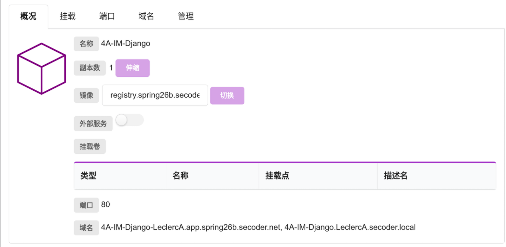

前几天系里开了关于 AI 时代的 CS 教育的研究生论坛, 但是我是本科生, 没有去. [杰哥](https://jia.je/) 去了, 在博客里分享了 [AI 时代的本科 CS 教育随想](https://jia.je/misc/2026/04/12/ai-era-cs-education/). 他对大作业 / 小作业 / 考试等都写了一些想法. 作为本科生, 我觉得他写的很有参考价值, 当然, 我也有一些自己的见解, 遂引用, 形成此文.

<!-- more -->

## 叠甲

本文仅代表本人观点，不代表本系或本校的观点，请勿扩大解读; 我日常发表暴论, 不代表一般计算机系本科生的观点; 引用的部分来自 [AI 时代的本科 CS 教育随想](https://jia.je/misc/2026/04/12/ai-era-cs-education/)

> 仅代表本人观点，不代表本系或本校的观点，请勿扩大解读！请不要让我上 AI 三大顶会（机、量、新），谢谢！但欢迎大家参与到这个讨论当中，因为目前谁也不知道未来应该怎么做。

## 现状

> 为了让读者了解背景，首先要知道前 AI 时代的 CS 教育大概是怎样的：本科的时候先上编程课，教大家各种编程语言，然后逐渐深入到各个领域，课上讲授知识点，课下通过工程训练来夯实，由于计算机是工科，这里面通过不断的工程实践来获取经验，是很重要的一个部分。这一部分学习过程很辛苦，但是确实很有效果，可以说几乎每一位系友都是这么锻炼过来的。
>
> 下面这一段，如果你还在读本科，请不要点开，点开了也请忘掉，按照老师的要求去做：
>
> 

但是，现在 AI 时代来临，很多事情都发生了变化。首先，AI 编程能力很强，大一同学辛辛苦苦学完一年，然后发现自己写的代码还不如 AI 写得好写得快，内心的挫败感和对这种古法编程的学习方法的质疑是无与伦比的。这对课程的教学产生了很大的冲击，因为人很难克制自己的懒惰，面对巨大的诱惑，其实很难静下心去学习这些已经由 AI 掌握的基础课程。论坛上有同学做了个比喻，计算器被发明了以后，人类没有失去心算的能力，因为你为了去用好计算器，还是要知道这些基础知识，从小学起，然后到某一个年级告诉你可以用计算器，然后各种考试还可以出计算器没法解决的题目。但是，AI 的能力边界太大了，它能解决从简单到困难的各种问题，只是有一定的概率解决出来是错的。其次，即使是前几年我们还会觉得，专业核心课的大作业还很难由 AI 完成，似乎还能通过大作业的难度来倒逼大家学习，但在今年也纷纷沦陷，对于学生来说，只要愿意，完全可以自己不写一行代码，纯让 AI 写一个能通过所有测试的作业，自己完全不了解内部是怎么实现的，用很短的时间完成作业。而且还不好去举证，说这一定是 AI 写的。这一点在这次论坛上，不同课程的助教都做了类似的实验，证明了这一点。虽然发这篇博客可能会让一些本科同学看到，然后不好好写大作业，但还是希望更多教育工作者可以看到并参与讨论。如果你是正在上课的同学，就自觉忘记吧。



软工大作业现在 Claude Code Sonnet 4.6 可以在 4h 内完全写完; 去年 , 而这学期助教做了类似实验, Claude Code Opus 4.6 在 2.5h 内获得了 80/80 分, 运行时间 48s; 而其他的工作量更小的作业就更别提了.

但是呢, 以上的情况都是 *建立在杰哥 / Holder / 我已经有相当的编程能力和工程能力的基础上的*. 为什么我要这么说呢? 作为软工助教 (虽然是本科生助教), 我能看到的是, 不少同学即便有了 AI 模型也不能很好完成小作业 / 大作业. 我觉得突出的问题包括:

- 不知道如何正确 Prompt, 比如把 SECoder 平台的照片发给 Claude Code 要求他调试, *"我的部署为什么无法访问?"*

  

  不是, 我他妈怎么知道? 你把这张图发给助教我, 我都不知道, AI 模型怎么可能他妈的知道...

- 甚至不知道有哪些工具, 比如买了 ChatGPT Plus 不知道可以用 CodeX...

## 怎么办

> 首先是关于 CS 教育要培养出什么样的人才。之前，我们要培养的一方面是工程师，在长时间的工程实践当中积累经验，通过自己的经验，可以打造出一个很完备的系统，功能完善，可靠安全。但其实细分看来，在系统的搭建当中，其实有偏向于顶层设计的架构师，也有偏向于具体实现的工程师。目前 AI 已经可以很快地针对一个给定的 Plan 去做实现，并且实现得还不错，但是从需求到 Plan 的这一步，其实还需要人类的专家知识，因为实际的需求往往很复杂，会有许多大模型没有学过的假设与背景，这需要架构师脑子里把架构想清楚，知道哪里应该怎么做，然后把一部分的工程实现外包给 AI，自己再保证它的实现质量，确保它忠实地实现了所设计的架构，并且实现的系统是可靠安全的。用 AI 写代码很容易，但是写出来复杂可靠的软硬件系统，依然不是容易的事情。另一方面是科学家，在科研方面，科研的品味（Taste）变得更加重要，因为许多科研，其工程量本来就很小，完全可以由 AI 代劳，那么谁能够找到正确的路径，谁才能更好地与 AI 协作，完成科研。换句话说，以后的每个科研工作者，可能自己都是通讯作者，手下是一堆 AI 博士生在做实验，自己提出研究的思路，由 AI 实现和写作，然后自己来保证整个过程的正确性和学术伦理。无论是哪个方向，重点都从以前的知道某个东西“是什么”，变成了“为什么”，进而能够判断“对不对”。论坛上有同学总结得好，人类会更多地变成一个鉴别器（Discriminator）。

这一点在软工的教学上也很有体现. 之前我一直在问, 软工这门课程 **"讲的是工程, 写的是软件"**, 课程和大作业有些脱节. 这是因为软工的大作业希望 **"上规模"**, 而在前 AI 时代, 要写出上规模的作业本身需要大量的工作. AI 给软工带来了机遇. 如果我们大作业的代码部分可以由 Agent 代劳, 那么我们就可以让同学们把更多的精力放在需求分析 / 架构设计 / 取舍 / 测试 / 安全性 / 性能 / 持续交付上. 或者说, AI 让 **上规模** 变得简单了, 而只有上规模的软件工程才真正需要工程能力.

但是基于同样的问题, 同学们接触到不同等级的 AI 模型则会有不同的体验. 如果确实打算用 AI 完成 "上规模" 的部分, 则我们需要消灭 AI 贫困, 拉齐 AI 贫富差距, 让所有同学能够平等使用 SOTA 的模型, 这样才能让大家站在同一起跑线上, 进而真正培养同学们的工程能力. 这也是一个很大的挑战.

> 首先，作业已经不再能区分同学，不能代表同学对知识的掌握情况，只能代表 AI 对知识的掌握情况。所以作业已经完全沦为 AI 的课后送分小练习，在目前这个卷绩点的氛围下，让大家都开开心心地拿作业满分，也是越来越普遍了。如果真的想要通过作业来督促同学进行学习，那就必须回归作为人类的基本功，就是通过更多的线下的口语、展示和对话，以最“人味”的方式对抗 AI 的“机味”。事实上，在目前这个时代，其实如何扩大自己的影响力，也是很重要的技能，真的是酒香也怕巷子深，如何能够让大家看到你，抓住大家的注意力（Attention），很多时候会比你做出来的东西有多好更重要。这些能力，其实是值得通过作业的设计来培养的。我在本科的时候，尝试选了一次演讲的课程，当时看到作业要求，人直接麻了：需要每个人在班级所有人面前做演讲，这对于当时还比较社恐的我，由于太过害怕直接退课了。现在想想，其实都是小意思，当你迈出那一步以后，会发现懂得大大方方展示自己，真的是很重要的能力，是 AI 暂时还无法取代的能力。

这件事我倒是没那么担心... 毕竟在几年之前, 作业 *已经* 不能区分同学了 -- 认真写作业的同学的平时成绩不如抄作业的同学, 毕竟在往年答案的面前, 努力没有那么 rewarding. 前两年软工课程上, 我们用 [这样一道题目](https://github.com/THUSE-Course/course-index/blob/175651b573ff304364bb870601cba3176be6e0f8/docs/handout/react/questions.md?plain=1#L81) 来区分大家是否使用 AI 完成小作业:

> *小明是某一家互联网公司的全栈开发工程师，他为公司设计的 JWT 鉴权系统为，将用户名和密码负载在 JWT 上供后端鉴权服务器判断。现在有黑客拦截到了某一条 JWT 信息，但是没能成功获得该 JWT 加密后的签名部分（即第三部分）。请问该黑客有没有成功劫持该 JWT 代表的用户，请说明理由。*

当年的 AI 模型会被 *但是没能成功获得该 JWT 加密后的签名部分（即第三部分）* 这句话影响, 认为既然 JWT 的签名部分没有被劫持到, 那么这个 JWT 就无效, 因此黑客没有成功劫持该 JWT 代表的用户. 而实际上, 由于用户名和密码被负载在 JWT 上, 黑客已经成功获取用户的登录凭据. 当年改小作业的时候, 这道题的得分率惨不忍睹, 即便我在课上明确强调了 **不要把用户名密码直接写进 JWT**, 可见同学们 **不仅没听课, 作业也是 AI 写的**; 然而, 随着时间的推移, 现在的 AI 模型已经能够正确解答这道题目了. 而现如今, 想要找到一个能绕晕 AI 的题目实在太难, 我们也就放弃了小作业.

> 既然作业沦陷了，那么，怎么打分呢？难道让每个人都能拿到满绩点？几年前，我在和大一新生聊天，他们就对这个打分的事情感到困惑，因为在目前这个绩点膨胀的时代里，好像很多课程拿满绩点都是天经地义的事情，如果你这个课不给我满绩点，我就要给你打教评低分。但是，又有不少东西和绩点挂钩，奖学金，保研等等。老师当然可以撒手不管，让所有人满绩点，但这只是让竞争延后、转化为其他领域了而已，不比绩点，那就比谁更能在本科的时候做科研，打比赛等等。另一方面，打分也是一个很重要的督促学习的手段，还是一样的前提，人类是很难抵抗自己的懒惰的，如果不是为了毕业以后有更好的发展，可能会有很多人放弃毕业、放弃学习。以前，为了能够顺利毕业，还会咬咬牙做一些比较困难的学习，甚至可能是自己不喜欢的；现在可以用 AI 糊弄了，那就糊弄过去，反正分数不错，能给父母交差，大环境也不好，然后就陷入了虚无主义，一泻千里。所以，似乎考试成为了最后的防线，还能在一定程度上督促学习。

同意, 但是我不评价. 毕竟我绩点也就系里 70%, 我不好说. 或者说, 评价了也改变不了绩点的地位. 不好好上课 + 考前突击 + 往年题拟合 + 绩点膨胀是大环境保研压力 + 绩点红线 (一条保研线, 到不了就倒闭) + 科研压力 (提前进组, 不然保研的时候没人鸟你) + 游戏诱惑的必然结果: 不上课 + AI 写作业 + 考前靠 *关系* 找到往年题拟合是在当前环境下能最大化自己的课余时间来打游戏 / 搞科研 / 发展兴趣爱好的相对优秀的策略. 何乐而不为呢?

> 但其实考试也受到了巨大的冲击。第一个问题就是，考试是否允许使用 AI 呢？许多 CS 课程，未来都会或多或少地引入一些 AI，那么学生对 AI 的掌握程度，也是一个需要考核的能力。但目前不同厂商的 AI 的可用性与性能差距过大，“AI 平权”会成为一个新的问题，我们希望比的是谁更会用 AI，而不是谁能用上更好的 AI。就像高考作文要考虑贫富差距一样，本科课程的考试也会面临类似的问题。一种可能性是在考试的时候提供统一的 AI 访问，但目前 AI 生态还是比较混乱，指定一个 AI 让大家用，其实也很容易出现与学生平时使用工具或生态不兼容的问题，而且学校自己部署一个同时几百上千人同时用的 AI 服务，也不是一件容易的事情，希望未来有云厂商可以提供类似的服务，并且能够控制住成本，其实就是一个持续两小时的上百 QPS 的专属推理服务。如果要类比的话，其他一些学科允许使用计算器，出题的时候可以规避，但 AI 能做的事情太杂了，其实很难针对。

这是个好问题, 不过我的感觉是, 开一个高一点优先级 + 不限制并发的阿里云 / 智谱就够用.

> 另一方面，如果禁止 AI 的话，也有很多问题。首先是没法考察学生的 AI 使用能力，这个在未来会更加重要。其次，学生自己会比较难接受，先给了 AI 这么方便的工具，结果期末考试又要古法做一遍，最后结果可能就是学期中都在用 AI，只有考试前一周突击一下，考完就忘了，当然，好像现在很多人也是这样呢。而且课程很容易被贴上“不与时俱进”的标签，就如那些用十几年前课件的课程一样。现在这个过渡时期，大家都知道会变，但是怎么变并没有达成共识，所以一定会有一个阵痛期。如果你是刚上本科，或者马上要上本科的高中同学，那就要做好成为小白鼠的准备了。此外，随着本地模型的发展，如果让学生带电脑，即使不给联网，有更好的独立显卡的同学，事实上可以通过电脑配置的优势转化为分数，这也会带来新的不公平性。

这是一个很现实的问题. 软工课程的 PPT 比较古老, 而我们期望大作业是能与时俱进的. (期待下学期的云原生 SECoder?)

> 当然，也不是毫无希望，比如前面说的，加一些有“人味”的考核，唯一的缺点是人力需求较大，难以扩展；或者允许使用 AI，但是必须提交完整的 AI 使用记录，这一点很多地方已经在实践；出题的时候，可能也要想办法去考察学生的思路，一些可以由 AI 完成的作业，不如就直接让学生用 AI 做，变成考察 AI 使用能力的题目。

软工就是 "人味" 的, 但是... 真的需要很多助教x 完整的 AI 使用记录这件事不太好追溯, 系里面在推动可追溯的 AI 平台, 但是一直没有宣发, 感觉还是有一些非技术上的困难.

## 其它的问题

还有一些其他的问题, 比如, 谁是教大家用 AI 的主体呢? 是否应该有一节课教大家用 AI? 是否应该把 AI 使用纳入教学方案和培养计划? 在 AI 日新月异的时代, 这一部分的内容更新迭代会非常快, 这对课程的设计和教师的教学能力都是挑战.

---

引用内容来自 [AI 时代的本科 CS 教育随想](https://jia.je/misc/2026/04/12/ai-era-cs-education/), 获得了 [授权](https://github.com/jiegec/blog-source/discussions/55#discussioncomment-16538936). 本文的引用部分不遵循 CC 协议, 其余部分遵循 [CC BY-NC 4.0](https://creativecommons.org/licenses/by-nc/4.0/) 协议.

The quoted content is from [AI 时代的本科 CS 教育随想](https://jia.je/misc/2026/04/12/ai-era-cs-education/), with [permission](https://github.com/jiegec/blog-source/discussions/55#discussioncomment-16538936) from the author. The quoted content does not follow the CC license, while the rest of the content follows [CC BY-NC 4.0](https://creativecommons.org/licenses/by-nc/4.0/).