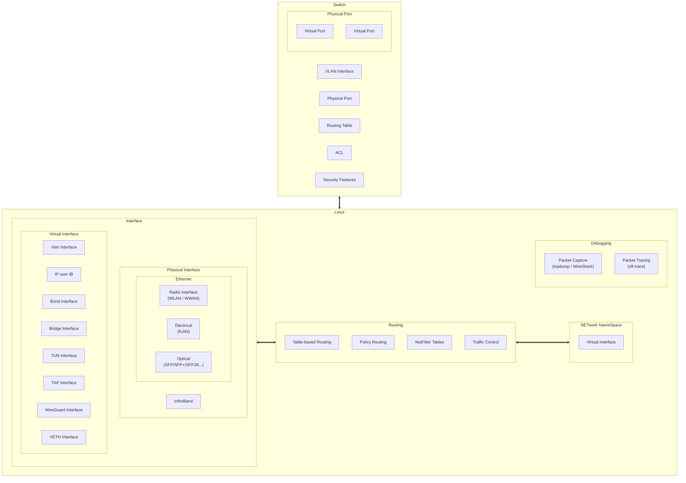

Linux 的网络栈是一个精妙而复杂的结构. 互联网的核心几乎总由其管理 (当然, 还有大量的 ASIC / FPGA 板卡以满足高性能的要求). 这套系统的组成如何, 是如何工作的呢? 我们不妨简述一二.

<!-- more -->

```mermaid
graph TD

subgraph SW[Switch]
  VLANIF[VLAN Interface]
  PORT1[Physical Port]
  subgraph PORT2[Physical Port]
    VPORT1[Virtual Port]
    VPORT2[Virtual Port]
  end
  SWRT[Routing Table]
  SWACL[ACL]
  SWSEC[Security Features]
end

subgraph LINUX[Linux]
  subgraph LINUXIF[Interface]
    subgraph PHYIFG[Physical Interface]
      subgraph ETHERNET[Ethernet]
        RF["Radio Interface
        (WLAN / WWAN)"]
        ELECIF["Electrical
        (RJ45)"]
        OPTIF["Optical
        (SFP/SFP+/SFP28...)"]
      end
      IB[InfiniBand]
    end
    
    subgraph VIRIFG[Virtual Interface]
      VIRVLAN[Vlan Interface]
      VIRIPOIB[IP over IB]
      VIRBOND[Bond Interface]
      VIRBRIDGE[Bridge Interface]
      VIRTUN[TUN Interface]
      VIRTAP[TAP Interface]
      VIRWG[WireGuard Interface]
      VIRVETH[VETH Interface]
    end
  end
  
  subgraph ROUTING[Routing]
    BASICROUTING[Table-based Routing]
    POLICYROUTING[Policy Routing]
    NETFILTER[NetFilter Tables]
    TC[Traffic Control]
  end
  
  subgraph NETNS[NETwork NameSpace]
    NETNSVIF[Virtual Interface]
  end
  
  LINUXIF <==> ROUTING <==> NETNS
  
  subgraph DEBUG[Debugging]
    PCAP["Packet Capture
    (tcpdump / WireShark)"]
    PTRACE["Packet Tracing
    (nft trace)"]
  end
end

SW <==> LINUX

```

