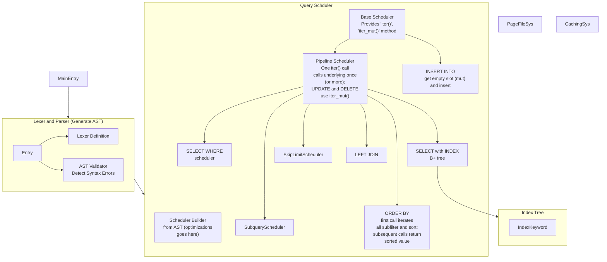

这学期选了数据库系统概论, 大作业是写一个不是很简单的数据库系统. 学期初的时候别人都警告我这门课的大作业很硬, 要至少留出完整的 2 周时间写. 于是我当时下定决心要大战数据库. 结果过了两个星期, 我发现这学期我比我想象的要忙得多, 完全没时间写... 于是我萌生了用 Agent 写大作业的想法. 我用了大概 3~4 天的时间让 Agent 把大作业写完了, 过程不算特别顺利, 但是总体上还算成功. 这篇文章来记录一下怎么回事.

<!-- more -->

## 选题

一开始的时候, 我打算大干一场, Over Engineer 了不少高级 Feature, 甚至尝试画了抽象架构图.

然后我当时被坑骗了, 用了 Chumsky 这个 Rust 的 Parser Combinator 库来写 Parser. Parser 硬着头皮写了两天, 总算是能用了; 但是后面还是发现了一堆 Bug. 这恐怕是我整个大作业里面手写代码最多的时候了.

当时在给这个数据库项目想名字. 咱喵是 Ajax, 然后这是数据库作业, 于是全称 Ajax Database, 简称 ADB, 主打一个碰瓷 Android Debug Bridge.

## 事情的开端

到了第三周左右, 因为一些 "前端开发" 的工作, 我被骗去实习了; 同时当时还有超算比赛的事情, 我逐渐发现这个学期写大作业的时间疑似比我想象的要少得多. 于是我开始考虑用 AI 来写大作业的可能性. 当时, 我总结了这个大作业情况:

1. 有一个 [比较详细的文档](https://thu-db.github.io/dbs-tutorial/) 可以作为参考
2. 我已经写了一部分 Parser
3. 项目是 Rust, Rust 有比较强编译器, 一般来说只要能编译过, 大部分功能就没什么大问题; 同时有比较好的单元测试支持
4. 我已经看过两遍文档, 对整个系统的框架有了一定的了解

然后当时我:

1. 有 Copilot 的教育版, 可以用 Claude Sonnet 4.5
2. 虽然并没有 ChatGPT / CodeX, 但是也不是不能有
3. 已经有不少的 Vibe Coding 的经验 (笑), 凭感觉, 我觉得 Claude Sonnet 已经有能力写完这个大作业了

于是我决定试一试用 Agent 来写完这个大作业.

大作业的源码在 [Github 仓库](https://github.com/84634E1A607A/DBS-ADB), 里面有一些记录.

## Claude Sonnet 大举进军

要让 Agent 搞明白怎么写这个大作业, 首先要让它理解需求. 一开始的时候, 我给了 Agent 一大段话, 要求他先阅读文档和测例, 根据要求写一个 IMPLEMENTATION_PLAN.md

由于 Agent 经常 Over Engineer, 我特意强调了 "你只需要实现能通过测例的功能, 不要过度设计".

> Your overall goal is to create a simple database management system that has basic functionalities such as creating, reading, updating, and deleting records. The system should be able to handle user input and store data in a structured format.
>
> You have a reference document dbs-tutorial/, in which you can find useful information and examples to help you achieve your goal. Make sure to explore the document thoroughly and utilize the information provided to build this system.
>
> The codebase is written in Rust in adb/ directory. Before importing any external libraries, prompt me for approval.
>
> Your testcases are located in dbs-testcase/ folder, check dbs-testcase/README.md for instructions on how to run the testcases against your implementation. Your implementation is good, as long as it can pass relevant testcases.
>
> \#\# Step 0
>
> I need you to read through the tutorial and plan ahead for the implementation. Make sure you understand the concepts and requirements before starting the coding process. You should document your understanding and plan in a separate file named IMPLEMENTATION_PLAN.md. Write down the structs, traits and modules you plan to create, along with their responsibilities and interactions.
>
> Also check the testcases in dbs-testcase/ and understand to what extent they cover the functionalities described in the tutorial. You just need to implement the DBMS so that it can pass the cases, so don't over-engineer your solution.

于是 Agent 阅读了文档, 写了一个还行的 IMPLEMENTATION_PLAN.md . 我检查了这个文档, 修改了一些不太合理的地方. 这个文档我觉得还是很重要的, 它帮助 Agent 理清了思路, 知道每一步要实现什么功能.

然后根据这个文档和作业的文档, 我依次让 Sonnet 实现了各个模块. 对于每一个模块, 我要求他写单元测试, 保证每一个模块都能独立通过自己的测试; 同时, 对于后续的模块, 我要求他写集成测试, 保证 (好吧, 最大程度上保证) 各个模块能协同工作.

同时, 我在提出 Prompt 的时候, 要求 Agent:

> Check IMPLEMENTATION_PLAN.md for design details and AGENT.md for goal. For now, draw a detailed plan and output it directly here before you start coding. If you have any questions, ask me before you start coding.

这样 Agent 会先通读文档和已有的代码, 遇到问题先记下来一起问我, 等双方统一意见之后再写代码. 我觉得这也是一个非常重要的环节; 之前经常出现 Agent 写着写着我就发现它和我的理解完全不一样, 结果白写了一堆代码的情况. 这个环节可以有效避免这种情况, 提高效率, 节省 Token.

## Claude Sonnet 写不明白 B+ Tree

索引模块文档期望实现 B+ Tree. 我第一次让 Agent 实现的时候, 它写完代码, 写完测试, 发现测试过不去, 然后就开始修. 我就看着他改来改去, 怎么改都不对, 按下葫芦浮起瓢. 在折腾到 Context 几乎用完之后, 我放弃了, 把所有更改都 revert, 直接重来. 这一次我在 Prompt 里面要求他实现 "最常见的 B+ Tree 结构", 他又写了一遍, 调试了一会, 总算是通了.

后面, 他实现了索引, 大体都能跑起来了, 和我的 Parser Hook 上之后, 就进入了跑测例环节.

## 不仅爆内存, 还慢的要死

跑测例的时候有一个 "Data" 测例. 内存限制是 256MB, 测试的时候根本搞不定. 我采取了直接忽略的办法, 首先验证正确性, 然后再想办法优化性能和内存. 具体地说, 我直接把本地测试的内存限制改成了 25600MB.

然后我发现 LOAD DATA 的时候速度非常慢, 而且是越到后面越慢. 我要求 Claude Sonnet 找到问题并解决, 他找不着. 于是我要求他帮我 Profile 并分析结果. 经过了一通折腾, 还是效果不好. 最后, 我决定让他直接分析复杂度. 他最终发现, 在 INSERT 的时候, 他的代码不是直接在页面文件的最后追加, 而是每次都查找一下有没有空闲的槽位可以使用. 这个操作导致了 INSERT 的复杂度从 O(1) 变成了 O(n), 于是越来越慢. 我要求他针对 LOAD DATA 优化, 什么东西都不要检查, 假装数据都是合法的, 直接追加到文件末尾. 这样一来, LOAD DATA 的速度就上去了.

然后优化内存, 内存爆炸主要是因为在建立索引等的时候, 它直接把整个表 (2GB) 都读到一个 `Vec` 里面了. 我要求他分块读取, 只存索引列, 如果数据量太大就 External Sort. 经过一番折腾, 内存终于过了... 不过还是不太好 (主要是我的索引和正常的页面是两个分离的文件, 没有用统一的页面文件管理器 (因为我不信任 Agent 能把这个的生命周期写明白), 同时多个索引也是直接全都读到内存的, 这部分内存开销比较不稳定, 索引多了就爆), 但... 反正在测例里面没问题, 我就懒得管了.

## Copilot 额度用完了

然后调试性能把 Copilot 的额度几乎用完了. 好在当时我拖我朋友帮我充值了 ChatGPT Plus, 有 CodeX 额度可以用. 于是我改用 CodeX 继续写.

CodeX 的历史记录找不着了, 但是可以说的是, CodeX 很厉害, 不比 Claude Sonnet 差. 我让它对着测例, 一个一个 feature flag 加, 一个一个跑通. 大概用了两天时间, 它把所有我想实现的功能都跑通了.

## 有人破防有人笑

我一开始表示我要用 Agent 写的时候, 某 Rust 魔怔人表示 "Agent 肯定没有我写的好", 对自己手写的 Rust 十分自信. 这激发了我的潜力 (雾), 一定要让她下不来台. 于是用 Agent 开始跑通功能的时候, 我一边写, 一边给她发进度, 然后她发现一天时间里 Agent 就把她当初写了一个星期的功能都给写完通过了. 她非常生气, 表示 "肯定没有她跑得快!" 然后把她写的代码拿来跑测例. 没想到, 她的代码直接爆内存, 跑不过测例; 而且即便我调大了内存限制, 整体的速度也不如我用 Agent 写的代码. 于是快进到t她看着 Agent 生成的 Rust 代码表示 "这一点也不 Rust!" (笑) (逃)

然后还有一位去年拿 Rust 写数据库的大手子听说之后大呼他选课太早了, 应该晚一点这样他也可以使用 Agent 了 (乐)

## 验收

大作业验收的时候我跟助教说我几乎都用 Agent 写的, 助教表示, 他们不禁止使用 AI, 因为之前所有用 AI 的都写不明白. 我能用 Agent 写完 11k 行 Rust, 说明 "工程能力了得". 笑死了.

同时, 作业要求有 "关于实验系统设计的交流讨论是被鼓励的，但 {NAME} 知道作业源代码的交流是严重违反学术规范的，因此 {NAME} 保证学期结束前不会将自己的代码透露给其他组的同学。", 但是现在已经学期结束了, 所以现在我公开一下代码想必也没有什么问题 (逃)
