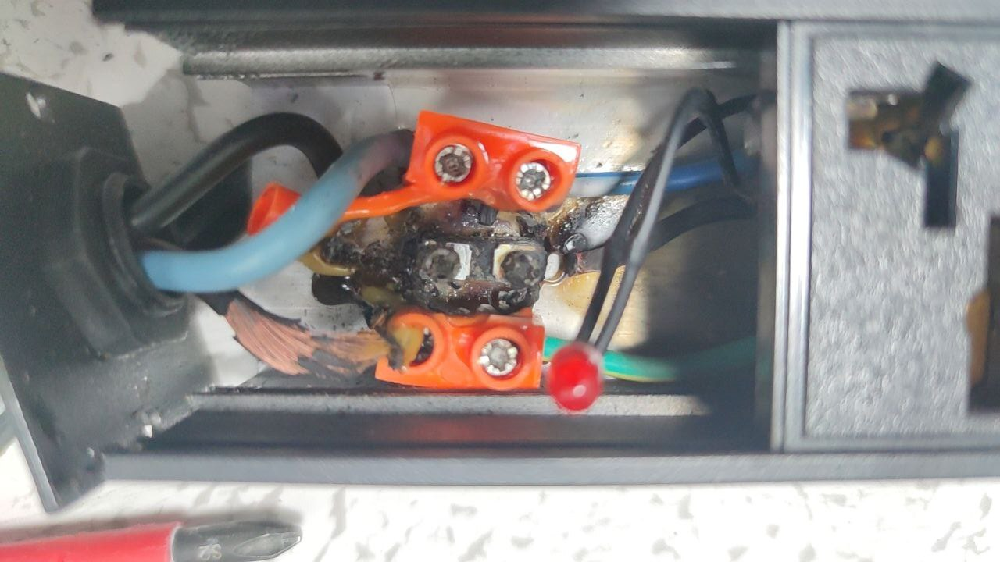

8 月份, 经过了 ~~惊心动魄~~ 乱七八糟的保研, 我半只脚给我在你清的生活续命了一年 (你别问为啥是一年, 不是因为我延毕了, 而是工程博士清华只管一年, 后面就扔给联培单位了). 然后就开始了大四, 本来在我的规划里面, 这个学期应该是轻松愉快, 主要放在比赛和科研上的; 不过刚开学没多久 ~~我就找了一堆事情~~ 就有一堆事情找上我, 于是这个学期又忙得不可开交了. 真是闲不下来啊.

<!-- more -->

## 工作总结

### 科协

科协是啥? 我不认识. 反正这个学期有人找我我就甩锅. 不过也确实不该我管了.

### 科服

本来我预期这个学期可以在科服狠狠打工 (笑), 结果一学期我差点强制退队 (bushi), 实在是太忙了根本没时间去修电脑.

十一的时候家里拖着我去张家界玩, 路上我写了一篇  讲义, 十一月的时候作为科服培训的一部分讲了一下.

这学期科服终于有了 "中期考核" 这个东西. 虽然中期考核完全没打算考我 (可能我一眼不用考?), 但是本着看热闹不嫌事大的精神, 我在某个晚上躺在宿舍床上简单刷了一下题目... 于是就有了 [柯基的考核回顾](https://mp.weixin.qq.com/s/3nGLsr2627mI0RHtBZL3VQ) 里面的获得 120 分, 击败 100% 同学的截图 (笑). 做推送的同学在下面打了个括号 *好强悍的实力您到底上了多少班*, 但是看上去我真的没什么时间上班 (悲).

### 工场

我也没有带什么项目, 实在是太忙了 (

不过也用不上我带什么项目. 机房如果着火我就去看看... 说到着火...

建机房的时候某个插排的线头没接好, 把接头烧化了, 差点着火

### 学生节

今年学生节还想找我弄网, 我一开始直接拒绝了, 跟他们说实在不行就别弄网了. 后来他们又来找, 然后我表示那你们弄, 我就看一看. 于是他们给我整了个什么 "网络架构师" 还是什么之类的头衔. 我一看, 反正不是负责人, 那我就弄好跑路得了. 后来我也确实是弄好就跑路了, 起码没让我收线.

但是我要喷, 今年的网线收上来真是一大坨啊...

### 实验室

实验室这边给我的事情大都不方便放在博客里面. 不说.

### 超算

见 

## 学业

保研完了, 这学期就没什么大事了. 这个学期的课程我似乎也去的不多. 还是简单列一下吧

### 互联网工程设计

本来我打算选这门课, 也选上了. 但是第二周由于我课上太积极了, 和老师聊了一下, 那位老师对我们组里面做的东西一脸嘲讽, 我看不惯一点, 就直接退了.

### 围棋与中国文化

这是个讲围棋的课程. 上课可以下棋, 但是到后面我下不动了 (忙死了), 就直接翘了. 期末考试是神秘围棋文化题, 考虑到这个课是 PF 课不可能挂, 我就尽力瞎写了.

### 京剧与中国传统文化

你别问我为啥选了这么多抽象通识课, 都怪你清. 这节课讲了京剧的历史, 文化, 怎么看京剧啥的. 还有一个神秘大作业没写. 先不管

### 数据库系统概论

这是一节很硬的课, 主要是大作业是手写数据库, 要实现 SQL 解析, 执行, 索引, 联查, 乱七八糟的一堆功能... 但是... 考虑到现在有 AI, 我真的很好奇 AI 现在到底能不能独立 (或者在监督下) 完成这么复杂的工程... 我就试了一下. 结论: AI 用了 3 天时间写完了所有东西, 我只负责跑测试 + 定位 Bug + 让 AI 改. AI 写出来的数据库还相当快. 让我猜猜到时候助教验收的时候听说我用 AI 写完了会不会相似 / 想打人 (逃)

### 计算机网络管理

啊对, 这个不是计算机网络 *原理*. 这个主要是讲如何管理网络 (五大块, 配置管理, 性能管理, 故障管理, 安全管理, 计费管理). 大作业是实现一个神秘网络管理系统, 我们用 Grafana + Prometheus + 一坨神秘开源组件弄了一个能跑的东西. 老师居然还挺满意.

### 高性能专题训练

这玩意是个赛课结合, 打 IndySCC 就行, 我好像完全不知道这个课到底要干啥 (应该是给了一堆选题, 然后选一个做, 打比赛是其中一个).

## 实习

然后一些抽象事情. 开学的时候高老板突然问我说有一个前端开发的工作, 问我有没有兴趣. 然后我去聊了一下, 感觉他们还挺厉害, 就答应下来. 没想到啊, 去了之后他们把前端的 spec 给我一看, 我表示这玩意一个人开发不了一点, 然后我就变成了运维. 然后又干了神秘后端, 神秘测试, 神秘 IT, 总之都很神秘. 但是课题组的事情又很忙, 我也没什么时间去实习, 于是就更神秘了.

---

反正忙忙碌碌, 这学期就突然就过完了. 感觉现在不能写的逐渐变多了, 能写的逐渐变少了 (?)

好像也没有更多有意思的事情, 就这样吧
