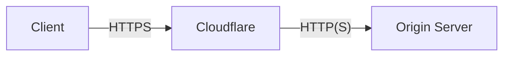
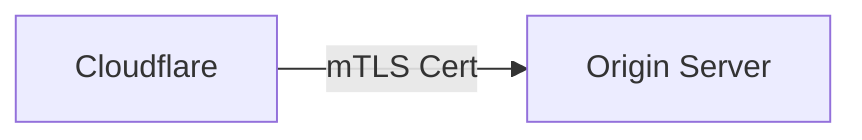
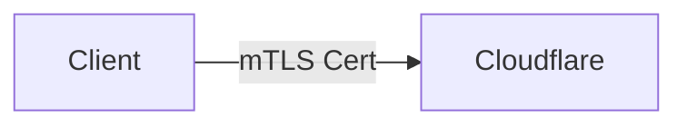

这篇博客简单介绍了一下 Cloudflare 的 mTLS 功能, 以及如何配置.

<!-- more -->

## 威胁模型

对于 Cloudflare 之类的 CDN, 其处于用户 (Client) 和源站 (Origin) 之间, 代理用户的请求, 同时进行缓存 / WAF / 认证等操作.



对于 CDN, 站长 (Site Admin) 有几个基本需求:

- 保护源站, 尽可能避免从网络侧 *发现* 源站 IP, 以防 DDoS 直接攻击源站
- 保护源站, 使得即便发现了 IP, 也无法直接 *访问* 源站 (需要经过 CDN 和 WAF)
- 尽可能好的缓存策略和性能
- 认证用户, 使得仅有合法的用户可以访问源站

Cloudflare 的 CDN 本身可以隐藏源站的 IP (但是 *并不完美*), 攻击者可能通过 SNI 扫描等方式发现源站 IP. 因此,

- *建议* 可以使用 IPv6 Only 的源站 (或者不听 IPv4 地址), 这样可以避免大部分的扫描攻击.
- 如果不得不使用 IPv4, 则对于 Cloudflare, 其公布了 [IP 地址列表](https://www.cloudflare.com/ips/), 可以通过防火墙规则只允许这些 IP 访问源站 (这样虽然 **不能** 阻止如果被发现了源站 IP 的 DDoS, 但是可以阻止 *大部分* 的扫描, 使得源站不容易被发现) (当然, Cloudflare Workers 也会使用这些 IP, 因此这样做不是 100% 安全的)
- 也可以用 Cloudflare Tunnel; 但是不那么... 好?

## 到源站的 mTLS

mTLS 可以用于认证客户端的身份. Cloudflare 支持 [Authenticated Origin Pulls](https://developers.cloudflare.com/ssl/origin-configuration/authenticated-origin-pull/), 即, Cloudflare 在访问源站的时候, 如果要求证书, 会提供一个客户端证书. 此客户端证书保证 *拉取请求是由 Cloudflare 发起的* (但是不保证是由 *你的账号* 发起的). 此证书在 [此文档](https://developers.cloudflare.com/ssl/origin-configuration/authenticated-origin-pull/set-up/zone-level/) 中记载. 即


当前的 CA 证书为

```
Certificate:
    Data:
        Version: 3 (0x2)
        Serial Number: 6310029703491235425 (0x5791ba9556c22e61)
        Signature Algorithm: sha512WithRSAEncryption
        Issuer: C=US, O=CloudFlare, Inc., OU=Origin Pull, L=San Francisco, ST=California, CN=origin-pull.cloudflare.net
        Validity
            Not Before: Oct 10 18:45:00 2019 GMT
            Not After : Nov  1 17:00:00 2029 GMT
        Subject: C=US, O=CloudFlare, Inc., OU=Origin Pull, L=San Francisco, ST=California, CN=origin-pull.cloudflare.net
...
```

此外 CLoudflare 也支持 Account Level 的 mTLS 证书, 但是前提是... 你得上传一个自己的证书. 但是上传证书需要一个 $200/mo 的付费计划... 我至于吗我 (

有了这个 mTLS 的验证, 我们就可以配置源站直接拒绝任何非 Cloudflare 的请求了. 这可以杜绝应用层绕过 WAF 的攻击.

## Origin Certificate

此外, 由于需要与源站做 mTLS, 源站也需要一个证书. 我们可以使用 ACME 的证书 (但是! 这可能带来副作用, 由于证书透明要求, CT 日志会记录申请的域名; 再一个... 我懒得配 (bushi)); Cloudflare 也提供了一个使用自签名证书的方式, 叫 [Origin CA](https://developers.cloudflare.com/ssl/origin-configuration/origin-ca/), 可以免费申请一个自签名的 CA 证书. Cloudflare 会信任这个证书, 用于与源站的 HTTPS 连接. 这个证书可以签 10 年的, 就不用定期更新了.

## 到客户的 mTLS

有时候, 一些敏感的站点我们希望认证客户的身份. Cloudflare 有 Access 功能; 我们同样可以 [使用 mTLS 证书来认证客户的身份](https://developers.cloudflare.com/ssl/client-certificates/).



这样, 只有持有合法证书的客户才能访问站点. 不过, 这里 Cloudflare 会给一个证书 PEM 和一个私钥 PEM, Chrome 浏览器似乎不认识. 要用

```sh
openssl pkcs12 -export -out cf_mtls_cert.p12 -inkey cf_mtls_cert.key -in cf_mtls_cert.crt
```

转换成 PKCS#12 格式, 才能导入浏览器. 导入之后, 在访问站点时, 浏览器会弹出选择证书的对话框. 之后在 Cloudflare Access 里面可以配置仅允许持有 Client Cert 的用户访问.
