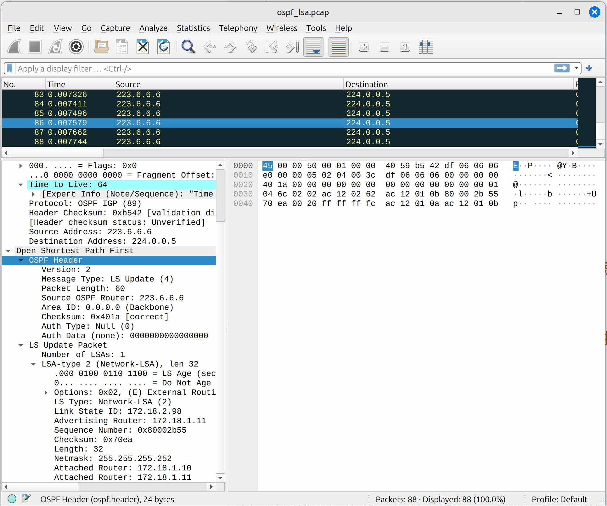

在  中我们讨论了 SNMP 暴露带来的被打烂的问题. 在那篇文章之后, 本着不扫不知道的原则, 我对你清校园网整个扫了一遍, 检查了是否有类似的问题存在. 结果令我大开眼界.

<!-- more -->

首先是我扫出来了 200 多个开放的 SNMP. 这些大多是 **打印机** (或许等期末周之后有时间了我会去研究一下有没有利用的可能). 有的甚至是 Read-Write 的. 但是这都不甚重要, 毕竟打印机就算再厉害感觉也没什么花活可以弄. 那么重点是什么呢? 重点是在学校的核心段 `118.229.0.0/16` 里面有一台核心路由器的 SNMP ACL 没有正确设置, 给漏了. 这个事就大了. 毕竟是学校骨干网的读权限, 还是能拿到很多信息的.

## 基本思路

当拿到了这样一台交换机的读权限之后, 我们应该关注什么东西呢?

- ISO SNMPv2 MIB. 这是基本信息存储的位置. 可以看出这玩意连续运行了 322 天, 要么是 *比较重要但没有那么重要的设备*, 要么是 *有热备的设备*, 不然应该会一直放着不重启.

  ```text
  SNMPv2-MIB::sysDescr.0 = STRING: H3C Comware Platform Software, Software Version 7.1.070, Release 2719P01
  H3C S12508X-AF
  Copyright (c) 2004-2022 New H3C Technologies Co., Ltd. All rights reserved.
  SNMPv2-MIB::sysObjectID.0 = OID: HH3C-PRODUCT-ID-MIB::hh3cS12508XAF
  DISMAN-EXPRESSION-MIB::sysUpTimeInstance = Timeticks: (2786528611) 322 days, 12:21:26.11
  SNMPv2-MIB::sysContact.0 = STRING: New H3C Technologies Co., Ltd.
  SNMPv2-MIB::sysName.0 = STRING: **Reducted**
  SNMPv2-MIB::sysLocation.0 = STRING: Hangzhou, China
  SNMPv2-MIB::sysServices.0 = INTEGER: 78
  ```

  这是 *一台* H3C 的大 (真的很大) *交换机* (对, 定性还是交换机不是路由器)

  

- H3C LLDP MIB. 一般 LLDP 都是开着的, 看 LLDP 可以迅速搞明白这台机器的物理上连接在什么地方.

  ```text
  LLDP-MIB::lldpRemPortId.2618351348.12774.1 = STRING: "Ten-GigabitEthernet2/7/1/1"
  LLDP-MIB::lldpRemPortId.2653856699.1207.1 = STRING: "xe-1/0/4"
  LLDP-MIB::lldpRemPortDesc.2618351348.12774.1 = STRING: ZJ**REDUCTED**ZW
  LLDP-MIB::lldpRemPortDesc.2653856699.1207.1 = STRING: To_**REDUCTED**ZW-1
  ```

  可以看出来这台交换机是 10G 接入的, 不处于核心的位置; 接入的东西不多, 但是有其特殊的功能. 后来我去找有关人士汇报了这个问题, 顺面问了问这是啥. 得知这是学校 *"资源子网"* 的一台备份交换机. (确实符合常常出问题的位置定义...)

- RFC1213 MIB. 这里面有路由表信息. 当时我看到这个的时候发现不对劲, 这里面怎么啥都有? 这时我立刻反应过来这台交换机是学校 OSPF 的一个节点. 这里面有 OSPF 协商得到的全部路由表. 从这里可以明确看到这个 AS 的子网分配情况. 不过这里面的东西相对没那么好用.

  ```text
  RFC1213-MIB::ipRouteDest.166.111.35.192 = IpAddress: 166.111.35.192
  RFC1213-MIB::ipRouteDest.166.111.36.0 = IpAddress: 166.111.36.0
  RFC1213-MIB::ipRouteDest.166.111.38.0 = IpAddress: 166.111.38.0
  ```

- H3C INFOCENTER MIB. 这里能拿到交换机的最新 512 条日志

  ```text
  HH3C-INFOCENTER-MIB::hh3cICLogbufferContDescription.23 = STRING: %Oct 31 15:04:30:499 2024 ZYBK SSHS/6/SSHS_LOG: Accepted password for **REDUCTED** from **REDUCTED** port 64018.
  HH3C-INFOCENTER-MIB::hh3cICLogbufferContDescription.24 = STRING: %Oct 31 15:04:31:525 2024 ZYBK SSHS/6/SSHS_CONNECT: SSH user **REDUCTED** connected to the server successfully.
  HH3C-INFOCENTER-MIB::hh3cICLogbufferContDescription.25 = STRING: %Oct 31 15:04:31:873 2024 ZYBK SHELL/5/SHELL_LOGIN: **REDUCTED**.
  HH3C-INFOCENTER-MIB::hh3cICLogbufferContDescription.26 = STRING: %Oct 31 15:04:32:602 2024 ZYBK SHELL/6/SHELL_CMD: -Line=vty0-IPAddr=**REDUCTED**-User=**REDUCTED**; Command is su
  HH3C-INFOCENTER-MIB::hh3cICLogbufferContDescription.27 = STRING: %Oct 31 15:04:34:489 2024 ZYBK SHELL/6/SHELL_CMD_INPUT: Input string for the su command is ******.
  ```

  能看到这个机器其实还是积极维护的, 只不过确实有一些疏忽导致了安全问题.

- OSPF MIB. 通过前面我们知道这玩意要么 RIP, 要么 OSPF, 肯定跑了域内路由协议. 而 RIP 在我们学校这样的骨干网各条线的带宽不一样的情况下效果是不好的, 因此大概率 OSPF. 

  ```sh
  snmpwalk -v2c -c public -m ALL **REDUCTED** 1.3.6.1.2.1.14 | tee ospf.txt
  ```

  得到了很好的结果.

  ```text
  OSPF-MIB::ospfAdminStat.0 = INTEGER: enabled(1)
  OSPF-MIB::ospfVersionNumber.0 = INTEGER: version2(2)
  OSPF-MIB::ospfAreaBdrRtrStatus.0 = INTEGER: false(2)
  OSPF-MIB::ospfASBdrRtrStatus.0 = INTEGER: true(1)
  OSPF-MIB::ospfExternLsaCount.0 = Gauge32: 1540
  ```

  其中我更感兴趣的是各个 Router 发来的 LSA, 这里面应该包含了每个子网的详细信息. 如以下这种:

  ```text
  OSPF-MIB::ospfLsdbAdvertisement.0.0.0.0.routerLink.172.18.1.11.172.18.1.11 = Hex-STRING: 03 45 02 01 AC 12 01 0B AC 12 01 0B 80 00 2B 52 
  9F 59 00 24 02 00 00 01 AC 12 02 62 AC 12 02 62 
  02 00 00 01 
  
  OSPF-MIB::ospfLsdbAdvertisement.0.0.0.0.networkLink.118.229.2.21.118.229.1.6 = Hex-STRING: 00 EF 42 02 76 E5 02 15 76 E5 01 06 80 00 B0 1C 
  E9 CE 00 20 FF FF FF FC 76 E5 01 01 76 E5 01 06 
  
  OSPF-MIB::ospfExtLsdbAdvertisement.asExternalLink.223.5.5.5.118.229.1.82 = Hex-STRING: 02 35 22 05 DF 05 05 05 76 E5 01 52 80 00 70 82 
  D6 CB 00 24 FF FF FF FF 00 00 00 00 00 00 00 00 
  00 00 00 00 
  ```

- OSPFv3 MIB. 这里面是 IPv6 OSPF 的信息.

  ```text
  OSPFV3-MIB::ospfv3AdminStatus.0 = INTEGER: enabled(1)
  OSPFV3-MIB::ospfv3VersionNumber.0 = INTEGER: version3(3)
  OSPFV3-MIB::ospfv3AreaBdrRtrStatus.0 = INTEGER: false(2)
  OSPFV3-MIB::ospfv3ASBdrRtrStatus.0 = INTEGER: true(1)
  
  OSPFV3-MIB::ospfv3AsLsdbAdvertisement.16389.1994719741.5 = Hex-STRING: 00 C1 40 05 00 00 00 05 76 E5 01 FD 80 01 AF 15 
  EF 32 00 28 05 00 00 01 40 00 00 00 24 02 **REDUCTED**
  ```

  

## 解码 OSPF

### OSPFv2

这一堆 Hex-String 的注释都是 "OSPF 含 Header 的原始 LSA". 因此, 我们需要正确构造一个 OSPF 报头把这些东西装进去. 经过了一番 GPT 大手子, 我使用 `scapy` 库构造了这个脚本.



```python
import re

with open('ospf.txt') as f:
    snmp_f = f.read()

# 这里的作用是把含有 Hex-STRING 的多行 SNMP 结果变成一行来处理
multiline_reg = re.compile(r'\n(\w\w )')

# 这样就可以按行分块了
snmp_lines = re.sub(multiline_reg, r'\1', snmp_f).split('\n')
snmp_lines = [x.strip() for x in snmp_lines]

# 对于每一行, 格式形如 MIB-NAME::OID-NAME.index1.index2...indexn = TYPE: DATA
# 这里第一个括号匹配 MIB-NAME, 第二个匹配 OID-NAME, 第三个匹配 index, 第四个匹配 type+data
snmp_line_reg = re.compile(r'([\w-]+)::([^\.]+)\.([^ ]+) = (.*)')

snmp_raw_table = []

for snmp_line in snmp_lines:
    match = snmp_line_reg.match(snmp_line)
    if not match:
        continue

    mib, oid, oid_index, value = match.groups()
    snmp_raw_table.append((mib, oid, oid_index, value))

# 这里直接分离出所有的 DATA, 每一条 DATA 是一个 LSA 记录
# ospfLsdbAdvertisement 是域内路由器之间连接的情况
# ospfExtLsdbAdvertisement 是到 OSPF 域外的连接信息
lsdb_adv = [
    x[3].split(":")[1] for x in snmp_raw_table if x[1] == 'ospfExtLsdbAdvertisement'
]

# --- --- ---
# 从这里开始是脚本的第二部分
from scapy.all import *
from scapy.contrib.ospf import *


def parse_ospf_lsdb(hex_string: str):
    # 这里给 RAW PAYLOAD 前面加 4 字节是网络序的 0x1, 代表后面是 1 个 LSA
    lsa_payload = bytes.fromhex(f"""
    00 00 00 01
    {hex_string}
    """)

    # Create an OSPF header
    ospf_packet = OSPF_Hdr(
        # OSPFv2
        version=2,
        
        # LSA Update
        type=4,
        
        # 瞎写一个 src 和 area
        src="223.6.6.6",
        area="0.0.0.0",
        
        # authtype 和 authdata 填 0 就行
        authtype=0,
        authdata=0000000000000000
    ) / Raw(load=lsa_payload) # 最后把 payload 附上去, scapy 会自动计算校验和

    # 再随便填一个 IP 头上去
    ip_packet = IP(src="223.6.6.6", dst="224.0.0.5", proto=89) / ospf_packet
    return ip_packet

# Write to a PCAP file
wrpcap("ospf_lsa.pcap", [parse_ospf_lsdb(p) for p in lsdb_adv])
```



得到的结果如同下图



我们检查 Router LSA, 这里面的 *Type* 可以得知 OSPF 骨干网上每两个节点之间的链路状态, 检查 *Metric* 可知链路速率, *Link ID* 和 *Link Data* 可以得知每一条链路两端的路由器 (当然, 也可能是三层交换机) 是谁. 而检查 Network LSA 则可以得知每个子网都有哪些路由器加入. 检查 AS External LSA 可以得知每一个子网都 Attach 在哪一个路由器上. 综合这些信息我们可以构建网络的架构图.

### OSPFv3

对 IPv6 OSPFv3 的工作也类似, 把脚本改动为使用 `OSPFv3_Hdr` 即可.  这里面可以看到每个路由器负责的子网.

由于 ~~懒~~ 和部分内容不适合挂出来 (主要是懒), 更多的内容就不在这写出了.

在写这篇文章时看到了一片 [非常好的思科论坛的文章](https://community.cisco.com/t5/networking-knowledge-base/reading-and-understanding-the-ospf-database/ta-p/3145995) ( [以防没了](DecodingH3COSPFMIB/Reading%20and%20Understanding%20the%20OSPF%20Database%20-%20Cisco%20Community.pdf), [+1](DecodingH3COSPFMIB/Reading%20and%20Understanding%20the%20OSPF%20Database%20-%20Cisco%20Community.html) ).
