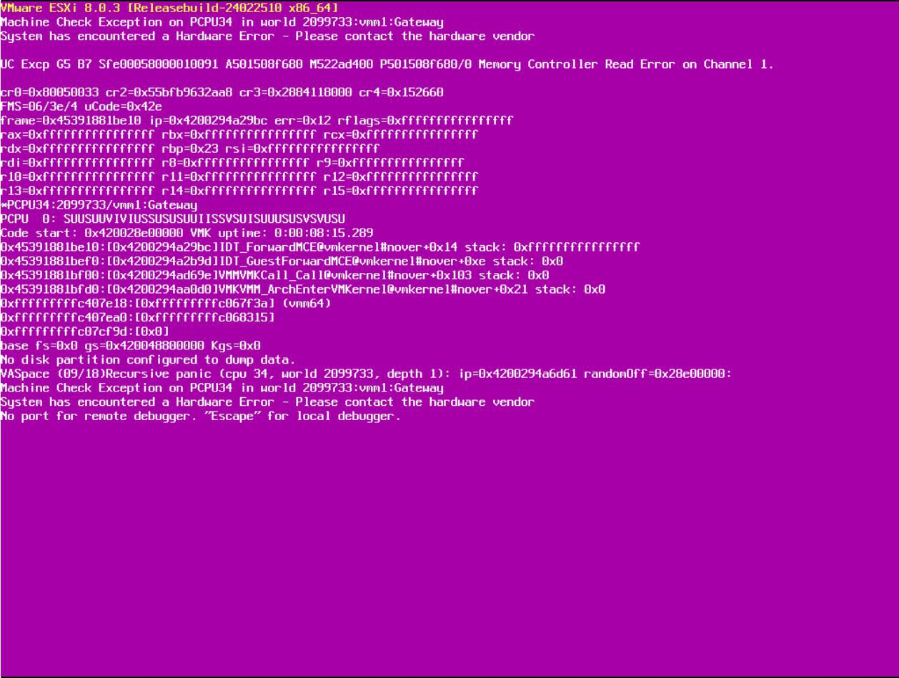

故逝是这样的... 昨天凌晨调试 SA5212M4 的阴间 BMC 到晚上一点, 困死了, 遂睡觉. 早上起来翻看邮件发现天塌了, Grafana 给我发了 10 封告警邮件. 放在  的服务器上面所有服务都崩了. 我 ~~连夜~~ 用手机打开 iDRAC, 进去之后就看到了不幸的消息, *Correctable memory error rate exceeded for DIMM_B10*. 但是暑假老师们都放假了, 机房值班的老师比较忙, 我也在实习过程中抽不开身去机房. 于是我开始思考一个问题: 我能不能在不物理介入的情况下暂时解决这个问题呢?

<!-- more -->

## 初次尝试: 直接启动, 万一内存好了呢?

你别说, ESXi 还真进去了, 可惜没过两分钟, 虚拟机还没启动呢, 就失去了响应.

## 内存构型

为什么呢? 我们讨论此机器的内存构型:

机器为 **双路**, 每一路 **4 通道**, 每通道 **3 DIMM**, 为 **16 + 16 + 8**, 2Rx4.

DIMM_B10 是 CPU2 通道 1 插槽 2, 它 **损坏**, 但是依然 **可识别**. PowerEdge 的 BIOS 内存模式当前为正常模式, 没有特殊配置.

这一段我也不甚了解, 只能问 GPT. 出乎我意料的是, 这玩意比我想象的更加复杂. 根据 [Datasheet](https://www.intel.com/content/dam/www/public/us/en/documents/datasheets/xeon-e5-v2-datasheet-vol-2.pdf) (其实我没怎么看, 太多了), E5 v2 的内存控制器支持最多每通道 3 个插槽, 插槽 0 和 1 支持最多 4 Rank 内存, 插槽 2 支持最多 2 Rank 内存. 然后由于我在一个 Channel 里面插了不同大小的内存, Channel 内的 Interleaving 每个大模型给的答案都不一样... 我也不知道咋测试, 因此先放在这里:

---

[Claude](./DellMemoryMirrorMode/DIMMInterleaving/Claude.txt) *[Share Link](https://claude.ai/share/4baa4095-51e7-41d1-b0f5-2f403ac63545)*:

> The memory controller interleaves across ranks within the channel. Since all your DIMMs are dual-rank (2Rx8/2Rx4), each channel has 6 total ranks. The interleaving typically occurs at cache line boundaries (64 bytes on x86), so consecutive 64-byte blocks alternate between ranks.
>
> However, there's an important consideration: your DIMMs have different densities. The 8GB DIMM will be "filled up" first, after which interleaving will continue only among the remaining ranks from the 16GB DIMMs. This creates an asymmetric interleaving pattern that may impact performance.

即, 首先 6 Rank Interleaving 直到 24GB (此时 8G 的用完), 然后 4 Rank Interleaving 直到 40G.

---

[GPT](./DellMemoryMirrorMode/DIMMInterleaving/GPT-4o.txt) *[Share Link](https://chatgpt.com/share/6881d4bf-5944-8012-a794-66e3c8d53672)*:

> Intel’s controller will usually interleave memory accesses between DIMMs *if the sizes are equal*, but in this case you have unequal sizes (16 GB vs. 8 GB). This leads to **non-uniform interleaving**.
>
> So:
>
> - The two 16 GB 2Rx8 DIMMs will likely be interleaved first.
> - The 8 GB 2Rx4 will be used **after the others are filled**, or used for **NUMA fallback** or for **non-interleaved (non-optimized) regions**.

即, 首先 4 Rank Interleaving, 只用 16G 内存条, 直到 32G; 然后 2 Rank Interleaving 直到 40G

---

[DeepSeek](./DellMemoryMirrorMode/DIMMInterleaving/DeepSeek.txt):

> 1. **地址映射与交织：**
>    - 内存控制器会将系统物理地址映射到通道、Rank Group 内的 Rank、Bank、行和列。
>    - 在 **Group 1 (8GB Ranks)** 内部：地址会在其包含的 4 个 8GB Ranks 之间进行交织（Interleaving）。这是为了平衡负载和提高带宽利用率。交织的粒度通常是 Cache Line (64字节) 或更大的块。
>    - 在 **Group 2 (4GB Ranks)** 内部：地址会在其包含的 2 个 4GB Ranks 之间进行交织。
>    - **不同 Rank Group 之间没有交织：** 连续的 Cache Line 要么都映射到 Group 1 的某个 Rank 上，要么都映射到 Group 2 的某个 Rank 上。它们不会交叉映射到不同大小的组上。

和 GPT 类似

---

[ChatGLM](./DellMemoryMirrorMode/DIMMInterleaving/ChatGLM.txt) *[Share Link](https://chatglm.cn/share/fFSet0Sd)*

> 1. No Interleaving Enabled
>    - The E5-2680v2 requires **identical DIMMs** (same capacity, rank, and die configuration) in a channel to enable DIMM interleaving.
>    - Your channel has mixed DIMMs:
>      - Two 16GB (2Rx8) modules (2 ranks, 8 dies per rank).
>      - One 8GB (2Rx4) module (2 ranks, 4 dies per rank).
>    - Result:
>      - The memory controller **disables interleaving within the channel** due to mismatched DIMM capacities and die configurations.
>      - Addresses are mapped **sequentially** across the three DIMMs (e.g., filling the two 16GB DIMMs first, then the 8GB DIMM).

即, 由于 Rank 大小不对称, 直接放弃 Interleaving.

---

先不说各个模型输出的哪个对吧, 但是总之是, 这根坏掉的内存的坏 "块" 可能已经扩散到整个 Channel 了. 而由于 Channel Interleaving, 这个坏 "块" 可能已经遍布 CPU2 的物理地址空间了.

## 探寻

首先想到的方式显然是, *我把这根内存禁用了不就完了* ?

可惜, 不得行. 可能是

1. 厂商觉得没必要整这么一个功能
2. 内存炸了你不换?
3. 禁用了也会影响电气特性

等因素共同造成的结果.

---

然后我想到的方式是, *那我禁用一整个内存通道呢* ?

可惜, 也不行. 感觉原因和前面也差不多 (?)

---

然后就是, *那我把整个 CPU2 扬了!*

在 BIOS 里面做不到. 在系统里可能可以? 但是 ESXi, 不会 (

## 内存模式

于是就只有这个办法了: 想办法让一部分内存爆炸可以接受.

很容易联想到 RAID. Dell 的内存有好几种模式, 平常开的是标准模式, 应该就是单根 ECC.

### Advanced ECC

> Advanced Error Correction Code (ECC) mode extends SDDC from x4 DRAM based DIMMs to both x4 and x8 DRAMs. This protects against single DRAM chip failures during normal operation.
>
> The installation guidelines for memory modules are as follows:
>
> - Memory modules must be identical in size, speed, and technology.
> - DIMMs installed in memory sockets with white release levers must be identical and the same rule applies for sockets with black release levers. This ensures that identical DIMMs are installed in matched pair —for example, A1 with A2, A3 with A4, A5 with A6, and so on.

如果 A1 和 A2 通道都是 2Rx4 内存, 那么可以通过绑定产生虚拟的 2Rx8 内存, 以支持 SDDC, 进而尝试修复 Multibit Memory Error.

看上去有些用? 于是我试了一下.

### Spare Rank

> NOTE To use memory sparing, this feature must be enabled in System Setup.
>
> In this mode, one rank per channel is reserved as a spare. If persistent correctable errors are detected on a rank, the data from this rank is copied to the spare rank, and the failed rank is disabled.
>
> With memory sparing enabled, the system memory available to the operating system is reduced by one rank per channel. For example, in a dual-processor configuration with sixteen 4 GB single-rank memory modules, the available system memory is: 3/4 (ranks/channel) × 16 (memory modules) × 4 GB = 48 GB, and not 16 (memory modules) × 4 GB = 64 GB.
>
> NOTE Memory sparing does not offer protection against a multi-bit uncorrectable error.
>
> NOTE Both Advanced ECC/Lockstep and Optimizer modes support memory sparing.

如果有某一个 Rank 的可恢复错误比较多, 那么就用空闲的 Rank 顶上去. 听上去不错. 但是考虑到 AECC 没用, Multibit Error 满天飞, 我没有尝试. (再加上我们内存构型不太对劲, 每个 Rank 大小不一致)

### Mirroring

> Memory mirroring offers the strongest memory module reliability mode compared to all other modes, providing improved uncorrectable multi-bit failure protection. In a mirrored configuration, the total available system memory is one half of the total installed physical memory. Half of the installed memory is used to mirror the active memory modules. In the event of an uncorrectable error, the system switches over to the mirrored copy. This ensures SDDC and multi-bit protection.
>
> The installation guidelines for memory modules are as follows:
>
> - Memory modules must be identical in size, speed, and technology.
> - Memory modules installed in memory module sockets with white release levers must be identical and the same rule applies for sockets with black and green release tabs. This ensures that identical memory modules are installed in matched pairs—for example, A1 with A2, A3 with A4, A5 with A6, and so on.
>
> | Processor  | Configuration           | Memory population rules | Memory population information |
> | ---------- | ----------------------- | ----------------------- | ----------------------------- |
> | Single CPU | Memory population order | {1,2}, {3,4}            | See Memory mirroring note     |

即, B9 和 B10 互为备份, 有一个是好的就行. 恰巧我们的内存构型符合 Mirroring 的要求, 我给它调成镜像模式, 这总不能坏了吧.jpg

最后成功启动了, 应该能撑到有时间去机房 ()

## 维修

经过这么一折腾, 我好像理解了, 我应该把所有垃圾 8G 全换了, 都装 16G 的 (

过几天去 ()

