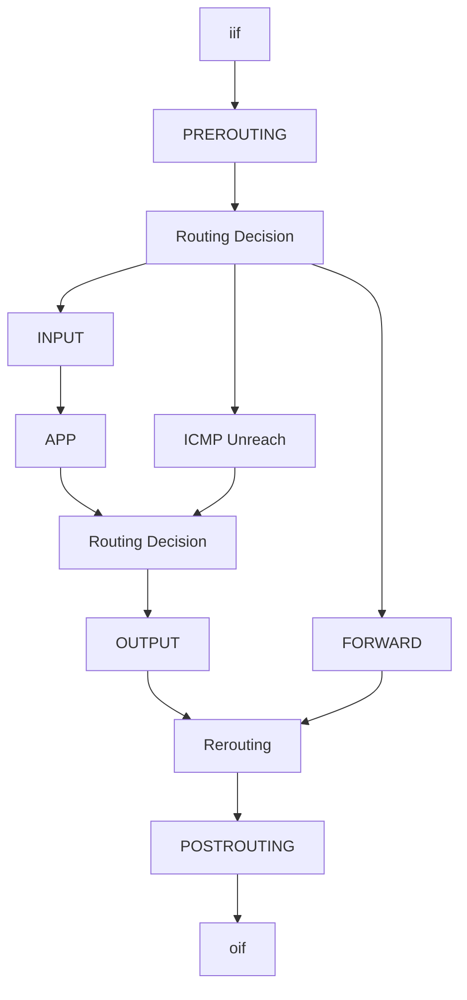

Docker, 一个常见的容器化手段. 之前, 我很想把一切服务都 Dockerize, 这样方便维护. 不过当时学长有过一些吐槽, "我遇到的 docker 的问题比 lxc 多多了，只是现在坑早就有人给你填上了". 我当时是不信的, 后来不得不信, 因为我自己也遇到了一坨 Docker 有关的坑. 最近, 又有 ~~小~~ 朋友被 Docker 坑了, 遂决定写一篇博客, 讲一讲使用 Docker 需要注意什么.


<!-- more -->


注意事项主要分为三个方向吧, 一个是关于 Docker Registry, 一个是关于网络配置, 一个是关于容器.


## Docker Registry

由于我并不知道的原因, Docker 的官方源被阻止了, 无法直接访问. 于是引出了几种解决方案:

其一, 可以给 daemon 配置代理, 这又有两种解决方案:

- 在 Docker 的 systemd service 里面写环境变量. 这么做的问题是改这个需要重启 Docker 服务 - 那所有的容器全得重启.

- 在 daemon.json 里面设置, 但我没试过, 大致如下. 这个解决方案在 *比较新* 的 Docker 中新增, 所以老版本 *未必生效*:

  ```json
  {
      "proxies": {
          "https-proxy": "socks5://172.21.0.2:1080"
      }
  }
  ```

其二, 可以换镜像源, 这又有几种方案:

- 直接在网上找能用的, 但是可用性不好说
- 自己拿 Cloudflare Worker 造一个, 参考 [白嫖Cloudflare Workers 搭建 Docker Hub镜像加速服务](https://songxwn.com/cf-works-DockerHub-Proxy/) 或者搜一下, 一搜一大把. 没试过, 不知道会不会出事
- 自己拿 [registry](https://hub.docker.com/_/registry) 造一个, 在这里配置代理

其三, 可以自建路由, 直接在路由上解决问题.


但是 **每一种方法都未必简单**. 我有一个同学在尝试给 daemon 配置代理的时候破防了, 因为网上的教程乱七八糟, 每干一件事都不一定有用 (可能还有副作用).

换镜像源的问题是有时候 docker 就是不听话 - 你明明配置了镜像源, Docker 就是要从官方源下载.

自建路由的问题主要是 DNS - 国内的官方源的 DNS 解析是被污染的, 这样即便到 *正确的* 官方源的链路是通的, 照样下不下来. 加上一大坨 DNS 缓存的问题导致即便你发现了 DNS 解析错误, 想很快恢复正确解析也不容易.

还有 Docker *buildx*, 这玩意现在好像已经是 Docker 的默认 builder 了, 它的镜像源配置和 Docker 自己不一样 (参考 [文档](https://docs.docker.com/build/buildkit/configure/) ), 所以有时候用 `docker pull` 的时候遵从镜像配置, 但是 `docker build` 就不行.


## 容器

这是 Misc 部分, 但是不是重头戏所以先写.

### overlayfs

我曾经把 Docker 的卷 `/var/lib/docker/containers/` 扔到一个 zfs subvolume 里面去了, 结果 Docker 里面出现了奇怪的问题, 诸如 `rm -rf /root/tmp` 的时候提示 "Directory not empty" 等. 我没有留下截图等资料也没搞明白到底咋回事, 只是后来发觉似乎是 zfs 和 overlayfs 打架了, 把 zfs 的 subvolume 删了就好了.

### zfs

有人就要问了, "那 Ajax, 你怎么不直接用 zfs 驱动呢?". 我倒是想啊, 但是 Docker 的文档写着

> Create a new `zpool` on your ***dedicated*** block device or devices, and mount it into `/var/lib/docker/`.

他张开血盆大口找我要一整个 zpool. 那我问你, 我哪有一整个 zpool 专门给 Docker 用啊? 我难道要在 zfs 上面新建一个文件, 换成 loop device 然后再格式化成 zfs? 还是我新建一个 zfs volume 格式化成 zfs 搞 zfs on zfs?

### logging driver

~~故事~~ 事故是这样的, 我在折腾  的时候, 那个虚拟机的盘只有 16G (这还不够? 我当时想). 结果运行了 3 天不到, 服务炸了. 我登上去一看发现 *盘满了*.

**盘满了???**

我实在想不出来什么东西能把盘干满, 于是上去 `docker compose logs`, 结果感觉这个 log 没完没了... 遂看了一眼 log 的大小...

> clash container 三天写了 12GB 日志给我把 / 写满了

于是发现:

- Docker 默认的 log driver 是 "json-file", "max-size" 默认是 "-1" (unlimited). 需要改成类似

  ```json
  {
    "log-driver": "json-file",
    "log-opts": {
      "max-size": "10m",
      "max-file": "3"
    }
  }
  ```

- 不然就用 "journald" driver, 写到 systemd journal 里面去.

  ```json
  {
    "log-driver": "journald"
  }
  ```

- 然后你用 `docker compose logs` 的时候, 出来的不同 container 的 log **不是按时间顺序排序的**, 也就是说如果你有 A 导致了异常但是 log 比较少, 而 B 正常但是一坨 log (比如 nginx 之类), 那么你用 `docker compose logs` 得到的结果是后面全是正常的 log, **报错被挤不见了**.

### Docker Desktop

Docker Desktop 用了 KVM, 在 Linux 下与 VirtualBox 不兼容...

在 Windows 下 Docker 有两种模式, 一种依附于 WSL, 一种是一个独立的 Hyper-V 虚拟机. 不管怎样, 在一些奇怪的问题上会与 Linux 下的原生 Docker 不太一致 (尤其是网络栈).

### Defaunt

去年我发现我们某一台服务器上有不少 Defaunt Process 并批评教育了导致此事出现的同学. 结果我自己也干了 (乐), 我当时想弄一个可以 exec 进去的 kali, 于是写了个 `CMD sleep infinity`, 后来在里面瞎玩, 突然告诉我进程号不够用了. 一看里面有 **9.02k 个 defaunt process**. 这是因为 sleep infinity 导致容器的 0 号进程不回收 zombie 了. 需要加个 `ENTRYPOINT ["tini", "--"]`.


## 网络

想不到吧, 大头在这, 但是前面已经 1k words 了

### iptables

这是我最想吐槽, 最绷不住的一件事.

首先来说一些 ~~故事~~ 事故.

第一件事, 我的一个同学在自己台式机的 Docker 上部署了 Dify, 未审查 Docker Compose 里面的暴露端口情况, 导致 Squid Proxy 服务向公网暴露了 3128 端口, 遭到信息化技术中心报警封号.

第二件事, 我的另一个同学 (A) 的同学 (B) 在 A 准入的服务器上部署了自己的服务, 未审查 Docker Compose 里面的暴露端口情况, 导致 MongoDB 27017 端口暴露到公网, 形成未授权访问, **国家网信办** (对, 真的是国家网信办) 给信息化技术中心发函要求整改, A 同学被封号, 然后被 ITS, ITC 和单位网管轮番打电话.

第三件事, 我自己的 Docker 我知道它暴露了端口, 因此配置了 iptables 防火墙, 但配置不正确未能阻止流量进入. 所幸我自己 nmap 扫自己的时候发现并及时处置.

第四件事, Harry 之前发现自己的 ipv6 莫名不通, 经过很长时间排查后发现 Docker 自动给 IPv6 的 Forward 表的默认行为改成了 DROP.

而 Docker 至今不原生支持 nftables, 非要在 iptables 里面拉屎...

因此, **起 docker compose 之前一定要检查暴露了哪些端口!!!** (或者起来之后再检查也行, 但是不能不检查)

其次关于 iptables, 事情是这样的. 包在 iptables 里面的流向简化如下:



Docker 干了什么事呢? 它的 Expose Port 的做法是在 **PREROUTING** 里面添加 DNAT:

```shell
-A DOCKER ! -i br-04276aaede81 -p tcp -m tcp --dport 8086 -j DNAT --to-destination 172.18.0.2:8086
```

此时到容器的包的行为是:


发现了什么? 我们一般的防火墙都做在 **INPUT** 上! 此时, Docker **绕开了** 我们一般配置的防火墙. 并且 Docker 把自己的 DNAT 的链放在的 nat PREROUTING 的最前面 (当然你可以用 iptables-persistent 给他拉到后面去, 但是总感觉害怕)

为了解决这一问题, 我们需要在 PREROUTING 上额外配置一些策略, 参考 [Stack Overflow](https://unix.stackexchange.com/questions/405364/drop-packets-with-prerouting-in-iptables), 可以 DNAT 到 0.0.0.1, 或者用

```shell
iptables -t nat -N DOCKER-BLOCK
iptables -t nat -I PREROUTING -m addrtype --dst-type LOCAL -j RETURN
iptables -t nat -I PREROUTING -m addrtype --dst-type LOCAL -j DOCKER-BLOCK
```

这个的精妙之处在于, Apply 之后的 PREROUTING 是:

- 直接跳到 DOCKER-BLOCK 链
- 在 DOCKER-BLOCK 里面把希望接受的转给 DOCKER 链
- 否则退出 DOCKER-BLOCK 链之后直接就 RETURN 了, 没有进行 DNAT, 则会发给 INPUT 链做常规防火墙.

但是问题依然存在, 如果 Docker 脑子一热给你在最前面再加一个 `-j DOCKER` 呢? 那又完蛋了. 或者也可以在 FORWARD 链上面做文章, 但是有同样的问题.

我现在用 nft 解决这个问题, nft 有 priority, 我直接加一个比 iptables-nft 的 forward 链更先执行的链就好了:

```nft
table inet firewall {
    chain forward {
        type filter hook forward priority filter - 1; policy accept;
        ct state { established, related } accept
        iifname { "lan-bridge", "azgw" } accept

        # Telegraf DB
        tcp dport 8086 accept
        iifname $outbound_if_set ct state new drop
    }
}
```

这样无论 Docker 怎么折腾都无所谓了. 我的优先级在你之上. (但是这样要小心不要影响了正常的流量)

至于 Docker 给 IPv6 的 FORWARD 改成 DROP, 我的解决方案是:

```nft
table ip6 filter {
    chain FORWARD {
        type filter hook forward priority filter; policy drop;
        jump DOCKER-USER
        accept
    }

    chain DOCKER-USER {}
}
```

### Predictable IfName

可以通过新建一个 Network 并指定 `com.docker.network.bridge.name` 让 Docker 新建 (或者是 Attach to? 我忘了) 一个名为其值的网卡. (这样就可以用 systemd 管理了)

```bash
docker network create --driver=bridge \
                      --opt "com.docker.network.bridge.name"="kali-bridge" \
                      --subnet=172.30.14.0/24 \
                      --gateway=172.30.14.1 --ipv6 --ipv4 \
                      kali-bridge
```

### GUA IPv6

然后再说说怎么在 Docker 网络上起 IPv6. 除了新建一个 IPv6 的 network (此时 Docker 会随便给你分配一个 ULA /64) 之外, 结合前面一节的名称, 可以让 systemd-networkd 给这个网卡做 Prefix Delegation, 得到 GUA 的 IPv6.

```ini
[Match]
Name=kali-bridge

[Network]
Address=172.30.14.1/24
DHCPPrefixDelegation=yes
IPv6SendRA=yes
DHCPServer=yes

[DHCPPrefixDelegation]
SubnetId=1
Announce=yes
Assign=yes
Token=::1
```

### Address Space

另外一个问题是 Docker 默认的地址空间是一个 /16, 从 172.16.0.0/16 开始, 实在有点浪费 (这一段总共就 16 个 /16), 多开几个 compose 简直要用完了. 需要在 daemon.json 里写

```json
{
        "default-address-pools": [
                {
                        "base": "172.17.0.0/20",
                        "size": 28
                }
        ]
}
```

给弄紧凑一点.

### nftables... again

今天起了个临时的 HTTP Server, 然后不通... 具体情况是:

```yml
services:
  data-server:
    image: nginx:latest
    ports:
      - "40965:80"
    volumes:
      - /dummy/data/dir:/usr/share/nginx/html:ro
      - ./nginx.conf:/etc/nginx/nginx.conf:ro
      - ./.htpasswd:/etc/nginx/.htpasswd:ro
    restart: unless-stopped
```

然后我给 nftables 的 forward 防火墙里面添加了一条

```
chain forward {
  type filter hook forward priority filter - 1; policy accept;
  ct state { established, related } accept
  iifname { ... } accept
  tcp dport 40965 accept  # Added accept rule here
  iifname { "enp2s0", ... } ct state new drop
}
```

然后... 不通. 怎么都不通. 我想了很久也没想明白, 遂前去问 DeepSeek. 没想到还真给 DeepSeek 想出来了.

> The packet is dropped due to a rule in the `inet firewall` table's `forward` chain. Here's the detailed explanation:
>
> 1. **Packet Details**:
>    - Source: `36.110.129.2:49461`
>    - Destination: `166.111.17.92:40965` (TCP SYN)
>    - Incoming Interface: `enp2s0`
>
> 2. **DNAT Processing**:
>    - The NAT table (`ip nat`) has a rule in the `DOCKER` chain:
>      ```
>      iifname != "br-067836a0b6f1" tcp dport 40965 dnat to 172.21.0.2:80
>      ```
>    - Since the packet arrives on `enp2s0` (not `br-067836a0b6f1`) with destination port `40965`, it is DNAT'd to `172.21.0.2:80`.
>
> 3. **Forward Chain in `inet firewall` Table**:
>    - After DNAT, the packet enters the `forward` chain (priority `filter - 1`, processed **before** the main filter table):
>      ```nftables
>      chain forward {
>          ct state { established, related } accept
>          iifname { "azgw", "lan-bridge" } accept
>          tcp dport 8086 accept
>          tcp dport 40965 accept       # ❌ Does NOT match (post-DNAT port is 80, not 40965)
>          iifname { "enp2s0", ... } ct state new drop  # 👈 DROPS THE PACKET
>      }
>      ```
>    - The packet is a **new connection** (`ct state new`) arriving on `enp2s0`.
>    - None of the `accept` rules match:
>      - Not `established/related`.
>      - Not from `azgw`/`lan-bridge`.
>      - Post-DNAT port is `80` (not `8086` or `40965`).
>    - The rule `iifname { "enp2s0", ... } ct state new drop` explicitly **drops** the packet.
>
> #### Why the Allow Rule for Port 40965 Fails:
> - The `tcp dport 40965` rule matches against the **post-DNAT port** (now `80`), not the original port (`40965`). Since the port no longer matches, the rule doesn't apply.
>
> #### Solution:
> To allow this traffic, add a rule to accept **original destination port `40965`** in the `inet firewall forward` chain using `ct original`:
> ```nftables
> ct original dport 40965 accept  # Add this BEFORE the drop rule
> ```
> Revised chain:
> ```nftables
> chain forward {
>     ct state { established, related } accept
>     iifname { "azgw", "lan-bridge" } accept
>     tcp dport 8086 accept
>     ct original dport 40965 accept  # 👈 Allows original port 40965
>     iifname { "enp2s0", ... } ct state new drop
> }
> ```
> This rule matches the **original destination port** (`40965`) before DNAT, allowing the packet to proceed.

虽然这个解决方案不太对, 但是, 他好聪明!

解决方案:

```
chain forward {
  ...
  ct original proto-dst 40965 accept
  ...
}
```

所以, Docker...
