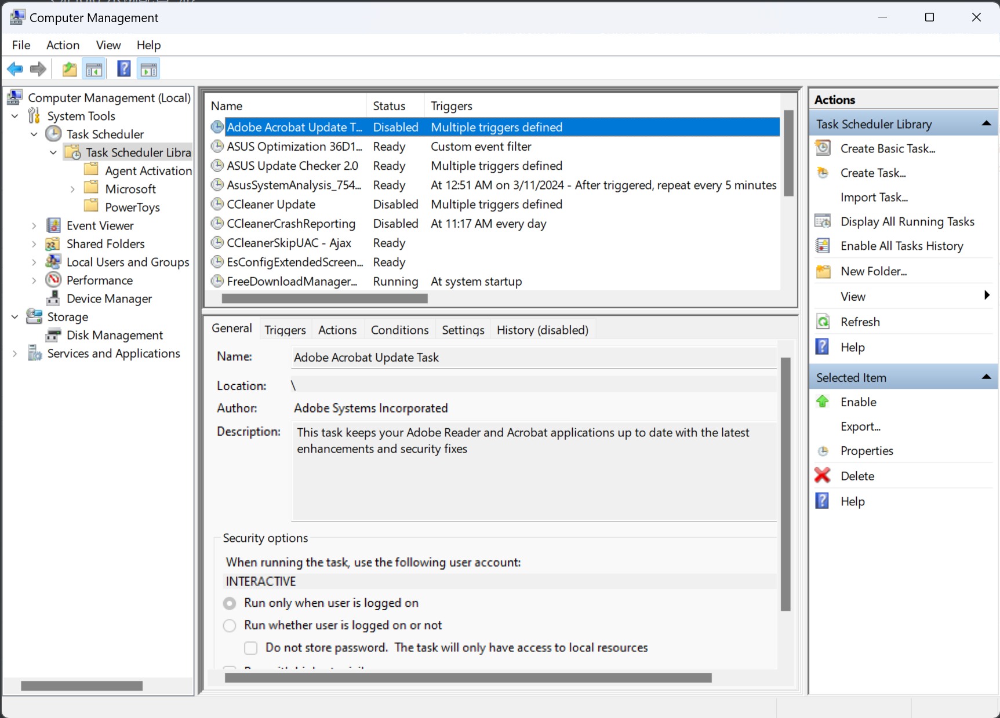
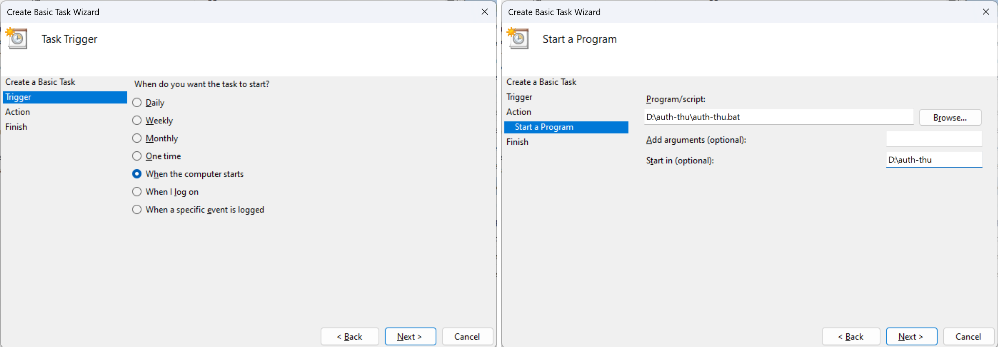
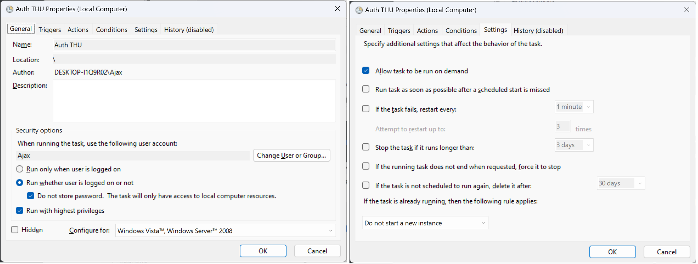

[GoAuthing](https://github.com/z4yx/GoAuthing) 是学长开发的, [THU Services](https://thu.services/services/#_3) 推荐的用于 THU 准入认证的应用, 主要用于 Linux 下的命令行自动认证. 部分同学在 Windows 下也有类似的需求 (自动准入, 掉线后自动重连), 在半个小时的脚本小子之后得到了以下方法.

<!-- more -->

## 下载 auth-thu

从 [Github Releases](https://github.com/z4yx/GoAuthing/releases/latest) 下载 Windows 应用程序 (.win64.exe), 32 位程序可能需要自行编译. 下载的程序可以直接运行但会闪退 (因为这是个命令行程序).

把这个程序放到一个妥善的地方保存 (并记下路径, 此处记为 **`$EXE_PATH$`**; 并记下所在的文件夹路径, 记为 **`$EXE_DIR$`**, 请在后续编辑脚本时 **直接替换**)

## 新建配置文件和脚本文件

在 `$EXE_DIR$` 下建立配置文件 `creds.json`, 内容参考 [GoAuthing 帮助文档](https://github.com/z4yx/GoAuthing/blob/master/README.md), 放一份如下:



```json
{
  "username": "your-username",
  "password": "your-password",
  "daemonize": true,
  "campusOnly": false
}
```



新建脚本文件如下 (记得替换, 记为 **`$BAT_PATH$`**):

```sh
:: auth-thu Windows keep online

:loop_begin
$EXE_PATH$ -c $EXE_DIR$\creds.json auth
$EXE_PATH$ -c $EXE_DIR$\creds.json login
$EXE_PATH$ -c $EXE_DIR$\creds.json online
goto loop_begin
```

在 cmd 中运行这个脚本, 如果能正确运行并登录, 可进行下一步. 需要注意的是这个 login 似乎没得用.

## 新建任务计划

(由于咱电脑是英文的, 所以自行脑补中文)

打开 Computer Management -> System Tools -> Task Scheduler (应该叫任务事件查看器?) -> Library (啥啥程序库)



新建基本事件 -> 在电脑开机时启动 -> 启动程序 -> 启动 `$BAT_PATH$`, 以 `$EXE_DIR$` 为工作目录.



新建完成后, 双击事件打开, 勾选 "无论用户时候登录都运行", "不储存密码", "使用最高权限运行";

打开 "条件" 菜单, 关掉 "只有连接电源才运行";

打开 "设置" 菜单, 只打开第一个, 最后那个选第一项, 保存退出.



此时右键启动这个任务, 在正常情况下就能运行并在掉线时自动重连了.

## 问题 / 局限

**! IMPORTANT** 由于 .bat 文件比较粗糙, 无法区分登录错误与掉线, 如果改了密码或断网 (物理上) bat 会疯狂重试. 但是 Windows 没有什么好的脚本语言, Python / Ruby 要装, Java / .Net 要运行库, 原生 C++ 难写地要命, 故先这样凑合用. (自带的那个 systemd 也不咋地) 可能需要改一改 GoAuthing 了.
