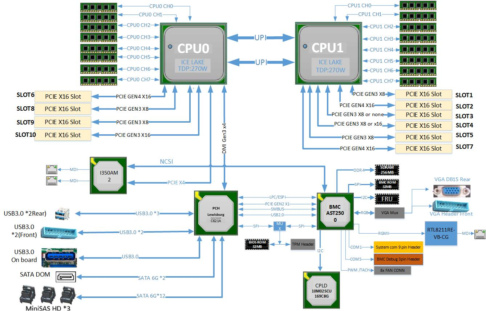

课题组去年还是前年购买了两台 8 卡 4090 48G 服务器, 在过去的一年里面可谓是故障不断. 之前我一直没有使用卡的需求, 所以说也并不关心; 但是最近我导想推进在外网的本地部署模型, 觉得上半年我让买的 Spark 太慢了满足不了科研需求. 因此这几天折腾了一下.

本文会涵盖硬件配置和调试, 暴打 BMC, 乱改 BIOS, 魔改 NVIDIA 驱动等抽象行为, 请谨慎观看.

<!-- more -->

## 硬件介绍

机器是一台国鑫 (Gooxi) AS4110G-D04R-G3 4U 10 卡服务器, [手册在此, 可在网上找到](./GooxiAS4110GServer/20230919093115938.pdf). 其安装双路 3 代可拓展至强 CPU, 我们的机器上是 8336C, 总共 64 核心 128 线程, 16 * 64G DDR4 LRDIMM, 总共 1TB 内存容量. [主板手册在此](./GooxiAS4110GServer/20231007141224278.pdf)

其系统 layout 长这样:



可以看到这个图上面其实并没有 GPU 所在的 PCIe 位置. 为什么呢? 在网上搜索服务器的拆解图可以发现, 其 GPU 模块位于整个机箱的最前面, 引出了两根 PCIe 延长线, 每一根是 PCIe Gen4 x16, 可以插在图示的 SLOT1-10 上. (我线下验证过了, 它的主板上面真的有 10 个 slot... 好多)

GPU 模块上面有两个 PCIe 交换机, 交换芯片看上去是 PEX8747, 每一个管五块卡.

然后看图可以发现 CPU0 引出了一个 Gen4 x16, 而 CPU1 引出了两个, 因此, 如果卡间通信上有需求的话, 放到 CPU1 可以避免 UPI.

## 硬件现状

我拿到机器的时候被这个机器的硬件状况震撼了. 我们的厂家发过来的时候, 8 个 GPU 是顺着插的, 因此插在物理位置的 2-9 上. 于是 5 个 GPU 在一个交换机上放在 CPU0, 而 3 个在另一个. IB 网卡插在 CPU1 上, 可以说是既不对称又不亲和, 达到了速度的最小化.

```bash
nvidia-smi topo -m
        GPU0    GPU1    GPU2    GPU3    GPU4    GPU5    GPU6    GPU7    NIC0    NIC1    CPU Affinity    NUMA Affinity   GPU NUMA ID
GPU0     X      PIX     PIX     PIX     PIX     SYS     SYS     SYS     SYS     SYS     0-31,64-95      0               N/A
GPU1    PIX      X      PIX     PIX     PIX     SYS     SYS     SYS     SYS     SYS     0-31,64-95      0               N/A
GPU2    PIX     PIX      X      PIX     PIX     SYS     SYS     SYS     SYS     SYS     0-31,64-95      0               N/A
GPU3    PIX     PIX     PIX      X      PIX     SYS     SYS     SYS     SYS     SYS     0-31,64-95      0               N/A
GPU4    PIX     PIX     PIX     PIX      X      SYS     SYS     SYS     SYS     SYS     0-31,64-95      0               N/A
GPU5    SYS     SYS     SYS     SYS     SYS      X      PIX     PIX     NODE    NODE    32-63,96-127    1               N/A
GPU6    SYS     SYS     SYS     SYS     SYS     PIX      X      PIX     NODE    NODE    32-63,96-127    1               N/A
GPU7    SYS     SYS     SYS     SYS     SYS     PIX     PIX      X      NODE    NODE    32-63,96-127    1               N/A
NIC0    SYS     SYS     SYS     SYS     SYS     NODE    NODE    NODE     X      PIX
NIC1    SYS     SYS     SYS     SYS     SYS     NODE    NODE    NODE    PIX      X

Legend:

  X    = Self
  SYS  = Connection traversing PCIe as well as the SMP interconnect between NUMA nodes (e.g., QPI/UPI)
  NODE = Connection traversing PCIe as well as the interconnect between PCIe Host Bridges within a NUMA node
  PHB  = Connection traversing PCIe as well as a PCIe Host Bridge (typically the CPU)
  PXB  = Connection traversing multiple PCIe bridges (without traversing the PCIe Host Bridge)
  PIX  = Connection traversing at most a single PCIe bridge
  NV#  = Connection traversing a bonded set of # NVLinks

NIC Legend:

  NIC0: mlx5_0
  NIC1: mlx5_1
```

## 进机房改硬件

由于上述的问题, 部署模型的时候非常抽象 (当然这不是最抽象的). 因此我决心进机房改一下物理拓扑. 按理说, **应该把两个延长线插在 SLOT2 和 SLOT7, 网卡插在 SLOT4**, 可以获得最好的收益. 对于 8 张卡, 由于前面板上有两个不透风的梁, 插在 0,1,3,4,5,6,8,9 是最好的.

改过之后的拓扑如下:

```bash
nvidia-smi topo -m
        GPU0    GPU1    GPU2    GPU3    GPU4    GPU5    GPU6    GPU7    NIC0    NIC1    CPU Affinity    NUMA Affinity   GPU NUMA ID
GPU0     X      PIX     PIX     PIX     NODE    NODE    NODE    NODE    NODE    NODE    32-63,96-127    1               N/A
GPU1    PIX      X      PIX     PIX     NODE    NODE    NODE    NODE    NODE    NODE    32-63,96-127    1               N/A
GPU2    PIX     PIX      X      PIX     NODE    NODE    NODE    NODE    NODE    NODE    32-63,96-127    1               N/A
GPU3    PIX     PIX     PIX      X      NODE    NODE    NODE    NODE    NODE    NODE    32-63,96-127    1               N/A
GPU4    NODE    NODE    NODE    NODE     X      PIX     PIX     PIX     NODE    NODE    32-63,96-127    1               N/A
GPU5    NODE    NODE    NODE    NODE    PIX      X      PIX     PIX     NODE    NODE    32-63,96-127    1               N/A
GPU6    NODE    NODE    NODE    NODE    PIX     PIX      X      PIX     NODE    NODE    32-63,96-127    1               N/A
GPU7    NODE    NODE    NODE    NODE    PIX     PIX     PIX      X      NODE    NODE    32-63,96-127    1               N/A
NIC0    NODE    NODE    NODE    NODE    NODE    NODE    NODE    NODE     X      PIX
NIC1    NODE    NODE    NODE    NODE    NODE    NODE    NODE    NODE    PIX      X

Legend:

  X    = Self
  SYS  = Connection traversing PCIe as well as the SMP interconnect between NUMA nodes (e.g., QPI/UPI)
  NODE = Connection traversing PCIe as well as the interconnect between PCIe Host Bridges within a NUMA node
  PHB  = Connection traversing PCIe as well as a PCIe Host Bridge (typically the CPU)
  PXB  = Connection traversing multiple PCIe bridges (without traversing the PCIe Host Bridge)
  PIX  = Connection traversing at most a single PCIe bridge
  NV#  = Connection traversing a bonded set of # NVLinks

NIC Legend:

  NIC0: ibp177s0f0
  NIC1: ibp177s0f1
```

## 魔改驱动

大模型推理是一个非常消耗带宽的工作. 如果全都走 SHMEM, 那么 PCIe 交换机的上行的 x16 带宽将成为显著的瓶颈. 4090 又没有 NVLink, 因此必须使用 PCIe P2P 才能提高性能. 但是呢, 老黄刀法让 GeForce 系列没办法用 P2P.

在魔改驱动之前, 我尝试部署了 GLM 5.3 Flash, 速度不到 1 token/s, 完全没法用.

Harry 曾经在博客上发过一篇 [如何在 5090 上启用 P2P](https://harrychen.xyz/2026/05/20/enable-gpudirect-rdma-on-rtx-5090/), 后来, 两个月前 (还挺新), 我看到 [duanyll 魔改了 Nvidia 驱动, 实现了 4090 48G 上的 P2P](https://duanyll.com/2026/7/13/4090-48G-P2P/). 按照上面的方法, 我安装了 595.71.05 版本的魔改驱动, 实现了 P2P 的支持. 但是, 在测试的时候, 还是发现了问题:

| GPU 数 / 分组 | 通信方式 | 配置 | 平均 bus bandwidth |
| --- | --- | --- | ---: |
| 4 卡，GPU 0–3 | P2P/CUMEM | `P2P_LEVEL=PIX` | **5.141 GB/s** |
| 4 卡，GPU 4–7 | P2P/CUMEM | `P2P_LEVEL=PIX` | **5.141 GB/s** |
| 8 卡，GPU 0–7 | P2P/CUMEM | `P2P_LEVEL=SYS` | **0.817 GB/s** |
| 8 卡，GPU 0–7 | SHMEM | 禁用 P2P | **4.480 GB/s** |

虽然没有数据错误, 但是 8 卡的 P2P 通信带宽非常低, 甚至不及直接使用 SHMEM. 为什么呢?

经过一些排查, 我们定位到这可能是没有打开 [Relaxed Ordering](https://techcommunity.microsoft.com/blog/azurehighperformancecomputingblog/nccl-performance-impact-with-pcie-relaxed-ordering/3660825). 我让 Codex 测试了一下, 发现, 当 PCIe 交换机上同时出现 P2P 和到 Host Bridge 上行的通信时, 由于队头阻塞, 带宽利用率骤降.

| 通信方式 | 跨 PIX 边的实际路径 | 平均 bus bandwidth |
| --- | --- | ---: |
| `P2P_LEVEL=SYS` | GPU 3→4 走交换机 P2P、7→0 跨组 P2P | **0.840 GB/s** |
| `P2P_LEVEL=PIX` | GPU 3→4 走交换机 P2P、7→0 跨组 SHM | **2.381 GB/s** |
| SHMEM | 全部走 SHM/direct/direct | **4.468 GB/s** |

因此打开 Relaxed Ordering, 打开后带宽明显改善, 利用率基本 100%. 在组内 P2P, 组间 SHM 情况下带宽最高.

| NCCL 路径 | Avg bus bandwidth | 对比不开 RO |
| --- | ---: | --- |
| `P2P_LEVEL=SYS` | 3.6315 GB/s | 约 **4.32×** |
| `P2P_LEVEL=PIX` | 5.2358 GB/s | 约 **2.20×** |
| SHMEM | 4.46901 GB/s | 基本不变 |

此时卡间通信速度允许使用 Tensor Parallel 部署模型.

## 模型部署

尝试了 GLM 5.3 Flash 和 Deepseek v4.1 Flash, GLM 5.3 Flash 单请求 MTP 5 速度约 100 token/s, 8 并发速度约 200 token/s, 16 并发峰值速度 500 token/s, KV 1.3M, 开 KV Offload 不成功, 但是 KV Pool 够用;

DeepSeek v4.1 Flash 单请求 DSpark 5 速度约 100 token/s, 8 并发速度约 300 token/s, KV 2.4M (但是得关 GPU 的 ECC Mem 不然显存不够用), Offload 256G 完全用不完.

用 claude code 开 ultracode, 速度勉强能够接受, 性能也勉强能够接受.

## 莫名重启

这台机器之前就因为莫名其妙重启返修, 修好了回来, 但是也不知道是否真的修好了. 然后某一天, 我正在调试 vLLM 的时候, 机器突然失联了. 打开 BMC 一看发现重启了, 原因未知. 让 Codex 诊断, 结果是, 他认为电源键被错误触发了. 遂决定禁用掉 Reset Button. 但是怎么才能禁用呢? BMC 网页没有相应的选项, ipmitool 也不能设置禁用前面板. 怎么办呢? 本着部署了模型就要用的原则, 我尝试分析了机器的 BIOS 和 BMC.

## 爆打 BMC

一开始我问老师要这台机器的 BMC, 老师说, BMC 不敢上网, 觉得 BMC 一旦上网秒被打穿. 我当时觉得这有些危言耸听, 但是这是后话.

### Gaining Access

在系统上重置 BMC 密码, 然后配置 BMC IP 为 169.254.0.0/16, 这样一来就可以在二层子网内访问. BMC 中有 "备份配置" 选项, 得到一个很长的文本文件. 里面可见:

```ini
[$$$/conf/shadow]
$$$DataLength=891$
sysadmin:$1$A17c6z5w$5OsdHjBn1pjvN6xXKDckq0:14386:0:99999:7:::
```

那么这是个什么 hash 呢? 直接把这一串扔进 Google, 即可得知, 这是 AMI BMC 的默认凭据, `sysadmin:superuser`. BMC 有 SSH 暴露, 用 `sysadmin` 尝试登录, 发现可用, 且进入了 Linux shell.

而这个密码又改不了 (或者说, 大家没人会想到要去改这个...), 所以 BMC 一旦暴露到公网... 就倒闭了!

### BMC Layout

BMC 是一个精简的 ARM Linux, 所有的 config 都在 /conf 里面, 是一个独立的 jffs 卷; 而 Web 页面也是独立的 jffs. 如果 /conf 没东西, 那么就自动新建 default conf. BMC 有 256M 内存 (比磁盘还大!), CPU 是 ARMv6.

Linux kernel version `Linux G3DE 3.14.17-ami #1 Tue Apr 21 09:20:40 GMT 2026 armv6l GNU/Linux`, 构建时间还挺新的, 不知道为啥一定要 Linux 3.x, 也可能是陈年技术债吧. 这里的 G3DE 是主板型号.

### 读取 BMC Flash

在 `/dev/` 里面能看到几个 mtd 设备, 我直接读取了 `/dev/mtd0 "fullpart"`, `ssh sysadmin@xxx dd if=/dev/mtd0 bs=1M > mtd0.dmp` 读取到本地, 得到了一个 32M 的文件, 经检验是 BMC Flash 的全部内容. 我将一份擦除了配置的文件放在 [此处](./GooxiAS4110GServer/BMC-anonymized.img.zst) 供研究.

### 读取 BIOS Flash

从 BMC 中可以看到一个允许与 BIOS 交互的 dev `crwxrwxrwx    1 sysadmin sysadmin  153,   0 Sep 25 11:42 /dev/host_spi_flash0`. 我让 Codex 读取了一下, 大致的流程是,

1. 打开 Host SPI 通道: 把 GPIO 202 拉高并加载 host_spi_flash_hw 模块, `/proc/mtd` 出现了 `mtd4: ... "Host SPI Flash"`，容量为 32 MiB

2. 用类似方式把 mtd4 读出到本地, 32 MiB, 78.5s

3. 拉低 GPIO

当然, 实际上我显然是用 Codex 干的, 他除了以上步骤之外, 还进行了包括但不限于首先尝试, 然后写脚本只读挂载, 然后写监控脚本如果炸了就回滚等一系列 ~~多余~~ 操作.

BIOS 的留档 [在此](./GooxiAS4110GServer/BIOS-anonymized.bin.zst)

### 逆向 BMC

那么到底有哪些可以用的指令呢? 我让上面跑的本地模型逆向了一番, 得到了 392 条指令, 其中 269 条在 IPMITool 里面没有直接的命令, 需要使用 raw 指令. 以下部分为 LLM 生成, 仅供参考.

## Gooxi GC2600PMT BMC IPMI 命令参考

适用机型：Gooxi GC2600PMT 系列（AST2500 BMC，AMI 固件 1.28，IPMI 2.0，Device ID 32）。

本手册收录主板 BMC 固件里那些只能用 `ipmitool raw` 调用的厂商自定义命令，共 269 条。它们不在 IPMI 规范里，也不会出现在 `ipmitool` 的 `sensor`、`sel`、`fru`、`chassis` 这类专用子命令中， 因此必须先知道命令号才能用。

正文按**用途**分章：风扇、传感器、电源、机箱、日志……每一章先列出该用途下的全部命令和状态， 再逐条说明各条命令。凡在本机实测过的命令都单列一节，给出命令格式、响应结构与逐字节的解读； 未实测的命令只出现在章首的表格与附录 A 中。附录 A 是按命令号排序的索引，逐条给出中文作用、 英文名称与状态。

### 关于状态标记

| 状态 | 含义 |
| --- | --- |
| 通过 | 命令已在实际机器上发送，BMC 正常响应 |
| 被拒 | 命令已发送，但 BMC 用完成码拒绝（码值见各章） |
| 未测试 | 命令在固件里存在，但未在本机下发过 |
| 接口无法发送 | 命令号无法通过带内 IPMI 接口发出，详见第七章末尾 |

### 使用前须知

**命令格式。** 厂商自定义命令没有专用子命令，统一用 raw 形式：

```sh
ipmitool raw <netfn> <cmd> [请求字节...]
```

带上 `-I open` 走带内 `/dev/ipmi0`，或用 `-I lanplus` 走带外；两者对命令号的处理相同，差别在 于带内多一道内核检查（见第七章末尾）。

**非 `0x00` 的完成码有多种含义**，见下表。

| 完成码 | 含义 |
| --- | :--- |
| `0x00` | 成功 |
| `0xc1` | 无效命令：该 NetFn 下未登记此命令号，或功能未启用 |
| `0xc6` | 请求数据无效：参数取值不在允许范围（索引未从 1 开始是最常见的一种） |
| `0xc7` | 请求数据长度无效：长度与命令要求的不一致 |
| `0xcb` | 请求的记录不存在：选择子指向的记录不存在 |
| `0xcc` | 参数无效：例如写入命令只接受由配置决定的几个具体值 |
| `0xd5` | 当前状态不支持：例如 APML 命令出现在 Intel 平台上 |
| `0xff` | 未指定错误：多为请求载荷不合适，例如索引超出机器实际配置，或对应的记录/文件不存在 |
| `0x80` `0x81` `0x91` | 厂商自定义 |

**响应怎么读。** `ipmitool` 打印的 `rsp=0xNN` 是完成码，其后的字节才是数据。BMC 返回的字节
序列里，第 1 个字节固定是完成码，数据从第 2 个字节开始；"只回完成码、没有任何数据"是一种完整 的正常返回，设置类命令多是这样。

数据字节的通则：16 位整数一律小端，低字节在前；请求中的选择子常以半字节打包，高半字节是选择 子、低半字节是子选择子，成功时该字节会原样回显到响应的第 1 个数据字节，可用以核对请求的 究竟是哪一路；定长字符串以 `00` 结尾、未用满的部分填 0；位域按"位 0 为最低位"解释。每条命令 的具体字段见其所在章节的说明小节。

**写完要回读。** 写入类命令拿到完成码 `0x00` 后，应再读一次确认取值确已生效。写入配置类命令
时遵循以下三步：

```sh
ipmitool raw 0x32 0x7e            # 1. 读出当前值
ipmitool raw 0x32 0x7f 0x01       # 2. 写入新值
ipmitool raw 0x32 0x7e            # 3. 回读，确认确已生效
```

**修改配置之前先备好回退手段。** 写 IPMI 用户、网络、服务这类命令一旦参数写错，可能把远程
管理通道切断。操作之前应确认另有可用的管理途径——BMC 网页、串口、管理网，或具备现场操作 条件。

**读数是动态的。** 温度、转速、电源数量、缓存内容这类值随机型配置和当前状态变化，本手册中标
"实测"的读数值仅供参考，脚本中的判断阈值应结合当前负载与配置确定。

---

### 一、风扇与散热

风扇转速由 BMC 依据温度曲线自行控制，固件还会把主机侧上报的 CPU/GPU 温度作为曲线的输入。 读取部分可以直接使用；写入部分要么会改变调速行为，要么直接改动曲线的输入，使用之前应先确认 回退手段。

| 命令 | 作用 | 状态 |
| :--- | :--- | :--- |
| `ipmitool raw 0x2a 0x61` | 读取风扇控制模式 | 通过（返回 `01`） |
| `ipmitool raw 0x2a 0x08 0xff` | 读取八路风扇的占空比与转速 | 通过 |
| `ipmitool raw 0x2a 0xfe` | 读取风扇附加信息 | 通过 |
| `ipmitool raw 0x2a 0x0d <gpu:01-0a>` | 读取 GPU 信息缓存 | 通过 |
| `ipmitool raw 0x2a 0x62 <mode:01>` | 设置风扇控制模式；`01` 为自动，其他值停止自动调速 | 通过（写入后回读确认） |
| `ipmitool raw 0x2a 0x09 <fan:00-07> <duty:01-64>` | 设置风扇 PWM 占空比 | 通过（写入后回读确认） |
| `ipmitool raw 0x2a 0x0c <gpu:01-0a> [89 more bytes]` | 写入 GPU 信息缓存 | 未测试 |
| `ipmitool raw 0x2a 0xff <cpu1> <cpu2>` | 更新 BMC 中的 CPU 温度 | 未测试 |
| `ipmitool raw 0x2a 0xfd <gpu1> ... <gpu10>` | 更新十路 GPU 温度 | 未测试 |

#### `0x2a 0x61` 读取风扇控制模式

```sh
ipmitool raw 0x2a 0x61
```

响应固定 1 个数据字节，表示当前风扇控制模式：

| 值 | 含义 |
| --- | --- |
| `01` | 自动。BMC 按温度曲线自动调速 |
| 其他（实测 `00`） | 非自动。自动调速停止，手动设置占空比被接受 |

该字节只有 `01` 表示自动，其余取值一律为非自动：写入 `0x2a 0x62` 时填 `02` 至 `ff` 之间的 任意值，自动调速同样停止。按"`01` 为自动、其余为非自动"来读。

读取本身无副作用。切换到非自动模式会停止自动调速，写入前应确认确有需要。

#### `0x2a 0x08` 读取风扇转速与占空比

```sh
ipmitool raw 0x2a 0x08 0xff     # 一次读全部 8 路
```

`0xff` 表示一次读全部通道。响应固定 27 个数据字节，与请求内容无关：

| 字节 | 长度 | 含义 |
| --- | --- | :--- |
| 0 | 1 | 通道数，恒为 `08` |
| 1 | 1 | 读数无效位图，位 i 为 1 表示第 i 路的转速不可信 |
| 2 | 1 | 恒为 `ff`，填充字节 |
| 3 起 | 3×8 | 每路 3 字节：占空比（百分比）、转速低字节、转速高字节 |

转速为 16 位小端值，低字节在前。本机实测的 27 字节按路分开如下：

```
08 f0 ff  64 45 3c  64 35 3b  64 60 3b  64 e1 3b  28 00 00  28 00 00  28 00 00  28 00 00
通道数 位图 填充  FAN1     FAN2     FAN3     FAN4     FAN5     FAN6     FAN7     FAN8
```

实测中，前四路占空比 `64` = 100%，转速依次为 15429、15157、15200、15329 RPM；后四路占空比 `28` = 40%，转速为 0；位图 `f0` 对应的正是这后四路：转速读数为 0 时该路被标注为无效。

八路的记录长度彼此相同，解析时按 3 字节步长逐路对齐；后四路同样占满 3 字节。第 i 路对应 FAN(i+1)，与 `0x2a 0xfe` 中各路名称的顺序一致。这些读数值随负载和配置变化，脚本中的阈值应 结合当前负载确定。

#### `0x2a 0xfe` 读取风扇附加信息

```sh
ipmitool raw 0x2a 0xfe
```

响应固定 256 个数据字节，不需要请求参数，也没有计数字节。

这 256 字节由 8 条 32 字节记录组成，第 i 条记录位于数据偏移 `32i`：

| 记录内偏移 | 长度 | 含义 |
| --- | --- | :--- |
| 0 | 1 | 该路对应的传感器号，实测 `28`–`2f` |
| 1 | 15 | 名称，ASCII，未用满的部分填 `00`，实测 `FAN1`–`FAN8` |
| 16 | 4 | 32 位值，实测全 0，含义未确定 |
| 20 | 4 | 32 位值，实测等于记录序号 0–7 |
| 24 | 4 | 32 位值，实测为 0,2,4,6,1,3,5,7，含义未确定 |
| 28 | 4 | 32 位值，实测与上一个字段取值相同，含义未确定 |

实测首条记录为 `28 46 41 4e 31 00 …`，即传感器号 `0x28` 加字符串 `FAN1`。

这 256 字节里没有占空比，也没有转速；需要转速与占空比时使用 `0x2a 0x08`。

#### `0x2a 0x0d` 读取 GPU 信息缓存

```sh
ipmitool raw 0x2a 0x0d 0x01     # 第 1 号 GPU 槽位
```

请求是 1 个字节的槽位号 `01`–`0a`，超出范围返回 `0xc9`。响应固定 170 个数据字节，与请求的是 哪一个槽位无关。

| 字节 | 长度 | 含义 |
| --- | --- | :--- |
| 0..89 | 90 | 该槽位的 GPU 描述记录；记录第 0 字节与请求的槽位号一致时才填入内容，否则这 90 字节全为 0 |
| 90..169 | 80 | 该槽位的附加块；实测全为 0，含义未确定 |

描述记录内部：

| 记录内偏移 | 长度 | 含义 |
| --- | --- | :--- |
| 0 | 1 | GPU 槽位号，实测 `01`，与请求的槽位号一致时该记录有效 |
| 1..2 | 2 | 实测 `de 10`，小端 0x10de（疑似 PCI 厂商号），含义未确定 |
| 3..4 | 2 | 实测 `84 26`，小端 0x2684（疑似 PCI 设备号），含义未确定 |
| 5 起 | 85 | ASCII 文本，各字符串之间以 `00` 分隔或填充，实测依次出现 `NVIDIA Corporation`、`NV1 [SAD102 [GeForce RTX 4090]`、`AD102 [GeForce RTX…`；字段边界未确定 |

实测（请求 `01`）返回 170 字节，前 5 字节 `01 de 10 84 26`，其后是上述文本。请求 `0a`（第 10 槽）返回 170 个 0，该槽位尚未写入过数据。

这段缓存由主机侧上报，内容随显卡型号变化；文本中的方括号与截断同样来自上报方。型号等信息以 主机侧的显卡配置为准。

#### 设置风扇控制模式与占空比

```sh
ipmitool raw 0x2a 0x62 0x00          # 切到手动
ipmitool raw 0x2a 0x09 0x00 0x46     # FAN1 设为 70%
ipmitool raw 0x2a 0x62 0x01          # 回到自动
```

- `0x2a 0x09` 的请求是风扇编号 `0x00`–`0x07` 加占空比 `0x01`–`0x64`（1%–100%）。
- **起转参考 PWM 为 20%，维持不停转的参考值为 3%。** 占空比低于 20% 时风扇未必能起转；已经
转起来之后，保持不低于 3% 即可继续转动。
- 自动模式（模式值为 `01`）下 `0x2a 0x09` 不被受理，需要先切到手动。
- `0x2a 0x62` 只建议用 `0x00` 和 `0x01` 两个值，写完用 `0x61` 回读确认。

实测的完整过程是：`0x2a 0x62 0x00` 切到手动，`0x2a 0x61` 回读 `00`；在手动模式下下发 `0x2a 0x09`，回读 `0x2a 0x08 0xff` 可见被写入的那一路占空比随之改变，其余各路保持原值；最后 `0x2a 0x62 0x01` 恢复自动，`0x2a 0x61` 回读 `01`，自动调速随后恢复。

低占空比可能让风扇停转：1% 曾让 FAN2、FAN3 的转速读数降至 0 RPM。因此低速值只适用于测试， 日常运行应保持原占空比。如需临时调整转速，较为稳妥的做法是：先记录 `0x61` 的模式和 `0x08` 的 各路占空比，切换到手动模式，写入目标占空比，回读 `0x08` 并监视转速与温度；结束时按记录恢复 被改过的占空比，最后恢复原模式（原先为自动模式则发送 `0x2a 0x62 0x01`），再回读 `0x61` 和 `0x08`。

BMC 冷重启后模式会回到自动，需要重新读取。

---

### 二、温度、传感器与告警

传感器读数由 BMC 采集，IPMI 侧能够修改的主要是迟滞值与事件使能；告警（PEF/PET）负责在越限 时发出通知，配置有误会造成误报或漏报。

| 命令 | 作用 | 状态 |
| :--- | :--- | :--- |
| `ipmitool raw 0x04 0x25 [data...]` | 读取传感器迟滞 | 通过（返回 `00 00`） |
| `ipmitool raw 0x04 0x24 <sensor> <ignored> <hyst_hi> <hyst_lo>` | 设置传感器迟滞 | 通过（同值写入验证） |
| `ipmitool raw 0x04 0x01` | 读取事件接收方 | 通过（返回 `20 00`） |
| `ipmitool raw 0x04 0x00 [data...]` | 设置事件接收方 | 通过（同值写入验证） |
| `ipmitool raw 0x32 0x95 [data...]` | 读取触发事件 | 通过 |
| `ipmitool raw 0x32 0x86` | 读取传感器信息 | 被拒（完成码 `0xc6`） |
| `ipmitool raw 0x04 0x28 [data...]` | 设置传感器事件使能 | 未测试 |
| `ipmitool raw 0x04 0x2a [data...]` | 重新使能传感器 | 未测试 |
| `ipmitool raw 0x04 0x30 [data...]` | 设置传感器读数 | 未测试 |
| `ipmitool raw 0x32 0x4a [data...]` | 处理跨重启的传感器阈值设置 | 未测试 |
| `ipmitool raw 0x32 0x94 [data...]` | 设置触发事件 | 未测试 |
| `ipmitool raw 0x04 0x12 [data...]` | 设置 PEF 过滤与告警配置参数 | 未测试 |
| `ipmitool raw 0x04 0x11 [data...]` | 启动 PEF 延时定时器 | 未测试 |
| `ipmitool raw 0x04 0x14 [data...]` | 设置上次已处理事件 ID | 未测试 |
| `ipmitool raw 0x04 0x16 [data...]` | 立即触发 PEF 告警 | 未测试 |
| `ipmitool raw 0x04 0x17 [data...]` | 确认 PET 告警 | 未测试 |

#### `0x04 0x25` 读取传感器迟滞

```sh
ipmitool raw 0x04 0x25 0x01 0x00
```

请求第 1 字节是传感器号，第 2 字节不被读取。响应固定 2 个数据字节：

| 字节 | 长度 | 含义 |
| --- | --- | :--- |
| 0 | 1 | 迟滞值 1；实测 `00` |
| 1 | 1 | 迟滞值 2；实测 `00` |

这两个字节与 `0x04 0x24` 写入的两个位置对应；其中哪个是正向迟滞、哪个是负向迟滞未确定。所查 传感器的配置为某几种取值时，命令返回 `0xcc`。

本固件的编号与 IPMI 规范相反：规范中读取是 `0x24`、设置是 `0x23`，本固件读取是 `0x25`、设置 是 `0x24`。按固件实际编号使用。

#### `0x04 0x24` 设置传感器迟滞

```sh
ipmitool raw 0x04 0x24 0x01 0x00 0x00 0x00
```

请求 4 字节：

| 字节 | 含义 |
| --- | --- |
| 0 | 传感器号 |
| 1 | 保留字节，填任意值均可 |
| 2 | 迟滞值 1 |
| 3 | 迟滞值 2 |

响应只有完成码，没有数据字节。写入的正是 `0x04 0x25` 读出的那两个字节，写完可直接回读核对。 可能的拒绝码为 `0xce`、`0xcc`、`0xd4`、`0xff`，出现这些完成码时不会写入。同值写入已实测通过。

#### `0x04 0x01` 读取事件接收方

```sh
ipmitool raw 0x04 0x01
```

响应固定 2 个数据字节：

| 字节 | 长度 | 含义 |
| --- | --- | :--- |
| 0 | 1 | 事件接收方的 8 位 IPMB 地址；实测 `20` |
| 1 | 1 | 事件接收方的 LUN；实测 `00` |

字节 0 按 8 位原样地址使用。

#### `0x04 0x00` 设置事件接收方

```sh
ipmitool raw 0x04 0x00 0x20 0x00
```

请求 2 字节，长度只能是 1 到 3，否则返回 `0xcc`：第 1 字节是事件接收方的 8 位 IPMB 地址， 第 2 字节是 LUN，其高 6 位必须为 0，否则同样返回 `0xcc`。响应只有完成码，没有数据字节。

写入的位置正是 `0x04 0x01` 读出的那两个字节，写完可直接回读核对。这条写入会更新事件发布者配置 并持久化，此后告警事件的投递目标随之改变。同值写入（`20 00`）已实测通过。

#### `0x32 0x95` 读取触发事件

```sh
ipmitool raw 0x32 0x95 0x01
```

请求 1 字节的事件索引，取值 `01`–`0b`（1–11），超出范围返回 `0x80`。响应长度随索引变化：

| 索引 | 数据字节数 | 含义 |
| --- | --- | --- |
| 1–8 | 1 | 每路 1 个字节，实测索引 1 为 `00` |
| 9 | 5 | 5 个字节；这 5 个字节全为 0 时改返回 6 个字节，内容是当前时间的 4 字节小端秒数再加 1 个字节 |
| 10 | 1 | 1 个字节 |
| 11 | 1 | 1 个字节，取值来自一个 16 位字段；该字段与另一个字节都为 0 时返回 0 |

索引 1 至 8、10、11 各对应一个事件标志，这些标志自身的含义未确定；按索引取字节使用。

#### `0x32 0x86` 读取传感器信息（被拒）

```sh
ipmitool raw 0x32 0x86
```

实测完成码 `0xc6`，没有任何数据字节。请求为空，与该命令规定的长度一致。

这条命令在本机型上稳定返回 `0xc6`，更换请求参数无法得到其它结果；`0xc6` 的具体来源未确定。

PEF 相关命令（`0x04 0x11`、`0x04 0x12`、`0x04 0x16`、`0x04 0x17`）都位于告警路径上：配置有误 会造成误报或漏报，其中 `0x04 0x16` 会立即发出告警。这几条未实测。

---

### 三、电源与供电

读电源模块信息、冗余状态与整机功耗。写入侧涉及 PSU 的 PMBus 写入和 ME 的功耗策略，会影响 供电冗余和主机功耗管理。

| 命令 | 作用 | 状态 |
| :--- | :--- | :--- |
| `ipmitool raw 0x2a 0x23` | 读取当前 PSU 信息 | 通过 |
| `ipmitool raw 0x2a 0x0a <psu:00-03>` | 读取电源模块信息 | 通过 |
| `ipmitool raw 0x2a 0x0b` | 读取电源模块状态 | 通过 |
| `ipmitool raw 0x2a 0x21 0x00 <psu_index>` | 读取电源冗余 | 通过 |
| `ipmitool raw 0x30 0xe2 [data...]` | 读取 ME/PNM 读数 | 被拒（完成码 `0xff`） |
| `ipmitool raw 0x2a 0x22 <psu_index> <psu_policy> <global_policy>` | 设置电源冗余策略并写入 PSU | 未测试 |
| `ipmitool raw 0x30 0xe3 [data...]` | 通知 ME 电源状态变化 | 未测试 |
| `ipmitool raw 0x30 0xe9 [data...]` | 通知平台功耗特性变化 | 未测试 |
| `ipmitool raw 0x00 0x0b <seconds:00-ff>` | 设置电源循环间隔 | 未测试 |

#### `0x2a 0x23` 读取当前 PSU 信息

```sh
ipmitool raw 0x2a 0x23
```

响应固定 811 个数据字节：1 字节数量 + 2 字节保留 + 4 条 202 字节记录。

| 字节 | 长度 | 含义 |
| --- | --- | :--- |
| 0 | 1 | 电源数量，**恒为 `04`**，为固定值 |
| 1:2 | 2 | 恒为 `00 00` |
| 3+202i | 202 | 第 i 条电源记录 |

记录内部（`i` 从 0 起）：

| 记录内偏移 | 长度 | 含义 |
| --- | --- | :--- |
| 0 | 1 | 电源序号，实测 `01`–`04` |
| 1 | 32 | 厂商，实测 `Gooxi` |
| 33 | 32 | 型号，实测 `GC2600PMT` |
| 65 | 32 | 产地，实测 `DONGGUAN` |
| 97 | 32 | 版本，实测 `002` |
| 129 | 32 | 生产日期，实测 `20241016` |
| 161 | 32 | 序列号，实测 `GC2600PMT2410000367` 等 |
| 193 | 2 | 16 位小端，实测 `28 0a` = 2600，含义未确定 |
| 195 | 4 | 实测全 `00`，含义未确定 |
| 199 | 2 | 实测字节依次为 `01 cc`、`01 e8`、`01 d4`、`00 00`，含义未确定。注意 `0x2a 0x0a` 不输出这两个字节 |
| 201 | 1 | 实测 `00`，含义未确定 |

字符串为定长 32 字节，未用满的部分填 `00`，超长则截断。第 0 字节的数量恒为 4：即使机器上只装 了两个电源，它仍然报 4。判断实际装机数量请以各条电源记录的实际内容为准。

#### `0x2a 0x0a` 读取电源模块信息

```sh
ipmitool raw 0x2a 0x0a 0x00     # 编号 0 的电源模块
```

请求是 1 个字节的电源编号 `00`–`03`，超出范围返回 `0xc9`。响应固定 394 个数据字节 = 2 字节 头部 + 4 条 98 字节记录；**只有被请求的那一条有内容，其余三条全为 0**。

| 字节 | 长度 | 含义 |
| --- | --- | :--- |
| 0:1 | 2 | 16 位小端，实测 `f0 11`（即 4592），含义未确定 |
| 2+98i | 32 | 厂商，实测 `Gooxi` |
| 34+98i | 32 | 型号，实测 `GC2600PMT` |
| 66+98i | 32 | 序列号，实测 `GC2600PMT2410000367` |
| 98+98i | 2 | 16 位小端，实测 `28 0a` = 2600，含义未确定 |

同一个电源的厂商与型号在两条命令里重复出现；`0x2a 0x0a` 多给出序列号，`0x2a 0x23` 多给出产地、 版本与日期。这些读数随机型和电源配置变化，只能作参考。

#### `0x2a 0x0b` 读取电源模块状态

```sh
ipmitool raw 0x2a 0x0b
```

响应固定 65 个数据字节：1 字节数量 + 4 条 16 字节记录。这里的数量是实际读出的，与 `0x2a 0x23` 中固定为 4 的数量不同。

| 字节 | 长度 | 含义 |
| --- | --- | :--- |
| 0 | 1 | 电源记录数，实测 `04` |
| 1+16i | 16 | 第 i 条记录 |

记录内部：

| 记录内偏移 | 长度 | 含义 |
| --- | --- | :--- |
| 0 | 1 | 恒为 `01` |
| 1 | 1 | 电源序号 `01`–`04` |
| 2 | 3 | PMBus 版本字符串，实测 `1.2` |
| 5 | 7 | 实测全 `00`，含义未确定 |
| 12 | 1 | PMBus 的 flagged 标志；实测 `00` |
| 13:14 | 2 | 状态字节，实测 `01 01`；两字节的先后顺序未确定 |
| 15 | 1 | 实测 `00`，含义未确定 |

长度固定为 65 字节，不随电源数量增加；若实际电源数超过 4，多出的记录会被截断。

#### `0x2a 0x21` 读取电源冗余

```sh
ipmitool raw 0x2a 0x21 0x00 0x01     # 第 1 号电源
```

请求第 1 字节固定为 `00`，第 2 字节是电源号。响应固定 3 个数据字节：

| 字节 | 长度 | 含义 |
| --- | --- | :--- |
| 0 | 1 | 经 I2C 从该电源读回的字节，读取失败为 `ff`；实测 `00` |
| 1 | 1 | 全局冗余策略字节；实测 `00` |
| 2 | 1 | 电源 PMBus STATUS_WORD 的位 11，指示冗余是否丢失；实测 `00`（未置位） |

第 0 字节所读的具体 PMBus 命令由机型配置决定，未确定。

#### 设置电源冗余策略（未测试）

请求三个字节：电源号、该电源的策略、全局策略。写入会下发到 PSU 的 PMBus 并保存策略。

#### `0x30 0xe2` 读取 ME/PNM 读数

```sh
ipmitool raw 0x30 0xe2 0x00 0x00 0x00
```

请求必须正好 3 字节：

| 请求字节 | 含义 |
| --- | --- |
| 1 | 高半字节是选择子，低半字节是子选择子，共同指定要读哪一路读数 |
| 2、3 | 必须为 `00` |

实测（请求 `00 00 00`）：完成码 `0xff`，没有任何数据。

`0xff` 表示这一路读数取不到：本机不支持该路的取数功能。请求长度须为 3 字节，否则返回 `0xc7`， 请求第 2、3 字节不为 `00` 时返回 `0xcc`。

取值成功时，响应中依次是：原样回显的请求第 1 字节（便于核对读的是哪一路），以及一个 16 位读数 （低字节在前）。该情形在本机未出现过。

---

### 四、机箱、前面板与主机状态

机箱能力、前面板按钮、ACPI 电源状态，以及主机侧的若干状态位。

| 命令 | 作用 | 状态 |
| :--- | :--- | :--- |
| `ipmitool raw 0x00 0x00` | 读取机箱能力 | 通过 |
| `ipmitool raw 0x00 0x05 <flags> <fru_addr> <sdr_addr> <sel_addr> <sm_addr> [bridge_addr]` | 设置机箱能力 | 通过（同值写入验证） |
| `ipmitool raw 0x00 0x0a <disable_mask>` | 设置前面板按钮使能状态 | 通过（同值写入验证） |
| `ipmitool raw 0x06 0x07` | 读取 ACPI 电源状态 | 通过（返回 `00 00`） |
| `ipmitool raw 0x06 0x06 0x80 0x80` | 设置 ACPI 电源状态 | 通过 |
| `ipmitool raw 0x06 0x08` | 读取设备 GUID | 通过 |
| `ipmitool raw 0x2a 0x60` | 读取 IP 准备状态标志 | 通过（返回 `01`） |
| `ipmitool raw 0x32 0xfd` | 读取系统健康、固件与电源循环信息 | 通过 |
| `ipmitool raw 0x32 0x73 [data...]` | 读取 BIOS POST 代码 | 被拒（完成码 `0xff`） |

#### `0x00 0x00` 读取机箱能力

```sh
ipmitool raw 0x00 0x00
```

响应固定 6 个数据字节，实测 `00 20 20 20 20 20`：

| 字节 | 长度 | 含义 |
| --- | --- | :--- |
| 0 | 1 | 机箱能力标志；按规范位 0 为机箱入侵检测、位 1 为前面板锁定。实测 `00` |
| 1 | 1 | FRU 设备的 8 位 IPMB 地址；实测 `20` |
| 2 | 1 | SDR 设备的 8 位 IPMB 地址；实测 `20` |
| 3 | 1 | SEL 设备的 8 位 IPMB 地址；实测 `20` |
| 4 | 1 | 系统管理设备的 8 位 IPMB 地址；实测 `20` |
| 5 | 1 | 桥接设备的 8 位 IPMB 地址；实测 `20` |

五个地址各自对应哪种设备是按规范的字段顺序排列的，该对应关系未确定；这些地址按 8 位原样地址 使用。

#### `0x00 0x05` 设置机箱能力

```sh
ipmitool raw 0x00 0x05 0x00 0x20 0x20 0x20 0x20 0x20
```

请求长度只接受 5 或 6 字节，其他长度返回 `0xc7`。

| 字节 | 含义 |
| --- | --- |
| 0 | 能力标志，高 6 位必须为 0，否则返回 `0xcc` |
| 1–4 | FRU、SDR、SEL、系统管理设备的 8 位 IPMB 地址 |
| 5 | 桥接设备地址，可以省略；只发 5 字节时固件补 `0x20` |

响应只有完成码，没有任何数据字节。写入落在 `0x00 0x00` 读出的那 6 个字节上（两者共用同一份配置）， 写完可以直接回读核对。先读现值、只改目标字节即可；同值写入已实测通过。

#### `0x00 0x0a` 设置前面板按钮使能状态

```sh
ipmitool raw 0x00 0x0a 0x0b
```

请求 1 字节，写进去的是**完整的四位状态**，每一位对应一个按钮：

| 位 | 按钮 |
| --- | --- |
| `0x01` | 电源键 |
| `0x02` | 复位键 |
| `0x04` | 诊断中断键 |
| `0x08` | 待机/睡眠键 |

`1` 表示禁用，`0` 表示不禁用。例如 `0x0b`（二进制 `1011`）表示电源键、复位键、睡眠键已禁用， 诊断键未禁用。高 4 位必须为 0，否则返回 `0xcc`；低 4 位中只有机箱能力支持的按钮允许被置位， 置了不支持的按钮同样返回 `0xcc`（支持掩码取自哪一处配置未确定）。响应只有完成码，没有数据字节。

调整其中一个按钮时，要把其余三个希望保持的状态一起写入——这条命令不接受"只改一位"。写完用 `ipmitool chassis status` 核对 `Power/Reset/Diag/Sleep Button Disabled` 四个字段。同值写入已实测 通过。

#### `0x06 0x07` 读取 ACPI 电源状态

```sh
ipmitool raw 0x06 0x07
```

响应固定 2 个数据字节：

| 字节 | 长度 | 含义 |
| --- | --- | :--- |
| 0 | 1 | 系统电源状态；实测 `00`，即 S0/G0（工作态） |
| 1 | 1 | 设备电源状态；实测 `00`，即 D0 |

状态值的编码按 IPMI 规范解读；两个字节各自取自哪一个状态字段未确定。

#### `0x06 0x06` 设置 ACPI 电源状态

```sh
ipmitool raw 0x06 0x06 0x80 0x80
```

请求 2 字节：第 1 字节是系统电源状态，第 2 字节是设备电源状态。响应只有完成码，没有数据字节。

两个字节都是「bit7 = 是否生效、低 7 位 = 状态值」的编码，状态值 `00` 表示 S0。低 7 位的取值受 白名单限制：系统电源状态允许 `00`–`0a`、`20`、`21`、`2a`、`7f`，设备电源状态允许 `00`–`03`、 `2a`、`7f`；不在集合内返回 `0xcc`。

同值写入的写法是 `80 80`，即只置生效位、值位保持 `00`；写成 `00 00` 时 bit7 为 0，命令按空 操作处理。写入的位置与 `0x06 0x07` 读回的内容对应，写完可回读核对。

#### `0x06 0x08` 读取设备 GUID

```sh
ipmitool raw 0x06 0x08
```

响应固定 16 个数据字节，实测：

```
8c 1a f3 11 03 74 | dc 03 | 00 10 | 20 8a | a0 52 7c d4
      6 字节          2 字节  2 字节  2 字节    4 字节
```

| 字节 | 长度 | 含义 |
| --- | --- | :--- |
| 0..15 | 16 | 16 字节设备 GUID |

数据按 6、2、2、2、4 字节分成五段，各段的语义未确定。这条命令与 `ipmitool mc guid` 所使用的 系统 GUID 命令是两条不同的命令。

#### `0x2a 0x60` 读取 IP 准备状态标志

```sh
ipmitool raw 0x2a 0x60
```

响应固定 1 个数据字节：

| 值 | 含义 |
| --- | --- |
| `00` | BMC 尚未就绪 |
| `01` | BMC 已就绪；实测 `01` |

该字节按原值使用。

#### `0x32 0xfd` 读取系统健康、固件与电源循环信息

```sh
ipmitool raw 0x32 0xfd
```

请求为空。响应固定 256 个数据字节，其中只有前 10 个实测有值，其余全为 0：

| 字节 | 长度 | 含义 |
| --- | --- | :--- |
| 0 | 1 | 单个字节；实测 `00`，语义未确定 |
| 1 | 1 | 单个字节；实测 `0f`，语义未确定 |
| 2..255 | 254 | 定长 254 字节；实测前 8 个字节是 ASCII 固件版本串 `G3DE0122`，其后全为 0 |

这 254 字节是定长内容，响应长度恒为 256，不随版本串长短变化。字节 0 与字节 1 的含义未确定。

#### `0x32 0x73` 读取 BIOS POST 代码（被拒）

```sh
ipmitool raw 0x32 0x73 0x00
```

实测完成码 `0xff`，没有任何数据字节。请求 1 字节，与该命令规定的长度一致。

这条命令在本机型上稳定返回 `0xff`，请求参数换任何值结果相同；该完成码的具体来源未确定。需要 POST 代码时请在主机侧获取。

---

### 五、日志：SEL、SDR 与审计

SEL 是事件日志，SDR 是传感器定义——风扇与传感器都建立在 SDR 之上。读取部分可以直接使用。

| 命令 | 作用 | 状态 |
| :--- | :--- | :--- |
| `ipmitool raw 0x0a 0x21` | 读取 SDR 仓库分配单位与空闲块信息 | 通过 |
| `ipmitool raw 0x0a 0x28` | 读取 SDR 仓库当前时间 | 通过 |
| `ipmitool raw 0x0a 0x41` | 读取 SEL 分配单位与空闲块信息 | 通过 |
| `ipmitool raw 0x0a 0x5c` | 读取 SEL 时间的 UTC 偏移 | 通过（返回 `00 00`） |
| `ipmitool raw 0x32 0x67` | 读取日志配置 | 通过 |
| `ipmitool raw 0x32 0x7e` | 读取 SEL 策略 | 通过（返回 `01`） |
| `ipmitool raw 0x32 0x7f [data...]` | 设置 SEL 策略 | 通过（同值写入验证） |
| `ipmitool raw 0x32 0x98` | 读取登录审计配置 | 通过 |
| `ipmitool raw 0x32 0x85 [data...]` | 读取 SEL 条目 | 被拒（完成码 `0xc6`） |
| `ipmitool raw 0x32 0xcd [data...]` | 读取扩展 SEL 数据 | 被拒（完成码 `0xcb`） |
| `ipmitool raw 0x32 0xf1 [data...]` | 分段读取扩展 SEL 条目 | 被拒（完成码 `0xcb`） |
| `ipmitool raw 0x0a 0x5d [data...]` | 设置 SEL 时间的 UTC 偏移 | 未测试 |
| `ipmitool raw 0x32 0x68 [data...]` | 设置日志配置 | 未测试 |
| `ipmitool raw 0x32 0x97 [data...]` | 设置登录审计配置 | 未测试 |
| `ipmitool raw 0x32 0xcc [data...]` | 添加扩展 SEL 条目 | 未测试 |
| `ipmitool raw 0x32 0xf0 [data...]` | 分段添加扩展 SEL 条目 | 未测试 |
| `ipmitool raw 0x0a 0x45 [data...]` | 分段添加 SEL 条目 | 未测试 |
| `ipmitool raw 0x0a 0x26 [data...]` | 删除 SDR | 未测试 |
| `ipmitool raw 0x0a 0x27 [data...]` | 清空 SDR 仓库 | 未测试 |
| `ipmitool raw 0x0a 0x2c [data...]` | 运行 SDR 初始化代理 | 未测试 |

#### `0x0a 0x21` 读取 SDR 仓库分配单位与空闲块信息

```sh
ipmitool raw 0x0a 0x21
```

响应固定 9 个数据字节，实测 `ff 04 10 00 26 03 26 03 08`：

| 字节 | 长度 | 含义 |
| --- | --- | :--- |
| 0:1 | 2 | 可能的分配单位总数，16 位小端；实测 `ff 04` = 0x04ff = 1279 |
| 2:3 | 2 | 每个分配单位的字节数，16 位小端；实测 `10 00` = 16 |
| 4:5 | 2 | 空闲分配单位数，16 位小端；实测 `26 03` = 806 |
| 6:7 | 2 | 最大连续空闲块（单位数），16 位小端；实测 `26 03` = 806 |
| 8 | 1 | 最大记录长度（单位数）；实测 `08`，即 8 × 16 = 128 字节 |

表中多字节字段均为 16 位小端。字节 2:3 的单位大小 `10 00` 即 16 字节。空闲单位数与最大连续空闲 块相等，说明当前空闲空间是连续的。

响应长度固定为 9 字节。14 字节的 SDR 仓库信息结构由另一条命令 `0x0a 0x20` 返回。

#### `0x0a 0x41` 读取 SEL 分配单位与空闲块信息

```sh
ipmitool raw 0x0a 0x41
```

响应固定 9 个数据字节，字段与 `0x0a 0x21` 一一对应，实测 `54 05 12 00 f4 03 f4 03 01`：

| 字节 | 长度 | 含义 |
| --- | --- | :--- |
| 0:1 | 2 | 可能的分配单位总数，16 位小端；实测 `54 05` = 1364 |
| 2:3 | 2 | 每个分配单位的字节数，16 位小端；实测 `12 00` = 18 |
| 4:5 | 2 | 空闲分配单位数，16 位小端；实测 `f4 03` = 1012 |
| 6:7 | 2 | 最大连续空闲块（单位数），16 位小端；实测 `f4 03` = 1012 |
| 8 | 1 | 最大记录长度（单位数）；实测 `01`，即 18 字节，正好容纳一条 16 字节 SEL 记录 |

#### `0x0a 0x28` 读取 SDR 仓库当前时间

```sh
ipmitool raw 0x0a 0x28
```

响应固定 4 个数据字节：

| 字节 | 长度 | 含义 |
| --- | --- | :--- |
| 0..3 | 4 | 32 位小端 Unix 时间戳（秒）；实测 `12 46 b7 6a` = 0x6ab74612 = 1790395922，即 2026-09-25，与实测日期吻合 |

该字段为秒级 Unix 时间。如需可读形式，`ipmitool sel time get` 或 BMC 网页更直观。

#### `0x0a 0x5c` 读取 SEL 时间的 UTC 偏移

```sh
ipmitool raw 0x0a 0x5c
```

响应固定 2 个数据字节：

| 字节 | 长度 | 含义 |
| --- | --- | :--- |
| 0:1 | 2 | 16 位小端**有符号**分钟数偏移；实测 `00 00` = UTC+0 |

该字段按 IPMI 规范为 16 位有符号分钟数。

#### `0x32 0x67` 读取日志配置

```sh
ipmitool raw 0x32 0x67
```

请求为空。响应固定 76 个数据字节，实测开头 `01 01 01 50 c3 00 00 00`、结尾 `02 02 00 00`：

| 字节 | 长度 | 含义 |
| --- | --- | :--- |
| 0 | 1 | 系统日志（syslog）第 1 个配置字节；实测 `01` |
| 1 | 1 | 系统日志第 2 个配置字节；实测 `01` |
| 2 | 1 | 系统日志第 3 个配置字节；实测 `01` |
| 3..6 | 4 | 日志轮转参数，32 位小端；实测 `50 c3 00 00` = 50000，单位未确定 |
| 7 | 1 | 系统日志第 4 个配置字节；实测 `00` |
| 8..71 | 64 | 实测全 `00`，含义**未确定** |
| 72..75 | 4 | 系统日志第 5 个配置字节组，实测 `02 02 00 00` |

各字节中哪一个是服务器地址、端口或日志等级未确定，本手册给出字节位置与实测值。

#### `0x32 0x7e` 读取 SEL 策略

```sh
ipmitool raw 0x32 0x7e
```

请求为空。响应固定 1 个数据字节：

| 字节 | 长度 | 含义 |
| --- | --- | :--- |
| 0 | 1 | SEL 策略字节；实测 `01` |

取值 `0` 与 `1` 各自代表"写满后停止记录"还是"覆盖旧记录"未确定；写入命令 `0x32 0x7f` 只接受 这两个值。取数前会加锁，加锁失败时返回 `0xff` 且无数据。

#### `0x32 0x7f` 设置 SEL 策略

```sh
ipmitool raw 0x32 0x7f 0x01
```

请求 1 字节，只接受 `00` 或 `01`，其他值返回 `0xcc`。固件另设一道功能开关，未启用该功能时命令 直接返回 `0xd5`（当前状态不支持）。响应只有完成码，没有任何数据字节，写入是否落盘请回读 `0x32 0x7e` 确认。

写入改的就是 `0x32 0x7e` 读回的那个字节，写完可以回读核对。同值写入已实测通过。

#### `0x32 0x98` 读取登录审计配置

```sh
ipmitool raw 0x32 0x98
```

请求必须为空，否则返回 `0xc7`。响应固定 5 个数据字节：

| 字节 | 长度 | 含义 |
| --- | --- | :--- |
| 0..4 | 5 | 连续 5 个配置字节；实测都是 `0f` |

`0x0f` = 15 是"最大允许失败次数"还是"超时分钟数"未确定。写入命令 `0x32 0x97` 需要 5 字节。

#### `0x32 0x85` 读取 SEL 条目（被拒）

```sh
ipmitool raw 0x32 0x85 0x00 0x00 0x00 0x00
```

实测完成码 `0xc6`，没有任何数据字节。请求 4 字节（起始偏移的 32 位小端），与该命令规定的长度 一致。

这条命令在本机型上稳定返回 `0xc6`，换起始偏移重试结果相同；该完成码的具体来源未确定。读取 SEL 条目可用 `ipmitool sel elist` 或 `ipmitool sel list`。

#### `0x32 0xcd` 读取扩展 SEL 数据（被拒）

```sh
ipmitool raw 0x32 0xcd 0x01 0x00
```

实测完成码 `0xcb`，没有任何数据字节。请求 2 字节是一条**小端 16 位记录号**，`01 00` 即记录号 1。

`0xcb` 表示请求的记录号不存在、超出范围，或者该记录在扩展 SEL 中不完整；换用其它记录号可能读到 数据。命中的是其中哪一种未确定，成功路径的字段布局也未确定。已有的记录号范围可用 `ipmitool sel elist` 查看。

#### `0x32 0xf1` 分段读取扩展 SEL 条目（被拒）

```sh
ipmitool raw 0x32 0xf1 0x01 0x00
```

实测完成码 `0xcb`，没有任何数据字节。请求与 `0x32 0xcd` 同构：2 字节小端记录号。

`0xcb` 表示请求的记录号不存在、超出范围，或者该记录不完整；命中的是其中哪一种未确定。这条命令 按记录分段读取，成功时的响应长度可变，未确定。

---

### 六、用户、认证与访问控制

IPMI 用户、主机侧账号、外部目录认证（AD/LDAP/RADIUS）与访问锁定。这一组的写命令大多改的是 凭据或认证路径，所以这一组以读取命令为主。

| 命令 | 作用 | 状态 |
| :--- | :--- | :--- |
| `ipmitool raw 0x32 0x63 [data...]` | 读取用户邮件地址 | 通过 |
| `ipmitool raw 0x32 0x81 [data...]` | 读取用户邮件格式 | 通过 |
| `ipmitool raw 0x32 0x90` | 读取 Root 用户访问权限 | 通过（返回 `01`） |
| `ipmitool raw 0x32 0x92 [data...]` | 读取用户 Shell 类型 | 通过 |
| `ipmitool raw 0x32 0x7b` | 读取 PAM 认证顺序 | 通过（返回 `01 02 03 04`） |
| `ipmitool raw 0x32 0xa4 [data...]` | 读取 Extended 权限 | 通过 |
| `ipmitool raw 0x32 0xae` | 读取主机锁定功能状态 | 通过（返回 `01`） |
| `ipmitool raw 0x32 0xaf [data...]` | 设置主机锁定功能状态 | 通过（同值写入验证） |
| `ipmitool raw 0x32 0xbc` | 读取主机自动锁定状态 | 通过（返回 `00`） |
| `ipmitool raw 0x32 0xfb` | 读取活动 IPMI 会话数量 | 通过 |
| `ipmitool raw 0x32 0xb0 [data...]` | 读取所有活动会话 | 通过 |
| `ipmitool raw 0x32 0xc6 [data...]` | 读取 RADIUS 配置 | 通过 |
| `ipmitool raw 0x32 0x93 [data...]` | 设置用户 Shell 类型 | 被拒（完成码 `0xcc`） |
| `ipmitool raw 0x32 0xb1 [data...]` | 关闭指定活动会话 | 未测试 |
| `ipmitool raw 0x32 0xfc [data...]` | 设置活动 IPMI 会话数量 | 未测试 |
| `ipmitool raw 0x32 0xbd [data...]` | 设置主机自动锁定状态 | 通过（同值写入验证，当前读数 `00`） |
| `ipmitool raw 0x32 0x64 [data...]` | 设置用户邮件地址 | 未测试 |
| `ipmitool raw 0x32 0x82 [data...]` | 设置用户邮件格式 | 未测试 |
| `ipmitool raw 0x32 0x65 [data...]` | 重置用户密码 | 未测试 |
| `ipmitool raw 0x32 0x91 [data...]` | 设置 root 密码 | 未测试 |
| `ipmitool raw 0x32 0x9b [data...]` | 设置密码加密密钥 | 未测试 |
| `ipmitool raw 0x32 0xa3 [data...]` | 设置 Extended 权限 | 未测试 |
| `ipmitool raw 0x32 0x7a [data...]` | 设置 PAM 认证顺序 | 未测试 |
| `ipmitool raw 0x32 0xc7 [data...]` | 设置 RADIUS 配置 | 未测试 |
| `ipmitool raw 0x32 0xc4 [data...]` | 读取 AD 配置 | 通过（非纯读取） |
| `ipmitool raw 0x32 0xc5 [data...]` | 设置 AD 配置 | 未测试 |
| `ipmitool raw 0x32 0xc8 [data...]` | 读取 LDAP 配置 | 通过（非纯读取） |
| `ipmitool raw 0x32 0xc9 [data...]` | 设置 LDAP 配置 | 未测试 |
| `ipmitool raw 0x06 0x56 [data...]` | 设置通道安全密钥 | 未测试 |

#### `0x32 0x63` 读取用户邮件地址

```sh
ipmitool raw 0x32 0x63 0x01
```

请求 1 字节 = 用户 ID。响应固定 64 个数据字节，实测全 `00`：

| 字节 | 长度 | 含义 |
| --- | --- | :--- |
| 0..63 | 64 | 该用户的邮箱地址字符串，未用满的部分以 `00` 补齐；未设置邮箱时整段为 0 |

长度恒为 64 字节，与是否设置过邮箱无关。实测全 0 表示用户 1 尚未设置邮箱。

用户 ID 越界等取不到用户记录的情况返回 `0xcc`。

#### `0x32 0x81` 读取用户邮件格式

```sh
ipmitool raw 0x32 0x81 0x01
```

请求 1 字节 = 用户 ID。与 `0x32 0x63` 不同，**长度有两态**：

| 情形 | 数据字节数 | 内容 |
| --- | --- | --- |
| 该用户已设置邮件格式 | 64 | 邮件格式字符串，未用满的部分以 `00` 补齐 |
| 该用户未设置邮件格式 | **0** | 只返回完成码，没有任何数据 |

实测走的是第一种，返回 64 字节 `41 4d 49 2d 46 6f 72 6d 61 74`（`AMI-Format`）后接 `00`。 "取到 0 字节"是一种正常的成功结果，表示该用户的邮件格式尚未设置。

请求校验与 `0x32 0x63` 相同。

#### `0x32 0x90` 读取 Root 用户访问权限

```sh
ipmitool raw 0x32 0x90
```

请求必须为空。响应固定 1 个数据字节：

| 字节 | 长度 | 含义 |
| --- | --- | :--- |
| 0 | 1 | 用户访问权限字节；实测 `01` |

权限值的具体编码未确定，此处照实记录实测值 `01`。失败时只返回完成码，没有任何数据字节。

#### `0x32 0x92` 读取用户 Shell 类型

```sh
ipmitool raw 0x32 0x92 0x01
```

请求 1 字节 = 用户 ID。成功时响应固定 1 个数据字节：

| 字节 | 长度 | 含义 |
| --- | --- | :--- |
| 0 | 1 | 该用户的 shell 类型；实测 `00` |

用户 ID 大于本通道的用户数上限，或取不到用户记录，均返回 `0xcc`。

读取返回的 `00` 是"未设置"的占位值，写入命令 `0x32 0x93` 会拒绝该值。详见下一条。

#### `0x32 0x93` 设置用户 Shell 类型（被拒）

```sh
ipmitool raw 0x32 0x93 0x01 0x00
```

实测完成码 `0xcc`，没有任何数据字节。请求 2 字节 = 用户 ID + 要设置的 shell 类型。用户 ID 超过 本通道用户数时返回 `0xcc`；请求的类型值必须是本机允许的取值之一，否则同样返回 `0xcc`。允许的 取值由本机配置决定，具体数值未确定，需在运行时读取。实测请求中的 `00` 被拒，`00` 不属于允许 取值。修改此项之前，应先确认本机允许的取值。

校验通过后，该用户的对应记录处于可改状态时才会写入并保存。**成功时只有完成码，没有任何数据 字节**，写入结果请回读 `0x32 0x92` 确认。

#### `0x32 0x7b` 读取 PAM 认证顺序

```sh
ipmitool raw 0x32 0x7b 0x00
```

请求 1 字节是子命令选择，实测用 `00`。返回的数据字节数等于本机已配置的 PAM 模块数量，实测 为 4：

| 字节 | 长度 | 含义 |
| --- | --- | :--- |
| 0..3 | 4 | PAM 模块的认证类型码，按优先级顺序排列；实测 `01 02 03 04` |

长度**随 PAM 模块数量变化**；解析时应按实际返回的字节数遍历。四个码值分别对应哪种认证方式 （本地密码、AD、LDAP、RADIUS 等）未确定。

认证重排特性未启用时返回 `0xc1`，且没有任何数据字节。

#### `0x32 0xa4` 读取扩展权限

```sh
ipmitool raw 0x32 0xa4 0x01
```

请求 1 字节 = 用户 ID。响应固定 4 个数据字节：

| 字节 | 长度 | 含义 |
| --- | --- | :--- |
| 0..3 | 4 | 小端 32 位扩展权限字；实测 `03 00 00 00` |

**只有最低两位有效**，实测 `03` 即两位都已置位；这两位各自代表什么权限未确定，第 2..31 位
（实测为 0）的含义也未确定。

请求参数非法时返回 `0xcc`。对应的写入命令是 `0x32 0xa3`。

#### `0x32 0xae` 读取主机锁定功能状态

```sh
ipmitool raw 0x32 0xae
```

请求必须为空，否则 `0xc7`。响应固定 1 个数据字节：

| 字节 | 长度 | 含义 |
| --- | --- | :--- |
| 0 | 1 | 主机锁定状态字的 **bit0**，归一化为 `0` 或 `1`；实测 `01` |

状态字其余各位的含义未确定，本命令只返回 bit0。主机锁定功能未启用时返回 `0xc1`；取状态失败时 返回 `0xff` 且**没有数据字节**。

#### `0x32 0xaf` 设置主机锁定功能状态

```sh
ipmitool raw 0x32 0xaf 0x01
```

请求 1 字节，只接受 `00` 或 `01`，其他值返回 `0x81`。响应**只有完成码，没有任何数据字节**： 请求被受理时为 `0x00`，写入失败为 `0xff`。

当请求值与当前值相同时，命令直接返回 `0x00`，不做写入；实测请求 `01`、当前读数也是 `01`，完成 码 `0x00`，状态未变。

这条命令适合同值写入验证；完成码 `0x00` 表示请求已被受理，写入结果请回读 `0x32 0xbc` 确认。

#### `0x32 0xbc` 读取主机自动锁定状态

```sh
ipmitool raw 0x32 0xbc
```

请求必须为空，否则 `0xc7`。响应固定 1 个数据字节：

| 字节 | 长度 | 含义 |
| --- | --- | :--- |
| 0 | 1 | 状态字的 **bit1**，归一化为 `0` 或 `1`；实测 `00` |

本条返回的是状态字的 **bit1**，`0x32 0xae` 返回的是 bit0，两条命令读的是同一个状态字的不同位， 按键位区分使用。主机自动锁定功能未启用时返回 `0xc1`；取状态失败时返回 `0xff` 且无数据字节。

#### `0x32 0xbd` 设置主机自动锁定状态

```sh
ipmitool raw 0x32 0xbd 0x00
```

请求 1 字节，只接受 `00` 或 `01`，其他值返回 `0x82`。响应只有完成码：请求被受理为 `0x00`， 写入失败为 `0xff`。

这条命令的行为与 `0x32 0xaf` 有一处差别：请求 `01` 时总会真正执行一次写入，无论 bit1 当前是否 已为 1；只有请求 `00` 且 bit1 当前为 0 时才是空操作。实测请求 `00`、当前 bit1 为 `0`，命令返回 `0x00` 且未改动状态。写入结果请回读 `0x32 0xbc` 确认。

#### `0x32 0xfb` 读取活动会话数

```sh
ipmitool raw 0x32 0xfb
```

请求必须为空。响应固定 2 个数据字节：

| 字节 | 长度 | 含义 |
| --- | --- | :--- |
| 0:1 | 2 | 16 位小端计数；实测 `00 00` |

该 16 位计数是会话上限还是当前会话数未确定，此处照实记录实测值。取数失败时返回 `0xff` 且没有 数据字节。会话明细请见下一条 `0x32 0xb0`。

#### `0x32 0xb0` 读取所有活动会话

```sh
ipmitool raw 0x32 0xb0 0x00
```

请求 1 字节是**会话类型过滤器**，取值 `0`–`6`，大于 `6` 返回 `0x82`。返回长度是**可变的**： `1 个字节的命中条数 + 每条 4 字节`。

| 字节 | 长度 | 含义 |
| --- | --- | :--- |
| 0 | 1 | **命中的记录条数 n** |
| 1+4k .. 4+4k | 4 | 第 k 条会话记录的记录头 4 字节（小端） |

实测请求 `00`（过滤类型 ≤ 1，即 HTTP/HTTPS 会话），当时只有 1 条命中，因此返回 5 字节 `01 05 00 00 00`——`01` 是条数，`05 00 00 00` 是那一条的记录头。解析时**先读第 0 字节得到 n， 再按 n 读 n 组 4 字节**。

记录头 4 字节是会话 ID 还是句柄未确定，实测值 `05`。单条响应最多容纳 20 条记录。

过滤器取值与命中的会话类型对应关系如下：

| 请求字节 | 命中的类型 |
| --- | --- |
| `00` | 类型 ≤ 1（HTTP / HTTPS） |
| `01` | 类型 = 5（KVM） |
| `02` | 类型 = 7 或 10（虚拟光驱） |
| `03` | 类型 = 8 或 11（虚拟软驱） |
| `04` | 类型 = 9 或 12（虚拟硬盘） |
| `05` | 类型 = 3（SSH） |
| `06` | 类型 = 2（Telnet） |

没有任何会话命中时返回 1 个数据字节 `00`（条数为 0）。特性未启用 → `0xc1`；会话记录读不到 → `0xff`。

本组的写入侧是 `0x32 0xb1`（关闭指定会话）与 `0x32 0xfc`（设置会话数上限），两者均未测试， 本手册不给出其返回格式。

#### `0x32 0xc4` 读取 AD 配置（会写盘）

```sh
ipmitool raw 0x32 0xc4 0x00
```

请求 1 字节是子项选择子，实测 `00`。返回长度**由请求字节决定**，随请求字节变化：

| 请求字节 | 数据字节数 | 内容 |
| --- | --- | --- |
| 0 | 1 | 单个配置字节；实测 `00` |
| 1 | 1 | 单个配置字节 |
| 2 | 4 | 4 字节，典型用途是 IPv4 地址 |
| 3 | 256 | 字符串，未用满的部分以 `00` 补齐 |
| 4 / 5 / 6 / 7 | 256 | 字符串，未用满的部分以 `00` 补齐 |
| 8 | 64 | 字符串，未用满的部分以 `00` 补齐 |
| 9 | 128 | 字符串，未用满的部分以 `00` 补齐 |

解析时要按请求的子项选择子去对应长度，`00` 只回 1 字节。

请求校验：长度为 0 → `0xc7`；请求字节 ≤ 9 时长度必须正好是 1，否则 `0xc7`；请求字节大于 10 → `0x80`；特性开关未启用 → `0xc1`。

**这条命令名为读取，在特定条件下会写盘。** 当 `/conf/activedir.conf` 缺失或损坏时，它会以出厂
默认值重写该文件；正常运行时该文件存在，读取不会改动配置。实测请求 `00` 返回 1 字节 `00`，表示 AD 尚未配置，配置文件未被改写。若需要保留现有 AD 配置，建议先备份 `/conf/activedir.conf`。

#### `0x32 0xc8` 读取 LDAP 配置（会写盘）

```sh
ipmitool raw 0x32 0xc8 0x00
```

请求 1 字节是子项选择子，实测 `00`。返回长度同样由请求字节决定：

| 请求字节 | 数据字节数 | 请求字节 | 数据字节数 |
| --- | --- | --- | --- |
| 0 | 1 | 7 | 63 |
| 1 | 1 | 8 | 127 |
| 2 | 2 | 9 | 7 |
| 3 | 2 | 10 | 直接拒绝 `0x83` |
| 4 | 255 | 11 | 3（需 3 字节请求） |
| 5 | 255 | 12 | 1 |
| 6 | 47 | | |

实测请求 `00` 返回 1 个数据字节 `00`。

请求校验：长度为 0 → `0xc7`；请求字节为 10 → `0x83`；请求字节 ≤ 9 或等于 12 时长度必须为 1， 否则 `0xc7`；请求字节为 11 时长度必须为 3，且第 2、3 字节都 ≤ 4，否则 `0xcc`；请求字节不在 0..12 内 → `0x80`；特性开关未启用 → `0xc1`。

**与 `0x32 0xc4` 同形，在同样条件下会写盘。** 当 `/conf/ldap.conf` 缺失或损坏时，它会以出厂默认
值重写该文件；正常运行时该文件存在，读取不会改动配置。实测请求 `00` 返回 1 字节 `00`，配置文件 未被改写。若需要保留现有 LDAP 配置，建议先备份 `/conf/ldap.conf`。

#### `0x32 0xc6` 读取 RADIUS 配置

```sh
ipmitool raw 0x32 0xc6 0x00
```

请求 1 字节是子项选择子，实测 `00`。返回长度由请求字节决定：请求字节 `0` → 1 字节（实测 `00`）、`1` → 255 字节、`2` → 2 字节、`3` → 32 字节、`4`/`5`/`6` → 4 字节、 `7` → 127 字节。

请求校验：长度为 0 → `0xc7`；请求字节大于 7 → `0x80`；请求字节为 7 时长度必须为 2 且第 2 字节 ≤ 5，否则 `0xcc`；请求字节为其它取值时长度必须为 1，否则 `0xc7`；特性开关未启用 → `0xc1`； 底层配置读取失败 → `0xff`。

`/conf/radiuspriv.ini` 在这条命令中只被读取，配置写回只发生在写入命令 `0x32 0xc7` 里。

---

### 七、网络与服务

网口状态、DNS、SSH、防火墙、SMTP/SNMP、Web 与证书。读取命令可以直接使用；写入命令改动的是 管理面的可达性，操作之前应确认另有可用的管理通道。

| 命令 | 作用 | 状态 |
| :--- | :--- | :--- |
| `ipmitool raw 0x32 0x72 [data...]` | 读取网络接口状态 | 通过 |
| `ipmitool raw 0x32 0x62 [data...]` | 读取以太网接口索引 | 通过（返回 `ff`） |
| `ipmitool raw 0x32 0x99 [data...]` | 读取所有 IPv6 地址 | 通过 |
| `ipmitool raw 0x32 0x6b [data...]` | 读取 DNS 配置 | 通过 |
| `ipmitool raw 0x32 0x11 [data...]` | 读取 SSH 配置 | 通过 |
| `ipmitool raw 0x32 0x77 [data...]` | 读取防火墙配置 | 通过 |
| `ipmitool raw 0x32 0x79 [data...]` | 读取 SMTP 配置参数 | 通过 |
| `ipmitool raw 0x32 0x69 [data...]` | 读取服务配置 | 通过 |
| `ipmitool raw 0x32 0xb7` | 读取运行时单端口状态 | 通过（返回 `01`） |
| `ipmitool raw 0x32 0xc3 [data...]` | 读取 SSL 证书状态 | 通过 |
| `ipmitool raw 0x32 0x8d` | 读取 IPMI 会话超时时间 | 通过（返回 `3c`） |
| `ipmitool raw 0x32 0x60` | 读取 Node Manager 通道编号 | 通过（返回 `05`） |
| `ipmitool raw 0x32 0x7c [data...]` | 读取 SNMP 配置 | 被拒（完成码 `0x80`） |
| `ipmitool raw 0x06 0x64 [data...]` | 读取 OEM NetFn 的 IANA 支持信息 | 被拒（完成码 `0xcc`） |
| `ipmitool raw 0x32 0x12 [data...]` | 设置 SSH 配置 | 未测试 |
| `ipmitool raw 0x32 0x6c [data...]` | 设置 DNS 配置 | 未测试 |
| `ipmitool raw 0x32 0x76 [data...]` | 设置防火墙配置 | 未测试 |
| `ipmitool raw 0x32 0x78 [data...]` | 设置 SMTP 配置参数 | 未测试 |
| `ipmitool raw 0x32 0x7d [data...]` | 设置 SNMP 配置 | 未测试 |
| `ipmitool raw 0x32 0x6a [data...]` | 设置服务配置 | 未测试 |
| `ipmitool raw 0x32 0x70 [data...]` | 设置链路中断恢复行为 | 未测试 |
| `ipmitool raw 0x32 0x71 [data...]` | 设置网络接口状态 | 未测试 |
| `ipmitool raw 0x32 0xb8 [data...]` | 设置运行时单端口状态 | 未测试 |
| `ipmitool raw 0x32 0xec [data...]` | 设置 SSL 证书 | 未测试 |
| `ipmitool raw 0x32 0xe6` | 重启 Web 服务 | 未测试 |
| `ipmitool raw 0x32 0xee [data...]` | 切换复用器 | 未测试 |
| `ipmitool raw 0x2a 0x0f <kind:00/01> <18 string bytes>` | 设置 SNMP community | 未测试 |
| `ipmitool raw 0x0c 0x03 [data...]` | 暂停 BMC ARP 响应或 gratuitous ARP | 未测试 |
| `ipmitool raw 0x39 0x01` | 读取 Syslog 端口 | 接口无法发送 |
| `ipmitool raw 0x39 0x02 [data...]` | 设置 Syslog 端口 | 接口无法发送 |
| `ipmitool raw 0x39 0x03` | 读取 Syslog 主机名 | 接口无法发送 |
| `ipmitool raw 0x39 0x04 [data...]` | 设置 Syslog 主机名 | 接口无法发送 |
| `ipmitool raw 0x39 0x05` | 读取 Syslog 使能 | 接口无法发送 |
| `ipmitool raw 0x39 0x06 [data...]` | 设置 Syslog 使能 | 接口无法发送 |
| `ipmitool raw 0x39 0x07` | 读取 SNMP 端口 | 接口无法发送 |
| `ipmitool raw 0x39 0x08 [data...]` | 设置 SNMP 端口 | 接口无法发送 |
| `ipmitool raw 0x39 0x09` | 读取系统温度 | 接口无法发送 |

#### `0x32 0x72` 读取网络接口状态

```sh
ipmitool raw 0x32 0x72 0x00 0x00 0x00
```

请求 3 字节：第 1 字节是子命令选择，第 2 字节是接口索引，第 3 字节必须为 `00`，不为 0 时返回 `0xcc`。子命令 `00` 返回 2 个数据字节，实测 `00 03`：

| 字节 | 长度 | 含义 |
| --- | --- | :--- |
| 0 | 1 | 回显请求里的接口索引（实测 `00`） |
| 1 | 1 | 状态位组：bit0 与 bit1 各表示一项接口状态；实测两者都为 1，故为 `03` |

这两个位分别代表哪一项接口状态（链路已连接、管理已启用等）未确定。

返回长度随第 1 字节变化：`01` → 7 字节（且接口索引为 `0xff` 时返回 `0xcc`）、`02` → 2 字节、 `03`/`04`/`05` → 16 字节、`06` → 2 字节、`07` → 1 字节、`08` → 6 字节、大于 `08` → `0x80`。

#### `0x32 0x62` 读取以太网接口索引

```sh
ipmitool raw 0x32 0x62 0x00
```

请求 1 字节。响应固定 1 个数据字节，实测 `ff`：

| 字节 | 长度 | 含义 |
| --- | --- | :--- |
| 0 | 1 | 以太网接口索引 |

实测值 `ff` = 255，在本固件中表示"该接口号没有对应的以太网接口"，是一种正常的成功结果。返回值 `00`–`fe` 的编号规则未确定。

#### `0x32 0x99` 读取所有 IPv6 地址

```sh
ipmitool raw 0x32 0x99 0x01 0x00 0x00
```

请求 3 字节：接口选择、起始序号、要读取的条目数。**返回长度由第 3 字节决定**：总长 = `1 + 17×请求第 3 字节`。

实测请求第 3 字节为 `00`，因此总长为 1——**只有完成码，没有任何数据字节**，这是正常结果，说明 "要读 0 条"。第 3 字节为 n 时，字节 0 恒为 `00`，其后分两段、每段 `16×n` 字节。

多条目返回时，两段中哪一段是真正有效的 IPv6 地址未确定；需要确认地址时请以 `ipmitool lan6 print` 的输出为准。

请求校验：第 3 字节须 ≤ 7、第 2 字节与第 3 字节之和须 ≤ 15，且第 1 字节低 4 位所指的接口须在 本机存在，任一不满足均返回 `0xcc`。

#### `0x32 0x6b` 读取 DNS 配置

```sh
ipmitool raw 0x32 0x6b 0x01 0x00
```

请求 2 字节：第 1 字节是查询项选择子，第 2 字节是子索引。第 2 字节非 0 时，第 1 字节必须为 `04` 或 `06`，否则返回 `0xcc`。

实测请求第 1 字节 `01`，返回 65 个数据字节 `01 04 47 33 44 45` 后接 59 个 0：

| 字节 | 长度 | 含义 |
| --- | --- | :--- |
| 0 | 1 | DNS 配置字节；实测 `01` |
| 1 | 1 | DNS 配置字节；实测 `04` |
| 2..64 | 63 | 主机名字符串的前 63 个字节——`47 33 44 45` 即 `G3DE` |

主机名字符串**最多回 63 个字符**，第 64 个字符会被截掉，取值时请留意长度。前两个字节的字段 含义未确定。

其它选择子的返回长度各不相同：`02` → 运行时确定、`03` → 4 字节、`04` → 64 字节（子索引须为 1..4）、`05` → 3 字节、`06` → 16 或 4 字节、`09` → 1 字节；`07`/`08`/`10` → `0x82`；大于 `10` → `0x80`。

#### `0x32 0x11` 读取 SSH 配置

```sh
ipmitool raw 0x32 0x11 0x00
```

请求 1 字节，只能取 `00` 或 `01`，否则返回 `0xcc`；长度必须正好 1，否则返回 `0xc7`。响应固定 1 个数据字节：

| 字节 | 长度 | 含义 |
| --- | --- | :--- |
| 0 | 1 | 请求字节为 `00` 时是 `sshmode`，为 `01` 时是 `passauth`；实测 `00` |

配置来自 `/conf/BMC<通道>/ssh_conf.ini` 的 `ssh_conf` 段；配置文件打不开时返回 `0xff` 且没有数据 字节。这两个键取值 `0`/`1`/`2` 具体代表什么（关闭、允许密码、仅密钥之类）未确定。

**这条读取在特定情况下会写盘：** 当配置文件里缺少某个键时，命令会补上一个默认值并写回该
ini 文件。使用前建议先备份该文件。

#### `0x32 0x77` 读取防火墙配置

```sh
ipmitool raw 0x32 0x77 0x00
```

请求 1 字节是子命令选择。返回长度随子命令变化，共 6 个子命令：`00` = IPv4 规则条数、`01` = IPv4 规则条目、`02` = 是否禁止全部、`03` = 超时是否启用、`04` = IPv6 条目、`05` = IPv6 规则条数。

| 字节 | 长度 | 含义 |
| --- | --- | :--- |
| 0 | 1 | 子命令为 `00` 时的 IPv4 规则条数；实测 `00` |

已知的其它完成码：`0xc7`（长度或取值校验失败）、`0xd5`（"超时是否启用"这一项的功能开关未打开）、 `0x80`。除子命令 `00` 之外各子命令的数据字段布局未确定。

#### `0x32 0x79` 读取 SMTP 配置参数

```sh
ipmitool raw 0x32 0x79 0x01 0x00 0x00 0x00
```

请求 4 字节：以太网接口选择、字段选择子、子索引、序号。返回长度**随字段选择子变化**；实测字段 选择子 `00` 返回 1 个数据字节：

| 字节 | 长度 | 含义 |
| --- | --- | :--- |
| 0 | 1 | SMTP 配置字节；实测 `01` |

请求校验（任一不满足 → `0xcc`）：接口必须有效；第 3 字节 ≤ 15；第 4 字节非 0 时必须小于该字段的 条目数；字段选择子 ≤ 27。

其它字段选择子的返回长度：`01` → 4 字节、`02` → 64 字节、`03` → 64 字节、`04` → 1 字节、 `05` → 1 字节、`06`/`07`/`08`/`09`/`12` → 16 字节、`10` → 2 字节、`11` → 1 字节、`13` → 1 字节、 `14` → 4 字节、`15` → 64 字节、`16` → 64 字节、`17`..`21` → 16 字节、`22`/`23`/`24`/`25` → 1 字节、 `26`/`27` → 2 字节。各字段选择子对应的字段含义均未确定。

#### `0x32 0x69` 读取服务配置

```sh
ipmitool raw 0x32 0x69 0x01 0x00 0x00 0x00
```

请求 4 字节 = 服务 ID 的小端 32 位（`01 00 00 00` 即第 0 项）。响应固定 44 个数据字节：

| 字节 | 长度 | 含义 | 实测 |
| --- | --- | :--- | --- |
| 0..3 | 4 | 请求回显（服务 ID） | |
| 4 | 1 | 是否启用 | |
| 5..21 | 17 | 接口名（ASCII，NUL 结尾），如 `bond0` | |
| 22..25 | 4 | 功能未启用时为 `FF FF FF FF` | |
| 26..29 | 4 | 端口 | `443` |
| 30..33 | 4 | 端口或超时 | `1800` |
| 34 | 1 | 一个字段 | `0x94` |
| 35 | 1 | 不可编辑掩码 | `0x81` |
| 36..39 | 4 | 见下 | `300` |
| 40..43 | 4 | 见下 | `1800` |

服务名表的已知项：第 0 项 `web`，另有 `kvm`、`cd-media`、`hd-media`、`telnet`、`solssh`。

**字节 36..43 的顺序需要留意。** 字节 36..39 是最大非活动超时（实测 `300`），字节 40..43 是最小
非活动超时（实测 `1800`），这两个字段的先后顺序与写入命令 `0x32 0x6a` 参数中的顺序相反；写入时 请按写入命令的顺序排参数。

数据字节 22..25 在功能启用时的真实语义、以及字节 35 掩码的位定义，均未确定。

#### `0x32 0xb7` 读取运行时单端口状态

```sh
ipmitool raw 0x32 0xb7
```

请求必须为空。响应固定 1 个数据字节：

| 字节 | 长度 | 含义 |
| --- | --- | :--- |
| 0 | 1 | 单端口运行时状态值；实测 `01` |

状态值的具体语义未确定。已知完成码：`0xc1`（特性未启用）、`0xc7`（参数错）、`0xff`（取状态 失败，无数据字节）。

#### `0x32 0xc3` 读取 SSL 证书状态

```sh
ipmitool raw 0x32 0xc3 0x00
```

请求 1 字节是选择子，必须 ≤ 3，否则返回 `0x80`。返回长度随选择子变化，最长为 1550 个数据字节。

选择子 `00`（实测）固定返回 1 个数据字节：

| 字节 | 长度 | 含义 |
| --- | --- | :--- |
| 0 | 1 | 证书文件是否存在：`1` = 存在，`0` = 不存在；实测 `01` |

判定顺序是先看 `/etc/actualcert.pem`，不存在再看 `/conf/certs/server.pem`，两个都不存在才算 "不存在"。

其它选择子：`01` → 126 字节（私钥到期时间等，取不到时返回 `0xff`）、`02` → 126 字节（证书到期 时间）、`03` → **1550 字节**（证书与私钥的内容解析结果）。到期时间取不到时会回字符串 `Not`， 看到 `4e 6f 74` 时不必当作数据损坏。

#### `0x32 0x8d` 读取 IPMI 会话超时时间

```sh
ipmitool raw 0x32 0x8d
```

请求必须为空，否则 `0xc7`。响应固定 1 个数据字节：

| 字节 | 长度 | 含义 |
| --- | --- | :--- |
| 0 | 1 | 会话超时时间；实测 `3c` = 60 |

这个 60 的单位（秒、分钟，还是规范里以 0.1 分钟为单位的计数）未确定；可对照 BMC 网页上同一项 显示的值确认，在确认之前请按原值处理。

#### `0x32 0x60` 读取 Node Manager 通道编号

```sh
ipmitool raw 0x32 0x60
```

请求必须为空。响应固定 1 个数据字节：

| 字节 | 长度 | 含义 |
| --- | --- | :--- |
| 0 | 1 | Node Manager 通道号；实测 `05` |

该通道编号由本机配置决定。Node Manager 功能未启用时返回 `0x80` 且没有数据字节。

注意这条命令与第四章的 `0x2a 0x60` 是两条不同的命令：本条返回 Node Manager 通道号（实测 `05`）， `0x2a 0x60` 返回 IP 准备状态标志（实测 `01`），两者的完成码都是 `0x00`，请按键值区分使用。

#### `0x32 0x7c` 读取 SNMP 配置（被拒）

```sh
ipmitool raw 0x32 0x7c 0x01
```

实测完成码 `0x80`，没有任何数据字节。

`0x80` 对应"该用户没有配置 SNMP 用户名"这一情况（实测请求的 `0x01` 号用户即属此类）；换成配置 过 SNMP 用户名的用户再请求，可能不再返回 `0x80`。

其它完成码：`0xcc`（请求长度或参数错）、`0x81`（请求字节与用户记录中的对应字段不符）、`0xc1` （特性未启用）。

**成功路径的数据字段布局未确定**，本手册不给出这条命令成功时的返回格式。

#### `0x06 0x64` 读取 OEM NetFn 的 IANA 支持信息（被拒）

```sh
ipmitool raw 0x06 0x64 0x01 0x57 0x01
```

实测完成码 `0xcc`，没有任何数据字节。请求第 2 个字节是 OEM IANA 编号的低字节，实测 `0x57`（AMI 的 IANA 编号），该取值在本固件上稳定触发 `0xcc`。BT 接口未启用时返回 `0xc1`。

这条命令在本机型上不返回数据，换用其它请求字节同样返回 `0xcc`。

#### 带内接口无法发送的命令

NetFn `0x39`（Scorpio）的 9 条命令——Syslog 端口/主机名/使能、SNMP 端口、系统温度——无法通过 带内接口发送。

IPMI 规范要求请求 NetFn 的最低位为 0（最低位为 1 表示响应）。Linux 内核的 IPMI 消息层会检查这 一位，最低位为 1 的请求 NetFn 会被本地拒绝，报文不会送到 BMC。用 `ipmitool -I open` 或任何 其它走 `/dev/ipmi0` 的程序，得到的都是 `EINVAL`。

这条分界线可以用对照来说明：`0x38/0x01` 与 `0x3a/0x01` 都被送达 BMC，各自返回 `0xc1`；而 `0x3b/0x01` 与 `0x39/0x01` 都停在本地。分界只取决于 NetFn 字节的奇偶。

带外通道不经过这道内核检查。这 9 条在带外是否可用，本手册没有测量过。

---

### 八、时间、时区与 NTP

时区影响 SEL 时间戳的解释，NTP 影响走时准确性。

| 命令 | 作用 | 状态 |
| :--- | :--- | :--- |
| `ipmitool raw 0x32 0xa6` | 读取时间时区 | 通过 |
| `ipmitool raw 0x32 0xa7` | 读取 NTP 配置 | 通过 |
| `ipmitool raw 0x32 0xa5 [data...]` | 设置时间时区 | 未测试 |
| `ipmitool raw 0x32 0xa8 [data...]` | 设置 NTP 配置 | 未测试 |

#### `0x32 0xa6` 读取时区

```sh
ipmitool raw 0x32 0xa6 0x00
```

请求 1 字节。**返回长度随时区名长短变化**：

| 字节 | 长度 | 含义 |
| --- | --- | :--- |
| 0..n-1 | n | 时区名字符串（ASCII），n = 实际字符数 |
| n | 1 | 字符串结尾的 NUL（`00`） |

实测返回 20 个数据字节 `America/Danmarkshavn`——19 个字符加 1 个结尾 NUL。**最后一个字节恒为 `00`**，按字符串读取时忽略它即可。时区特性未启用时返回 `0xc1`。

这条命令与第五章的 `0x0a 0x5c`（SEL 时间的 UTC 偏移）返回的是两类信息：本条是时区名， `0x0a 0x5c` 是分钟数偏移，两者可能并不一致。

#### `0x32 0xa7` 读取 NTP 配置

```sh
ipmitool raw 0x32 0xa7 0x00
```

请求 1 字节。响应固定 **257** 个数据字节，布局是 `[1 字节模式][127 字节服务器1][1 字节间隙][127 字节服务器2][1 字节恒0]`：

| 字节 | 长度 | 含义 |
| --- | --- | :--- |
| 0 | 1 | 模式：`1` = Auto，`0` = Manual，`2` = 其它 |
| 1..127 | 127 | NTP 服务器 1，ASCII 字符串，NUL 结尾 |
| 128 | 1 | **恒为 `00` 的间隙字节** |
| 129..255 | 127 | NTP 服务器 2，ASCII 字符串，NUL 结尾 |
| 256 | 1 | 多出的第 257 个字节，恒为 `00` |

**两个服务器字段各占 127 字节，加上那个间隙字节才凑成 128 字节一段。** 如果按"每 128 字节一段、
段首是状态字节"去解析，第 2 段的起点会错位 1 个字节——这是本命令最容易踩的坑。

模式字段的取值与常见假设相反：`1` 是 Auto，`0` 是 Manual，`2` 表示其它。

实测首字节为 `00`，即当前是 Manual 模式；服务器字段实测为 `169.254.21.154`。已知的其它完成码： `0xc1`（特性未启用）、`0xd5`、`0xf2`、`0xf3`、`0xf1`（三个取自状态机的时间相关错误码）。

---

### 九、固件更新

这一组是 YAFU 固件刷写族：读闪存与内存、擦写、校验、切换镜像、重启 BMC。除下面几条只读 命令外都没有实测。

| 命令 | 作用 | 状态 |
| :--- | :--- | :--- |
| `ipmitool raw 0x32 0x04 00×12` | 读取 YAFU 刷写状态 | 通过（85 字节；需要补足 12 字节） |
| `ipmitool raw 0x32 0x88` | 读取 TFTP 进度状态 | 通过 |
| `ipmitool raw 0x32 0x8a [data...]` | 读取固件配置 | 通过 |
| `ipmitool raw 0x32 0x8c` | 读取固件协议 | 通过 |
| `ipmitool raw 0x32 0x8b [data...]` | 设置固件更新协议 | 通过（同值写入验证） |
| `ipmitool raw 0x32 0x9d` | 读取 U-Boot 内存测试状态 | 通过 |
| `ipmitool raw 0x3e 0x82 [data...]` | 提高 HPM 传输载荷大小 | 被拒（完成码 `0xc1`） |
| `ipmitool raw 0x32 0x01 [data...]` | 读取闪存信息 | 未测试 |
| `ipmitool raw 0x32 0x02 [data...]` | 读取固件信息 | 未测试 |
| `ipmitool raw 0x32 0x03 [data...]` | 读取 FMH 信息 | 未测试 |
| `ipmitool raw 0x32 0x28 [data...]` | 读取 ECF 状态 | 未测试 |
| `ipmitool raw 0x32 0x29 [data...]` | 读取 Verify 状态 | 未测试 |
| `ipmitool raw 0x32 0x30 [data...]` | 读取 BMC 内存 | 未测试 |
| `ipmitool raw 0x32 0x31 [data...]` | 写入 BMC 内存 | 未测试 |
| `ipmitool raw 0x32 0x32 [data...]` | 复制内存 | 未测试 |
| `ipmitool raw 0x32 0x33 [data...]` | 比较内存 | 未测试 |
| `ipmitool raw 0x32 0x34 [data...]` | 清空内存 | 未测试 |
| `ipmitool raw 0x32 0x35 [data...]` | 比较 ME 固件版本 | 未测试 |
| `ipmitool raw 0x32 0x40 [data...]` | 读取启动配置 | 未测试 |
| `ipmitool raw 0x32 0x41 [data...]` | 设置启动配置 | 未测试 |
| `ipmitool raw 0x32 0x42 [data...]` | 读取固件启动变量 | 未测试 |
| `ipmitool raw 0x32 0x10 [data...]` | 进入 YAFU 固件刷写模式 | 未测试 |
| `ipmitool raw 0x32 0x20 [data...]` | 分配固件刷写缓冲内存 | 未测试 |
| `ipmitool raw 0x32 0x21 [data...]` | 释放固件刷写缓冲内存 | 未测试 |
| `ipmitool raw 0x32 0x22 [data...]` | 读取 BMC 固件闪存 | 未测试 |
| `ipmitool raw 0x32 0x23 [data...]` | 写入 BMC 固件闪存 | 未测试 |
| `ipmitool raw 0x32 0x24 [data...]` | 擦除 BMC 固件闪存 | 未测试 |
| `ipmitool raw 0x32 0x25 [data...]` | 保护闪存 | 未测试 |
| `ipmitool raw 0x32 0x26 [data...]` | 擦除并复制闪存区域 | 未测试 |
| `ipmitool raw 0x32 0x27 [data...]` | 校验闪存 | 未测试 |
| `ipmitool raw 0x32 0x50 [data...]` | 停用闪存 | 未测试 |
| `ipmitool raw 0x32 0x51 [data...]` | 重置固件刷写目标设备 | 未测试 |
| `ipmitool raw 0x32 0x52 [data...]` | 切换闪存设备 | 未测试 |
| `ipmitool raw 0x32 0x53 [data...]` | 恢复闪存设备 | 未测试 |
| `ipmitool raw 0x32 0x54 [data...]` | 查询或处理双固件镜像支持 | 未测试 |
| `ipmitool raw 0x32 0x55 [data...]` | 选择固件刷写目标闪存 | 未测试 |
| `ipmitool raw 0x32 0x56 [data...]` | 启用闪存设备 | 未测试 |
| `ipmitool raw 0x32 0x57 [data...]` | 向 BMC 上传文件 | 未测试 |
| `ipmitool raw 0x32 0x58 [data...]` | 从 BMC 下载文件 | 未测试 |
| `ipmitool raw 0x32 0x59 [data...]` | 读取或处理 YAFU 扩展信息 | 未测试 |
| `ipmitool raw 0x32 0xa9 [data...]` | 替换签名镜像密钥 | 未测试 |
| `ipmitool raw 0x32 0x87 [data...]` | 从 TFTP 启动固件更新 | 未测试 |
| `ipmitool raw 0x32 0x89 [data...]` | 设置固件配置 | 未测试 |
| `ipmitool raw 0x32 0x9c [data...]` | 设置 U-Boot 内存测试 | 未测试 |
| `ipmitool raw 0x32 0xe8 [data...]` | 执行 AMI 固件管理命令 | 未测试 |

#### `0x32 0x04` 读取 YAFU 刷写状态

```sh
ipmitool raw 0x32 0x04 00 00 00 00 00 00 00 00 00 00 00 00
```

请求必须补足 **12** 个字节，只补 6 个字节会被拒绝；第 7 到第 12 个字节不参与处理，填 `00` 即可。

成功时固定返回 85 个数据字节：

| 字节 | 长度 | 含义 | 实测 |
| --- | --- | :--- | --- |
| 0..5 | 6 | 原样回显请求的第 1..6 字节 | 全 `00` |
| 6 | 1 | 常量 `8` | `08` |
| 7 | 1 | 常量 `0` | `00` |
| 8..11 | 4 | 校验和：对本响应的字节 12..19 共 8 字节算 CRC32，**小端存放** | `69 df 22 65` |
| 12 | 1 | 一个全局变量的低字节 | `00` |
| 13 | 1 | 同一全局变量的次字节 | `00` |
| 14..20 | 7 | 常量 `0` | 全 `00` |
| 21..84 | 64 | **未确定**——本命令不写入这一段 | 残留数据 |

实测的校验和 `69 df 22 65` 即 0x6522df69，正好等于对 8 个零字节求 CRC32 的结果，与字节 12..19 实测全为 0 一致。字节 21..84 不含本命令的有效内容，实测给出的是不定值（如 `28 00 00 28 00 00 07 97 c5 8b ff 00 55 50`），**不可解读**，请忽略这些字节。

另一条完成码：`/var/flasher.status` 不存在时返回 `0x25`。

#### `0x32 0x88` 读取 TFTP 进度状态

```sh
ipmitool raw 0x32 0x88
```

请求必须为空。响应固定 2 个数据字节，实测 `00 00`：

| 字节 | 长度 | 含义 |
| --- | --- | :--- |
| 0 | 1 | TFTP 进度记录的第 1 字节 |
| 1 | 1 | TFTP 进度记录的第 2 字节 |

这 2 个字节是进度百分比还是状态码未确定。固件升级功能未启用时返回 `0xc1` 且没有数据字节。

#### `0x32 0x8a` 读取固件升级配置

```sh
ipmitool raw 0x32 0x8a 0x01
```

请求 1 字节是选择子。返回长度**随选择子变化**：

| 选择子 | 数据字节数 | 内容 |
| --- | --- | --- |
| 1 | 200 | 200 字节，主机名类字段 |
| 2 | 200 | 200 字节，文件名类字段 |
| 3 | 1 | 单个字节 |
| 4 | 1 | 单个字节 |

实测选择子 `01` 返回 200 个数据字节、全 `00`（即该字段为空）。

选择子 `01` 的响应长度为 200 字节（`0xc8`），实测记录与此一致。

完成码：已处于刷机模式 → `0xd1`；固件升级功能未启用 → `0xc1`；选择子大于 4 → `0xc9`。选择子 4 返回的那个字节含义未确定；协议号请用下一条命令 `0x32 0x8c` 读取。

#### `0x32 0x8c` 读取固件升级协议

```sh
ipmitool raw 0x32 0x8c
```

请求必须为空。响应固定 1 个数据字节：

| 字节 | 长度 | 含义 |
| --- | --- | :--- |
| 0 | 1 | 固件上传协议；实测 `00` |

配置读取失败时这个字节同样为 0，两者在响应上表现相同，需要确认时请重读一次。

#### `0x32 0x8b` 设置固件升级协议

```sh
ipmitool raw 0x32 0x8b 0x00
```

请求 1 字节，只能取 `00` 或 `01`，其他值返回 `0xc9`。响应**只有完成码，没有任何数据字节**： 成功为 `0x00`，已处于刷机模式为 `0xd1`，固件升级功能未启用为 `0xc1`。

它写入的正是 `0x32 0x8c` 读回的那个字节，写完请回读 `0x32 0x8c` 核对。实测把当前值 `00` 原样 写回，完成码 `0x00`。

#### `0x32 0x9d` 读取 U-Boot 内存测试状态

```sh
ipmitool raw 0x32 0x9d
```

请求必须为空。响应固定 2 个数据字节，实测 `00 00`：

| 字节 | 长度 | 含义 |
| --- | --- | :--- |
| 0 | 1 | 状态，取值只能落在 `0`、`1`、`2` 三个值上 |
| 1 | 1 | 标志，取值只能落在 `0`、`1` 两个值上 |

这两个取值各自对应哪个 U-Boot 参数或哪个文件状态未确定。取数失败时返回 `0xff` 且没有数据字节。

刷固件请走 AMI 官方的刷新工具或 BMC 网页的固件更新入口。

#### `0x3e 0x82` 提高 HPM 传输载荷大小

```sh
ipmitool raw 0x3e 0x82 [data...]
```

实测：完成码 `0xc1`，没有任何数据。`0xc1` 表示命令未获受理，具体原因未确定。

这条命令属于 HPM 固件更新协议中扩大单次传输载荷的协商步骤，日常管理用不到。需要刷固件时请走 AMI 官方工具或 BMC 网页的更新入口。

---

### 十、配置管理与备份

保留哪些配置、备份与恢复、恢复出厂。这一组决定其他配置项能否在固件升级之后保留下来。

| 命令 | 作用 | 状态 |
| :--- | :--- | :--- |
| `ipmitool raw 0x32 0x84 [data...]` | 读取保留配置状态 | 通过 |
| `ipmitool raw 0x32 0xbb` | 读取所有配置保留状态 | 通过 |
| `ipmitool raw 0x32 0xe4 [data...]` | 读取备份标志 | 通过 |
| `ipmitool raw 0x32 0xf3 [data...]` | 读取恢复信息 | 通过 |
| `ipmitool raw 0x32 0x83 [data...]` | 设置保留配置状态 | 未测试 |
| `ipmitool raw 0x32 0xba [data...]` | 设置所有配置保留状态 | 未测试 |
| `ipmitool raw 0x32 0xf4 [data...]` | 设置恢复信息 | 未测试 |
| `ipmitool raw 0x32 0xe3 [data...]` | 设置备份标志 | 未测试 |
| `ipmitool raw 0x32 0xe5 [data...]` | 管理 BMC 配置备份或恢复 | 未测试 |
| `ipmitool raw 0x32 0x66 [data...]` | 恢复 BMC 默认配置 | 未测试 |

#### `0x32 0x84` 读取单项配置的保留状态

```sh
ipmitool raw 0x32 0x84 0x00
```

请求 1 字节是选择子。响应固定 1 个数据字节：

| 字节 | 长度 | 含义 |
| --- | --- | :--- |
| 0 | 1 | 该选择子的保留状态值；实测 `00` |

取值来源是 `/conf/Preserve-AMI.ini`：遍历文件的每个 section，拿它的 `Selector` 键与请求的选择子 比较，命中的那个 section 的 `Preserve_Status` 键就是返回值。实测返回 `00`，含义是"存在 `Selector=0` 的 section，且它的 `Preserve_Status` 为 0"——如果文件或条目不存在，返回的是 `0xff`，所以这里的 `00` 表示确有该项且未设为保留。

完成码：保留配置功能未启用 → `0xc1`；请求长度不为 1 → `0xc7`；选择子对应的条目不存在 → `0xff`；选择子大于 17 → `0x80`。选择子大于 199 时走另一条路径，其行为未确定。

**注意一个陷阱**：这条命令在拒绝时（完成码 `0xc1`、`0xc7`、`0x80`、`0xff`）**仍然返回 2 字节的
总长度**，但只有完成码被写入，多出来的那个数据字节是缓冲区里的原有内容。因此应**先确认完成码为 `0x00`，再解读数据字节**。

#### `0x32 0xbb` 读取所有配置的保留状态

```sh
ipmitool raw 0x32 0xbb
```

请求必须为空。响应固定 5 个数据字节，实测 `00 00 00 ff 17`：

| 字节 | 长度 | 含义 |
| --- | --- | :--- |
| 0 | 1 | 恒为 `00` |
| 1 | 1 | 恒为 `00`，不含有效信息 |
| 2 | 1 | 打包状态值的高位部分；实测 `00` |
| 3:4 | 2 | 16 位小端位图，标记哪些 section 出现在 `/conf/Preserve-AMI.ini` 里；实测 `ff 17` 即 0x17ff |

位图的每一位对应一类配置：

| 位 | 对应 | 位 | 对应 |
| --- | --- | --- | --- |
| 0 | SDR | 9 | Authentication |
| 1 | FRU | 10 | Syslog |
| 2 | SEL | 11 | CMX |
| 3 | IPMI | 12 | WEB |
| 4 | Network | 13 | EXTLOG |
| 5 | NTP | 14 | REDFISH |
| 6 | SNMP | 15 | AUTOMATION_ENGINE |
| 7 | SSH | 16 | RackEvents |
| 8 | KVM | | |

按实测的 `0x17ff` 解读：SDR、FRU、SEL、IPMI、Network、NTP、SNMP、SSH、KVM、Syslog、WEB 这 11 类配置的条目存在于保留清单里；Authentication、CMX、EXTLOG、REDFISH、AUTOMATION_ENGINE 以及 RackEvents 不在。置位的条件只是"该 section 名出现在文件里"，与它的值无关。

有两点要说明：位图按 16 位存放，**第 17 位（RackEvents）无法被表示**；另外位图只说明 section 是否存在，不说明它的保留状态是开还是关——后者被打包进字节 2，实测为 `00`。

拒绝时（完成码 `0xc1` 或 `0xff`）同样返回 6 字节的总长度，但只有完成码被写入，那 5 个数据字节是 未定义内容，无法解读。

#### `0x32 0xe4` 读取备份标志

```sh
ipmitool raw 0x32 0xe4 0x01
```

请求 1 字节是选择子，只接受 `01` 或 `02`，其它值返回 `0xcc`。返回长度随选择子变化。

选择子 `01`（实测）固定返回 17 个数据字节：

| 字节 | 长度 | 含义 | 实测 |
| --- | --- | :--- | --- |
| 0 | 1 | 备份标志总览 | `07` |
| 1..16 | 16 | 16 个逐项标志（槽位） | `06 04 01 02 03 00 05 00 …` |

选择子 `02` 固定返回 68 个数据字节，其内容是若干段拼接而成，**中间有一个字节不在其中**，因此不 能按"一整块连续数据"解析；各段的含义未确定。

请求长度与选择子必须匹配（选择子 `01` 要 1 字节、`02` 要 2 字节），否则返回 `0xc7`。备份功能 未启用 → `0xc1`。

那 16 个逐项标志各自代表哪一类备份内容未确定，此处照实列出实测的字节。

#### `0x32 0xf3` 读取恢复信息

```sh
ipmitool raw 0x32 0xf3 0x00 0x00
```

请求 2 字节：第 1 字节是查询项，第 2 字节必须为 `00`，否则返回 `0xcc`；第 1 字节大于 4 返回 `0x80`。读取的是 **U-Boot 环境变量**，返回长度随查询项变化：

| 请求字节 | U-Boot 变量 | 数据字节数 | 含义 |
| --- | --- | --- | --- |
| 0 | `forcerecovery` | 1 | `0` = 该变量未设为 `yes`（含未设置），`1` = 该变量等于 `yes`；实测 `00` |
| 1 | `recoveryserverip` | 4 | IPv4 地址（4 字节，按网络序解析） |
| 2 | `recoverybootfile` | 10 | 文件名，最多 10 字节；为空时用默认名 `rom.ima` |
| 3 | `recoveryretry` | 1 | 重试次数；变量为空时为 0 |
| 4 | `bootretry` | 1 | 同上 |

实测查询项 `0`，返回 1 个数据字节 `00`，即当前没有强制恢复标志。变量读取失败时返回 `0xff` 且 没有数据字节。

#### 恢复出厂设置

`0x32 0x66` 会把所有 BMC 配置（用户、网络、日志、证书）清除并重建为出厂值。使用之前应确认具备 带外通道或现场操作条件，并记录当前网络配置。

---

### 十一、远程管理：KVM、虚拟介质与 SOL

远程控制台（KVM）、挂载 ISO（虚拟介质 / 介质重定向）、串口控制台（SOL）与串口接入。这一组的 读取命令都可以使用；写入命令改动的是远端会话行为，配置有误会导致无法连接控制台。

| 命令 | 作用 | 状态 |
| :--- | :--- | :--- |
| `ipmitool raw 0x32 0xc0 [data...]` | 读取远程 KVM 配置 | 通过（返回 `01`） |
| `ipmitool raw 0x32 0xca [data...]` | 读取虚拟介质配置 | 通过（返回 `00`） |
| `ipmitool raw 0x32 0xab` | 读取虚拟设备状态 | 通过（返回 `01`） |
| `ipmitool raw 0x32 0xb5 [data...]` | 读取视频录制配置 | 通过（返回 `00 00 00 00`） |
| `ipmitool raw 0x32 0x96` | 读取 SOL 配置 | 通过（返回 `3c` + `/dev/ttyS3`） |
| `ipmitool raw 0x32 0xd8 [data...]` | 读取介质信息 | 被拒（完成码 `0xc7`） |
| `ipmitool raw 0x32 0xdc [data...]` | 读取已重定向介质信息 | 被拒（完成码 `0x91`） |
| `ipmitool raw 0x32 0x9e [data...]` | 读取 RIS 配置 | 被拒（完成码 `0xff`） |
| `ipmitool raw 0x0c 0x11 [data...]` | 读取串口 Modem 配置 | 被拒（完成码 `0xcc`） |
| `ipmitool raw 0x0c 0x13` | 读取 TAP 响应码 | 被拒（完成码 `0xc1`） |
| `ipmitool raw 0x0c 0x1b [data...]` | 读取用户 Call Back 选项 | 被拒（完成码 `0xc1`） |
| `ipmitool raw 0x32 0xc1 [data...]` | 设置远程 KVM 配置 | 未测试 |
| `ipmitool raw 0x32 0xcb [data...]` | 设置虚拟介质配置 | 未测试 |
| `ipmitool raw 0x32 0xd7 [data...]` | 启动或停止介质重定向 | 未测试 |
| `ipmitool raw 0x32 0xd9 [data...]` | 设置介质信息 | 未测试 |
| `ipmitool raw 0x32 0xda` | 读取 SD 卡分区信息 | 未测试 |
| `ipmitool raw 0x32 0xdb [data...]` | 设置 SD 卡分区 | 未测试 |
| `ipmitool raw 0x32 0xb6 [data...]` | 设置视频录制配置 | 未测试 |
| `ipmitool raw 0x32 0x9f [data...]` | 设置 RIS 配置 | 未测试 |
| `ipmitool raw 0x32 0xa0 [data...]` | 启动或停止远程镜像服务 | 未测试 |
| `ipmitool raw 0x32 0xaa [data...]` | 设置虚拟设备状态 | 未测试 |
| `ipmitool raw 0x0c 0x10 [data...]` | 设置串口 Modem 配置 | 未测试 |
| `ipmitool raw 0x0c 0x12 [data...]` | 设置串口 Modem 复用器 | 未测试 |
| `ipmitool raw 0x0c 0x19 [data...]` | 调用 Back | 未测试 |
| `ipmitool raw 0x0c 0x1a [data...]` | 设置用户 Call Back 选项 | 未测试 |

#### `0x32 0xc0` 读取远程 KVM 配置

```sh
ipmitool raw 0x32 0xc0 0x01
```

请求 1 字节是查询项。返回长度随查询项变化；实测请求 `01` 返回 1 个数据字节 `01`。

**这个字节的语义未确定**，请勿直接当作 KVM 的启用标志使用。

已知完成码：`0xc1`（特性未启用）、`0x81`、`0xff`（取配置失败）。查询项 `1`..`6` 各自返回的数据 布局亦未确定。

#### `0x32 0xca` 读取虚拟介质配置

```sh
ipmitool raw 0x32 0xca 0x00
```

请求必须正好 1 字节（否则 `0xc7`），该字节是选择子。响应固定 1 个数据字节：

| 字节 | 长度 | 含义 |
| --- | --- | :--- |
| 0 | 1 | 选择子对应的虚拟介质配置字段；实测 `00` |

选择子与配置项的对应关系（实测选择子 `00` 即 `cdrom_mode`，其值为 0）：

| 选择子 | 配置项 | 选择子 | 配置项 |
| --- | --- | --- | --- |
| 0 | `cdrom_mode` | 8 | `rmedia_enable` |
| 2 | `hdisk_mode` | 9 | `power_consumption_enable` |
| 3 | `boot_once` | 12 | `kvm_cd` |
| 4 | `num_cd` | 14 | `kvm_hd` |
| 6 | `num_hd` | 11 | 由虚拟介质安全状态接口提供 |
| 7 | `lmedia_enable` | | |

选择子 `1`、`5`、`10`、`13` 一律返回 `0x80`。另外有前置门控：选择子 `0`/`4`/`12` 需要某个特性 开关为 1，选择子 `2`/`6` 需要另一个开关为 1，不满足时返回 `0x93`；选择子 `3`、`7`、`8`、`9`、 `12`、`14` 各自还有一道开关，不满足时返回 `0x80`。

上表中的配置项名称为通用命名，取值含义可对照 BMC 网页虚拟介质页面上的同名项。

#### `0x32 0xab` 读取虚拟设备状态

```sh
ipmitool raw 0x32 0xab
```

请求必须为空。响应固定 1 个数据字节：

| 字节 | 长度 | 含义 |
| --- | --- | :--- |
| 0 | 1 | 虚拟设备运行模式；实测 `01` |

模式值 0/1/2 各代表什么未确定。特性未启用时返回 `0xc1` 且没有数据字节。挂载 ISO 出问题时可以 先看这一条：它反映的是虚拟设备当前的运行状态。

#### `0x32 0xb5` 读取视频录制配置

```sh
ipmitool raw 0x32 0xb5 0x00
```

请求 1 字节是选择子，共 15 个选择子。下表给出各选择子的**总长度**（含完成码），数据字节数 = 总长 − 1：

| 选择子 | 总长 | 数据字节数 | 选择子 | 总长 | 数据字节数 |
| --- | --- | --- | --- | --- | --- |
| 0 | 5 | 4 | 8 | 6 | 5 |
| 1 | 256 | 255 | 9 | 256 | 255 |
| 2 | 5 | 4 | 10 | 5 | 4 |
| 3 | 5 | 4 | 11 | 2 | 1 |
| 4 | 5 | 4 | 12 | 5 | 4 |
| 5 | 63 | 62 | 13 | 2 | 1 |
| 6 | 256 | 255 | 14 | 2 | 1 |
| 7 | 32 | 31 | | | |

实测选择子 `00` 返回 4 个数据字节 `00 00 00 00`。

选择子大于 15 → `0x80`；功能开关未打开 → `0xc1`；配置读取失败 → `0x80` 或 `0xff`。

各选择子返回内容的已知情况：`1`、`6` 为 255 字节字符串，`2`、`4` 为 4 字节，`3` 为 3 字节， `5` 为 62 字节字符串，`7` 为 31 字节字符串；`8`..`14` 未确定。各字段的业务名称未确定。

#### `0x32 0x96` 读取 SOL 配置

```sh
ipmitool raw 0x32 0x96
```

请求必须为空。响应固定 17 个数据字节，实测 `3c 2f 64 65 76 2f 74 74 79 53 33 00 …`：

| 字节 | 长度 | 含义 |
| --- | --- | :--- |
| 0 | 1 | SOL 配置字节；实测 `3c` = 60 |
| 1..16 | 16 | SOL 绑定的串口设备名，字符串，未用满的部分以 `00` 补齐；实测 `/dev/ttyS3` |

设备名若超过 15 个字符会被截断，完成码与返回长度都不变，读取时请留意长度上限。

如需实际使用 SOL，执行 `ipmitool sol activate` 即可，无须手工下发这条原始命令；它的用途是确认 SOL 绑定在哪个串口。

#### `0x32 0xd8` 读取介质信息（被拒）

```sh
ipmitool raw 0x32 0xd8 0x00 0x00
```

实测用 1 字节请求 `00` 时完成码为 `0xc7`。这里的 `0xc7` 对应请求长度不符：选择子 `0`..`4` 必须 配 2 字节请求；选择子大于 5 时，1 字节请求即可受理。

其它拒绝：选择子 `5` 且通道号不为 7 → `0xc1`；2 字节请求的第 2 字节为 `00`、`01` 之外的取值 → `0xcc`。成功路径的数据字段布局未确定，本手册不给出。

**这条命令是一次带副作用的读取**：它会改动镜像段的记录，并按镜像类型调整默认状态。需要用介质
信息时，请优先使用 BMC 网页的虚拟介质页面。

#### `0x32 0xdc` 读取已重定向介质信息（被拒）

```sh
ipmitool raw 0x32 0xdc 0x00 0x00
```

实测完成码 `0x91`，没有任何数据字节。请求必须正好 2 字节（否则 `0xc7`），且**第 1 字节必须是 `01` 或 `04`**；实测发的是 `00`，因此被拒。

改发 `01 00` 或 `04 00` 才可能进入成功路径，但成功时的数据字段布局未确定，本手册不给出。

#### `0x32 0x9e` 读取 RIS 配置（被拒）

```sh
ipmitool raw 0x32 0x9e 0x01 0x00
```

实测请求 `00 00` 得到完成码 `0xff`。这里的 `0xff` 对应请求参数不合法：第 1 字节必须是"只有一位 为 1"的位掩码（`01`、`02`、`04`、`08`…）；实测发的 `00` 一位都没置，因此被拒。

这条命令的请求形状是：第 1 字节 = 要查询的服务或介质位，第 2 字节 = 子项。其它完成码：`0x91` （介质配置表项为空）、`0xc1`（特性未启用）、`0x80`（第 2 字节不在 0..9 内）、`0xff`（取介质配置 失败）。

成功时的结构是：第 1、2 个数据字节分别回显请求的两个字节，其后按第 2 字节给出 35、9、66、259 或 4 字节之一的内容。改发 `01 00` 可能进入成功路径，本机型上未实测。

#### `0x0c 0x11` 读取串口 Modem 配置（被拒）

```sh
ipmitool raw 0x0c 0x11 0x01 0x00 0x00 0x00
```

实测完成码 `0xcc`，没有任何数据字节。这里的 `0xcc` 对应请求第 1 字节（低 7 位）所指的通道与本 命令实际到达的通道不一致；实测发的 `01` 不符，因此被拒。

请求长度必须正好 4 字节（否则 `0xc7`），实测的 4 字节长度本身是合法的。参数选择子不受支持时 返回 `0x80`。

这条串行/Modem 通道在本机型上没有可用的读取路径：请求第 1 字节必须与本命令实际到达的通道号 一致才可能读到数据，而该通道号未确定。需要串口控制台请使用 SOL。

#### `0x0c 0x13` 读取 TAP 响应码（被拒）

```sh
ipmitool raw 0x0c 0x13 0x00
```

实测完成码 `0xc1`，没有任何数据字节。请求长度 1 与本命令声明的长度一致，因此该完成码的含义是 "无效命令"，与参数无关。

**本机型上这条命令稳定返回 `0xc1`，改请求参数绕不过去。**

#### `0x0c 0x1b` 读取用户 Call Back 选项（被拒）

```sh
ipmitool raw 0x0c 0x1b 0x01 0x02
```

实测完成码 `0xc1`，没有任何数据字节，结论与上一条相同。请求长度 2 与本命令声明的长度一致， 该完成码同样是"无效命令"，与参数无关。本机型上这条命令同样稳定返回 `0xc1`。

`0x0c 0x10` 到 `0x0c 0x1b` 是串口 Modem、TAP 与回拨（Call Back）相关的命令，对应串行/Modem 通道那一族。实测的三条读取都被拒（`0xcc` / `0xc1`），这台 BMC 上这条通道没有可用的读取路径， 写入侧归入未测试。需要远程控制台请使用 SOL 或 KVM。

---

### 十二、主机接口与 BIOS 通信

BMC 与主机之间的通道：系统接口能力、载荷（payload）激活、BIOS 与 BMC 之间的命令邮箱，以及 经 PECI 访问 CPU 侧设备。

| 命令 | 作用 | 状态 |
| :--- | :--- | :--- |
| `ipmitool raw 0x06 0x36` | 读取 BT 系统接口能力 | 通过（返回 `02 40 40 02 01`） |
| `ipmitool raw 0x06 0x57 [data...]` | 读取系统接口能力 | 通过（返回 `00 88 ff 7d`） |
| `ipmitool raw 0x06 0x4a [data...]` | 读取当前载荷激活状态 | 通过（返回 `01 01 00`） |
| `ipmitool raw 0x06 0x4e [data...]` | 读取通道支持的载荷类型 | 通过（返回 `03 00 00 00 00 00 00 00`） |
| `ipmitool raw 0x06 0x4f [data...]` | 读取通道载荷版本 | 通过（返回 `10`） |
| `ipmitool raw 0x32 0xcf` | 读取 BIOS 命令 | 通过（返回 `00 00 00`） |
| `ipmitool raw 0x06 0x4b [data...]` | 读取已激活载荷实例信息 | 被拒（完成码 `0xcc`） |
| `ipmitool raw 0x06 0x50 [data...]` | 读取通道 OEM 载荷信息 | 被拒（完成码 `0x80`） |
| `ipmitool raw 0x32 0xd2 [data...]` | 读取 BIOS 响应 | 被拒（完成码 `0xc1`） |
| `ipmitool raw 0x32 0xd4` | 读取 BIOS 通信标志 | 被拒（完成码 `0xff`） |
| `ipmitool raw 0x06 0x55 [data...]` | 暂停或恢复载荷加密 | 未测试 |
| `ipmitool raw 0x32 0xce [data...]` | 向 BIOS 发送远程控制消息 | 未测试 |
| `ipmitool raw 0x32 0xd1 [data...]` | 写入 BIOS 命令响应 | 未测试 |
| `ipmitool raw 0x32 0xd3 [data...]` | 设置 BIOS 通信标志 | 未测试 |
| `ipmitool raw 0x32 0xd5 [data...]` | 传递 PLDM BIOS 消息 | 未测试 |
| `ipmitool raw 0x32 0xbf [data...]` | 经 PECI 读写 CPU 侧设备 | 未测试 |

#### `0x06 0x36` 读取 BT 系统接口能力

```sh
ipmitool raw 0x06 0x36
```

请求必须为空。响应固定 5 个数据字节，实测 `02 40 40 02 01`：

| 字节 | 长度 | 含义 | 实测 |
| --- | --- | :--- | --- |
| 0 | 1 | 支持的并发请求数（常量 2） | `02` |
| 1 | 1 | 接口块/缓冲区字节数（常量 64） | `40` |
| 2 | 1 | 常量 64，独立含义未确定 | `40` |
| 3 | 1 | 常量 2 | `02` |
| 4 | 1 | 接口使能标志，**成功时必为 1** | `01` |

字节 0 到 3 都是固定常量，不反映运行时状态；只有字节 4 来自配置。配置项未启用时返回 `0xc1`， 这种情况下**仍返回 6 字节的总长度，但只有完成码被写入**，剩下 5 个字节是未初始化内容；因此应先 看完成码，再看数据。

#### `0x06 0x57` 读取系统接口能力

```sh
ipmitool raw 0x06 0x57 0x00
```

请求 1 字节（接口号，实测 `00`）。响应固定 4 个数据字节，实测 `00 88 ff 7d`：

| 字节 | 长度 | 含义 |
| --- | --- | :--- |
| 0..3 | 4 | 系统接口能力；实测 `00 88 ff 7d`，逐位含义**未确定** |

请求字节代表哪个接口号未确定。拒绝码为 `0xcc`。

#### `0x06 0x4a` 读取当前载荷激活状态

```sh
ipmitool raw 0x06 0x4a 0x01
```

请求 1 字节（按规范是载荷类型）。响应固定 3 个数据字节，实测 `01 01 00`：

| 字节 | 长度 | 含义 |
| --- | --- | :--- |
| 0 | 1 | 载荷激活状态：`0` = 未激活、`1` = 已激活、`2` = 激活中（按规范）；实测 `01` |
| 1 | 1 | 未确定 |
| 2 | 1 | 未确定 |

字节 1、字节 2 的含义未确定。异常情况下的完成码未确定。

#### `0x06 0x4e` 读取通道支持的载荷类型

```sh
ipmitool raw 0x06 0x4e 0x01
```

请求 1 字节（通道号）。响应固定 8 个数据字节，实测 `03 00 00 00 00 00 00 00`：

| 字节 | 长度 | 含义 |
| --- | --- | :--- |
| 0 | 1 | 标准载荷类型位域（规范：位 0 = IPMI、位 1 = SOL …）；实测 `03` = IPMI + SOL |
| 1..5 | 5 | 其余载荷类型位域；实测全 `00` |
| 6..7 | 2 | **恒为 0 的填充字节** |

规范定义该响应为 6 字节的载荷类型位域，本固件固定返回 8 字节，末尾 2 个字节恒为 0。按规范长度 （6 字节）解析可正常使用，只是会忽略末尾的填充字节。另有"只返回完成码、没有数据"的情况，其 触发条件未确定；字节 1..5 的逐位含义也未确定。

#### `0x06 0x4f` 读取通道载荷版本

```sh
ipmitool raw 0x06 0x4f 0x01 0x01
```

请求 2 字节（通道号 + 载荷类型）。响应固定 1 个数据字节：

| 字节 | 长度 | 含义 |
| --- | --- | :--- |
| 0 | 1 | 载荷格式版本；实测 `10`，按规范解读为主版本 1、次版本 0 |

另有"只返回完成码"的情况，以及完成码未确定的异常情况。

#### `0x32 0xcf` 读取 BIOS 命令

```sh
ipmitool raw 0x32 0xcf
```

请求必须为空。返回长度**是可变的，而且由响应自己的第 3 个字节决定**：数据字节数 = 第 3 个 字节 + 3，响应总长 = 第 3 个字节 + 4。

| 字节 | 长度 | 含义 |
| --- | --- | :--- |
| 0 | 1 | BIOS 命令邮箱头部字节 |
| 1 | 1 | BIOS 命令邮箱头部字节 |
| 2 | 1 | **后续载荷字节数 N**，同时决定响应总长 |
| 3..2+N | N | 载荷，最多 200 字节 |

实测返回 3 个数据字节 `00 00 00`，即 N = 0、载荷为空，表示 BIOS 命令队列为空。

前两个字节的语义未确定。加锁失败时返回 `0xc7` 且没有数据字节。

#### `0x06 0x4b` 读取已激活载荷实例信息（被拒）

```sh
ipmitool raw 0x06 0x4b 0x01 0x00
```

实测完成码 `0xcc`，没有任何数据字节。这里的 `0xcc` 对应**请求第 2 字节（载荷实例号）为 0**； 实测请求 `01 00` 的第 2 字节正是 0，因此被拒。

载荷实例号还须 ≤ 15，且请求第 1 字节减 1 后 ≤ 30。

**调用时请使用非 0 的载荷实例号**，这样才有机会成功；成功时的数据布局本机型上未测得。

#### `0x06 0x50` 读取通道 OEM 载荷信息（被拒）

```sh
ipmitool raw 0x06 0x50 0x01 0x02 0x57 0x01 0x00 0x00 0x00
```

实测完成码 `0x80`，没有任何数据字节。`0x80` 在此处表示"请求给出的载荷类型与 IANA 编号组合不受 支持"。请求的形状是通道号、载荷类型、IANA 编号。

具体是哪一个请求字节触发了这一判断未确定。**在本机型上，用载荷类型 2 加 AMI 的 IANA 编号请求 会返回 `0x80`，带内读不到 OEM 载荷信息。**

#### `0x32 0xd2` 读取 BIOS 响应（被拒）

```sh
ipmitool raw 0x32 0xd2 0x00
```

实测完成码 `0xc1`，没有任何数据字节。`0xc1` 表示"无效命令"：该命令号在本机型上没有可用的 实现。请求长度 1 与本命令声明的长度一致，与参数无关。

同族的 `0x32 0xcf`（读取 BIOS 命令）在本机型上能正常返回，因此本组其它几条读取命令仍可使用。

**本机型上这条命令稳定返回 `0xc1`，改请求参数绕不过去。**

#### `0x32 0xd4` 读取 BIOS 通信标志（被拒）

```sh
ipmitool raw 0x32 0xd4
```

实测完成码 `0xff`，没有任何数据字节。**空请求是正确的发送形状**：本命令不接受请求数据。

`0xff` 对应配置文件读取失败：`/conf/BMC<通道>/BIOS_FLAG.ini` 装载失败，或文件里没有 `[BIOS]` 段的 `BIOS_FLAG` 键。

成功时完成码为 0，并返回 4 个数据字节；这 4 个字节的含义未确定。

`0x32 0xd1` 写入 BIOS 命令响应、`0x32 0xd3` 设置通信标志、`0x32 0xd4` 读取通信标志，这一族 用于 BIOS 与 BMC 之间的双向邮箱通信，写入侧会改动同一块邮箱区。除非正在排查 BIOS 侧的问题， 否则不需要使用它们。

#### 经 PECI 访问 CPU 侧设备

`0x32 0xbf` 通过 PECI 总线对 CPU 侧设备做寄存器读写。它对真实设备发起 I/O。

---

### 十三、系统信息与资产

BMC 里保存的整机资产信息：整机与部件的型号、序列号、MAC、电源与风扇清单等。这些数据由主机 侧工具（厂商的资产管理程序）上报，BMC 负责存储和展示。

| 命令 | 作用 | 状态 |
| :--- | :--- | :--- |
| `ipmitool raw 0x2a 0x04 <type>` | 读取系统硬件信息 | 通过 |
| `ipmitool raw 0x2a 0x14 <sel> <type> <idx>` | 读取已上传的系统硬件信息 | 通过 |
| `ipmitool raw 0x2a 0x15 <type>` | 读取已上传系统硬件信息数量 | 通过 |
| `ipmitool raw 0x2a 0x05 <subcmd>` | 复合控制命令，按第一个字节分派 | 通过 |
| `ipmitool raw 0x2a 0x0e` | 读取 UUID 超时状态 | 通过（返回 `00`） |
| `ipmitool raw 0x32 0x80 [data...]` | 读取 FRU 详细信息 | 通过（返回 `05 00` + `SystemFRU`） |
| `ipmitool raw 0x2a 0x02 ...` | 按操作码从 FRU 读 MAC 或向 FRU 写 MAC | 被拒 |
| `ipmitool raw 0x32 0x5b [data...]` | 读取资产清单信息 | 被拒（完成码 `0x81`/`0x83`） |
| `ipmitool raw 0x2a 0x01 [data...]` | 接收并保存主机上报的进程/服务信息 | 未测试 |
| `ipmitool raw 0x2a 0x03 [data...]` | 写入系统硬件信息 | 未测试 |
| `ipmitool raw 0x2a 0x13 [data...]` | 分段上传系统硬件信息 | 未测试 |
| `ipmitool raw 0x2a 0x16` | 标记系统硬件信息上传完成 | 未测试 |
| `ipmitool raw 0x2a 0x17` | 清空系统信息缓冲区 | 未测试 |
| `ipmitool raw 0x32 0x5a [data...]` | 设置资产清单信息 | 未测试 |
| `ipmitool raw 0x32 0xef [data...]` | 读取 RAID 信息 | 未测试 |

#### `0x2a 0x04` 读取系统硬件信息

```sh
ipmitool raw 0x2a 0x04 0x02     # 列出有哪些信息项
ipmitool raw 0x2a 0x04 0x03     # 取其中一项
```

请求恰好 1 字节，是信息项选择子。选择子 `02` 至 `16` 对应 21 个信息项，超出范围时按默认项 处理。

**响应长度随选择子变化**，应按实际返回的字节数解析。实测的选择子与数据字节数：

| 选择子 | 数据字节数 | 开头几个字节 | 说明 |
| --- | --- | --- | --- |
| `02` | 67 | `00 04 01 00 00 00 00 00` | 清单，4 条记录 |
| `03` | 17 | `01 01 02 64 45 3c 46 41 4e 31` | 含 `FAN1` 及转速记录 `64 45 3c` |
| `04` | 142 | `00 01 01 43 50 55 5f 30` | 含 `CPU_0` |
| `05` | 58 | `00 05 01 00 00 00 00 00` | 5 条记录 |
| `07` | 235 | `00 04 01 00 00 00 00 00` | 4 条记录 |
| `08` | 221 | `00 02 01 50 53 55 31 00` | 含 `PSU1`、`PSU2` |
| `09` | 101 | `00 01 01 4e 2f 41 00 00` | 字段为 `N/A` |
| `0a` | 57 | `00 01 01 4e 2f 41 00 00` | 字段为 `N/A` |
| `12` | 7 | `01 01 00 00 00 00 00` | |
| `13` | 254 | `01 01 fa e1 e4 e3 e5 af` | 大块二进制数据 |
| `0b` | 1 | `ff` | 表中没有这一项 |

出多条记录的选择子（`02`、`04`、`05`、`07`、`08`、`09`、`0a`）都以 `00 NN` 开头，`NN` 与 后文出现的部件记录条数一致——`08` 是 `00 02`，正文里正好有 `PSU1` 和 `PSU2`；`04` 是 `00 01`，正文里是 `CPU_0`。记录内部的字节划分**未确定**，能直接利用的是其中的部件名称字符 串，字段为 `N/A` 表示该项没有内容。

选择子 `03` 的数据第 3 至 5 字节与 `0x2a 0x08` 的第 1 路风扇记录相同（`64 45 3c`，即占空比 100 %、转速 15429），两处给出的风扇数据是一致的。

选择子 `16` 的响应固定 5 个数据字节，字段如下：

| 字节 | 长度 | 含义 |
| --- | --- | :--- |
| 0 | 1 | 固定为 1 |
| 1 | 1 | 固定为 1 |
| 2 | 1 | CPU 在位数量，实测 `00` |
| 3 | 1 | 内存条在位数量，实测 `00` |
| 4 | 1 | 固定值 `02`，含义未确定 |

选择子 `0b` 返回单字节 `ff`，表示清单里没有这一项。具体哪一项对应哪种部件，应以响应中的 字符串为准，不同型号的可选项并不相同。另外，本机实测 CPU 与内存条在位数量都是 0，与机型 配置不符，这两个计数应以实际配置为准。

#### `0x2a 0x14` 读取已上传的系统硬件信息

```sh
ipmitool raw 0x2a 0x14 0x00 0x06 0x00
```

请求恰好 3 字节：标志、类型、序号。标志的 bit0 置位时不查询数据，直接返回 1 个数据字节 `10`；正常使用填 `00`。类型取 1 至 6，序号 `00` 取该类型的第一条记录，`ff` 在类型 1 至 4 下表示一次读取全部记录。

响应的第 1 个数据字节恒为 `10`，其后是该类型的定长记录：类型 1 为 80 字节、类型 2 为 10 字节、类型 3 为 30 字节、类型 4 为 11 字节、类型 5 固定 26 字节、类型 6 固定 18 字节。 序号为 `ff` 时类型 1 至 4 返回全部记录，数据字节数 = 1 + 块长 × 条数；否则只返回序号所指的 那一条。

实测（标志 `00`、序号 `00`）：

| 类型 | 数据字节数 | 开头几个字节 |
| --- | --- | --- |
| 1 | 81 | `10 00 49 6e 74 65 6c 28 52 29 20 58 65 6f 6e 28 52 29 …` |
| 2 | 11 | `10 00 00 00 01 00 2c 40 80 0c 0c` |
| 3 | 31 | `10 02 01 43 50 55 31 20 78 31 36 20 53 4c 4f 54 32` |
| 4 | 12 | `10 00 86 80 21 15 8c 1a f3 11 03 76` |
| 5 | 27 | `10 47 33 44 45 30 00 00 00 31 32 32 00 …` |
| 6 | 19 | `10 47 33 44 45 00 00 00 00 30 36 30 36 30 35 32 30 32 34` |

类型 1 的记录里可以直接读到 CPU 型号字符串（`Intel(R) Xeon(R) Platinum 8336C CPU @ 2.30GHz`），字符串后面还有若干二进制字段；类型 3 里是槽位名（`CPU1 x16 SLOT2`）；类型 4 里能看到 `8c 1a f3 11 03 76` 这样的 MAC 字节串；类型 5、6 里是 `G3DE` 开头的字符串和若干 十进制字符。记录的字段划分与这些二进制字段的含义**未确定**。

类型不在 1 至 6、或序号越界时返回完成码 `0xc9`，没有数据字节。

各类型的记录条数可以用 `0x2a 0x15` 查询（见下一条），实测类型 1 有 2 条、类型 2 有 16 条、 类型 3 有 10 条、类型 4 有 2 条。

#### `0x2a 0x15` 读取已上传系统硬件信息数量

```sh
ipmitool raw 0x2a 0x15 0x01
```

请求恰好 1 字节，是类型。响应固定 2 个数据字节：

| 字节 | 长度 | 含义 |
| --- | --- | :--- |
| 0 | 1 | 回显请求的类型 |
| 1 | 1 | 该类型的记录条数 |

实测 6 条：`01 02`、`02 10`、`03 0a`、`04 02`、`05 01`、`06 01`，即类型 1 有 2 条、 类型 2 有 16 条、类型 3 有 10 条、类型 4 有 2 条、类型 5 与类型 6 各 1 条。

类型 1 至 4 的条数来自缓冲区里的计数；类型 5 与类型 6 固定返回 1 条。类型不在 1 至 6 时返回完成码 `0xc9`。

#### `0x2a 0x05` 复合控制命令

```sh
ipmitool raw 0x2a 0x05 0x00
ipmitool raw 0x2a 0x05 0x01
```

请求的第 1 个字节是子命令。

**成功时完成码为 0，并且总带 1 个数据字节 `00`**；这个字节只表示子命令已被受理，硬件动作的
结果需要在设备侧确认。实测子命令 `00`、`01` 都返回 `00`。

| 数据字节 | 含义 |
| --- | --- |
| `00` | 已受理 |
| `ff` | 子命令未知，或请求长度不符合该子命令的要求 |

子命令 `02`、`03`、`04` 一律被拒绝，但**被拒时完成码仍是 0**，失败只由数据字节 `ff` 表达—— 只看完成码会把失败读成成功。

其余子命令中，有几个会改变 BMC 内部状态：子命令 `13`（十进制 19）要求请求长度恰好 2，会把 第 2 个字节当作新的风扇控制模式写入；子命令 `14`（十进制 20）要求长度大于 2，转交风扇控制 处理并把结果作为数据字节返回；子命令 `05` 把请求内容存入 BMC 的一张表；子命令 `fe` 修改一项 内部定值。除 `00`、`01` 这两个空操作外，其余子命令都会改变状态，使用前应确认回退手段。

#### `0x2a 0x0e` 读取 UUID 超时状态

```sh
ipmitool raw 0x2a 0x0e
```

请求必须为空。响应固定 1 个数据字节，实测 `00`。

加锁失败时返回完成码 `0xff` 且没有数据字节。这个字节的语义与单位**未确定**。

#### `0x32 0x80` 读取 FRU 详细信息

```sh
ipmitool raw 0x32 0x80 0x00
```

请求 1 字节，是 FRU 序号。响应固定 19 字节（1 个完成码 + 18 个数据字节）。成功时：

| 字节 | 长度 | 含义 |
| --- | --- | :--- |
| 0 | 1 | 该通道的 FRU 总数，实测 `05` |
| 1 | 1 | 本条 FRU 记录流的第 1 个字节，实测 `00`，语义未确定 |
| 2..17 | 16 | FRU 名称字符串，定长 16 字节，不足补 `00`，实测 `SystemFRU` |

FRU 序号填 `ff` 时不取记录，只返回 1 个数据字节，即 FRU 总数。

序号不小于总数时返回完成码 `0xc9`；名称超过 15 个字符时返回完成码 `0xff`，同时名称会被截断。 这两种情况**仍然返回 18 个数据字节**，因此判断成败必须先看完成码。

#### `0x2a 0x02` 读取或写入 FRU 中的 MAC（被拒）

```sh
ipmitool raw 0x2a 0x02 0x01 0x00
ipmitool raw 0x2a 0x02 0x01 0x01
```

请求：第 1 字节是操作码（`00` 写、`01` 读），第 2 字节是网口序号（`00` 或 `01`）；写入时 还要跟 6 字节 MAC，写路径要求请求长度恰好 8。

**这条命令的读取路径不返回 MAC。** 读取时响应除完成码外没有任何数据字节；实测的两条读取请求
都是完成码 `0xff`、零个数据字节。`0xff` 表示请求长度或参数取值非法、读 FRU 失败，或操作码 或操作码为 `00`、`01` 之外的取值；这三种情况给出同一个完成码，在响应上表现相同。

要取得 BMC 的 MAC 地址，请读取 FRU 内容。

#### `0x32 0x5b` 读取资产清单信息（被拒）

```sh
ipmitool raw 0x32 0x5b 0x01 0x00 0x00
```

请求 3 字节。被拒的原因是参数校验：

| 条件 | 完成码 | 实测 |
| --- | --- | --- |
| 请求字节 0 大于 3 | `0x80` | 未实测 |
| 请求字节 1 不在 1 至 3 之间 | `0x81` | `01 00 00` → `0x81` |
| 请求字节 0 等于 0 或 2 | `0x83` | `00 00 00` → `0x83` |

实测请求的请求字节 1 是 0，因此返回 `0x81`，表示请求参数不合法，与权限无关。把请求字节 1 改成 1 至 3 之间的值后，按上述校验应当进入成功路径，但本机型上未实测；成功响应的长度与字段 划分因此**未确定**。

写资产信息的命令（`0x2a 0x03`、`0x2a 0x13`、`0x32 0x5a` 等）都会改 BMC 里的资产存储， `0x2a 0x16`/`0x2a 0x17` 则直接把主机上报的数据删掉；这些数据 BMC 侧无法恢复，只能由主机侧 重新上报。

---

### 十四、BMC 自身信息与调试

BMC 自身的版本、通道与服务状态、会话信息，以及调试开关。

| 命令 | 作用 | 状态 |
| :--- | :--- | :--- |
| `ipmitool raw 0x32 0x3d [data...]` | 读取 BMC 接口状态 | 通过（返回 `00 00 00`） |
| `ipmitool raw 0x32 0xb4 [data...]` | 读取 BMC 固件版本 | 通过（返回含 `ast2500e` 与版本串） |
| `ipmitool raw 0x32 0xbe [data...]` | 读取通道类型 | 通过（返回 `00 00`） |
| `ipmitool raw 0x32 0xc2 [data...]` | 读取功能开关状态 | 通过（返回 `00`） |
| `ipmitool raw 0x32 0xe7 [data...]` | 读取异步任务状态 | 通过（返回 `00`，无任务在跑） |
| `ipmitool raw 0x32 0x9a [data...]` | 读取 UDS 会话信息 | 通过（返回 `24 01`） |
| `ipmitool raw 0x32 0xa1 <0/1>` | 控制调试消息输出 | 通过（置 1 后已还原为 0） |
| `ipmitool raw 0x32 0xa2` | 读取调试消息状态 | 通过（返回 `00`） |
| `ipmitool raw 0x32 0xe9 [data...]` | 读取版本说明 | 被拒（完成码 `0xc1`） |
| `ipmitool raw 0x32 0x8e [data...]` | 读取 UDS 信息 | 被拒（完成码 `0xcc`） |
| `ipmitool raw 0x2a 0x00 [data...]` | 设置调试级别 | 未测试 |
| `ipmitool raw 0x06 0x05 [data...]` | 启用制造测试模式 | 未测试 |

#### `0x32 0x3d` 读取 BMC 接口状态

```sh
ipmitool raw 0x32 0x3d 0x01 0x00 0x00     # 位图为空，不查任何一项
ipmitool raw 0x32 0x3d 0x01 0x00 0x07     # 三项都查
```

请求 3 字节：第 1 字节必须是 `01`，第 2 字节必须是 `00`，第 3 字节是选择位图（取值 0 至 7）， 位图的每一位对应一个数据字节。任一项不满足就返回完成码 `0xcc`、没有数据字节——实测 `00 00 00` 正是这个结果（第 1 字节为 0）。

| 数据字节 | 选择位 | 对应的接口 |
| --- | --- | --- |
| 0 | bit0 | USB-over-IPMI |
| 1 | bit1 | LAN-over-USB |
| 2 | bit2 | Redfish 与事件服务 |

被选中时，每个字节由一组状态文件是否存在生成：`_started` 文件存在则置 bit0；`_ready` 文件 存在则置 bit1 与 bit2（值为 `06`），不存在则只置 bit1（值为 `02`）。三个字节分别对应 `/var/ipmi_over_usb_ifc_*`、`/var/lan_over_usb_ifc_*`，以及 `/var/run/redfish-server.pid`、`/var/run/event-service.pid`、`/var/tmp/rc-init-complete` 三个文件的组合。每个字节还受一个功能开关全局量控制，该全局量为 0 时对应字节保持 0、不做 文件探测；这三个全局量的含义**未确定**。

实测 `01 00 00` 返回 `00 00 00`：请求位图为空时没有选中任何一项，响应中的三个字节因此都为 0。 要查询某项接口的状态，必须在请求位图中选中该项。

#### `0x32 0xb4` 读取 BMC 固件版本

```sh
ipmitool raw 0x32 0xb4 0x01
ipmitool raw 0x32 0xb4 0x02
```

请求 1 字节，是器件选择子，只允许 `01`、`02`、`04`，其它取值返回完成码 `0xcc`、没有数据 字节。

响应长度由记录条数推出：第 1 个数据字节是记录条数 N，其后是 N 条 19 字节记录，数据字节数 = 1 + 19 × N。每条记录的字段：

| 记录内偏移 | 长度 | 含义 |
| --- | --- | :--- |
| +0 | 1 | 标识 |
| +1 | 1 | 实例号；该值为 0 时整条记录被跳过 |
| +2..+9 | 8 | 名称，定长 8 字节，不足补 `00` |
| +10 | 1 | 主版本号 |
| +11 | 1 | 次版本号 |
| +12..+17 | 6 | 附加串（构建或日期信息） |
| +18 | 1 | 器件号 |

实测选择子 `01` 返回 20 个数据字节：条数 `01`，一条记录 `01 01 61 73 74 32 35 30 30 65 01 1c 30 32 30 35 31 30 01`。名称是 `ast2500e`，即 BMC 芯片型号；次版本号 `1c` 是 28，与 `mc info` 报告的固件 1.28 一致；附加串为 `020510`。

数据来自 `/conf/BMC<通道>/FwVersion.ini`，选择子决定读哪些小节，支持双镜像时选择子 `01` 会把第二个镜像的小节一并读出。日常查看版本用 `mc info` 更直观，这条命令的用处是在脚本里 取得芯片型号与版本串。

#### `0x32 0xbe` 读取通道类型

```sh
ipmitool raw 0x32 0xbe 0x00
```

请求 1 字节，是通道号，合法取值是 0 至 13 和 15（14 以及高 4 位非 0 的值都非法）。响应固定 2 个数据字节：

| 字节 | 长度 | 含义 |
| --- | --- | :--- |
| 0 | 1 | 回显请求的通道号 |
| 1 | 1 | 类型字节 = (通道信息块第 9 字节的低 3 位) 左移 4 位，或上 (第 8 字节的高 4 位) |

实测通道 `00` 返回 `00 00`。第 2 个字节高低半字节各自对应介质类型还是协议类型，**未确定**。

通道号非法、或取通道信息失败都返回完成码 `0xcc`、没有数据字节；互斥量加锁失败返回 `0xff`。

#### `0x32 0xc2` 读取功能开关状态

```sh
ipmitool raw 0x32 0xc2 0x00
ipmitool raw 0x32 0xc2 0x37 0x78     # 以两字节 37 78 为功能名
```

请求体是一个**功能名字符串**（ASCII，长度 1 至 128 字节），按以 `00` 结尾的字符串查询。 响应固定 1 个数据字节：

| 字节 | 含义 |
| --- | --- |
| 1 | 该功能已使能 |
| 0 | 该功能未使能 |

请求长度不在 1 至 128 之间时返回完成码 `0xc7`。

实测发单字节 `00`（一个空名字）返回 `00`，只表示命令通路可用；要查询某个功能的状态，必须把 功能名发进请求。

#### `0x32 0xe7` 读取异步任务状态

```sh
ipmitool raw 0x32 0xe7 0x00 0x00 0x00 0x00
```

请求恰好 4 字节，被拼成小端 32 位值传给异步任务查询接口。响应长度有两种：

| 数据字节数 | 触发条件 |
| --- | --- |
| 1 | 返回值低字节为 `00` 或 `0f` |
| 3 | 其余情况 |

3 个数据字节时的字段：

| 字节 | 含义 |
| --- | --- |
| 0 | 状态码（返回值的低字节） |
| 1 | 进度或百分比（返回值的次字节） |
| 2 | 返回值第 3 字节 |

实测发送全零的 4 字节，返回 1 个数据字节 `00`，即返回值低字节为 0，落在"只返回状态码"的 分支。状态码 `00` 与 `0f` 的确切含义**未确定**。查询接口返回 -1 时返回完成码 `0x80` 和 3 个 全零数据字节，字节数与成功路径相同，必须靠完成码区分。

刷固件、备份、证书更新这类操作都会投递异步任务，怀疑任务卡住时可以观察这条命令。请求里那 4 个字节代表什么（任务类型还是任务编号）**未确定**。

#### `0x32 0x9a` 读取 UDS 会话信息

```sh
ipmitool raw 0x32 0x9a 0x00
```

请求的第 1 字节是选择子，**请求总长度必须等于该选择子声明的长度**，否则返回完成码 `0xc7`； 选择子大于 6 时返回 `0xcc`。选择子 `00` 声明的长度是 1 字节，响应固定 2 个数据字节：

| 字节 | 长度 | 含义 |
| --- | --- | :--- |
| 0 | 1 | 本通道的会话计数，实测 `24`（十进制 36）；更具体的含义未确定 |
| 1 | 1 | 实测 `01`；含义未确定 |

其它选择子：`02`、`03`、`04` 各返回 18 个数据字节（会话地址、端口等字段按固定偏移排列， 各字段含义**未确定**）；`05` 返回 8 个数据字节；`06` 的数据字节数随本机当前会话情况变化， 等于被列出的会话条目个数。

#### `0x32 0xa1` 控制调试消息

```sh
ipmitool raw 0x32 0xa1 0x01     # 打开调试消息（创建 /var/enable.debugmsg）
ipmitool raw 0x32 0xa1 0x00     # 关闭（删除该文件）
```

请求 1 字节，只接受 `00` 或 `01`；其它取值返回完成码 `0xcc`（这条拒绝路径会多返回 1 个 未定义的数据字节）。响应固定 1 个数据字节，取值与请求相同，表示请求已被受理，供调用方确认 命令到达。文件是否真的创建或删除，请用下一条命令确认。

这项功能由一项全局开关控制，开关未打开时返回完成码 `0xc1`；本机实测写入 `01` 正常返回， 说明该开关在本机是打开的。

建议的用法是三步：先读 `0x32 0xa2` 得到 `00`，写入 `01`，再用 `0x32 0xa2` 读回 `01`，然后 写回 `00`，最后读回 `00`。排查问题时可短暂打开调试输出，用完应及时关闭——调试输出会占用 BMC 的存储与处理器时间。

#### `0x32 0xa2` 读取调试消息状态

```sh
ipmitool raw 0x32 0xa2
```

请求必须为空。响应固定 1 个数据字节：

| 字节 | 含义 |
| --- | --- |
| 1 | `/var/enable.debugmsg` 存在，调试消息已打开 |
| 0 | 该文件不存在，调试消息未打开 |

实测返回 `00`，即调试消息处于关闭状态。门控与 `0x32 0xa1` 相同，功能开关未打开时返回完成码 `0xc1`。

#### `0x32 0xe9` 读取版本说明（被拒）

```sh
ipmitool raw 0x32 0xe9 0x00 0x00 0x00
```

请求 3 字节，与该命令规定的长度一致，被拒的原因是本机未启用该项功能：本机一律返回 `0xc1`、 没有数据字节。**成功响应的长度与字段未确定。**

#### `0x32 0x8e` 读取 UDS 信息（被拒）

```sh
ipmitool raw 0x32 0x8e 0x00 0x00 0x00 0x00 0x00 0x00 0x00 0x00 \
  0x00 0x00 0x00 0x00 0x00 0x00 0x00 0x00
```

请求 16 字节，这 16 字节**整体是一个通道地址结构**：命令把它直接交给通道查找，在索引 1 至 3 上依次尝试，IPv6 使能时再尝试一次 IPv6 查找。

实测发 16 个零字节时三个索引都找不到通道，返回完成码 `0xcc`、没有数据字节，表示请求中的地址 结构解析不出任何通道。**这 16 字节的正确格式未确定。**

供对照：成功时返回 3 个数据字节——通道号、类型字节（高低半字节的组合）、以及索引（1 至 3）。

---

### 十五、主机侧 CPU 与 ME 接口（APML）

APML 是 AMD 平台的边带管理接口。GC2600PMT 是 Intel 平台，固件里虽然登记了这一族命令，但 没有对应的硬件控制器。

| 命令 | 作用 | 状态 |
| :--- | :--- | :--- |
| `ipmitool raw 0x36 0x01 [data...]` | 读取 APML 接口版本 | 被拒（完成码 `0xd5`，当前状态不支持） |
| `ipmitool raw 0x36 0x02 [data...]` | 读取 APML RMI 寄存器 | 未测试 |
| `ipmitool raw 0x36 0x03 [data...]` | 写入 APML RMI 寄存器 | 未测试 |
| `ipmitool raw 0x36 0x04 [data...]` | 读取 CPU ID | 未测试 |
| `ipmitool raw 0x36 0x0b [data...]` | 读取 MCR | 未测试 |
| `ipmitool raw 0x36 0x0c [data...]` | 写入 MCR | 未测试 |
| `ipmitool raw 0x36 0x0d [data...]` | 读取 APML TSI 寄存器 | 未测试 |
| `ipmitool raw 0x36 0x0e [data...]` | 写入 APML TSI 寄存器 | 未测试 |
| `ipmitool raw 0x36 0x13 [data...]` | 读取 APML DRAM 节流寄存器 | 未测试 |
| `ipmitool raw 0x36 0x14 [data...]` | 写入 APML DRAM 节流寄存器 | 未测试 |
| `ipmitool raw 0x36 0x15 [data...]` | 读取封装电源功耗 | 未测试 |
| `ipmitool raw 0x36 0x16 [data...]` | 设置 CPU 封装功耗上限 | 未测试 |
| `ipmitool raw 0x36 0x17 [data...]` | 读取 APML 启动代码状态 | 未测试 |

#### `0x36 0x01` 读取 APML 接口版本

```sh
ipmitool raw 0x36 0x01
```

实测：完成码 `0xd5`，没有任何数据。

`0xd5` 的含义是"当前状态不支持"。本机上 APML 接口未初始化，因此只返回完成码、没有数据字节。 APML 初始化之后才会返回数据，届时响应的第 1 个字节是接口版本号；本机不具备该条件，故该分支的 取值未经实测。

这一族其余 12 条都是 APML 寄存器读写，仅适用于 AMD 平台。本机型为 Intel 平台，这些命令没有 使用价值。

---
