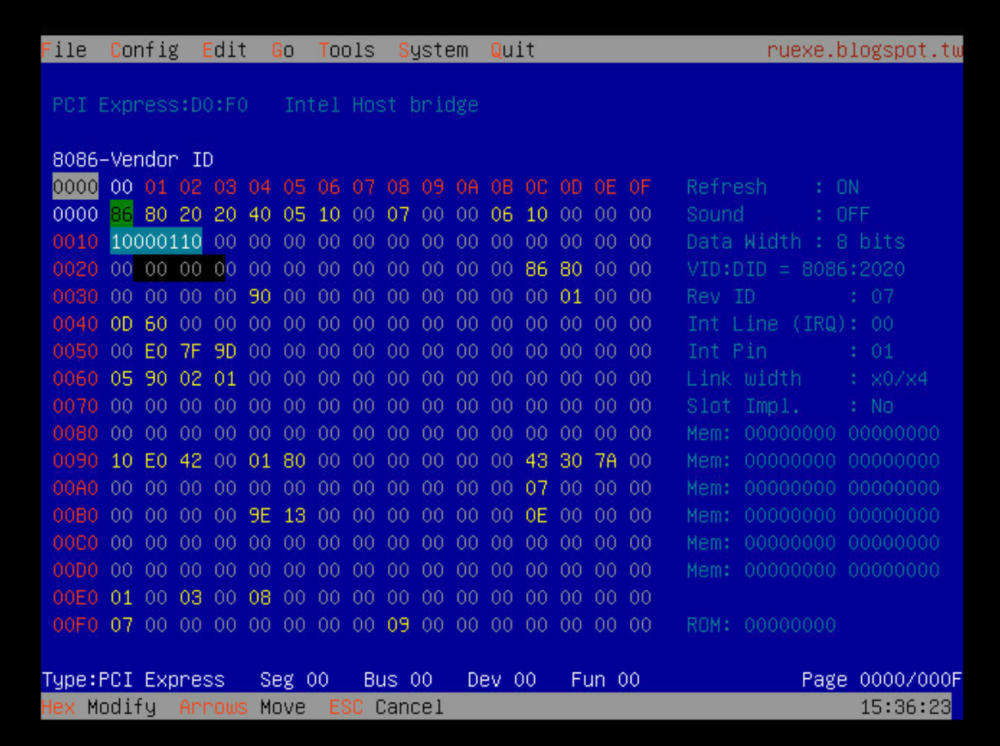
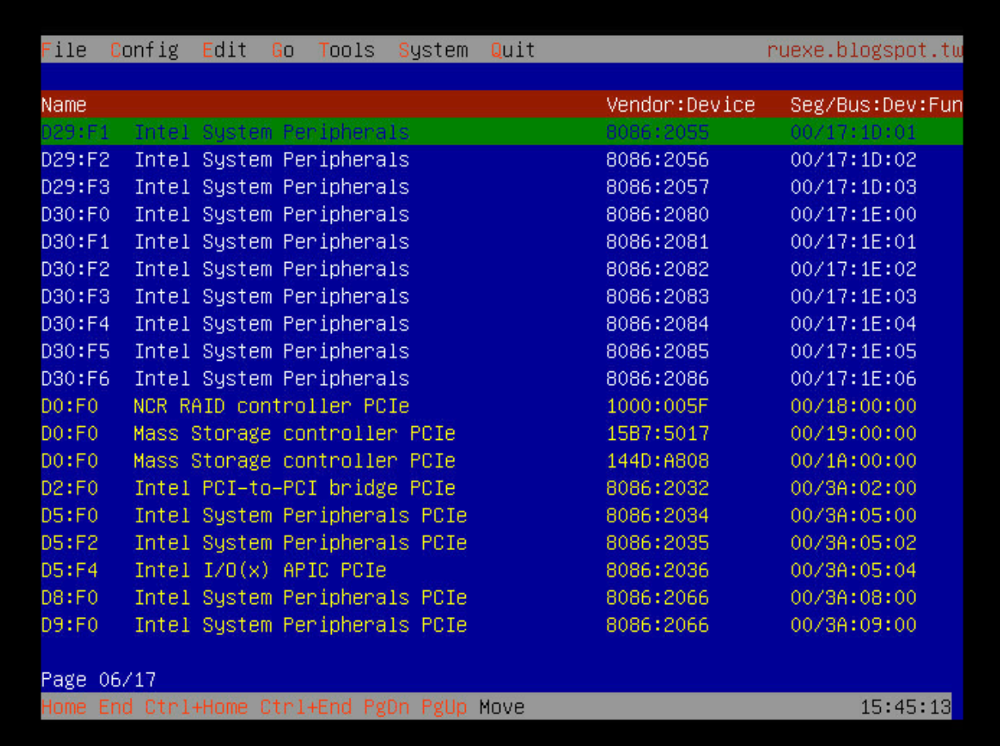
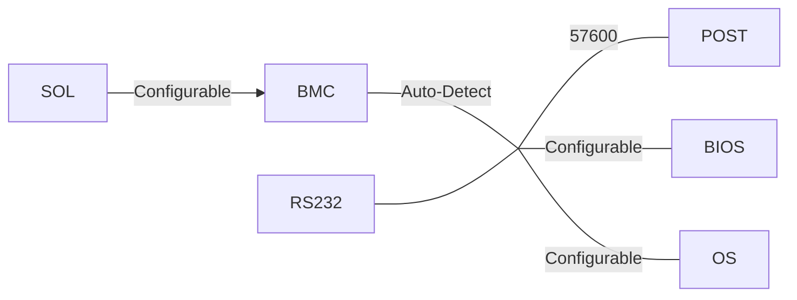
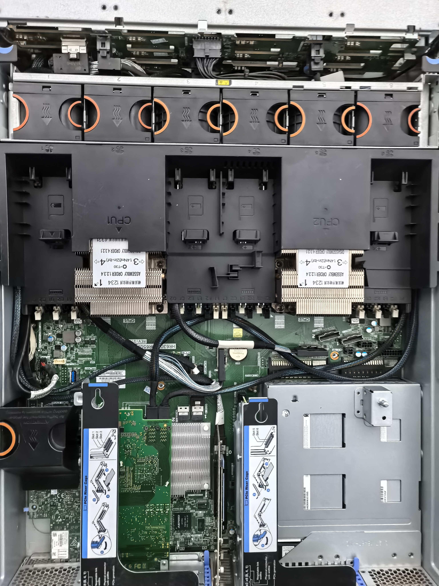
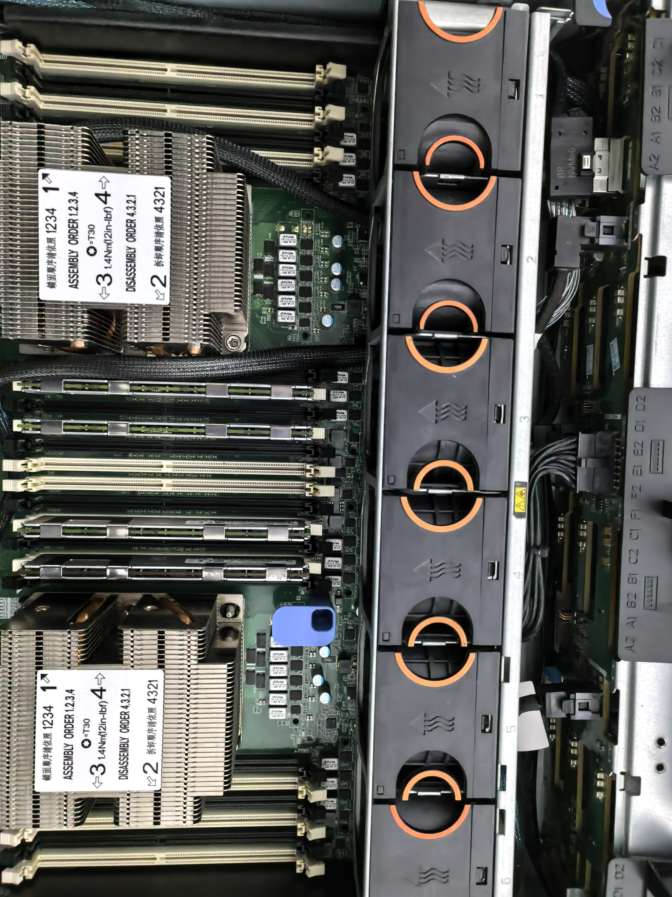

最近手痒想换服务器, 本来想二代 EPYC, 可惜太贵; 当时找到了比较便宜的是 HR650M, 但是没有 Riser 卡, 比较鸡肋, 然后就发现了 HR650X, 可以装一二代可拓展至强. 鉴于价格还行, 不如我手机贵, 我决定买一台解决我没有服务器用而一直把台式机当半个服务器又不太好用的问题. (主要是我的台式机的系统太混乱了我又不敢重装, 把服务器配好之后我一定要给我台式机扬了)

于是我就折腾了几天, 当然, 这个折腾还是很折腾的 (x). 这里记录一下过程.

多图警告

<!-- more -->

## 购买

我在淘宝上买的, 当时 (01/24/2026) 的价格是 "HR650X 准系统，双电双散满风扇满盘架，4 U2 背板两根 U2 线，无导轨，满 Riser，板载 2*25G 光口是在 1850 不包邮". 商家听说我要上二代至强, 表示那帮我刷 22 年的 BIOS. 我就同意了.

> Q: 诶，问一下他的BMC是全功能吗
>
> A: 是
>
> Q: 嗯嗯
>
> A: 远程口会测试好, 帐号和密码都是大写 Albert

我当时查了一下手册, 手册里面写 BMC 的默认账号是 admin:admin, 不知道当时商家怎么说 Albert.

然后我发现这个服务器有一个可选的 M.2 模块可以用, 我问了一下

> Q: 嗯。哦对，您这里有 M.2 模块吗
>
> A: 没有哦

我又看了看 Spec, 发现这个模块是 SATA NGFF 的 (不是, 这玩意鬼才用), 就不管了

考虑到我手上有一块 1TB 的 NVMe 盘, 现在的硬盘又... 和金子差不多贵, 我就打算先用着, 买一块 PCIe 转 NVMe M.2 的扩展卡. **但是**, 主板上面的 PCIe 要么是 x16, 要么是 x8, 因此买那个一个 x4 的卡就会浪费通道; 买 x8 转 2 * x4 就需要主板支持 PCIe 拆分 (bifurcation). 我在手册里面没有找到支持 PCIe 拆分的说明, 于是我就问了一下商家

> Q: 诶，能帮忙看一下这个PCIE支持拆分吗？
>
> A: 你要上 m.2吗
>
> Q: 我刚刚翻了半天他的手册没翻到（)
>
> A: 你要上m.2吗
>
> Q: 我想上m2
>
> A: 可以

然后我就被骗上了贼船 (bushi

然后我买了一个 x8 转 2 * M.2 的扩展卡, (现在看来, 其实可以买 x16 转 4 * M.2 的, 反正也没差多少钱; 主板上面 x8 的位置理论上是用来接阵列卡的)

当然, 后来我又购买了一块阵列卡 (LSI 8003-8i) 来装 SAS 盘 (硬盘也太贵了! SATA 买不起)

内存是薅的工场的一些闲置 64GB (这个是真的金条);

CPU 是神秘 [8259CL](https://www.cpu-world.com/CPUs/Xeon/Intel-Xeon%208259CL.html), 据说是 AWS 的定制 CPU, 因为大量下架, 价格只需要 100 一个... 24 核 48 线程, 简直白送. 但是也没那么白送: 这个 CPU 的额定功率比较高 (好像是 210W?) 在 3647 CPU 的 VRM 里面有一个软 TDP 限制, 如果 CPU 的 TDP 超过这个限制, 主板会拒绝启动. 显然大部分服务器 VRM 里面的 TDP 都不到 210W, 因此 8259CL 不能直接用 (估计这也是为什么 8259CL 二手这么便宜). Github 上面有一个神秘项目 [KCN VRM Mod Tool](https://github.com/JDDKCN/KCNVrmModTool) 可以连接 VRM 芯片的 I2C 接口修改 VRM 的 TDP 限制, 参考 [Lyc8503's blog](https://blog.lyc8503.net/post/19-first-rack-server-hr630x/) 和 [Serve the Home: VRM modify ICC_MAX to run high TDC OEM cpu](https://forums.servethehome.com/index.php?threads/vrm-modify-icc_max-to-run-high-tdc-oem-cpu.38686/)

卖家在发货之前做了测试, 发了不少图片 (不过我就不放出来了), 看着很好.

## 收货开箱

服务器在 CPU 啥的之后到. 到了之后 [physicsdolphin](https://aquarium.skyw.top/) 用他之前买的刷高功率的板子 (其实就是前面说的那个 GitHub 仓库的工具) 刷了 VRM, 成功启动. 于是我着急去 BIOS 里面找了 PCIe 拆分的选项... 没找到.

算了, 既然没有找到, 我就先调一下 BIOS 罢. 我点了一通, 把 BMC 在日志满了的时候的行为改成了覆盖. 保存重启...

## 救砖

然后 BIOS 启动过程中就卡 92 了. 重启几次无果, 而且卡一段时间之后 BMC 会崩溃自动重启, 表现为风扇满转速, SYS_ERR 闪红灯. BMC 的网页也进不去, ping 丢包严重.

然后我去问店家是不是没有更新 BMC 固件, 店家说没有更新过... 那么问题就比较明显了: BIOS 是 2022 年的版本, BMC 是 2017 年的... 两个差距过大, 在 BIOS 里面调整 BMC 的设置直接干烂了 BMC.

于是那个下午我就在寻找救砖的方法. 联想官网上有 BMC 固件, 但是里面的 README 大概的意思是:

- 要么进系统强制刷 BMC
- 要么在 BMC 正常工作的情况下通过 IPMI 刷 BMC

但是现在我 BMC 烂了, 系统也进不去, 直接就倒闭了.

怎么办呢? dolphin 先生有刷 BIOS 的夹子, 如果能找到原始固件, 就能直接刷回去. 但是 BMC 不只有 SPI 的固件, 还有一部分在 EMMC 里面.

```text
[  96]  .
├── [ 190]  Linux_64
│   ├── [3.6K]  FBMC_FW.SH
│   ├── [ 14K]  FBMC_MAIN.SH
│   ├── [3.4K]  FBMC_PC.SH
│   ├── [5.7M]  ipmitool
│   ├── [6.9M]  pmu
│   ├── [225K]  socflash_x64
│   ├── [  11]  version_file
│   ├── [1.7M]  yafuflash
│   └── [ 957]  yafu_flash_local.sh
├── [ 32M]  Mid_version.ima
├── [ 63M]  R13_79_0906.hpm
└── [1.5K]  ReadMe.txt
```

BMC 的固件里面有一个 `Mid_version.ima`, 大小看上去比较正常; 还有一个 `R13_79_0906.hpm`, 是真正的 BMC 的固件 (但是大小不对, 应该包含了 SPI 和 EMMC 的固件). 用来刷写的脚本是 `FBMC_MAIN.SH`, 我看了里面的代码, 发现在从非常老的 BMC 更新或者救砖的时候, 会用 `Mid_version.ima` 先刷写一遍, 等到 BMC 重启, 能正常用了之后然后再刷写 `R13_79_0906.hpm`. 抱着试一试的心态 (也没别的办法了), 我让 dolphin 先生用夹子把 `Mid_version.ima` 刷进了 BMC 的 SPI 里面 (这个文件最后有一点校验和要删了), 然后同时把 BIOS 固件也重新刷了一遍.

当然, 在此之前, 我还尝试过扣小电池重置 BIOS, 只刷入 BMC 等等, 折腾了一下午; 但是最终在同时刷入 BIOS 和 BMC 之后, 服务器终于成功启动了, BMC 版本是 11.xx, 然后用 admin:admin 进入 BMC (所以 Albert 是啥), 用 Web 刷入了 `R13_79_0906.hpm`, 终于把 BMC 救活并升级到了最新版本. (好吧记错了, 我当时刷入的是 15.35 版本)

```sh
root@router /h/ajax [1]# ipmitool mc info
Device ID                 : 32
Device Revision           : 1
Firmware Revision         : 15.35
IPMI Version              : 2.0
Manufacturer ID           : 8774
Manufacturer Name         : Universal Scientific Industrial Co., Ltd.
Product ID                : 581 (0x0245)
Product Name              : Unknown (0x245)
Device Available          : yes
Provides Device SDRs      : no
Additional Device Support :
    Sensor Device
    SDR Repository Device
    SEL Device
    FRU Inventory Device
    IPMB Event Receiver
    IPMB Event Generator
    Chassis Device
Aux Firmware Rev Info     :
    0x20
    0x09
    0x00
    0x00
```

## PCIe 拆分

但是 PCIe 拆分还是没有选项, 怎么办呢? dolphin 先生又拿出了他的喵喵小工具. 他不知道咋整的通过 BIOS 文件, 把 IFR 反编译出来了 (我也不知道这玩意中文是啥), 他发现在一个与 Setup (也就是 BIOS 的所有设置) 平级的选单里面有 PCIe 拆分的选项 (但是显然, 由于它与 Setup 平级, BIOS 里面是看不到的).



```yml
0x115F4: 	Form FormId: 0x47A, Title: "Socket0 Configuration" { 01 86 7A 04 0A 01 }
0x115FA: 		SuppressIf  { 0A 82 }
0x115FC: 			EqIdVal QuestionId: 0xB2, Value: 0x0 { 12 06 B2 00 00 00 }
0x11602: 			OneOf Prompt: "IOU0 (IIO PCIe Br1)", Help: "Selects PCIe port Bifurcation for selected slot(s)", QuestionFlags: 0x10, QuestionId: 0xD3, VarStoreId: 0x1, VarOffset: 0xB3, Flags: 0x10, Size: 8, Min: 0x0, Max: 0xFF, Step: 0x0 { 05 91 77 02 8B 02 D3 00 01 00 B3 00 10 10 00 FF 00 }
0x11613: 				OneOfOption Option: "x4x4x4x4" Value: 0 { 09 07 9B 02 00 00 00 }
0x1161A: 				OneOfOption Option: "x4x4x8" Value: 1 { 09 07 9C 02 00 00 01 }
0x11621: 				OneOfOption Option: "x8x4x4" Value: 2 { 09 07 9D 02 00 00 02 }
0x11628: 				OneOfOption Option: "x8x8" Value: 3 { 09 07 9E 02 00 00 03 }
0x1162F: 				OneOfOption Option: "x16" Value: 4 { 09 07 94 0D 00 00 04 }
0x11636: 				OneOfOption Option: "Auto" Value: 255, Default, MfgDefault { 09 07 91 0D 30 00 FF }
0x1163D: 			End  { 29 02 }
0x1163F: 			OneOf Prompt: "IOU1 (IIO PCIe Br2)", Help: "Selects PCIe port Bifurcation for selected slot(s)", QuestionFlags: 0x10, QuestionId: 0xD4, VarStoreId: 0x1, VarOffset: 0xB7, Flags: 0x10, Size: 8, Min: 0x0, Max: 0xFF, Step: 0x0 { 05 91 7B 02 8B 02 D4 00 01 00 B7 00 10 10 00 FF 00 }
0x11650: 				OneOfOption Option: "x4x4x4x4" Value: 0 { 09 07 9B 02 00 00 00 }
0x11657: 				OneOfOption Option: "x4x4x8" Value: 1 { 09 07 9C 02 00 00 01 }
0x1165E: 				OneOfOption Option: "x8x4x4" Value: 2 { 09 07 9D 02 00 00 02 }
0x11665: 				OneOfOption Option: "x8x8" Value: 3 { 09 07 9E 02 00 00 03 }
0x1166C: 				OneOfOption Option: "x16" Value: 4 { 09 07 94 0D 00 00 04 }
0x11673: 				OneOfOption Option: "Auto" Value: 255, Default, MfgDefault { 09 07 91 0D 30 00 FF }
0x1167A: 			End  { 29 02 }
0x1167C: 			OneOf Prompt: "IOU2 (IIO PCIe Br3)", Help: "Selects PCIe port Bifurcation for selected slot(s)", QuestionFlags: 0x10, QuestionId: 0xD5, VarStoreId: 0x1, VarOffset: 0xBB, Flags: 0x10, Size: 8, Min: 0x0, Max: 0xFF, Step: 0x0 { 05 91 7F 02 8B 02 D5 00 01 00 BB 00 10 10 00 FF 00 }
0x1168D: 				OneOfOption Option: "x4x4x4x4" Value: 0 { 09 07 9B 02 00 00 00 }
0x11694: 				OneOfOption Option: "x4x4x8" Value: 1 { 09 07 9C 02 00 00 01 }
0x1169B: 				OneOfOption Option: "x8x4x4" Value: 2 { 09 07 9D 02 00 00 02 }
0x116A2: 				OneOfOption Option: "x8x8" Value: 3 { 09 07 9E 02 00 00 03 }
0x116A9: 				OneOfOption Option: "x16" Value: 4 { 09 07 94 0D 00 00 04 }
0x116B0: 				OneOfOption Option: "Auto" Value: 255, Default, MfgDefault { 09 07 91 0D 30 00 FF }
0x116B7: 			End  { 29 02 }
0x116B9: 			SuppressIf  { 0A 82 }
0x116BB: 				EqIdVal QuestionId: 0x18F7, Value: 0x1 { 12 06 F7 18 01 00 }
0x116C1: 				OneOf Prompt: "MCP0 / IOU3 (IIO PCIe Br4)", Help: "Selects PCIe port Bifurcation for selected slot(s)", QuestionFlags: 0x10, QuestionId: 0xD6, VarStoreId: 0x1, VarOffset: 0xBF, Flags: 0x10, Size: 8, Min: 0x4, Max: 0xFF, Step: 0x0 { 05 91 83 02 8B 02 D6 00 01 00 BF 00 10 10 04 FF 00 }
0x116D2: 					OneOfOption Option: "x16" Value: 4 { 09 07 94 0D 00 00 04 }
0x116D9: 					OneOfOption Option: "Auto" Value: 255, Default, MfgDefault { 09 07 91 0D 30 00 FF }
0x116E0: 				End  { 29 02 }
0x116E2: 			End  { 29 02 }
0x116E4: 			SuppressIf  { 0A 82 }
0x116E6: 				EqIdVal QuestionId: 0x18F7, Value: 0x1 { 12 86 F7 18 01 00 }
0x116EC: 					Not  { 17 02 }
0x116EE: 				End  { 29 02 }
0x116F0: 				OneOf Prompt: "MCP0 / IOU3 (IIO PCIe Br4)", Help: "Selects PCIe port Bifurcation for selected slot(s)", QuestionFlags: 0x10, QuestionId: 0xD7, VarStoreId: 0x1, VarOffset: 0xBF, Flags: 0x10, Size: 8, Min: 0x0, Max: 0xFF, Step: 0x0 { 05 91 83 02 8B 02 D7 00 01 00 BF 00 10 10 00 FF 00 }
0x11701: 					OneOfOption Option: "x4x4x4x4" Value: 0 { 09 07 9B 02 00 00 00 }
0x11708: 					OneOfOption Option: "x4x4x8" Value: 1 { 09 07 9C 02 00 00 01 }
0x1170F: 					OneOfOption Option: "x8x4x4" Value: 2 { 09 07 9D 02 00 00 02 }
0x11716: 					OneOfOption Option: "x8x8" Value: 3 { 09 07 9E 02 00 00 03 }
0x1171D: 					OneOfOption Option: "x16" Value: 4 { 09 07 94 0D 00 00 04 }
0x11724: 					OneOfOption Option: "Auto" Value: 255, Default, MfgDefault { 09 07 91 0D 30 00 FF }
0x1172B: 				End  { 29 02 }
0x1172D: 			End  { 29 02 }
0x1172F: 			SuppressIf  { 0A 82 }
0x11731: 				EqIdVal QuestionId: 0x18F7, Value: 0x1 { 12 06 F7 18 01 00 }
0x11737: 				OneOf Prompt: "MCP1 (IIO PCIe Br5)", Help: "Selects PCIe port Bifurcation for selected slot(s)", QuestionFlags: 0x10, QuestionId: 0xD8, VarStoreId: 0x1, VarOffset: 0xC3, Flags: 0x10, Size: 8, Min: 0x4, Max: 0xFF, Step: 0x0 { 05 91 87 02 8B 02 D8 00 01 00 C3 00 10 10 04 FF 00 }
0x11748: 					OneOfOption Option: "x16" Value: 4 { 09 07 94 0D 00 00 04 }
0x1174F: 					OneOfOption Option: "Auto" Value: 255, Default, MfgDefault { 09 07 91 0D 30 00 FF }
0x11756: 				End  { 29 02 }
0x11758: 			End  { 29 02 }
0x1175A: 		End  { 29 02 }

...... Lots of lines skipped for other fine-grained PCIe controls ......

0x11A7E: 	End  { 29 02 }
0x11A80: 	Form FormId: 0x47B, Title: "Socket1 Configuration" { 01 86 7B 04 0B 01 }
0x11A86: 		SuppressIf  { 0A 82 }
0x11A88: 			EqIdVal QuestionId: 0xB2, Value: 0x0 { 12 06 B2 00 00 00 }
0x11A8E: 			OneOf Prompt: "IOU0 (IIO PCIe Br1)", Help: "Selects PCIe port Bifurcation for selected slot(s)", QuestionFlags: 0x10, QuestionId: 0xF5, VarStoreId: 0x1, VarOffset: 0xB4, Flags: 0x10, Size: 8, Min: 0x0, Max: 0xFF, Step: 0x0 { 05 91 78 02 8B 02 F5 00 01 00 B4 00 10 10 00 FF 00 }
0x11A9F: 				OneOfOption Option: "x4x4x4x4" Value: 0 { 09 07 9B 02 00 00 00 }
0x11AA6: 				OneOfOption Option: "x4x4x8" Value: 1 { 09 07 9C 02 00 00 01 }
0x11AAD: 				OneOfOption Option: "x8x4x4" Value: 2 { 09 07 9D 02 00 00 02 }
0x11AB4: 				OneOfOption Option: "x8x8" Value: 3 { 09 07 9E 02 00 00 03 }
0x11ABB: 				OneOfOption Option: "x16" Value: 4 { 09 07 94 0D 00 00 04 }
0x11AC2: 				OneOfOption Option: "Auto" Value: 255, Default, MfgDefault { 09 07 91 0D 30 00 FF }
0x11AC9: 			End  { 29 02 }

...... Lots of lines skipped for Socket 1, 2 and 3 ......
```



从这里面, 我们可以知道, 在 AMI 的 BIOS 里面, 这个 BIOS 最多支持 4 个 CPU 插槽 Socket 0~4, 每个插槽有 4 个 PCIe 控制器 IOU 0~3 且在某些条件下有 IOU4 (MCP1), 每个控制器都是 x16, 但可能被拆分成多个模式, 默认都是 Auto (但是 Auto 是什么意思呢? 首先排除 "自动拆分"). 这些选项虽然被隐藏了, 但是依然可以 (尝试) 通过直接修改 NVRAM 来使他生效. 比如:

```yaml
"IOU0 (IIO PCIe Br1)", Help: "Selects PCIe port Bifurcation for selected slot(s)",
  QuestionFlags: 0x10, QuestionId: 0xD3,
  VarStoreId: 0x1, VarOffset: 0xB3, # [!code focus]
  Flags: 0x10, Size: 8, Min: 0x0, Max: 0xFF, Step: 0x0 { 05 91 77 02 8B 02 D3 00 01 00 B3 00 10 10 00 FF 00 }
```

这里 `VarOffset: 0xB3` 就是这个选项在 NVRAM 里面的位置, 大小是 8 位 (1 字节). 但是 NVRAM 怎么修改呢? dolphin 先生又从不知道什么地方掏出一个叫 `RU.efi` 的工具, 这个工具可以直接读写 AMI BIOS 的 NVRAM.



这东西还有串口输出, 可以用串口调试... 不过感觉不如 BMC Virtual Console 或者插个显示器一根.

```text
File  Config  Edit  Go  Tools  System  Quit                    ... James Wang

 PCI Express:D0:F0   Intel Host bridge                                       

 00000000-Base Address #0
 0011 00 01 02 03 04 05 06 07 08 09 0A 0B 0C 0D 0E 0F   Refresh    : ON
 0000 86 80 20 20 40 05 10 00 07 00 00 06 10 00 00 00   Sound      : OFF
 0010 00 00 00 00 00 00 00 00 00 00 00 00 00 00 00 00   Data Width : 8 bits
 0020 00 00000000 00 00 00 00 00 00 00 00 86 80 00 00   VID:DID = 8086:2020
 0030 00 00 00 00 90 00 00 00 00 00 00 00 00 01 00 00   Rev ID        : 07
 0040 0D 60 00 00 00 00 00 00 00 00 00 00 00 00 00 00   Int Line (IRQ): 00
 0050 00 E0 7F 9D 00 00 00 00 00 00 00 00 00 00 00 00   Int Pin       : 01
 0060 05 90 02 01 00 00 00 00 00 00 00 00 00 00 00 00   Link width    : x0/x4
 0070 00 00 00 00 00 00 00 00 00 00 00 00 00 00 00 00   Slot Impl.    : No
 0080 00 00 00 00 00 00 00 00 00 00 00 00 00 00 00 00   Mem: 00000000 00000000
 0090 10 E0 42 00 01 80 00 00 00 00 00 00 43 30 7A 00   Mem: 00000000 00000000
 00A0 00 00 00 00 00 00 00 00 00 00 00 00 07 00 00 00   Mem: 00000000 00000000
 00B0 00 00 00 00 9E 13 00 00 00 00 00 00 0E 00 00 00   Mem: 00000000 00000000
 00C0 00 00 00 00 00 00 00 00 00 00 00 00 00 00 00 00   Mem: 00000000 00000000
 00D0 00 00 00 00 00 00 00 00 00 00 00 00 00 00 00 00   Mem: 00000000 00000000
 00E0 01 00 03 00 08 00 00 00 00 00 00 00 00 00 00 00
 00F0 07 00 00 00 00 00 00 00 09 00 00 00 00 00 00 00   ROM: 00000000

Type:PCI Express   Seg 00   Bus 00   Dev 00   Fun 00              Page 0000/000F
Ctrl+PgDn Ctrl+PgUp +/- Pages  PgDn Next PgUp Prev device              15:41:49
```

这里我们 F6 可以列出 PCIe 设备; 但是看到的是总线号, 并非前面提到的 IOUx. 那怎么办呢? 这次 dolphin 先生没招了. 于是我们只好一个一个试. 一开始的时候只识别到了一张盘, 总线号是 0x19; 我们把 Socket 0 IOU 0 的拆分改成了 x8x4x4, 发现还是识别一张盘, 但是总线号变成了 0x1a. 这大概率说明了这个总线本身是 x8x8 拆分的... 吗? 如果这样, 那么 0x18 应该是另一个 x8 的插槽. 但是 RAID 卡正巧在 0x18 上, 那个插槽写的是 x16. 需要测试.



我们把它改成了 x4x4x4x4, 进入之后检查 RAID 卡, 发现其工作在 x4/x8 模式且总线为 0x19. 这确认了以下拓扑:

- Socket 0
  - IOU0: Auto 为 x8 (Slot 4) x8 (Slot 3)
  - IOU1: Auto 为 x16 (Slot 5)
  - IOU2: Auto 为 x16 (Slot 1)
  - IOU3: Auto 为 x16 (OCP 网卡? 但是网卡工作在 x8/x8, 理论上这里还有空闲的通道. 根据接口 Form + 手册, 这里应该有 x8 + x16 的能力)

- Socket 1
  - 不知道了, 没有盘. 有两个 IOU 应该是 Auto x4x4x4x4 用于 U.2 盘; 另外两个应该是 Auto x16 在 Riser 2 上面. 没有多的 PCIe 设备 (以及懒)

所以... 你就说能不能拆分吧.jpg

(修改教程: 进入 RU.efi, Alt+= 进入 UEFI Variable 编辑, 输入 (直接输入) iioconfig 回车找到 "SocketIIOConfig", 回车进入, 找到对应的 VarOffset 修改成上述表格里面的值, Ctrl+W 写入 (如果是 KVM 记得别 Ctrl+W 给浏览器页面关了), 然后重启)

## BMC

然后我要强烈吐槽这玩意的 BMC. 不知道是谁干的好事, 但是应该不是我的问题, BMC 的 HTTP 跳转 HTTPS 的请求响应长这样:

```http
HTTP/1.1 301 Moved Permanently
X-Content-Type-Options: nosniff, nosniff
X-XSS-Protection: 1; mode=Block, 1; mode=block
Content-Encoding: gzip
X-Frame-Options: SAMEORIGIN
Cache-Control: no-store, no-cache, must-revalidate, private
Pragma: no-cache
Strict-Transport-Security: max-age=63072000;includeSubDomains
Content-Security-Policy: default-src 'self';object-src 'none';connect-src *;style-src 'self';script-src 'self'; img-src 'self' blob: data:;font-src 'self'
Referrer-Policy: no-referrer-when-downgrade
Location: https://10.5.0.112:443/^@
Content-Length: 0
Date: Sun, 01 Feb 2026 11:27:43 GMT
Server: lighttpd
```

这个 Location 的结尾多了一个 NULL BYTE, 违反了 HTTP 规范, 浏览器直接返回 Invalid HTTP Response 了. 至少 HTTPS 没啥问题, 但是也不是完全没有:

Cache-Control 是 no-store, no-cache, must-revalidate, private 导致浏览器不缓存任何内容, 这个 B BMC 本来就慢, 每次都重新加载资源就更烦人了;

然后他自己写了一堆 Content-Security-Policy 又没写明白, 浏览器报一坨 CSP 错误

> source.min.js:66 Applying inline style violates the following Content Security Policy directive 'style-src 'self''. Either the 'unsafe-inline' keyword, a hash ('sha256-47DEQpj8HBSa+/TImW+5JCeuQeRkm5NMpJWZG3hSuFU='), or a nonce ('nonce-...') is required to enable inline execution. The action has been blocked.

还有这个 HSTS, 万一我拿我自己的域名反代一下算是完蛋了, 整个域名都会被 HSTS 污染, 没法用 HTTP (不过我域名似乎本来就有 HSTS, 所以问题不大).

好在至少整个 BMC 能 work, CSP 也没有导致什么不得了的问题, 顶多就是一些按钮啥的更难看了; 传感器也都正常, 整机空载功率 130W 左右, 风扇可以开得相当低.

BMC 里面有 FRU 信息, 因为拆分了 PCIe, FRU 的信息并不准确 (好吧至少没有爆炸, 已经很好了)

IPMI Event Log 里面有 0 条有用的记录, 全是些我感觉无关紧要的东西.

Settings 里面感觉功能好像很多, 但是有用的几乎没有 (网络设置算是唯一能用的了?), 什么 RADIUS 什么 LDAP 也用不着, Event Filter 过于专业和高级我感觉配置起来会非常头大, RAID 设置... 因为没有 RAID 卡也用不了.

Remote Control 的 Virtual Console 好歹不是 Java (求你了), 还有一个下载 SOL Log 的功能, 还行. 但是 KVM Console 不知道怎么了 BitWarden, 每一次敲键盘之后 BitWarden 都会觉得 KVM Console 是一个密码输入框而弹出密码填充提示, 会抢走键盘的焦点, 搞得我只好给 BitWarden 关了.

然后有一个 Media Redirection 的功能, 可以从 NFS / CIFS 挂载 CD / DVD / HDD, 感觉挺方便, 但是目前没有用到.

## SOL

对于一个 Linux 用户, 打开 BMC 然后打开 Virtual Console 然后发现没法粘贴还是太头疼了, 不如串口. 大部分 BMC 都有 SOL (Serial Over LAN) 的功能, 可以把 BMC 的串口重定向到网络上. 不过我当时又折腾了好久. 这个串口是个神秘东西, BIOS 自检的时候就会喷一些东西到这个串口, Linux 启动之后也可以设置为把 tty 输出到这个串口上面, BIOS 自己也支持串口输出. 但是!

既然有这么多源, 那么波特率到底是多少呢?

答: 不知道! 或者说, 不一定... 我现在对这玩意的感觉是, 用 `ipmitool sol set volatile-bit-rate` 的结果并不靠谱, 和实际值不一致. 我当时试了很久, 大概是这么个状况:



由于右边按顺序是 POST, BIOS / OS, 且 POST 似乎一定是 57600 (吗?), 所以 BMC 连接到串口线上的波特率总是 57600, 把 SOL 设置成任何波特率都不会改变 POST 的输出波特率. 如果 BIOS / OS 的波特率和 POST 的时候不一致, 那么 SOL 无论怎么调都是乱码. 当然, 可能不对, 或者 BMC 可以 Trigger 重试协商波特率, 但是 Anyway 我当时用 57600 终于发现一切都通了之后我就懒得动了. 把 BIOS 和 OS 都调成 57600, SOL 就完全正常了.

BMC 里面能保存 2MB 的 SOL Log, 如果不是前述的抽象 RU.efi 一直往 Console 里面喷 ANSI Control Char, 应该能保存不少东西 (好吧, 还是 fish 往串口喷的更胜一筹, 刚刚去看了一下直接给 less 干烂了).

虽然我有点想把启动的 POST Log 在这里放一份, 但是考虑到不知道里面会不会有什么奇怪的东西, 就算了.

## 买盘...

太贵了!

在闲鱼上好不容易决定买两块, 结果一个卖家说没货了, 一个卖家说放假了, 总之就是没有 ()

## 总结?

总体上说, 是一次成功的捡垃圾. 我的小水管路由器变成了 2U 服务器, 这下可以自由安装虚拟机啥的跑神秘计算服务了.

最后来点图





## 似了

时间过去了一个多星期, 我回家过年了. 2 月 13 号, 我发现服务器连不上了. BMC 还好着, 但是进去之后服务器的状态是 Off, 点开机键没有反应. 由于前述这个 BMC 的日志是一坨大的, 我也搞不明白到底咋回事. 我忘记了下载 SOL Log (太坏了), 重置 BMC 也没用. Anyway, 两个 CPU 同时 IERR + MCERR 就很奇怪, 后面还开不起来, 只能留着等到回北京再研究了. 可恶!

```log
  a0 | 02/13/2026 | 10:27:17 | System ACPI Power State ACPI_State | S0/G0: working | Asserted
  a1 | 02/13/2026 | 10:27:48 | Processor CPU1_IERR | State Asserted
  a2 | 02/13/2026 | 10:27:48 | Processor CPU2_IERR | State Asserted
  a3 | 02/13/2026 | 10:27:48 | Processor CPU1_MCERR | State Asserted
  a4 | 02/13/2026 | 10:27:48 | Processor CPU2_MCERR | State Asserted
  a5 | 02/13/2026 | 10:28:06 | System Event | Timestamp Clock Sync | Asserted
  a6 | 02/13/2026 | 10:28:06 | System Event #0xff | Timestamp Clock Sync | Asserted
  a7 | 02/13/2026 | 10:28:02 | System Event #0xff | Timestamp Clock Sync | Asserted
  a8 | 02/13/2026 | 10:28:05 | System Event | Timestamp Clock Sync | Asserted
  a9 | 02/13/2026 | 10:33:35 | System ACPI Power State ACPI_State | S5/G2: soft-off | Asserted
  aa | 01/01/2000 | 00:00:19 | System ACPI Power State ACPI_State | S5/G2: soft-off | Asserted
  ab | 01/01/2000 | 00:00:19 | System Event #0xff | Timestamp Clock Sync | Asserted
  ac | 02/13/2026 | 12:13:59 | System Event #0xff | Timestamp Clock Sync | Asserted
  ad | 02/13/2026 | 12:14:16 | Processor CPU1_Status | Presence detected | Asserted
  ae | 02/13/2026 | 12:14:16 | Processor CPU2_Status | Presence detected | Asserted
```

## 活了

过年之后有同学去机房帮忙把电拔了, 然后重新插了一下, 服务器就活了. 别问我为什么, 我也不知道. 我把 SOL Log 下载下来让 GPT 看, 他也没看出什么大锅, 只是发现在 MEM Init 之前, CPU 的 Fabric 部分有一些报错, 但是正常启动了, 所以感觉上也没什么毛病. Kernel Log 里面也没有问题 (感觉是因为 CPU 出错, Kernel Log 没法写回磁盘了), 只是确实是异常关机, 没有 systemd 的关机停止服务的记录.

然后我装了 rasdaemon 来试图监控 MCE Log, 不过至今 (02/25) 为止也没有死第二次 (当然, 我也不想让它死第二次, 求你了).

## 买盘

之前看的 6T 盘的价格又涨了一点, 从 400 涨到 430. 不过我逛来逛去的时候看到了一个 930 的 14TB 盘, [Seagate Exos 2X14](https://www.seagate.com/support/internal-hard-drives/enterprise-hard-drives/exos-2X14/), 有点意思. 这块盘是双磁头机械盘, 一块盘会被 OS 识别成两块, 每块 7TB. 我买了 3 块, 打算做 ZFS RAIDZ2 (这个也挺神奇的, 因为每块盘都被识别成两块, 所以我实际有 6 块虚拟盘; 而这个神秘盘又可能只坏一块逻辑盘 (对, 坏一半物理盘), 所以双盘冗余说不定还真是有用的 (比起 RAID50)) 不好说? GPT 建议先 RAIDZ1 再 stripe.

### 阵列卡...

盘到了以后, 我先在叶先生的机器上测试了一下. 他的 JBOD 似乎没有风扇, 这个盘放上去十几分钟, 拿下来的时候烫得要命. ylw 的阵列卡在 Windows 上面正确识别到了 6 块逻辑盘, 但是他尝试了好几个工具都不能正常读取 SMART 信息. 用 DG 简单跑了一点没啥大锅, 然后用 HDTune 简单跑了一下 benchmark, 没啥大问题, 遂不管了, 取下来放在我自己的机器上跑 format + write test.

结果... 放到我的机器上, 只读出来了 3 块盘 (每一块盘的第一个逻辑盘). 我让 GPT 研究了一下为什么, GPT 发现这个阵列卡的驱动是 MegaRAID SAS (而不是标准的 LSI SAS IT 模式), 导致只认识 LUN0, 不能正常识别 LUN1. 解决方案应该是给这个卡刷公版的 IT 固件, 但是我当时懒了, 直接从别的用公版固件的卡的机器上拆了一张下来. 重启就认全了.

至于这个拆下来的阵列卡, 它是富士通的 OEM 版, 后面叶先生又折腾了一个小时把它刷回了公版, 这是后话, 在此不管了.

### 盘...

盘到手之后看了一下 SMART 信息, 三块盘的读写都还好, 看上去不是矿; 其中一块的写入甚至只有 45GB, 通电时间 18000h, 感觉是阵列的热备盘. 6 个逻辑盘里面有一个 SMART 表里面有一些 pending sector 但是日志记录时间是 4600 小时的时候, 不知道怎么回事.

我对盘做了 sg_format. 对 *任意* 一块逻辑盘做 sg_format 都会把两块逻辑盘 (也就是一整块物理盘) 都 format 掉. 不过 anyway 盘里面没有数据, 格了不心疼. 三块盘的格式化用时差不太多, 是好事, 说明没有大量坏道. 比较神秘的是格式化到 75% 的时候就完成了, 不知道剩下 25% 干嘛去了.

### 阵列...

准备制造 ZFS 阵列的时候才又发现了一万个问题. 我原先的磁盘分区是 (但是我没有保存)

```text
nvme1n1     894.3G disk                                                    
├─nvme1n1p1   976M part vfat       /boot/efi  nvme1n1                      1bc1b1c1-b7a4-4299-9649-51be296450d0
└─nvme1n1p2 893.3G part btrfs      /          nvme1n1                      2044c41d-37af-4bb8-a490-296dedda5422
nvme0n1     953.9G disk                                                    
├─nvme0n1p1 953.9G part zfs_member            nvme0n1 zfs-74af3cd6588fc037 21f42df7-f015-b945-952b-25425903d120
└─nvme0n1p9     8M part                       nvme0n1 4a78b6a2-72d2-ea4c-9dc0-f1ecb5fbec23\
```

我一开始想把 nvme0n1 的 zfs 拆了, 然后把这块盘当成 metadata dev. GPT 警告我说 metadata device 是一个独立的冗余区, 最好 mirror. 加上 zfs 的 metadata dev 也不需要那么大, 因此我决定在 nvme0n1 和 nvme1n1 的最后都增加一个 128GB 的分区当 metadata dev (mirror). 于是, 我需要缩容这两块盘的最后一个分区.

nvme1n1p2 是 / (btrfs), 相对好弄一点, 先 `btrfs filesystem resize -128G /`, 然后用 fdisk 把分区调小, 最后 `btrfs filesystem resize max /` 把它撑满 (其实理论上不需要这一步, 但是以防我 sb 了没算对分区大小, 我还是加上了), 后面就多了 128GiB 的空间可以新建一个分区.

nvme0n1 就不太好办了. 这玩意是一个完整的 zpool, zpool 没办法像 btrfs 一样缩容, 只能给它完全拆了之后重新建. 我让 CodeX 写了一些脚本 (但是 LLM 的 Bash 水平一直都是一坨啊):

```bash
#!/usr/bin/env bash
set -euo pipefail

if [[ "${EUID}" -ne 0 ]]; then
  echo "Run as root." >&2
  exit 1
fi

POOL="${1:-ssd}"
BACKUP_DIR="${2:-/var/tmp/zfs-backup}"
SNAP="${3:-pre-shrink-$(date +%F-%H%M)}"
BACKUP_FILE="${BACKUP_DIR}/${POOL}-${SNAP}.zfs"

mkdir -p "${BACKUP_DIR}"

echo "Creating recursive snapshot: ${POOL}@${SNAP}"
zfs snapshot -r "${POOL}@${SNAP}"

echo "Estimating send stream size..."
zfs send -nP -R "${POOL}@${SNAP}"

echo "Sending to: ${BACKUP_FILE}"
zfs send -v -R "${POOL}@${SNAP}" > "${BACKUP_FILE}"

# echo "Writing checksum..."
# sha256sum "${BACKUP_FILE}" > "${BACKUP_FILE}.sha256"

echo "Backup stream written."

echo "Done."
ls -lh "${BACKUP_FILE}" "${BACKUP_FILE}.sha256"
```

创建了一个包含从 zfs root 递归的包含所有快照的备份 (send stream); 然后 zpool export + fdisk 重建分区 + zpool create, 然后再

```bash
zfs receive -uF "${TARGET_POOL}" < "${BACKUP_FILE}"
```

把数据导入进去. 好在两块盘都是 NVMe SSD, 速度有 600MB/s, 没有特别慢.

这一切都弄完之后, 使用

```bash
zpool create \
  -o ashift=12 \
  -o autotrim=on \
  -O compression=zstd \
  -O atime=off \
  -O xattr=sa \
  -O acltype=posixacl \
  tank \
  raidz1 \
    /dev/disk/by-id/wwn-0x6000c500cb1cac1f0000000000000000 \
    /dev/disk/by-id/wwn-0x6000c500d75029530000000000000000 \
    /dev/disk/by-id/wwn-0x6000c500d7be243b0000000000000000 \
  raidz1 \
    /dev/disk/by-id/wwn-0x6000c500cb1cac1f0001000000000000 \
    /dev/disk/by-id/wwn-0x6000c500d75029530001000000000000 \
    /dev/disk/by-id/wwn-0x6000c500d7be243b0001000000000000 \
  special \
  mirror \
    /dev/disk/by-id/nvme-SAMSUNG_MZ1LB960HAJQ-00007_S435NA0R311997-part3 \
    /dev/disk/by-id/nvme-WD_PC_SN560_SDDPNQE-1T00-1102_24274F807216-part2
```

建立了 zfs 阵列. 第一个 raidz1 用了 3 块盘的第一个逻辑盘, 第二个用另一个逻辑盘 (所以这三块盘提供了一块盘的冗余).

至此, 我们获得了 26TB 的存储空间 (我猜够我用很久了).
