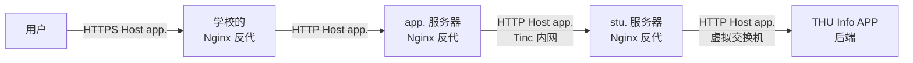
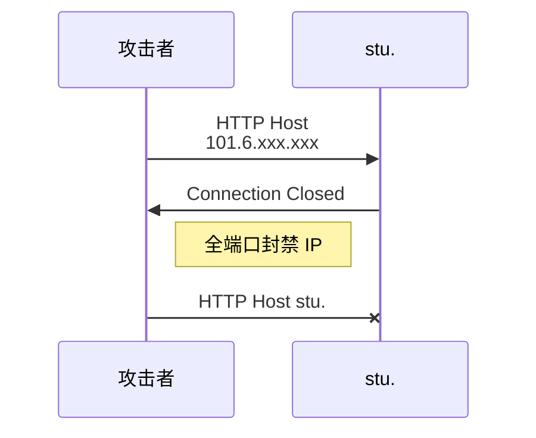
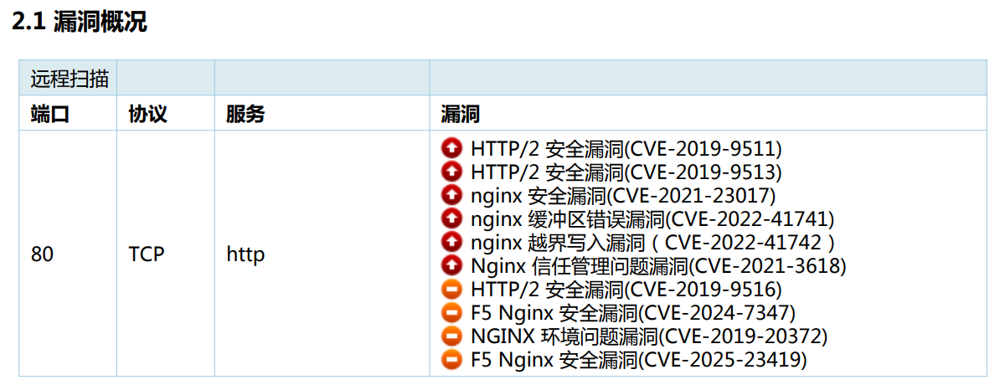
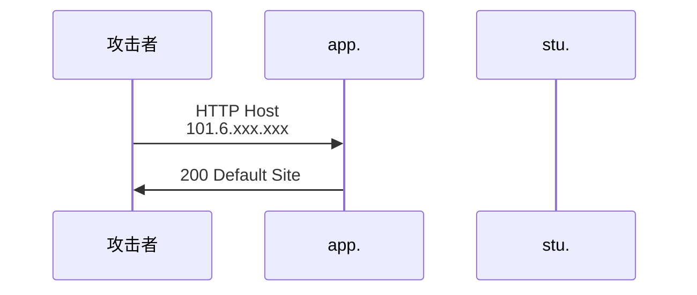
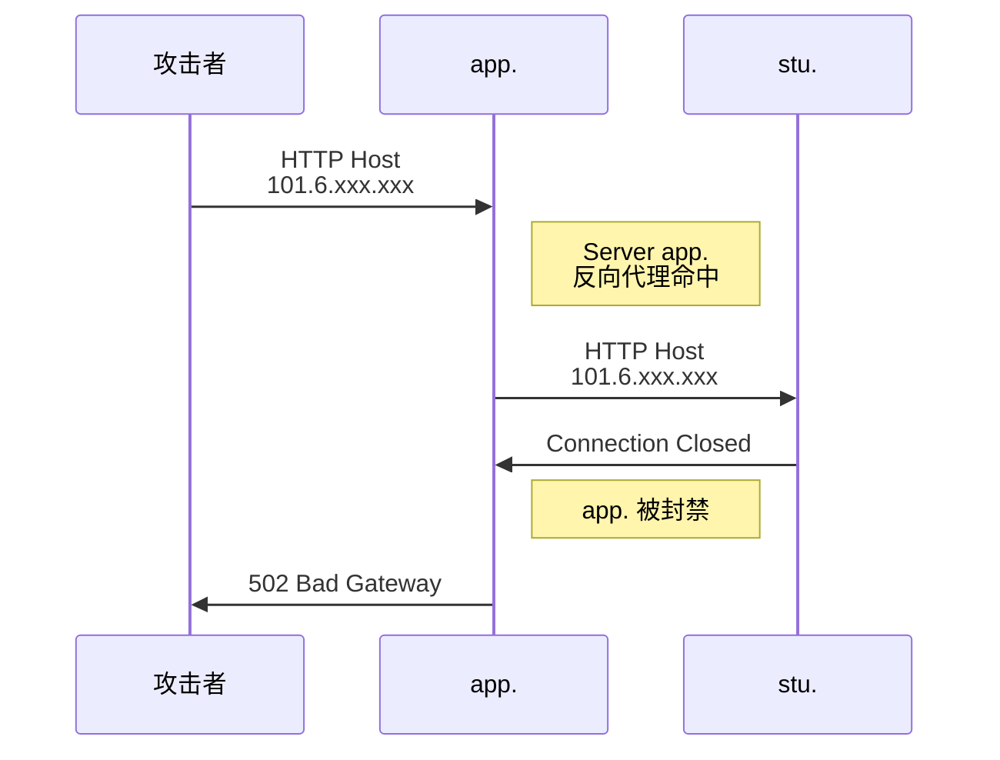
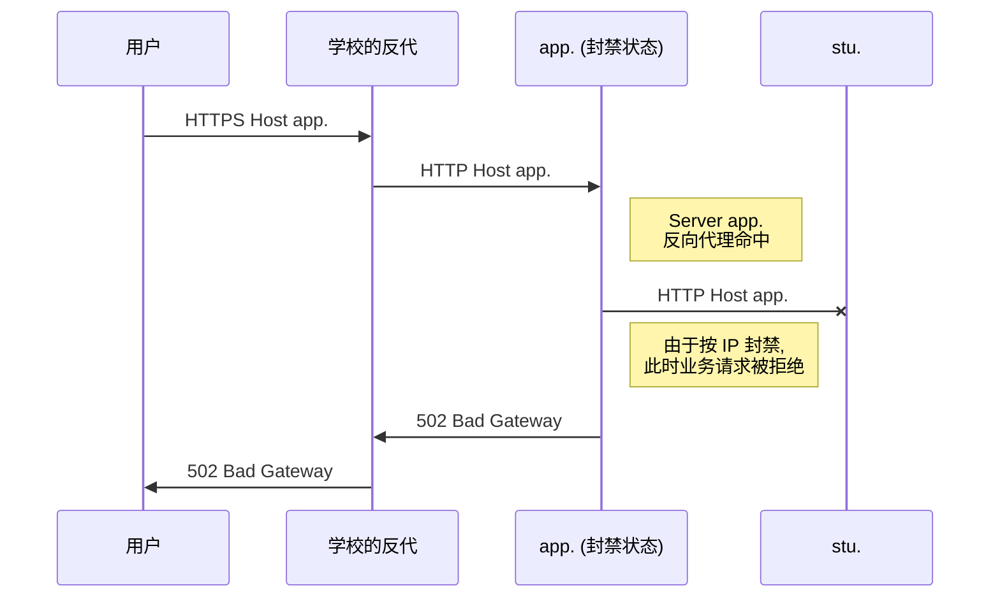

这周一, 我在更新交流群二维码的时候发现 app.cs.tsinghua.edu.cn (以下简称 app.) 502 了, 登录进去之后发现 Tinc VPN 出现了奇怪的问题, 遂进行了一些配置调整; 周三, 我校园卡没钱了, 用 APP 充值失败, 我发现又 502 了, 遂晚上调查, 发现多个 "无害" 更新共同作用, 产生了奇怪的后果: 我自己写的蜜罐封禁了我自己的 IP.


<!-- more -->


## 前置知识: 系统架构

app. 注册于信息化技术中心的虚拟化平台上, 是一个性能一般, 磁盘空间严重受限 (16G), 内存也少的机器 (还贵的不行); stu.cs.tsinghua.edu.cn (简称 stu.) 是科协托管在信息化中心机房的一台物理服务器, 运行虚拟化平台, 在上面开虚拟机几乎没有开销 (因为机器性能不错, 平时负载不高). 后来, 我们决定将 app. 迁移到 stu. 的一台虚拟机上, 并走流程变更 app. 指向的 IP 为 stu. 的 IP (这一步 ~~还没搞完~~ 还没开始), 在学校反代变更之前, 我们的架构如下:




## 扫描器与蜜罐

学校为了检查信息系统的安全性, 时常采用主动扫描的方式. 如果扫到什么漏洞 (也不一定真的是什么严重的问题), 就会发工单要求整改. 同时, 也有人喜欢攻击, 到处扫端口.

为了避免被扫到然后因为什么 SSH Server 支持较弱的密码学算法而被发工单, 我之前 [写了几个蜜罐](https://gist.github.com/84634E1A607A/a28bbb19ad8386710f4a6f05ab981389), 其中有一条是, 如果 stu. 的 Nginx 收到了不存在的 Host 的请求, 就会触发全端口封禁. 这样一来, app. 已经吃了不少工单了, 但是 stu. 从未吃过工单 --- 扫描器还没扫出什么好东西, 就被蜜罐全端口封禁了.




## Nginx 与默认站点

可以参考一下 , Nginx 对每种协议都有一个默认站点. 一般来说, 默认站点是那个 "Welcome to nginx!" 的页面; 但是如果配置不当, 业务网站可能变成默认站点, 从而泄露信息.


## 漏洞告警

两周前, [Unidy](unidy.cn) 跟我说, app. 又被报漏洞了, 说 Nginx 有一坨洞.



我跟他说,

> 你回复说这是 CentOS 的问题
>
> 学校给了这个垃圾系统, 就只能这样

这是学校给的 tnnd Centos Stream 6 导致的. 即便更新到了 CentOS Stream 8, 它的系统 Nginx 依然是

```
nginx version: nginx/1.14.1
built by gcc 8.5.0 20210514 (Red Hat 8.5.0-3) (GCC) 
built with OpenSSL 1.1.1k  FIPS 25 Mar 2021
TLS SNI support enabled
```

的老古董. 我的评价是别管, 但是 Unidy 迫于工单的压力, 选择了用 Docker 拉一个更新的 Nginx 下来, 换成了

```
nginx version: nginx/1.29.1
built by gcc 14.2.0 (Alpine 14.2.0) 
built with OpenSSL 3.5.1 1 Jul 2025
TLS SNI support enabled
```

并且把原来 /etc/nginx/conf.d 中的配置文件以只读卷的方式挂载了进去.


## Tinc 异常

周一, 我发现 app.cs. 502, 连上去, 发现 app. Ping 不通 stu. (port unreachable), 但是其他的 Tinc 内网都是正常的. 我当时没有多想, 觉得可能是 Tinc somewhat 坏掉了, 遂把反代改成了使用 HTTP 的物理地址 (而非 Tinc 地址) 访问.


## 还是异常

周三吃晚饭的时候, 我发现还是不太对劲, 校园卡无法充值; 打开电脑发现通过 Tinc 内网无法访问 app. 了 (不通). 我让 Unidy 从另一条内网给我了临时访问权限, 发现 app. 无法 ping 通 stu. . 我当时没想出来能是为什么 (因为我当时认为 app. 没人拿它恶意访问, 不该被 Ban; 又没有配置变更, 因此没一点道理). 吃晚饭之后我开始调试, 通过 nft trace 发现是被 Ban 了, 原因是命中了 Nginx default host 的蜜罐. 为什么呢?

我检查了 Nginx 配置, 发现问题如下:

在使用 CentOS 的 Nginx 时, 其 `/etc/nginx/nginx.conf` 中有如下内容:

```nginx
    server {
        listen       80 default_server;
        listen       [::]:80 default_server;
        server_name  _;
        root         /usr/share/nginx/html;

        # Load configuration files for the default server block.
        include /etc/nginx/default.d/*.conf;

        location / {
        }

        error_page 404 /404.html;
            location = /40x.html {
        }

        error_page 500 502 503 504 /50x.html;
            location = /50x.html {
        }
    }
```

因此扫描器在扫描端口的时候实际情况如下:



没有 stu. 啥事. 但是换成 Nginx Docker 镜像之后, 它的 conf 十分简单:

```nginx
http {
    include       /etc/nginx/mime.types;
    default_type  application/octet-stream;

    log_format  main  '$remote_addr - $remote_user [$time_local] "$request" '
                      '$status $body_bytes_sent "$http_referer" '
                      '"$http_user_agent" "$http_x_forwarded_for"';

    access_log  /var/log/nginx/access.log  main;

    sendfile        on;
    #tcp_nopush     on;

    keepalive_timeout  65;

    #gzip  on;

    include /etc/nginx/conf.d/*.conf;
}
```

*没有* 对应的 default server. 因此, 我们挂载进去的用于反代的 server 块 **成为了 Default Server**.

```nginx
server {
    listen 80;
    server_name app.cs.tsinghua.edu.cn;

    set_real_ip_from 166.111.xxx;
    set_real_ip_from 166.111.xxx;
    real_ip_recursive on;

    add_header X-App-Old-Server true always;

    location / {
        proxy_pass https://101.6.xxx;
        proxy_ssl_verify       off;
        proxy_ssl_server_name  on;
        proxy_set_header Host $host;
        proxy_set_header X-Real-IP $remote_addr;
        proxy_set_header X-Forwarded-For $proxy_add_x_forwarded_for;
        proxy_set_header X-Forwarded-Proto $scheme;
    }
}
```

这意味着什么呢? 这意味着直接发往它的 Host 不是 app. 的请求也会经过反代, 而 `proxy_set_header Host $host` 会让它带上会遭到封禁的 Host:



**但是!** 是 app. 被 stu. 封禁了! 所以在此之后, **即便是正常的访问也无法送达**.




## 解决方案

解决方案也很简单, 只要在配置文件结尾添加一个额外的 Default Site 即可:

```nginx
server {
    listen 80 default_server;
    server_name _;

    return 444;
}
```


## 评价

从这次事件, 我们得出以下结论:

1. 蜜罐是有效的, 虽然出了一些事故, 但是我认为蜜罐起到了很好的防护作用 (毕竟, app. 收了工单, stu. 可没有)
2. 没有设置监控告警是个问题, 如果我们定期监控 app., 应该能尽早发现此问题, 不会两周才发现
3. 从发现问题到解决问题的速度还是比较快的
