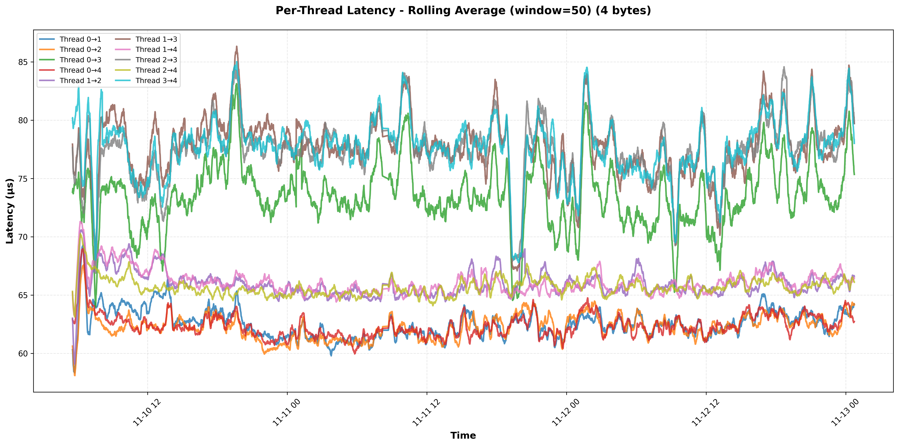
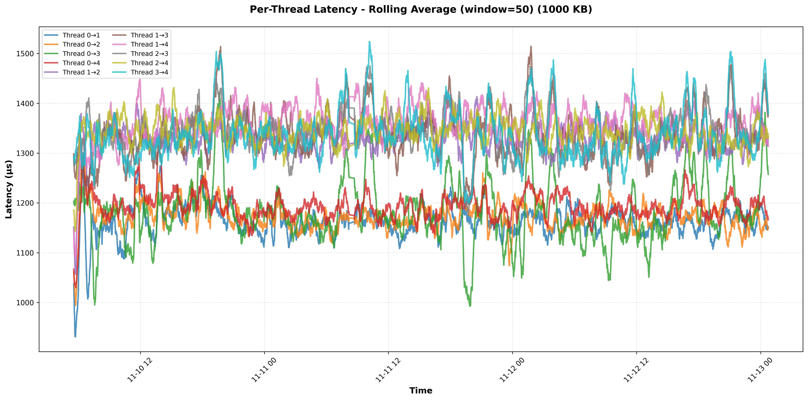
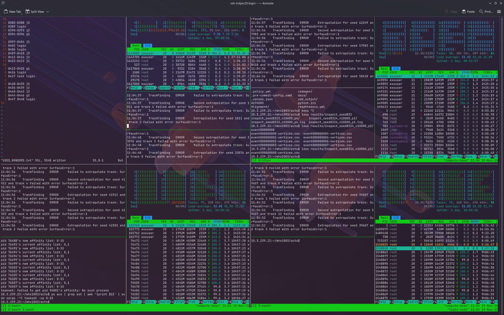
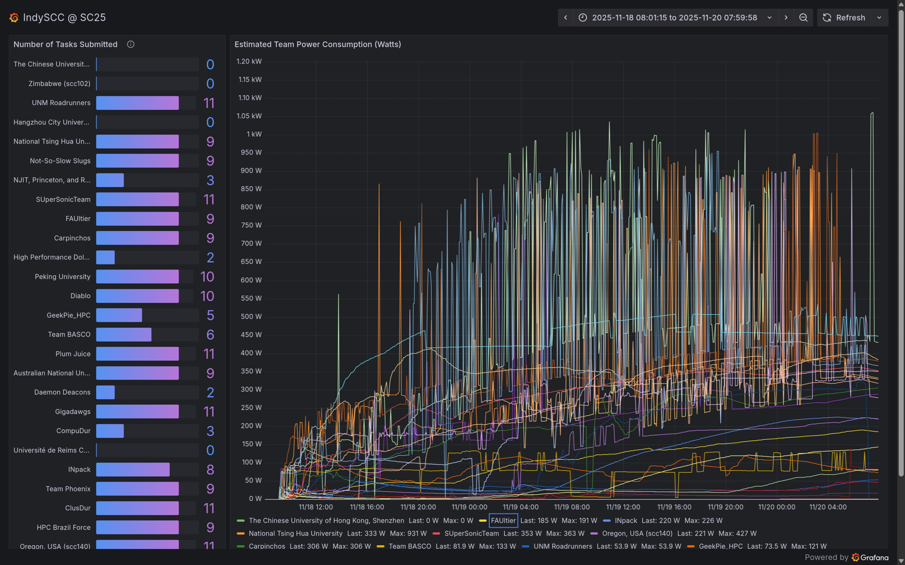

今天 (11/20) 早上 7:00, IndySCC 2025 比赛结束了. 经过了 46 个小时的比赛, 我现在也不知道成绩咋样, 公布成绩的时间是明天的凌晨 2:30... 算了我还是睡觉吧. 但是想必这篇博客写成的时候, 成绩应该已经出来了. 这篇博客记录一下我们为了这个抽象比赛都干了什么抽象事情.

<!-- more -->

## 练习题

一开始的时候给了两道练习题, 一道是 SST (https://github.com/sstsimulator/sst-core), 要求是 "研究一下模拟的 rv 处理器的原理和性能, 再研究一下给出的 Dragonfly 拓扑是如何缩放的". 另一道是 ECE (https://github.com/ecrc/exageostatcpp), 是个气候模拟仿真.

我们在比赛之前去研究了许久如何优化. 在不知道赛题的情况下, 我们当时判断对于 SST, 模型应该是给定了 SST 上需要跑的负载, 然后让我们去调优 SST, 实现最快的模拟速度.

对于 ECE, 他们看完了代码之后觉得优化的重点是 Cholesky 分解, 会在 GPU 上进行, 重点是混合精度计算等.

## 机器...

IndySCC 在神秘的 [JetStream2](https://jetstream-cloud.org/index.html) 上面用 **虚拟机** 进行比赛... 对此, 学长纷纷表示, 没有任何参考经验. 我们的申必虚拟机的 CPU 节点是...

```plaintext
Architecture:                x86_64
  CPU op-mode(s):            32-bit, 64-bit
  Address sizes:             40 bits physical, 48 bits virtual
  Byte Order:                Little Endian
CPU(s):                      32
  On-line CPU(s) list:       0-31
Vendor ID:                   AuthenticAMD
  Model name:                AMD EPYC-Milan Processor
    CPU family:              25
    Model:                   1
    Thread(s) per core:      1
    Core(s) per socket:      1
    Socket(s):               32
    Stepping:                1
    BogoMIPS:                3992.49
    Flags:                   ...... (without AVX-512)
Virtualization features:
  Virtualization:            AMD-V
  Hypervisor vendor:         KVM
  Virtualization type:       full
Caches (sum of all):
  L1d:                       1 MiB (32 instances)
  L1i:                       1 MiB (32 instances)
  L2:                        16 MiB (32 instances)
  L3:                        1 GiB (32 instances)
NUMA:
  NUMA node(s):              1
  NUMA node0 CPU(s):         0-31
```

重点: 这是... 32 **"个"** Sockets of "单核" AMD Milan... 也就是它在虚拟化的时候把什么 NUMA 啊, 什么绑定核心啊什么的全给优化没了... 换句话说... 都改不了 ()

不仅如此, 这玩意的核间延迟又高又不稳定, 访存带宽也很低.

然后 GPU 节点是

```plaintext
Architecture:                x86_64
  CPU op-mode(s):            32-bit, 64-bit
  Address sizes:             46 bits physical, 57 bits virtual
  Byte Order:                Little Endian
CPU(s):                      20
  On-line CPU(s) list:       0-19
Vendor ID:                   GenuineIntel
  Model name:                Intel(R) Xeon(R) Platinum 8468
    CPU family:              6
    Model:                   143
    Thread(s) per core:      1
    Core(s) per socket:      20
    Socket(s):               1
    Stepping:                8
    BogoMIPS:                4200.00
    Flags:                   ...... (with AVX-512)
Virtualization features:
  Virtualization:            VT-x
  Hypervisor vendor:         KVM
  Virtualization type:       full
Caches (sum of all):
  L1d:                       640 KiB (20 instances)
  L1i:                       640 KiB (20 instances)
  L2:                        80 MiB (20 instances)
  L3:                        16 MiB (1 instance)
NUMA:
  NUMA node(s):              1
  NUMA node0 CPU(s):         0-19
```

这玩意就正常多了, 至少它是 1 个 CPU 上面的 20 核心 (x), 而且似乎硬件绑了核, 这一台机器的访存带宽比 3 个 CPU 节点加起来还要高...

然后, 机器之间的延迟也抽象地离谱, 我们家里一般用 200G IB 互联, 然后这边他们声称是 100G Ethernet, 但是实际上有时候我们体验到的速度是 100M Ethernet...



而且延迟既不稳定, 也不对称, 还不知道为什么...



> ~~A卡音质好，N卡网速快~~ 0,1,2,4 Affinity 好, 0 网速快

## 比赛题...

### SST

然后前天赛题出来之后我人傻了... SST 的题目是三个 Task, 第一个是它给了一坨 rv CPU 的选型, 让我们跑一个固定的模拟负载 (我要吐槽, 主办方在一开始的时候没有提供 Binary, 只提供了源码, 而同一份源码在不同的编译器和编译选项下跑出来的结果是不一样的, 这会对 CPU 的选型产生影响), 然后我们要在给定的预算下选出最优的 CPU, 实现 1. 最高的性能; 2. 最高的性价比.

第二个 Task 是给定了 6 种网络选型, 让我们确定最优的网络拓扑; 第三个 Task 是把这个网络上面的任务规模给弄大了不少, 要仿真的日志.

从头到尾, "优化" 的任务都是 SST 上面跑的负载, 而不是 SST 本身... 这和我们的预期完全不同 (好在, 至少我们准备的时候正确构造了一个 SST 的 Dockerfile, 这样一来我们就可以确保正确地并行执行 SST 了).

### ECE

ECE 和他们的预期类似. 我没有关注 ECE 到底在干嘛, 但是他们似乎主要负载是 GPU 上面, 20 核心的 CPU 甚至可以腾出 12 个跑 Mystery.

### Mystery

Mystery 这个题目就很 mystery, 主办方给了个 ACTS 让大家跑, 然后编译的依赖有一万个, zy 他们第一天很长时间都在尝试用 Spack 正确编译出一个能跑的 ACTS. 后来, 他们发现编译出来的程序跑主办方给的脚本过不了测试, 经检查, 主办方给里面写了个 1e-6 的精度要求, 但是我们编译出来的版本和他那个有 5e-4 的误差. 我们也不知道咋回事, 然后问出题人, 出题人想了想, 觉得 5e-4 好像也可以接受, 于是就让我们先这么跑.

## 时间线 (大概率不准)

### 11/18 09:00 - 比赛开始

在比赛开始前, 组委会冻结了我们的 JetStream2 账号, 所有虚拟机都自动 Shelve 了. 比赛开始, 我们对所有虚拟机做 Unshelve 操作, 结果登录节点卡在了 Unshelving 状态, 一直起不来. 比赛正式开始之前, 我们觉得我们的登录节点 *一定不会出问题的* 就没有做快照, 结果这下炸了, 不得不给虚拟机扬了, 重新开了一个登录节点. 这大概耗费了 30min 的时间.

\* 这里, 我们新开的登录节点忘记安装 zfs-auto-snapshot 了, 导致后面 /home 的快照没有自动生成, 到快要结束的时候我们才发现这个问题, 好在, 问题不算太大.

### 11/18 09:30 - SST 跑 Docker Build

由于我记错了 Docker 导入镜像的命令, 我花了小一段时间 debug 为啥 `docker import` 进来的镜像打不开. 后来发现, 应该是 `docker load`...

我们在尝试把 LLVM 和 GNU RV 工具链打包进已有的 Dockerfile. 但是 LLVM 和 RV 工具链都很大, 这么一来, Docker 镜像也变得非常大, 甚至导致了 / 分区空间不够. 后来, 我们给 `/var/lib/docker` 挂载了一个额外的磁盘. 我们本来以为这能解决问题, 但是发现新的 Docker 用 Containerd 存储镜像, 而在自己的文件夹下面存储容器. 最终, 我们决定直接用 `cp -a` 把 `/var/lib/` 都复制到新的磁盘上面, 然后再挂载回去.

### 11/18 10:00 - SST Dockerfile 把 Spack 扬了

后面由于 hjh 认为 spack 编译太慢, 他决定直接基于 ubuntu:24.04 造一个 Dockerfile, 这样能快一点. 我们进行了约三个小时的调试, 最终我们成功地完成了构建.

好吧... 我承认我们在 Docker Build 这件事上面浪费了相当多时间

### 11/18 13:00 - 讨论碰头, 确认了 SST 方向

由 qfr 先写 Task 1, 我跑 Task 1; 由 hjh 写和跑 Task 2 & 3.

我写了个抽象生成 Makefile 的脚本, 会生成类似:

```Makefile
$(RESULTS_DIR)/output_1.txt:
	@echo "[Job 1] Attempting to acquire lock..."
	@if mkdir $(LOCK_DIR)/output_1.lock 2>/dev/null; then \
		echo "[Job 1] Lock acquired, starting execution..."; \
		echo "$$HOSTNAME:$$$$" > $(LOCK_DIR)/output_1.lock/info; \
		sudo docker run --rm --network host sst-i2:latest bash -c 'cd node && time mpirun --allow-run-as-root -np 4 sst p1.py -- -e beam -n 32 -c slow -t no -x small -y small -s private -z small -b slow -w 6 -m basic' > $(RESULTS_DIR)/.temp_output_1.txt 2>&1; \
		EXIT_CODE=$$?; \
		if [ $$EXIT_CODE -eq 0 ]; then \
			mv $(RESULTS_DIR)/.temp_output_1.txt $(RESULTS_DIR)/output_1.txt; \
			echo "[Job 1] Completed successfully"; \
		else \
			echo "[Job 1] Failed with exit code $$EXIT_CODE"; \
			echo "[Job 1] Output discarded, lock released for retry"; \
			cat $(RESULTS_DIR)/.temp_output_1.txt; \
			rm -f $(RESULTS_DIR)/.temp_output_1.txt; \
		fi; \
		rmdir $(LOCK_DIR)/output_1.lock 2>/dev/null || rm -rf $(LOCK_DIR)/output_1.lock; \
	else \
		echo "[Job 1] Already completed or in progress by another process"; \
	fi
```

的脚本, 首先尝试用 mkdir 创建一个锁目录, 如果创建成功, 说明锁被当前进程获取到了, 然后就执行 SST 的模拟任务, 否则说明已经有别的进程在跑这个任务了, 就直接跳过. 这样一来, 我们可以充分利用家里集群的所有资源尽可能快地跑完所有的 Task 1.

### 11/18 15:00 - 发现主办方上传了标程 + 确认 Task 1 结果

这时候我们在讨论 Task 1 的结果, 因为题目要求给出唯一的正确答案, 如果答案不对就只能得到最多 50% 的分数. 但是, 由于此时我们不知道主办方的标程如何, 所以我们感觉不对, 发了一封邮件问到底标程是怎么回事.

这时我们发现比赛的仓库里面默默地多出了一个 rv 二进制文件... 他们把标程传上去了. (这样一来, 我们折腾了半天的 LLVM 和 RV 工具链就白折腾了...) 然后之前的也统统白跑了.

> 题外话, 我用了以下脚本提取 journal
> 
> ```sh
> ansible all -i ./hosts -m shell -a 'sudo sh -c "journalctl -b0 > /home/exouser/logs/$(ip route get 1 | awk '\''{print $7; exit}'\'').log"'
> ```

### 11/18 18:25 - 在家里开始跑 SST Task 1

我们在尝试构建了一年的 Dockerfile 然后又搞炸了一些事情之后, 终于开始跑 SST 了. SST 的 Task 1 有 893 个需要跑的 job, 我们按照 4 进程一个 job 的方式跑, 一个 job 需要 ~30min, 一台机器上可以跑 32 个 job, 大概需要 3.5h 能全部跑完.

### 11/18 19:30 - NFS 意外死锁

到了 19:30 左右的时候, 我观测到 i2, i4 的 Load 下降了, 当前在跑的程序基本已经结束, 但是新的程序没能成功被调度上去. 在 i2 上新建 shell 失败, 在 i1 上 ls 失败. 和 zy 沟通, 认为 NFS 似乎死锁, i1 在等待 i3:/mnt/treasure 而 i3 在等待 i1:/home, i2 和 i4 在等待 i1 和 i3. 我们决定强行在 i1 上解除挂载 i3:/mnt/treasure 以缓解死锁, 成功. 因此, 我们预期 11/19 0:00 能遍历完 SST Task 1.

### 11/18 不确定时间 - ECE + Mystery

ECE 相对比较常规; Mystery zy 一开始在看, 但是被它的编译环境气死了. 没有关注具体时间线.

### 11/18 不确定时间 - SST Task 2 & 3

hjh 对 SST 的 Task 2 和 3 需要的核时进行了估计, 感觉 SST 一定跑不完, 因此 SST 将要放弃部分点.

### 11/19 00:00 - SST Task 1 结束

SST Task 1 按照预期结束, 我整理了结果, 弄了一个表格出来; 然后交给 hjh 在 JS2 上复现, 跑了部分点. (这还是得干, 不然算是作弊了(?)) 我就回去睡觉了. 组委会发了一个 "标准点" 的结果, 我让 hjh 跑了一下.

### 11/19 09:00 - 起床, 交接班

第二天早上大概 9 点我去了, 和熬了一整夜的 zy, hjh 和 whx 交接班, 他们在前一天晚上总算是把 Mystery 正确 (吗?) 编译出来了, 但是有感觉有一些浮点数精度的奇怪问题. 他们问了组委会, 但是组委会还没有回复.

SST 的 Task 2 已经完全跑出来了, Task 3 跑了一部分, 还需要一段时间才能跑完, 预期要到 11/19 23:00. 这之后, 一整天的时间, 我大概就在当监控室大爷. Task 1 的标准点我们的结果和组委会的一致, 感觉 SST 应该没啥问题.

题外话, 我当时从 B286 的一堆垃圾显示器里面调了个最像监控室显示器的出来, 插上电, 发现它的分辨率甚至不到 1080p, 是一个神秘的 16:10 的屏. 但是尽管它分辨率一坨, 我用神奇的 Wayland 调了个 75% 的缩放, 居然还挺清楚.



### 11/19 11:00 - 组委会发了一个 Grafana 面板

组委会发了一个 Grafana 面板, 里面能显示每个队伍交了多少题, 以及每个队伍的功耗. 我们发现有一些题目我们交了, 但是没有识别到. 为此, 我们当时反正主要也就是在当监控室大爷, 我们就尝试了来回修改我们的提交名称啥的, 来猜测组委会的识别逻辑. 好吧, 实际没什么作用. 后来我们发邮件问了一下组委会到底咋回事. 很久之后, 组委会发现自己的识别逻辑写错了.



### 11/19 11:30 - 组委会回复精度问题

> You must have done some interesting things with the floating point math ;-)
> 
> It's close enough, so I'll give it to you.

组委会表示这个浮点误差也不是不能接受, 于是我们就开始在所有可用的 JS2 机器上面跑 Mystery 了. 这之后, zy, hjh, whx 就回去休息了, 我继续当监控室大爷.

### 11/19 20:00 - zy 回来, hjh 回不来

到了晚上, zy 睡觉起来了, hjh 发烧了回不来了. SST 的其中一个 Task 3 跑完了, 还有一个还在跑. 组委会上班了, 大家在 Google Group 里面疯狂轰炸组委会, 虽说我就应该是个监控室老大爷的活, 但是实际体验下来还挺累的 ()

晚上点的饭我总感觉没吃饱, 于是我把事情大致交代给 zy, 肉身跑路去麦当劳又去点了份汉堡套餐. 过了一个小时左右, 我回到了比赛的场地.

### 11/20 0:20 - SST 结束

SST 的 Task 3 终于跑完了, 交了之后就可以开始跑 Mystery 的 "Throughput Test" 了.

### 11/20 1:30 - Mystery 的事件有重复

我当时突发奇想 (因为 Mystery App 的提交要求里面写道, 提交你们一共找到了多少 "Unique" 事件), 对所有 Mystery 跑出来的结果做了 sha256sum 排了个序, 发现有一大坨重复的. 于是我们大为震惊, 给出题人发了一份邮件. 结果出题人也大为震惊...?

> that is very surprising, and I'm not sure how it's happened!
> 
> can you tell me which seeds produced the same output? I'll need to look into it.
> 
> Since this isn't your fault, we won't hold it against you that the different jobs/seeds produced the same output. Make sure you supply all the log files so we can see what you've done.
> 
> When calculating your max throughput, just assume that each event processed was unique.
> 
> cheers,  Charles.

然后此时已经 2:45 了.

### 11/20 3:00 - Mystery Throughput Test

我们准备了一下 Mystery Throughput Test 的脚本, 在跑的时候我们发现同样的 CPU, login node 上面的一个 job 总是比计算节点的要快一些. 经过了短时间的 Debug, 我们把问题定位到了前述的声称自己有 100G 的 JS2 网络上面. 用 sync 模式的 NFS 写一个 output 文件疑似需要将近 1s 的时间...?

我们把输出文件的位置改成了 /dev/shm, 其它几个节点的速度明显变快了. 于是我们跑了 40min 的 Throughput Test.

非常不幸的是, 当时我们改输出位置的时候漏掉了一部分, 然后这部分文件写到了 NFS, 和试跑的数据混在了一起; 然后在把 /dev/shm 里面的数据拷贝回来的时候, 我顺手就给之前的测试数据文件夹扬了 () 于是部分结果就消失了. 由于前述原因, zfs autosnapshot 也没有启用, 于是我们不得不重跑. 这次跑了 35min.

### 11/20 4:50 - 跑部分 SST Task 3 拿部分分数

这之后, 我把那几个跑不完的 SST Task 3 给跑起来了, 这样能拿到部分分数; 然后我们着手处理 Mystery 的数据. 我们发现了抽象问题...

本来我们 (和主办方) 预期 ACTS 的随机数种子是用来生成随机数的; 结果, 我们发现随机数种子为 10000 的第 2 个点就是随机数种子为 10001 的第一个点. 也就是说, ACTS 的所谓 "随机数种子" 是它用固定种子生成的随机数序列的起始位置. 这玩意疑似有些过于误导了.

### 11/20 6:55 - 交!

最后, 我们在 6:55 确认了所有我们跑出来的结果都交了, 完结但并没有撒花 (x)

## 反思!

今天 (已经是 11/21 了) 凌晨公布了第一名是浙江大学, 其它队伍的成绩和排名都还没公布. 但是, 必须反思! (x)

### 得找个人一直盯着仓库

感觉 SC 的题是巨大的一坨啊, Bug 到处都是. 有时候主办方不声不响 Push 了几个 commit, 我们几个小时才知道, 这严重影响了我们的进度. 比如, 如果我们 13:00 的时候知道主办方推了 rv 二进制文件, 我们就可以节约 3h 的机时直接跑 Task 1 了, 17:00 就能把 Task 1 跑完, 说不定 Task 3 就可以多跑两个了.

### 怎么这么多 Bug

我觉得 SC 他自己也得反思, 怎么能到处都是 Bug, 啥玩意都不清楚, 邮件列表里面能有 50 封邮件

### 准备还是不足... 吗?

感觉我们准备的也不少, 但是这个题和我们准备的完全正交吧, 感觉没什么用.

### NFS?

我们选用了一种用 NFS 挂 /home, 几乎所有的东西都放 NFS 的方案, 事实是, 这玩意垃圾网络的 NFS 延迟也高, 丢包也高, NFS 感觉出了不少锅, 甚至影响到了性能. 下次如果还是线上比赛, 我觉得我们得认真研究一下到底还要不要 NFS; 或者说我们只把 /home 里面放轻量级的东西, 把更多的东西放到 memory / 挂盘里面去.

### 不要觉得 60G 的 / 分区很大

除非你想给 /var/lib 也挂个盘

## 致谢 (雾)

虽然这次比赛抽象, 但是比赛的体验还是不错的. 至少 ---

### 大家都很认真

没有人摆烂, 没有人跑路, 没有人推诿. 大家都在尽力把比赛搞好! (我怎么感觉这是很不容易的品质, 你清怎么给了我这么个印象)

### 沟通比较顺利

不管是队内还是和组委会, 没有打嘴仗, 整体的氛围很友好

---

别的也不知道应该写什么... 等如果有评论再说吧
