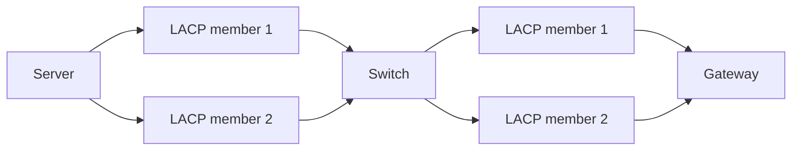

Earlier we upgraded the core switch of Skyworks' serverroom to a Cisco Nexus 92160YC-X, a 48-port 25GbE datacenter switch. We also upgraded the connection of Skyworks' gateway to the switch from 2x10GbE to 2x25GbE LACP. Days ago, I upgraded my server from 1x25GbE to 2x25GbE LACP. Dolphin told me that despite the 50Gbps aggregated bandwidth, iperf3 tests can reach to only about 41Gbps. He and 6dx suspected a saturated CPU on the server, but when I ran the test, I got similar results, with not a single 100% busy core.

UDP tests yeilded approximately the same result, which make me *think*: what's the root of the problem, were it not CPU saturation? Here is the investigation.

<!-- more -->

## Experimental setup: the network topology

The following diagram illustrates the network topology of the testbed (that is, my server and the gateway). The two nodes are connected through that N9K switch (enterprise-class, guaranteed line-speed switching). Both sides are configured with 2x25GbE LACP (802.3ad, hashing based on encap-3+4 (we will simulate layer-3+4, but since we don't use MPLS etc., they're effectively the same)), link healthy, MTU 9216. Linux congestion control is linux kernel BBR.

We tested the bandwidth with multi-connection iperf3.

The results:

| Connections | Flow | Bandwidth | Note |
| ----------- | ---- | --------- | ---- |
| 1           | G->S | 22.9 Gbps | Gateway CPU 90+ single-core |
| 1           | S->G | 19.6 Gbps | Gateway CPU 90+ single-core |
| 2           | G->S | 24.7 Gbps | One link saturated |
| 2           | S->G | 24.7 Gbps | One link saturated |
| 2           | G->S | 43.0 Gbps | Gateway 2 cores 90+ |
| 2           | S->G | 39.2 Gbps | Gateway 2 cores 90+ |
| 4           | G->S | 41.1 Gbps | Most of the time |
| 4           | G->S | 46.0 Gbps | Sometimes |
| 4           | S->G | 41.2 Gbps | Most of the time |
| 4           | S->G | 46.3 Gbps | Sometimes |

When we add more threads, the bandwidth is around 42 Gbps, still lower than the theoretical maximum. Why?

## Background: LACP and flow hashing

I will just simply put the kernel docs here. See [Linux Ethernet Bonding Driver HOWTO](https://www.kernel.org/doc/html/next/networking/bonding.html) for more details.

### Linux bonding

When a NetDev is in `bond` mode, multiple physical interfaces are combined into a single logical one. Traffic can flow through *any* of the physical interfaces, determined by the bonding mode and the hashing policy.

> mode
>
> Specifies one of the bonding policies. The default is balance-rr (round robin). Possible values are:
>
> - balance-rr or 0
>
>   Round-robin policy: Transmit packets in sequential order from the first available slave through the last. This mode provides load balancing and fault tolerance.
>
> - active-backup or 1
>
>   Active-backup policy: Only one slave in the bond is active. A different slave becomes active if, and only if, the active slave fails. The bond's MAC address is externally visible on only one port (network adapter) to avoid confusing the switch.
>
>   In bonding version 2.6.2 or later, when a failover occurs in active-backup mode, bonding will issue one or more gratuitous ARPs on the newly active slave. One gratuitous ARP is issued for the bonding master interface and each VLAN interfaces configured above it, provided that the interface has at least one IP address configured. Gratuitous ARPs issued for VLAN interfaces are tagged with the appropriate VLAN id.
>
>   This mode provides fault tolerance. The primary option, documented below, affects the behavior of this mode.
>
> - balance-xor or 2
>
>   XOR policy: Transmit based on the selected transmit hash policy. The default policy is a simple [(source MAC address XOR'd with destination MAC address XOR packet type ID) modulo slave count]. Alternate transmit policies may be selected via the xmit_hash_policy option, described below.
>
>   This mode provides load balancing and fault tolerance.
>
> - broadcast or 3
>
>   Broadcast policy: transmits everything on all slave interfaces. This mode provides fault tolerance.
>
> - 802.3ad or 4
>
>   IEEE 802.3ad Dynamic link aggregation. Creates aggregation groups that share the same speed and duplex settings. Utilizes all slaves in the active aggregator according to the 802.3ad specification.
>
>   Slave selection for outgoing traffic is done according to the transmit hash policy, which may be changed from the default simple XOR policy via the xmit_hash_policy option, documented below. Note that not all transmit policies may be 802.3ad compliant, particularly in regards to the packet mis-ordering requirements of section 43.2.4 of the 802.3ad standard. Differing peer implementations will have varying tolerances for noncompliance.
>
>   Prerequisites:
>
>   1. Ethtool support in the base drivers for retrieving the speed and duplex of each slave.
>
>   2. A switch that supports IEEE 802.3ad Dynamic link aggregation.
>
>   Most switches will require some type of configuration to enable 802.3ad mode.
>
> - balance-tlb or 5
>
>   Adaptive transmit load balancing: channel bonding that does not require any special switch support.
>
>   In tlb_dynamic_lb=1 mode; the outgoing traffic is distributed according to the current load (computed relative to the speed) on each slave.
>
>   In tlb_dynamic_lb=0 mode; the load balancing based on current load is disabled and the load is distributed only using the hash distribution.
>
>   Incoming traffic is received by the current slave. If the receiving slave fails, another slave takes over the MAC address of the failed receiving slave.
>
>   Prerequisite:
>
>   Ethtool support in the base drivers for retrieving the speed of each slave.
>
> - balance-alb or 6
>
>   Adaptive load balancing: includes balance-tlb plus receive load balancing (rlb) for IPV4 traffic, and does not require any special switch support. The receive load balancing is achieved by ARP negotiation. The bonding driver intercepts the ARP Replies sent by the local system on their way out and overwrites the source hardware address with the unique hardware address of one of the slaves in the bond such that different peers use different hardware addresses for the server.
>
>   Receive traffic from connections created by the server is also balanced. When the local system sends an ARP Request the bonding driver copies and saves the peer's IP information from the ARP packet. When the ARP Reply arrives from the peer, its hardware address is retrieved and the bonding driver initiates an ARP reply to this peer assigning it to one of the slaves in the bond. A problematic outcome of using ARP negotiation for balancing is that each time that an ARP request is broadcast it uses the hardware address of the bond. Hence, peers learn the hardware address of the bond and the balancing of receive traffic collapses to the current slave. This is handled by sending updates (ARP Replies) to all the peers with their individually assigned hardware address such that the traffic is redistributed. Receive traffic is also redistributed when a new slave is added to the bond and when an inactive slave is re-activated. The receive load is distributed sequentially (round robin) among the group of highest speed slaves in the bond.
>
>   When a link is reconnected or a new slave joins the bond the receive traffic is redistributed among all active slaves in the bond by initiating ARP Replies with the selected MAC address to each of the clients. The updelay parameter (detailed below) must be set to a value equal or greater than the switch's forwarding delay so that the ARP Replies sent to the peers will not be blocked by the switch.
>
>   Prerequisites:
>
>   1. Ethtool support in the base drivers for retrieving the speed of each slave.
>
>   2. Base driver support for setting the hardware address of a device while it is open. This is required so that there will always be one slave in the team using the bond hardware address (the curr_active_slave) while having a unique hardware address for each slave in the bond. If the curr_active_slave fails its hardware address is swapped with the new curr_active_slave that was chosen.

In short:

- If you use balance-rr, sequential packets *may not* arrive in order, but the aggregate bandwidth is always the sum of all members;
- If you use active-backup, you get fault tolerance, but the aggregate bandwidth is limited to one member;
- If you use broadcast, packets are duplicated, but if not configured properly, you may end up receiving every packet twice;
- If you use balance-xor, 802.3ad, balance-tlb, or balance-alb, when configured properly, packets are distributed across members with a hash function. The theoretical bandwidth is the sum of all members, but every connection cannot get the full bandwidth of the aggregate, it's limited to the bandwidth of *that* member.

So the obvious part:

1. **You need at least N connections for N members to get the full bandwidth of the aggregate.**
2. **balance-rr may not work; active-backup and broadcast will not work; balance-xor, 802.3ad, balance-tlb, and balance-alb can work.**
3. If your switch supports LACP (802.3ad), you should use it. With the two sides coordinating, it's better than one-side effort. *Like, if one of the links has subtle errors, the other side can detect it and avoid using that link.*

### Flow hashing

> xmit_hash_policy
>
> Selects the transmit hash policy to use for slave selection in balance-xor, 802.3ad, and tlb modes. Possible values are:
>
> - layer2
>
>   Uses XOR of hardware MAC addresses and packet type ID field to generate the hash. The formula is
>
>   hash = source MAC[5] XOR destination MAC[5] XOR packet type ID slave number = hash modulo slave count
>
>   This algorithm will place all traffic to a particular network peer on the same slave.
>
>   This algorithm is 802.3ad compliant.
>
> - layer2+3
>
>   This policy uses a combination of layer2 and layer3 protocol information to generate the hash.
>
>   Uses XOR of hardware MAC addresses and IP addresses to generate the hash. The formula is
>
>   hash = source MAC[5] XOR destination MAC[5] XOR packet type ID hash = hash XOR source IP XOR destination IP hash = hash XOR (hash RSHIFT 16) hash = hash XOR (hash RSHIFT 8) And then hash is reduced modulo slave count.
>
>   If the protocol is IPv6 then the source and destination addresses are first hashed using ipv6_addr_hash.
>
>   This algorithm will place all traffic to a particular network peer on the same slave. For non-IP traffic, the formula is the same as for the layer2 transmit hash policy.
>
>   This policy is intended to provide a more balanced distribution of traffic than layer2 alone, especially in environments where a layer3 gateway device is required to reach most destinations.
>
>   This algorithm is 802.3ad compliant.
>
> - layer3+4
>
>   This policy uses upper layer protocol information, when available, to generate the hash. This allows for traffic to a particular network peer to span multiple slaves, although a single connection will not span multiple slaves.
>
>   The formula for unfragmented TCP and UDP packets is
>
>   hash = source port, destination port (as in the header) hash = hash XOR source IP XOR destination IP hash = hash XOR (hash RSHIFT 16) hash = hash XOR (hash RSHIFT 8) hash = hash RSHIFT 1 And then hash is reduced modulo slave count.
>
>   If the protocol is IPv6 then the source and destination addresses are first hashed using ipv6_addr_hash.
>
>   For fragmented TCP or UDP packets and all other IPv4 and IPv6 protocol traffic, the source and destination port information is omitted. For non-IP traffic, the formula is the same as for the layer2 transmit hash policy.
>
>   This algorithm is not fully 802.3ad compliant. A single TCP or UDP conversation containing both fragmented and unfragmented packets will see packets striped across two interfaces. This may result in out of order delivery. Most traffic types will not meet this criteria, as TCP rarely fragments traffic, and most UDP traffic is not involved in extended conversations. Other implementations of 802.3ad may or may not tolerate this noncompliance.
>
> - encap2+3
>
>   This policy uses the same formula as layer2+3 but it relies on skb_flow_dissect to obtain the header fields which might result in the use of inner headers if an encapsulation protocol is used. For example this will improve the performance for tunnel users because the packets will be distributed according to the encapsulated flows.
>
> - encap3+4
>
>   This policy uses the same formula as layer3+4 but it relies on skb_flow_dissect to obtain the header fields which might result in the use of inner headers if an encapsulation protocol is used. For example this will improve the performance for tunnel users because the packets will be distributed according to the encapsulated flows.
>
> - vlan+srcmac
>
>   This policy uses a very rudimentary vlan ID and source mac hash to load-balance traffic per-vlan, with failover should one leg fail. The intended use case is for a bond shared by multiple virtual machines, all configured to use their own vlan, to give lacp-like functionality without requiring lacp-capable switching hardware.
>
>   The formula for the hash is simply
>
>   hash = (vlan ID) XOR (source MAC vendor) XOR (source MAC dev)
>
> The default value is layer2. This option was added in bonding version 2.6.3. In earlier versions of bonding, this parameter does not exist, and the layer2 policy is the only policy. The layer2+3 value was added for bonding version 3.2.2.

We are trying to measure the bandwidth between two nodes, so the source and destination MAC and IP addresses are mostly fixed. So even though `layer3+4` is not fully 802.3ad compliant, it is the best choice.

4. **The hashing policy should be layer3+4 (or encap3+4 if you use encapsulation).**

## Flow hashing and the math

We have 2 constraints here:

1. A single TCP connection cannot reach 24.8 Gbps because one CPU core would be saturated at 21 Gbps;
2. We have 2 physical links, one connection cannot spread across links.

Ideally, with our setup, 4 parallel iperf streams should be able to reach the full 50Gbps bandwidth. We'd like two connections flow through `S1 --> G1`, while other two flow through `S2 --> G2`. But the hashing algo surely doesn't know about this. It would use the source and destination IP and port to calculate a hash, then modulo 2 to choose a link.

We can model this like a random choice (hashing policy is to make sure *one flow goes to one link*, but if we consider one TCP connection as a whole, then it's much like random selection between links).

Here is a simulator (written by Codex) to illustrate the situation. I didn't ask Codex to model the single-core problem here, though.

<link rel="stylesheet" href="lacp-speed-sim.css">

We modeled RTT, switch oversubscribe buffer and measured throughput. When the streams are not distributed evenly, one link (the one with 1 stream) is consistently underutilized.

So how to make this more ideal? We can use two iperf servers. Keep trying to create one 2-conn long-running test who will saturate one link, then create another one to saturate the other. <-- Well, this *doesn't work*, because I cannot differentiate `S1 --> G1 + S1 --> G1` and `S1 --> G1 + S1 --> G2`, they looks the same in bandwidth test. Maybe we should use tcpdump, but 25 Gbps looks too fast for tcpdump that I'm worried about whether tcpdump itself will disrupt the test.

I ended up just trying again and again until I get a good result. Anyway, when performing speed tests, you pick the highest result.

## Mystery unsolved: still not ideal with 16 connections

*Theory*: If I put enough connections, the hashing algo will eventually distribute them evenly across links. *But*, I tried 16, 32 and 64 connections, the results are still not that ideal.

ChatGPT points to NUMA affinity, QPI speed and other factors. *HOWEVER*, I discovered that NUMA is not enabled on the gateway, so I can't reliably test it.

Anyway, I have 50 Gbps LAN now, horay~
