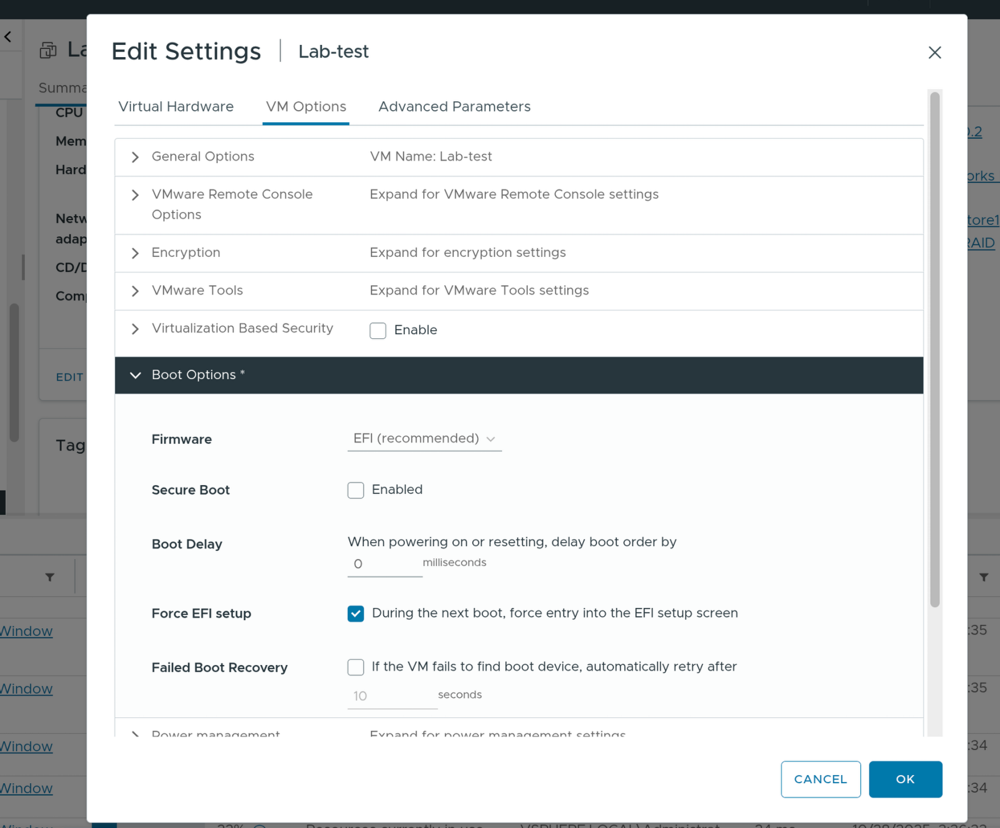
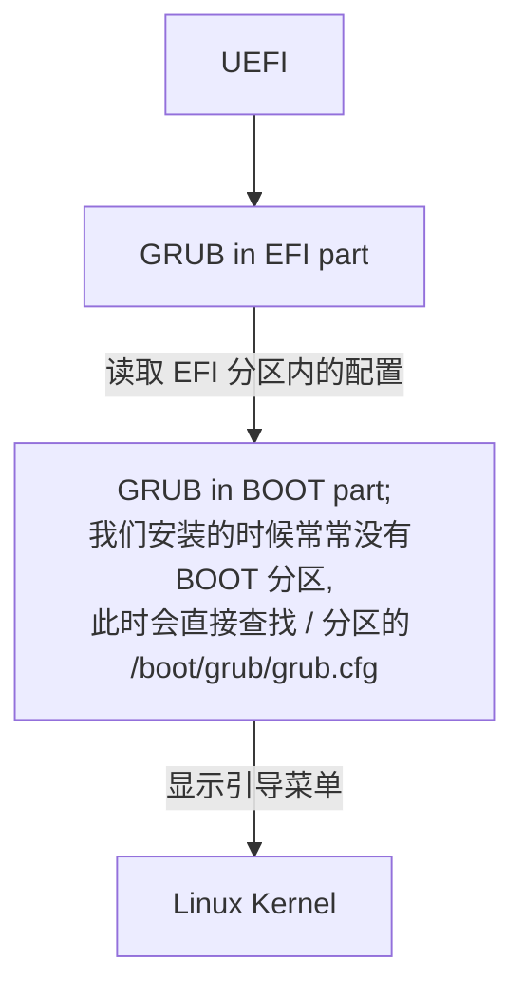

所以我要去给科服的同学们上 Linux 课程. 这主要是一些系统维护的内容. 以下是课件 (吗?) (多图警告)

<!-- more -->

## 先来一点概念

### 什么是 Linux?

- 狭义上讲, Linux 特指 [Linux Kernel (Linux 内核)](http://kernel.org/). 这一段直接问 GPT:
  > Linux 内核就是操作系统的核心，大脑和管家。它一方面让应用程序（像微信、浏览器）能顺利使用硬件（CPU、内存、网卡），另一方面又负责分配和保护这些资源，让电脑、手机等设备稳定、安全地运行。

- 广义上讲, Linux 指的是基于 Linux 内核的操作系统. 这些操作系统通常被称为 "Linux 发行版" (Linux Distribution), 简称 "Distro".

---

### Linux 发行版

Linux 发行版有 [很多分支](https://en.wikipedia.org/wiki/List_of_Linux_distributions), 我们常见有:
- Debian 系 (这个见的最多): Debian, Ubuntu (这个又有很多衍生版, 比如 Linux Mint), Kali Linux, Rasbian (树莓派用)...
- Red Hat 系 (这个很企业级): Red Hat Enterprise Linux (RHEL), CentOS, Fedora...
- SUSE 系 (这个也很企业级): openSUSE, SUSE Linux Enterprise...
- Arch 系 ~~(小药娘系)~~: Arch Linux, Manjaro...
- AOSP 系 (真的是 Linux): Android...
- OpenWRT (路由器用的)
- ......

我们平常接触 (客户要我们装的) 大多是 Debian 系的, Ubuntu 尤其多.

---

### 为啥客户要用 Linux?

(我): cnm Windows 天天蓝屏, 装个开发环境急死人

(生医的客户): 我的专业软件只能用 Linux

(计算机的客户): 跑 nn 用 Linux 更好

(自动化的客户): 机器人上位机要用 Linux

...

---

### YLW: 你要不要推荐一下 WSL2?

不可能! 我完全不推荐 WSL2! 虽然很多时候 WSL2 也不是不能用, 但是:

- 对于不少用户, 他们的 GUI 应用就是 Linux 的
- 对于不少用户, 他们要直接操作硬件 (USB 设备, 机器人等)
- 对于少数用户, (比如我), 他妈的 WSL2 的网络栈到底是他妈的什么玩意?

以及, WSL2 似乎还有一坨诸如文件系统的神秘权限问题; 访问 Windows 文件系统的性能问题; bla bla bla...

---

## 我们科服要会什么

- 装系统, 装双系统 (这是重点, 别的都可以不管)
- 简单故障排查 (我不多讲, 多的需要大量经验, 不好讲)
- 驱动问题排查 (大部分时候直接倒闭)
- 简单网络配置 (不深讲)
- Nvidia 驱动安装
- Out-of-tree 驱动安装... (如果能直接装. 万一 DKMS 编译报错, 那就是一大坨了)

---

## 所以直接开始装系统

### 装什么?

- Debian / Ubuntu / Mint, 这几个都差不多, 我们以 Ubuntu 讲
- Desktop 版本. Server 版本应该让他们请工程师装 (不是说我不会装, 而是 TUI 不太好教...)
- LTS 版本, 一般现在 Ubuntu 就 24.04.x, 除非客户指定
- amd64 版本

---

### 准备工作

科服有 PE 盘, 里面有一些有 Ubuntu 的 ISO. 当然, 我个人推荐定时更新 ISO (虽然在科服不大可能 (x))

在 [TUNA](https://mirrors.tuna.tsinghua.edu.cn/) 的 "常用发行版 ISO 和应用软件安装包直接下载：" 可以找到 Ubuntu 的 ISO.

```text
Ubuntu
...
25.04 (arm64+raspi, Preinstalled Desktop)

# 以上不是 LTS, 忽略

24.04.3 (amd64, Server)
24.04.3 (amd64, Desktop LiveDVD)
24.04.3 (ppc64el, Server)
24.04.3 (s390x, Server)
24.04.3 (riscv64, Server)
24.04.3 (arm64, Server)
24.04.3 (arm64+largemem, Server)
24.04.3 (riscv64+unmatched, Preinstalled Server)
24.04.3 (riscv64+jh7110, Preinstalled Server)
24.04.3 (arm64+raspi, Preinstalled Server)
24.04.3 (riscv64+pic64gx, Preinstalled Server)
24.04.3 (riscv64+licheerv, Preinstalled Server)
24.04.3 (riscv64, Preinstalled Server)
24.04.3 (riscv64+icicle, Preinstalled Server)
24.04.3 (riscv64+nezha, Preinstalled Server)
24.04.3 (arm64+raspi, Preinstalled Desktop)

# 以下是上一个 LTS, 忽略

22.04.5 (amd64, Server)
22.04.5 (amd64, Desktop LiveDVD)
...
```

还是很多. 这里解释一下命名:

- `Preinstalled` 代表预装版, 直接写到 SD 卡或 SSD 上就能用, 但一般 PC 用不到 (我们拿 ISO 装).
- `Server` 代表服务器版, 没有 GUI, 我们不管.

剩下了 **`24.04.3 (amd64, Desktop LiveDVD)`** (xs 就一个了). 这个就是我们要的. `amd64` 代表 x86-64 架构, `Desktop` 代表桌面版, `LiveDVD` 代表可以直接从光盘 (或 U 盘) 启动. `24.04` 是大版本, `.3` 是小版本, 越新越好 (里面的内置软件越新, 装完了需要更新的就越少).

---

### 检查客户的电脑是哪年的

**这个很重要!!!** 因为新电脑 + 旧 Linux = 缺驱动. 一般可以认为, 比如对于 24.04.3 LTS:

- 2023 年以前的电脑, 没啥问题
- 2023 - 2024 年的电脑, 可能需要 HWE 内核 (也就是更新一点的内核) 才有驱动
- 2024.04 以后新出的电脑... 就只能用 HWE 碰运气了, 弄不好最新的 Mainline Kernel 都不一定有驱动

如果一个客户拿着 2024 年的电脑, 还要装 20.04 LTS... 那就直接劝退吧 (x) 一般的结果是装完之后:

- 没有核显驱动, 卡得要死
- 没有 WiFi 驱动, 只能用有线
- 没有蓝牙驱动, 用不了
- 没有触摸板驱动, 触摸板完全没反应或者很难用
- 甚至, 没有 CPU 驱动, 性能调度有大问题

---

### 拷贝进 PE 盘

当然, 也可以用 dd / Rufus 之类的工具直接写到 U 盘上.

---

### 培训用虚拟机


对于我们培训, 我造了 35 个 ESXi 上的虚拟机, Lab-1~35. 由于磁盘空间不够了, 前 30 台在 SSD 上面, 后 5 台在机械盘上面. 到时候给大家发账号密码, 大家登录 ESXi 随机选取一台 (雾)

虚拟机的配置:

- 8 vCPU
- 8G RAM
- SATA Controller 0
  - 0:0 DVD (Disconnected)
  - 0:1 Ventoy (15G)
  - 0:4 Windows (40G)

**使用之前请先打快照!** 免得炸了无法恢复

已经预装好了 Windows 11 LTSC 2024, Ventoy 里面有 WePE, FirPE 和 Ubuntu 24.04.3 ISO. 

---

### BIOS 设置

我们只讲 UEFI 启动, 不讲传统 BIOS 启动 (这样的客户让他换电脑x) (或者找我)

然后进 BIOS 改:

- 安全启动... 可以关 (其实我推荐开着)
- UEFI, 检查一下.
- 什么 RST 啥的管他的, 先关了 (x)
- 如果没有启动 Override, 就把 U 盘提到第一位

> 对于我们虚拟机, 我设置了第一次启动的时候会直接进入 EFI Options; 后续你需要在 ESXi 里面设置一下下次启动进入 EFI Options
> 
> 

---

### 开始装之前...

一定建议参考 [分区方案](#分区方案) 这一节, **先想好分区方案**.

同时, 如果是双系统, 很可能会涉及到 **需要先从硬盘里面挤一点空间出来** 的问题, 我们一般选用 DiskGenius 或者 傲梅分区助手 来干这些事情.

> 对于我们虚拟机, 我阴差阳错的 Windows 那个分区还爆炸了, 所以大家还需要先在 WinPE 里面把 Windows 分区 CHKDSK 修好, 然后用 DG 挤出一点空间来装 Ubuntu.
> 
> 那个 Windows 好像似了... 吗? 我不确定, 但是如果你进不去 Windows, 那可能 *或许* 不是你的问题 (x)
> 
> 我建议给 Windows 调到 14GB - 20GB, 剩下的空间给 Ubuntu 用. (当然, 实际上你不可能给客户装这么小的 Windows)
>
> 

---

### 开始装

进 Ubuntu 的 ISO, 在 GRUB 界面, 选第一个 (如果客户的电脑比较新, 找一下 HWE 版本的内核... 但是这里没有, 看上去要先启动再安装了)


#### nomodeset

Reference: [What does `nomodeset` do](https://askubuntu.com/questions/207175/what-does-nomodeset-do)

如果客户的电脑比较新, 然后直接启动进不去 (黑屏 / 花屏 / 卡在奇怪的地方), 可以考虑使用 `nomodeset` 参数启动, 具体的方法是:

- 在这个 GRUB 界面, 当高亮在第一个选项的时候, 按下 `e` 键进入编辑界面
- 找到以 `linux` 开头的那一行, 行尾应该有 `quiet splash`.
  - `quiet`: 静默启动
  - `splash`: 显示启动画面
- 把这两个都删了 (便于调试), 然后在行尾加上 `nomodeset`
  - `nomodeset`: 禁用内核模式设置, 让内核使用基本的显卡驱动启动
- 按 `F10` 启动

或者也可以用 `safe graphics` 选项启动 (如果有的话).

---

### 检查一下你的屏幕分辨率...

如果分辨率太低, 可能后面某一步的 "Next" 按钮会被挡住, 导致你点不了 (x)

如果出现这样的情况... 好吧我也不知道咋办, 或许可以找另一台机器, 试一下键盘快捷键, 理论上用 Tab 可以切到 "Next" 按钮然后按回车

---

### 语言 / 键盘

我求你们了在安装的时候一定要选 **English**! 键盘我们用的一般是 **English (US)**. 不然到时候有得折腾的, 比如你发现你的用户文件夹里面是 *"桌面"* 而不是 "Desktop", 用命令行的时候就得切出输入法...

---

### 联网

Ubuntu 不需要联网就能装; Debian (如果用 netinst) 则需要从网上下载软件包. 一般来说, 在这里如果识别到了无线网卡就很好 (说明装上也能识别); 但是万一没有识别... 那就说明要装 HWE 了.

也可以直接用有线网. 在校园网里面没法准入, 可以尝试用 USB 连手机, 打开 USB Tethering (中文叫啥? 通过 USB 共享网络?).

> 虚拟机的网络是工场的神秘网, 我觉得它有一些大问题, 所以要不大家就无网络装吧

---

### 安装类型

首先选 "Interactive installation" (对, 底下那个 Automatic Installation 是用配置脚本装), 然后选... 如果用户双系统, 那可以考虑 "Default Selection"; 否则可以考虑选 "Extended Selection", 可以装更多软件.

然后选 "Install third-party software for graphics and Wi-Fi hardware", 这样可以装一些闭源驱动.

---

### 分区

这里是最复杂的部分. 如果用户装单系统且不需要数据, 可以考虑一键安装; 但推荐手动分区.

选 Manual Installation, 进入分区界面.


---

### 检查硬盘!

首先, 你要知道要安装的硬盘是哪个. 这里只会写什么 sda, nvme0n1, vda 之类的, 然后有磁盘的大小.

来普及一下:

- SATA 盘和 USB 盘一般是 /dev/sdX, 比如 /dev/sda, /dev/sdb...
- NVMe 盘一般是 /dev/nvmeXnY, 比如 /dev/nvme0n1, /dev/nvme1n1...
- VirtIO (虚拟磁盘) 一般是 /dev/vdX, 比如 /dev/vda, /dev/vdb...

如果客户的电脑有多个硬盘, 建议:

#### 问问客户

客户应该记得哪个硬盘是要装系统的 (其他的盘应该有别的分区, 可以在这个界面看到).

#### 直接检查硬盘

用 `Ctrl + Alt + T` 唤出一个 terminal.

可以用 `sudo gparted` 打开一个更详细的分区工具;

也可以按一下 Windows 键, 搜 "Disks" (磁盘), 打开一个磁盘工具.

在里面可以确认盘的型号, 序列号, SMART 信息等, 以确认哪个盘是要装系统的.

实在不行, 把别的盘都拔了 (x)

---

### 分区方案

对于单系统, 建议:

- EFI 分区, 512MB, FAT32
- Swap 分区, 如果客户的内存 16GB, 就放个 4GB; 如果更大, 就放个 2GB 是个意思得了. **如果客户要装到机械盘上面, 别开 swap, 否则卡死你**
- Ext4 分区, 剩下的全给它

如果客户的磁盘上已经有分区表, 选中磁盘, 点 "New Partition Table" (新建分区表);


> 对于虚拟机, 也可以示意性的给 1G 的 SWAP, 不过我觉得无所谓了

---

点一下底下的 "Device for Bootloader Installation" 选项, 选中你要装系统的硬盘 (不是分区, 是整个硬盘). 此时安装工具会自动帮你建立一个 EFI 分区.


可以点击这个分区然后点 "Change" 改大小, 但是既然默认是 1.13GB, 那就别动了

---

然后点一下 "Free Space", 点 "+" 号, 开始新建分区.


这里依次是:

- Ext4, 最常见 (历史悠久?) 的分区格式, 不是不能用, 一般这个就行
- XFS, 比较新, 大文件性能好, 没啥大问题
- Btrfs, 很新, 有快照功能, 有时候不稳定, 客户要是不太懂就别用
- VFAT, 也就是 FAT32, EFI 分区必须是这个格式; 一般不用 (不如 ext4)
- Swap, 也就是交换分区.

---


这里选 Mount Point (挂载点), 选 `/` (根目录). 其他的选项不用管. 对于我们, 这么搞就行了.

最后的样子应该像这样:


---

### 双系统分区方案

对于双系统, 一定要 **先装 Win, 再装 Linux**. 在装 Ubuntu 之前用 Disk Genius 或者什么别的工具先留出一段装 Ubuntu 的位置. 在进入 Partitioner 的时候应该类似 (你别管为什么 C 盘只有 10GB, 示意图x):


此时建议把 swap 放后面, 类似:


EFI 分区直接用 Windows 的就行

#### 如果你忘记了缩容...

你可以尝试用 GParted 试试; 但是如果它告诉你 NTFS 分区有问题... 那你就重启进 PE 用 DG 罢

---

### 用户设置

搞完之后, Next, 接受风险, 分区, 然后就开始账户设置

Your name: 可以写中文 / 符号等, 是一个显示用的
Your conputer's name: 电脑在网络上的标识, 这个不太重要, 只能用英文数字-
Username: 系统中的用户名 (登录用), 只能用英文数字-, 建议别太长
Password: 密码, 建议复杂一点 (真的...)


---

### 区域

在地图上点一下中国, 时区名应该是 Asia/Shanghai

---

然后就安装. 等着. 等 ~10min 重启就好.

---

## 一些杂七杂八的

### 装 HWE Kernel

前提: 联网 ()

在 Linux 里面, 大部分的驱动是和 Kernel 绑在一起的. 如果客户的电脑比较新, 可能需要 HWE Kernel (Hardware Enablement, 硬件支持) 才能识别硬件. 在装完之后, 打开 terminal, 输入

```bash
sudo apt update
sudo apt install linux-image-generic-hwe-24.04 linux-headers-generic-hwe-24.04
```
(但是我的虚拟机装完了重启就似了, 没有图形输出...) 我后面就直接 SSH 了

装不上倒闭 (x)

---

### 配网

Ubuntu 用 NetworkManager 管网, 桌面版有 GUI. 一般来说不会有事.

---

### 装 Nvidia

运行 "Additional Drivers", 可以选 nvidia-open-xxx 安装即可.

---

### Ubuntu 炸了怎么办

找我得了 (x)

理论上应该进一个 Live USB 然后 chroot 进系统修, 但是这就没法讲了.

---

### 装 Out-of-tree 驱动

网上搜索硬件的型号 + linux driver, 一般能找到 deb 包, 尝试用

```bash
sudo apt install ./xxx.deb
```

安装, 装上去成功, 装不上去倒闭, 用 `sudo apt purge xxx` 卸载.

---

### 卸载双系统的 Linux (修引导)

一般来说双系统的时候我们都是用 GRUB 引导 Windows. 在安装的时候, GRUB 会自动搜索 Windows 的引导并添加引导项.

GRUB 的一般状况是:



因此: 卸载双系统的时候 **不能直接删 Linux 分区** (或者说, 还不够), 要 **同时删除 GRUB 引导**.

```text
root@ajax-ubuntu-vm-kjfwd:/boot/efi# ls -R
.:
EFI

./EFI:
BOOT  ubuntu

./EFI/BOOT:
BOOTX64.EFI  fbx64.efi  mmx64.efi

./EFI/ubuntu:
BOOTX64.CSV  grub.cfg  grubx64.efi  mmx64.efi  shimx64.efi
```

在这种配置中, 我们需要:

- 把 `/EFI/ubuntu` 删掉
- 把 `/EFI/BOOT` 里面的 BOOTX64.EFI 删掉, 用 Windows 的 `/EFI/Microsoft/Boot/bootmgfw.efi` 代替

重启之后应该就直接进 Windows 了.

---

修 GDM / Gnome

这个... 不会 (x) 但是一般可以通过重装这个组件解决. 如:

- 删除用户配置
  
  ```bash
  mkdir -p ~/gnome-backup
  mv ~/.config/dconf ~/gnome-backup/
  mv ~/.config/gnome* ~/gnome-backup/ 2>/dev/null
  mv ~/.local/share/gnome* ~/gnome-backup/ 2>/dev/null
  mv ~/.cache/gnome* ~/gnome-backup/ 2>/dev/null
  dconf reset -f /
  ```

- 把 Gnome 和 GDM 的系统配置也扬了重来
  
  ```bash
  sudo rm -rf /etc/dconf /etc/gdm3 /etc/xdg/gnome* /var/lib/gdm3
  sudo dconf update
  ```

然后应该就好了... 吧. 不然就整个扬了重装

```bash
sudo apt-get purge gnome-shell gdm3
sudo apt-get install gnome-shell gdm3
```

不然就换 LightDM + Xfce (x)

---

别的... 再说 ()

## Aux

以下是一些神秘东西

### 如何 Nginx 反代 vCSA

vCSA 设计出来是给内网用的, 用反代之后 SSO 会不通过, 经过了一些折腾, 有以下可用的配置:

```nginx
server {
    listen 443 ssl;
    listen [::]:443 ssl;
    # 想不到吧我支持 QUIC
    listen 443 quic;
    listen [::]:443 quic;

    server_name skyworks-vcsa.aajax.top;

    ssl_certificate /etc/nginx/ssl/aajax.top/fullchain.pem;
    ssl_certificate_key /etc/nginx/ssl/aajax.top/key.pem;

    access_log  /var/log/nginx/skyworks-vcsa.access.log  main;
    add_header X-Frame-Options "SAMEORIGIN" always;
    add_header X-Content-Type-Options "nosniff" always;
    add_header Alt-Svc 'h3=":443"; ma=3600';

    proxy_http_version 1.1;
    # proxy_set_header Host $host;
    proxy_set_header X-Forwarded-Proto https;
    proxy_set_header X-Forwarded-For $proxy_add_x_forwarded_for;

    proxy_set_header Upgrade $http_upgrade;
    proxy_set_header Connection $connection_upgrade;
    proxy_set_header Origin https://10.0.0.3;

    proxy_connect_timeout 60s;
    proxy_send_timeout 3600s;
    proxy_read_timeout 3600s;
    proxy_set_header Accept-Encoding ""; # 给 gz 关了, 免得替换失败

    location / {
        proxy_pass https://10.0.0.3;    # internal vCSA IP / FQDN
        proxy_ssl_verify off;
        proxy_redirect ~https?:\/\/10\.0\.0\.3(.*)$ https://skyworks-vcsa.aajax.top$1; # 给所有重定向改地址

        # 然后把所有的 10.0.0.3 统统替换了
        sub_filter '10.0.0.3' 'skyworks-vcsa.aajax.top';
        sub_filter_once off;  # Replace all occurrences
        sub_filter_types *;
    }
}
```

### 如何 Bulk Provison ESXi VM

对, powershell 是一个跨平台的工具... 你可以在 Linux 上面装 PowerCLI 然后跑脚本

```pwsh
Connect-VIServer -Server 10.0.0.3 -User administrator@vsphere.local -Password 'xxx'

# ===== CONFIGURE THESE =====
$templateName = "Template Windows VM"
$folderName   = "xxx"              # 这样方便给不用的用户给管理权限
$datastore    = "datastore1"       # your datastore name
$networkName  = "Skyworks Net"     # target network
$resourcePool = "Resources"        # default pool unless you have custom
$numVMs       = 30
$vmPrefix     = "Lab-"
$startIndex   = 1
# ===========================

$template = Get-Template -Name $templateName
$folder   = Get-Folder -Name $folderName
$pool     = Get-ResourcePool -Name $resourcePool

for ($i = $startIndex; $i -le $numVMs; $i++) {
    $vmName = "{0}{1:D2}" -f $vmPrefix, $i
    Write-Host "→ Deploying $vmName..."
    New-VM -Name $vmName `
           -Template $template `
           -Location $folder `
           -Datastore $datastore `
           -ResourcePool $pool `
           -Confirm:$false `
		       -Verbose `             # 多输出点信息没有坏处
		       -RunAsync              # 创建之后立即返回, 等 vCSA 慢慢弄
}
```


