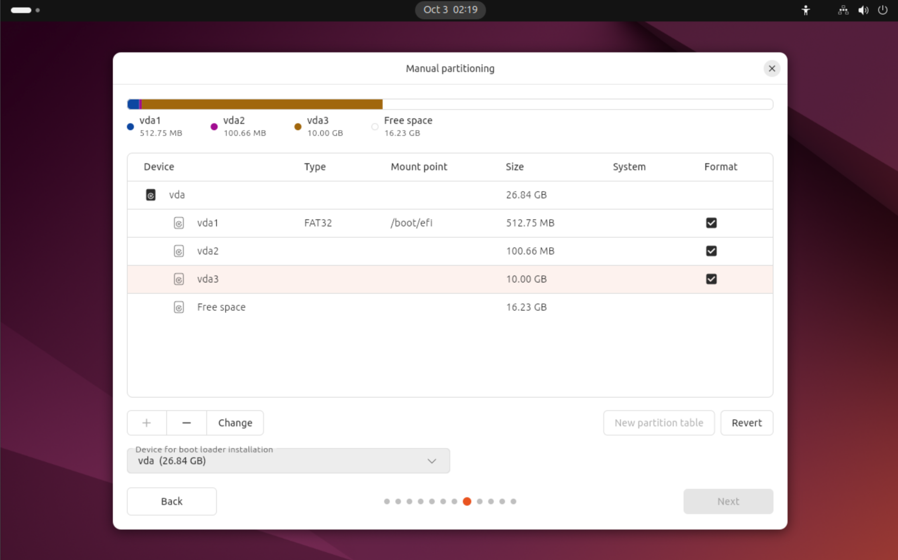
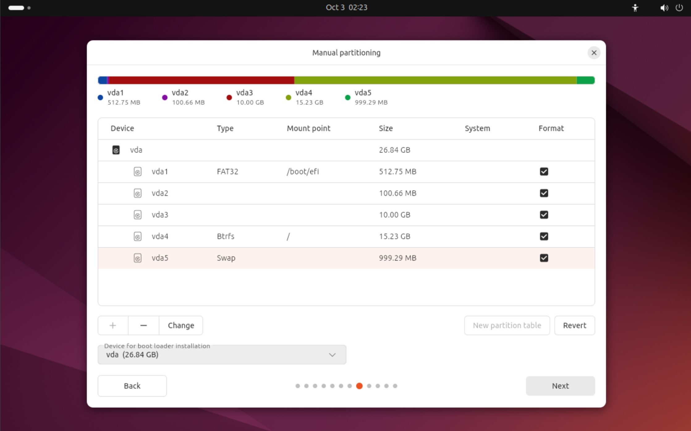

所以我要去给科服的同学们上 Linux 课程. 这主要是一些系统维护的内容. 以下是课件 (吗?) (多图警告)

<!-- more -->

## 先来一点概念

### 什么是 Linux?

- 狭义上讲, Linux 特指 [Linux Kernel (Linux 内核)](http://kernel.org/). 这一段直接问 GPT:
  > Linux 内核就是操作系统的核心，大脑和管家。它一方面让应用程序（像微信、浏览器）能顺利使用硬件（CPU、内存、网卡），另一方面又负责分配和保护这些资源，让电脑、手机等设备稳定、安全地运行。

- 广义上讲, Linux 指的是基于 Linux 内核的操作系统. 这些操作系统通常被称为 "Linux 发行版" (Linux Distribution), 简称 "Distro".

---

### Linux 发行版

Linux 发行版有 [很多分支](https://en.wikipedia.org/wiki/List_of_Linux_distributions), 我们常见有:
- Debian 系 (这个见的最多): Debian, Ubuntu (这个又有很多衍生版, 比如 Linux Mint), Kali Linux, Rasbian (树莓派用)...
- Red Hat 系 (这个很企业级): Red Hat Enterprise Linux (RHEL), CentOS, Fedora...
- SUSE 系 (这个也很企业级): openSUSE, SUSE Linux Enterprise...
- Arch 系 ~~(小药娘系)~~: Arch Linux, Manjaro...
- AOSP 系 (真的是 Linux): Android...
- OpenWRT (路由器用的)
- ......

我们平常接触 (客户要我们装的) 大多是 Debian 系的, Ubuntu 尤其多.

---

### 为啥客户要用 Linux?

(我): cnm Windows 天天蓝屏, 装个开发环境急死人

(生医的客户): 我的专业软件只能用 Linux

(计算机的客户): 跑 nn 用 Linux 更好

(自动化的客户): 机器人上位机要用 Linux

...

---

## 我们科服要会什么

- 装系统, 装双系统 (这是重点, 别的都可以不管)
- 简单故障排查 (我不多讲, 多的需要大量经验, 不好讲)
- 驱动问题排查 (大部分时候直接倒闭)
- 简单网络配置 (不深讲)
- Nvidia 驱动安装
- Out-of-tree 驱动安装... (如果能直接装. 万一 DKMS 编译报错, 那就是一大坨了)

---

## 所以直接开始装系统

### 装什么?

- Debian / Ubuntu / Mint, 这几个都差不多, 我们以 Ubuntu 讲
- Desktop 版本. Server 版本应该让他们请工程师装 (不是说我不会装, 而是 TUI 不太好教...)
- LTS 版本, 一般现在 Ubuntu 就 24.04.x, 除非客户指定
- amd64 版本

---

### 准备工作

科服有 PE 盘, 里面有一些有 Ubuntu 的 ISO. 当然, 我个人推荐定时更新 ISO (虽然在科服不大可能 (x))

在 [TUNA](https://mirrors.tuna.tsinghua.edu.cn/) 的 "常用发行版 ISO 和应用软件安装包直接下载：" 可以找到 Ubuntu 的 ISO.

```text
Ubuntu
...
25.04 (arm64+raspi, Preinstalled Desktop)

# 以上不是 LTS, 忽略

24.04.3 (amd64, Server)
24.04.3 (amd64, Desktop LiveDVD)
24.04.3 (ppc64el, Server)
24.04.3 (s390x, Server)
24.04.3 (riscv64, Server)
24.04.3 (arm64, Server)
24.04.3 (arm64+largemem, Server)
24.04.3 (riscv64+unmatched, Preinstalled Server)
24.04.3 (riscv64+jh7110, Preinstalled Server)
24.04.3 (arm64+raspi, Preinstalled Server)
24.04.3 (riscv64+pic64gx, Preinstalled Server)
24.04.3 (riscv64+licheerv, Preinstalled Server)
24.04.3 (riscv64, Preinstalled Server)
24.04.3 (riscv64+icicle, Preinstalled Server)
24.04.3 (riscv64+nezha, Preinstalled Server)
24.04.3 (arm64+raspi, Preinstalled Desktop)

# 以下是上一个 LTS, 忽略

22.04.5 (amd64, Server)
22.04.5 (amd64, Desktop LiveDVD)
...
```

还是很多. 这里解释一下命名:

- `Preinstalled` 代表预装版, 直接写到 SD 卡或 SSD 上就能用, 但一般 PC 用不到 (我们拿 ISO 装).
- `Server` 代表服务器版, 没有 GUI, 我们不管.

剩下了 **`24.04.3 (amd64, Desktop LiveDVD)`** (xs 就一个了). 这个就是我们要的. `amd64` 代表 x86-64 架构, `Desktop` 代表桌面版, `LiveDVD` 代表可以直接从光盘 (或 U 盘) 启动. `24.04` 是大版本, `.3` 是小版本, 越新越好 (里面的内置软件越新, 装完了需要更新的就越少).

---

### 检查客户的电脑是哪年的

**这个很重要!!!** 因为新电脑 + 旧 Linux = 缺驱动. 一般可以认为, 比如对于 24.04.3 LTS:

- 2023 年以前的电脑, 没啥问题
- 2023 - 2024 年的电脑, 可能需要 HWE 内核 (也就是更新一点的内核) 才有驱动
- 2024.04 以后新出的电脑... 就只能用 HWE 碰运气了, 弄不好最新的 Mainline Kernel 都不一定有驱动

如果一个客户拿着 2024 年的电脑, 还要装 20.04 LTS... 那就直接劝退吧 (x) 一般的结果是装完之后:

- 没有核显驱动, 卡得要死
- 没有 WiFi 驱动, 只能用有线
- 没有蓝牙驱动, 用不了
- 没有触摸板驱动, 触摸板完全没反应或者很难用
- 甚至, 没有 CPU 驱动, 性能调度有大问题

---

### 拷贝进 PE 盘

当然, 也可以用 dd / Rufus 之类的工具直接写到 U 盘上.

---

### BIOS 设置

我们只讲 UEFI 启动, 不讲传统 BIOS 启动 (这样的客户让他换电脑x) (或者找我)

然后进 BIOS 改:

- 安全启动... 可以关 (其实我推荐开着)
- UEFI, 检查一下.
- 什么 RST 啥的管他的, 先关了 (x)
- 如果没有启动 Override, 就把 U 盘提到第一位

---

### 开始装

进 Ubuntu 的 ISO, 在 GRUB 界面, 选第一个 (如果客户的电脑比较新, 找一下 HWE 版本的内核... 但是这里没有, 看上去要先启动再安装了)


---

### 语言 / 键盘

我求你们了在安装的时候一定要选 **English**! 键盘我们用的一般是 **English (US)**. 不然到时候有得折腾的, 比如你发现你的用户文件夹里面是 *"桌面"* 而不是 "Desktop", 用命令行的时候就得切出输入法...

---

### 联网

Ubuntu 不需要联网就能装; Debian (如果用 netinst) 则需要从网上下载软件包. 一般来说, 在这里如果识别到了无线网卡就很好 (说明装上也能识别); 但是万一没有识别... 那就说明要装 HWE 了.

也可以直接用有线网. 在校园网里面没法准入, 可以尝试用 USB 连手机, 打开 USB Tethering (中文叫啥? 通过 USB 共享网络?).

---

### 安装类型

首先选 "Interactive installation" (对, 底下那个 Automatic Installation 是用配置脚本装), 然后选... 如果用户双系统, 那可以考虑 "Default Selection"; 否则可以考虑选 "Extended Selection", 可以装更多软件.

然后选 "Install third-party software for graphics and Wi-Fi hardware", 这样可以装一些闭源驱动.

---

### 分区

这里是最复杂的部分. 如果用户装单系统且不需要数据, 可以考虑一键安装; 但推荐手动分区.

选 Manual Installation, 进入分区界面.


---

### 检查硬盘!

首先, 你要知道要安装的硬盘是哪个. 这里只会写什么 sda, nvme0n1, vda 之类的, 然后有磁盘的大小.

来普及一下:

- SATA 盘和 USB 盘一般是 /dev/sdX, 比如 /dev/sda, /dev/sdb...
- NVMe 盘一般是 /dev/nvmeXnY, 比如 /dev/nvme0n1, /dev/nvme1n1...
- VirtIO (虚拟磁盘) 一般是 /dev/vdX, 比如 /dev/vda, /dev/vdb...

如果客户的电脑有多个硬盘, 建议:

#### 问问客户

客户应该记得哪个硬盘是要装系统的 (其他的盘应该有别的分区, 可以在这个界面看到).

#### 直接检查硬盘

用 `Ctrl + Alt + T` 唤出一个 terminal.

可以用 `sudo gparted` 打开一个更详细的分区工具;

也可以按一下 Windows 键, 搜 "Disks" (磁盘), 打开一个磁盘工具.

在里面可以确认盘的型号, 序列号, SMART 信息等, 以确认哪个盘是要装系统的.

实在不行, 把别的盘都拔了 (x)

---

### 分区方案

对于单系统, 建议:

- EFI 分区, 512MB, FAT32
- Swap 分区, 如果客户的内存 16GB, 就放个 4GB; 如果更大, 就放个 2GB 是个意思得了. **如果客户要装到机械盘上面, 别开 swap, 否则卡死你**
- Ext4 分区, 剩下的全给它

如果客户的磁盘上已经有分区表, 选中磁盘, 点 "New Partition Table" (新建分区表);


---

点一下底下的 "Device for Bootloader Installation" 选项, 选中你要装系统的硬盘 (不是分区, 是整个硬盘). 此时安装工具会自动帮你建立一个 EFI 分区.


可以点击这个分区然后点 "Change" 改大小, 但是既然默认是 1.13GB, 那就别动了

---

然后点一下 "Free Space", 点 "+" 号, 开始新建分区.


这里依次是:

- Ext4, 最常见 (历史悠久?) 的分区格式, 不是不能用, 一般这个就行
- XFS, 比较新, 大文件性能好, 没啥大问题
- Btrfs, 很新, 有快照功能, 有时候不稳定, 客户要是不太懂就别用
- VFAT, 也就是 FAT32, EFI 分区必须是这个格式; 一般不用 (不如 ext4)
- Swap, 也就是交换分区.

---


这里选 Mount Point (挂载点), 选 `/` (根目录). 其他的选项不用管. 对于我们, 这么搞就行了.

最后的样子应该像这样:


---

### 双系统分区方案

对于双系统, 一定要 **先装 Win, 再装 Linux**. 在装 Ubuntu 之前用 Disk Genius 或者什么别的工具先留出一段装 Ubuntu 的位置. 在进入 Partitioner 的时候应该类似 (你别管为什么 C 盘只有 10GB, 示意图x):



此时建议把 swap 放后面, 类似:



EFI 分区直接用 Windows 的就行

---

### 用户设置

搞完之后, Next, 接受风险, 分区, 然后就开始账户设置

Your name: 可以写中文 / 符号等, 是一个显示用的
Your conputer's name: 电脑在网络上的标识, 这个不太重要, 只能用英文数字-
Username: 系统中的用户名 (登录用), 只能用英文数字-, 建议别太长
Password: 密码, 建议复杂一点 (真的...)


---

### 区域

在地图上点一下中国, 时区名应该是 Asia/Shanghai

---

然后就安装. 等着. 等 ~10min 重启就好.

---

## 装 HWE Kernel

前提: 联网 ()

在 Linux 里面, 大部分的驱动是和 Kernel 绑在一起的. 如果客户的电脑比较新, 可能需要 HWE Kernel (Hardware Enablement, 硬件支持) 才能识别硬件. 在装完之后, 打开 terminal, 输入

```bash
sudo apt update
sudo apt install linux-image-generic-hwe-24.04 linux-headers-generic-hwe-24.04
```
(但是我的虚拟机装完了重启就似了, 没有图形输出...) 我后面就直接 SSH 了

装不上倒闭 (x)

---

### 配网

Ubuntu 用 NetworkManager 管网, 桌面版有 GUI. 一般来说不会有事.

---

### 装 Nvidia

运行 "Additional Drivers", 可以选 nvidia-open-xxx 安装即可.

---

### Ubuntu 炸了怎么办

找我得了 (x)

理论上应该进一个 Live USB 然后 chroot 进系统修, 但是这就没法讲了.

---

### 装 Out-of-tree 驱动

网上搜索硬件的型号 + linux driver, 一般能找到 deb 包, 尝试用

```
sudo apt install ./xxx.deb
```

安装, 装上去成功, 装不上去倒闭, 用 `sudo apt purge xxx` 卸载.

---

别的... 再说 ()
