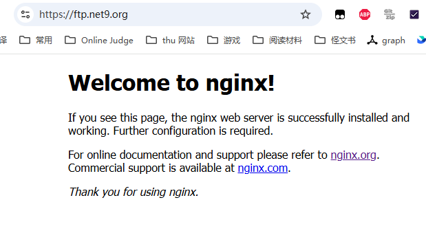

今天闲得慌, 就手痒痒想给 Nginx 上 QUIC, 于是小小折腾了一番, 兼论如何正确配置监听...


<!-- more -->


## 一些安全问题

事情是这样的, 我收了个工单, 说 [59.66.131.xx (实际上是 ftp.net9.org)](https://ftp.net9.org) (校内访问) 有未授权访问漏洞. 本来这玩意就是开放访问的, 所以我并不想理睬. 但是一想到他不知道域名, 怎么访问的, 就知道肯定是默认证书漏了.

在一个月前我利用默认证书漏了的手段打过另一个网站, 当时通过证书找到了 Cloudflare 后面的原站. 原理很简单, 一般 Nginx 的 default site 都只对 http 生效, 会导致 https 的第一个站点成为默认站点, 此时 https 返回相应证书, 泄漏域名信息. 如:

```
curl https://101.6.4.25 --insecure -v
*   Trying 101.6.4.25:443...
* ALPN: curl offers h2,http/1.1
...
* SSL connection using TLSv1.3 / TLS_AES_256_GCM_SHA384 / secp384r1 / RSASSA-PSS
* ALPN: server accepted http/1.1
* Server certificate:
*  subject: CN=*.tsinghua.edu.cn
*  start date: Jun 11 15:06:04 2025 GMT
*  expire date: Sep  9 15:06:03 2025 GMT
*  issuer: C=US; O=Let's Encrypt; CN=R11
*  SSL certificate verify result: unable to get local issuer certificate (20), continuing anyway.
*   Certificate level 0: Public key type RSA (4096/152 Bits/secBits), signed using sha256WithRSAEncryption
*   Certificate level 1: Public key type RSA (2048/112 Bits/secBits), signed using sha256WithRSAEncryption
* Connected to 101.6.4.25 (101.6.4.25) port 443
...
```

因此我们 *应该* 给 https 也设置一个默认站点并使用自签名证书, 这样就可以防止泄漏.

于是我签了个 ecc

```bash
openssl req -x509 -newkey ec:<(openssl ecparam -name prime256v1) \
    -sha256 -nodes -days 10950 \
    -keyout ecc-key.pem -out ecc-cert.pem \
    -subj "/C=CN/ST=Beijing/O=Nginx/CN=127.0.0.1"
```

然后补了两行配置 (这实际上是取消注释了, 所以我没有在意.)

```nginx
        listen 443 ssl default_server;
        listen [::]:443 ssl default_server;
```

然后

```bash
nginx -t && nginx -s reload
```

我以为就万事大吉了.


## 双栈

结果 Fuyuki 来跟我说他看一半, ftp9 变成默认页了. 怎么回事呢?



我第一反应是顺序错了, 遂更换顺序折腾了一下, 似乎好了 (后来发现是别的问题). 然后过了一会又炸了, 遂发现:

**Nginx 的 IPv4 和 IPv6 需要分别监听** (可以参考 [StackOverflow](https://serverfault.com/questions/638367/do-you-need-separate-ipv4-and-ipv6-listen-directives-in-nginx))

我之前一直都只监听了 v4, v6 没有 vhost 用, 此时 v6 的端口是完全关闭的. 现在 default server 监听了, 然后 v6 的请求就扔给了 default server, 而 v4 的正确解析了.

遂增补监听.


## QUIC

然后我一直手痒痒想支持 QUIC, 查了一下 [文档](https://nginx.org/en/docs/quic.html) 说有. 添加了 `listen 443 quic reuseport;` 之后炸了. 简单研究发现 Debian 的 Nginx 太旧, 没有开启支持. 遂 [使用官方源](https://nginx.org/en/linux_packages.html#Debian), 照着 [Module 文档](https://nginx.org/en/docs/http/ngx_http_v3_module.html) 简单设置即可用了. (吗?)

事实是又炸了

```
nginx: [emerg] duplicate listen options for 0.0.0.0:443 in /etc/nginx/sites-enabled/ftp:35
nginx: configuration file /etc/nginx/nginx.conf test failed
```

有个 [Ticket](https://trac.nginx.org/nginx/ticket/2504) 说如果写了一个 `listen 443 quic reuseport;`, 后面的 `listen 443 quic;` 都会隐含 `reuseport`. 这么改了一下之后通过了.

此时用 `curl https://59.66.131.xx --http3-only --insecure -v` 会发现 QUIC 没有 default 照样泄漏证书. 遂给 default server 也加上 QUIC.

然后就能用啦! (


(哦, 记得修改防火墙放行 UDP port 443)
