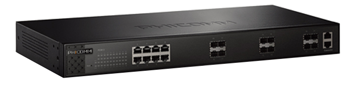
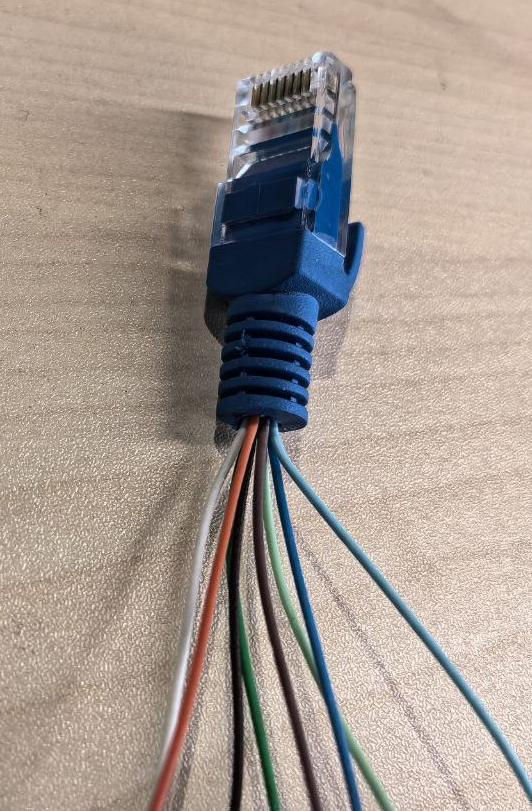
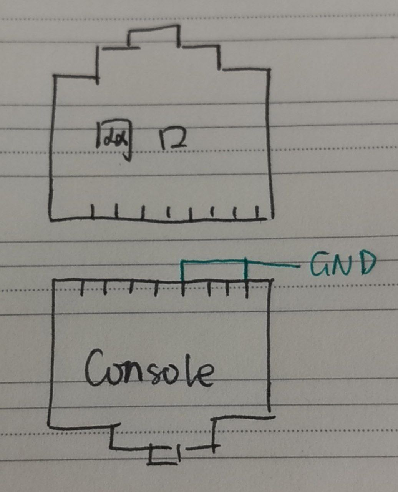
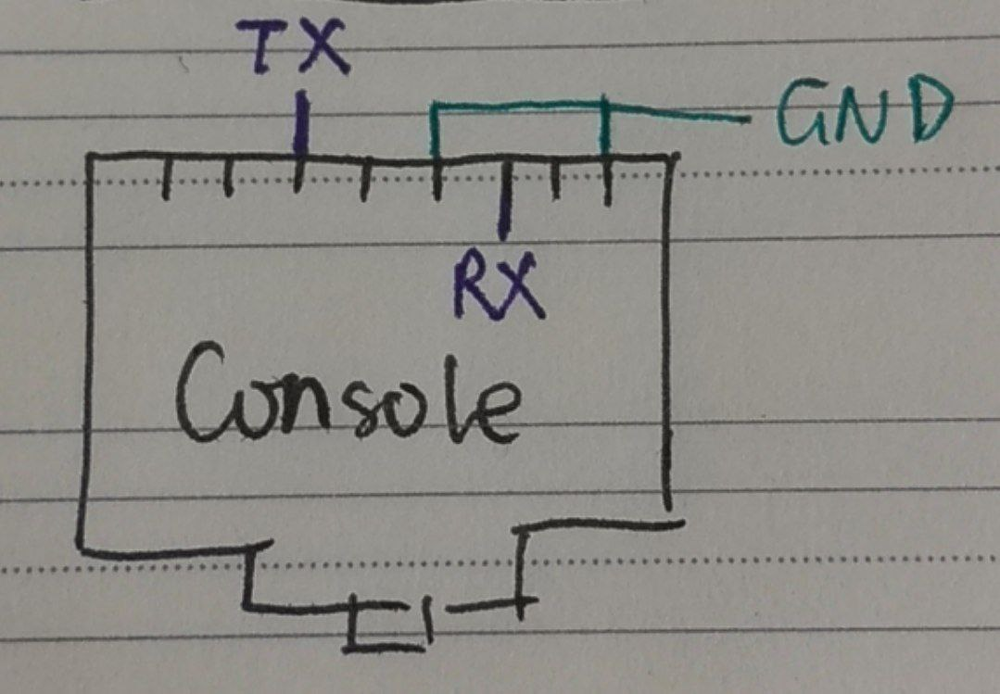
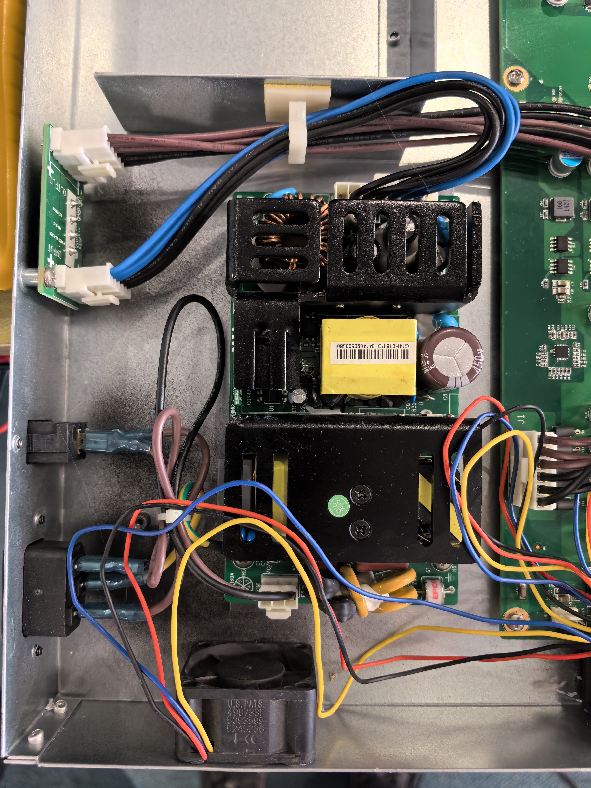
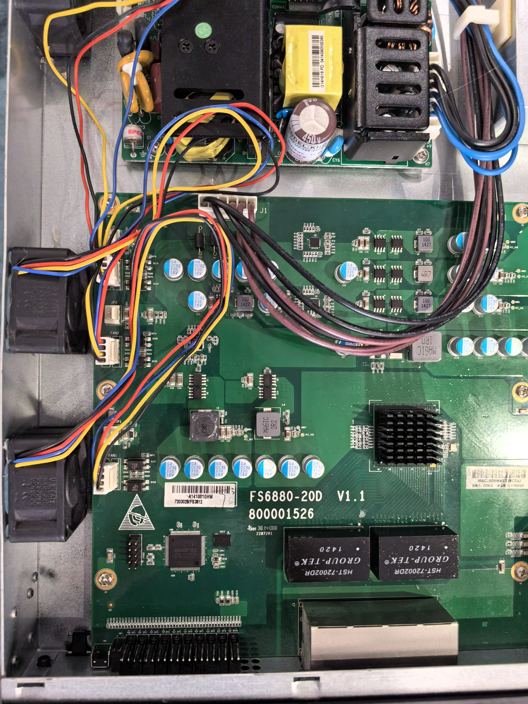

之前工场的人问有没有斐讯 FS3812 的配置文档, 我找了一圈没找到, 还在想为啥他们要找这玩意的文档. 这两天要考试了, 到了我最喜欢的摸鱼环节, 去一看发现工场不知道从哪搞了个这, 结果不会配置. 于是本着死马当活马医的原则, 我折腾了一下这玩意.

<!-- more -->

## Introduction to Phicomm FS3812

斐讯 FS3812 是一款 **弱三层** 网管交换机, 有 8 个千兆电口, 12 个万兆光口和两个 Console 口. 交换机的功耗不高, 根据介绍 (没测过) 包转发率 360Mpps, 交换容量 512Gbps (假的吧, 所有端口全跑满也没这个量啊). 由于斐讯的特性, 网上并不能找到什么说明书, 所以很花了一点时间才搞定.

<div style="display: flex;">
<div style="width: 50%; margin: auto;">



</div>
</div>

*参考: [某不知名卖家的商品详情页](https://b2b.homedo.com/goods/100118204.html)*

## Console

拿到交换机的时候里面是有配置的, 我们并不知道是什么配置, 管理界面也没有. 插上平常用的 Console 线之后没有任何反应, 感觉跟坏了一样. 但是插上线确实是能识别, 所以还是得试试. 那么我们要做的第一件事就是恢复出厂设置, 第 0 件事就是搞明白怎么连接 Console 并进入 U-Boot 给他恢复出厂.

### 确认 GND 线

Console 那一排其实有两个口. 上面一个和一个网络变压器连着, 用电脑怼上去可以握手到 1000M, 是个网口; 下面一个网线接上去没反应, 应该是 Console. 但是这个 Console 也不标准.

既然直接用 Console 线连上去没有反应, 我们就要使用经典的 CH340 了. 找一个烂网线剪断一截然后把每一根线剥开, 我们就得到了可以用来测量线序的线.

这里要注意一个常见问题: 我们一般认为外壳是 **接地** 的, 但是这个 *地* 是大地, 可能并不是直流电路板的负极 *GND*. 这块板子就是这样. 一开始我那示波器一端接外壳, 一端量线, 结果每一个上面都有 50Hz 的杂波, 万用表量也不通. 后来我发现这件事之后从板子上的滤波电容一端取点, 找到了 **GND 为棕色和蓝白两条线**.

<div style="display: flex; flex-direction: row;">
<div style="width: 20%; margin: auto;">



</div>
<div style="width: 25%; margin: auto;">



</div>
</div>

### 确认 TX 线

在确认 GND 之后, 最好确认的线自然是 TX 了 - 只要看看哪一个在开机之后有信号就行. 把示波器一端接 GND, 另一端夹在某一跟线上, 看看开机之后有没有波动. 发现 **绿白线** 有信号, 说明这是 TX.

### 确认电平

首先拿到几个线序之后上网搜一下, 结果既不是 TTL, 也不是 RS232, 好像也不是 RS485. 只好手动调电平确认 RX 了.

等交换机启动之后, TX 线上为 0V. 根据串口协议的电平定义, 知 0V 为逻辑 1. 将示波器触发调到 2V 并开机单次触发, 发现 TX 的峰值是 5V, 说明这是 RS232 电平, 5V 为逻辑 0.

然而手上的 CH340 是 TTL 电平. 手头有非门, 将 TX 和 RX 都过一遍非门, 就可以将 TTL 电平转换为 RS232 电平.

### 确认串口参数

然后开机, 单次触发, 测量最短脉冲宽度对应频率约为 8us, 波特率应该是 115200. 由于并没有逻辑分析仪啥的, 我直接尝试 8n1, 显示正常. 此时单向信道已经建立.

### 确认 RX 线

确认 RX 需要回显. 登录页有个 `Password:` 的提示, 理论上按回车一定有回显. 所以选择按住回车检查 TX 有没有发送信号. 得到的结果是 **RX 是绿线**. 还有几根线不清楚到底是干嘛的, 其中有一根好像是片选 (CS), 拉高会导致 TX 啥也没了.

<div style="display: flex;">
<div style="width: 50%; margin: auto;">



</div>
</div>

此时串口算是调通了, 可以进入 U-Boot 恢复出厂设置了. 但是让我完全没有想到的是, 恢复完了之后还有密码... Console 口登不进去.

## Web Management

机器后面其实贴了一个标签写着 192.168.1.100. 但是交换机有那么多口, 我偏偏觉得既然 Console 有个网口, 那么 Web 管理肯定是这个口. 于是折腾了半个多小时也进不去.

实际上这个交换机的默认设置里面 192.168.1.100 是 VLAN If 1 的地址, 而所有接口 (除了 Console) 都是 Access VLAN 1, 接除了 Console 网口的任意口都能进 Web 管理. 默认 Creds 为 **`admin:admin`**. 进去之后基本上都能配置.

## I want more!

本来这篇文章可以到此结束了, 毕竟进去了. 但是串口到头来还是进不去. 于是我又折腾了一下, 搞到了点好东西.

### 内部照片



电源模块



主板






### Firmware

Web 里面可以下载固件, 所以我小小下了一份

```text
DECIMAL       HEXADECIMAL     DESCRIPTION
--------------------------------------------------------------------------------
0             0x0             uImage header, header size: 64 bytes, header CRC: 0x187BF3D7, created: 2014-05-20 03:11:20, image size: 11395763 bytes, Data Address: 0x0, Entry Point: 0x0, data CRC: 0x8B3A062B, OS: Linux, CPU: PowerPC, image type: Multi-File Image, compression type: gzip, image name: "v5.0.10.sp1.fcs"
80            0x50            gzip compressed data, maximum compression, has original file name: "vmlinux.bin.17695", from Unix, last modified: 2014-05-20 02:51:42
2146540       0x20C0EC        LZMA compressed data, properties: 0x5D, dictionary size: 33554432 bytes, uncompressed size: -1 bytes
11386240      0xADBD80        Flattened device tree, size: 9587 bytes, version: 17
```

[FS3812 FW V1.0.2](Phicomm-FS3812/FS3812_SW_703003504_V1.0.2.bin)

### Web Image

这个其实就是个 .tar.gz 文件, 改个后缀就能解压了. 可以随便改, 随便整活.

[WebImage](Phicomm-FS3812/webimage.bin)

### SSH

SSH 默认是开启的, admin@192.168.1.100 密码应该和 Web 一致. 进去之后是管理员权限的交换机 Shell. 固件疑似没有校验, 应该可以改固件使得 SSH 登进去是 Linux Shell.
