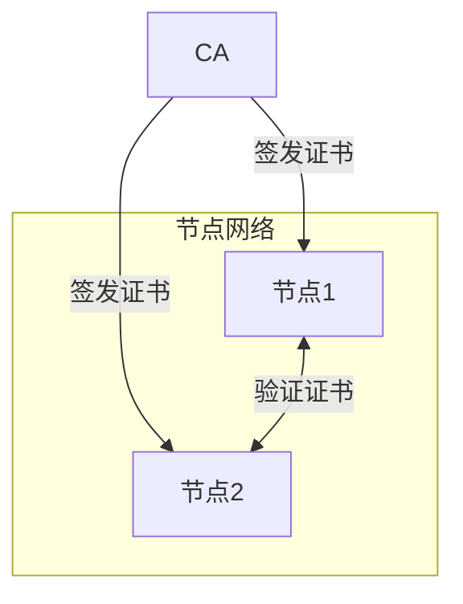
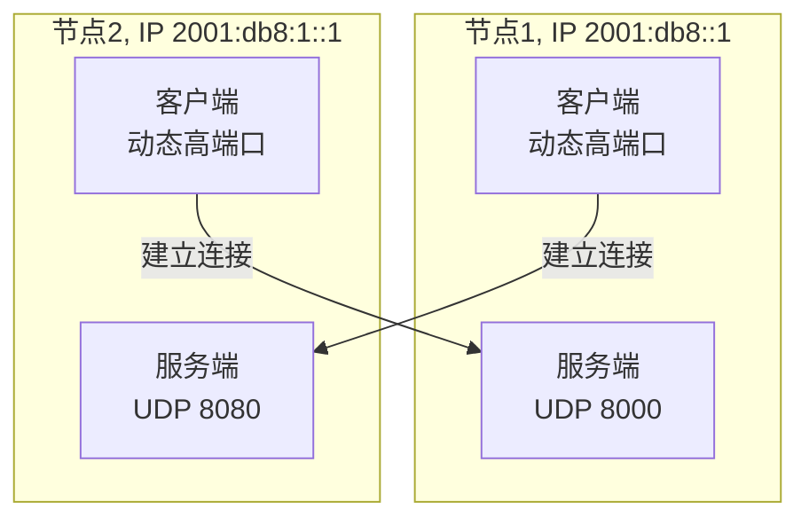
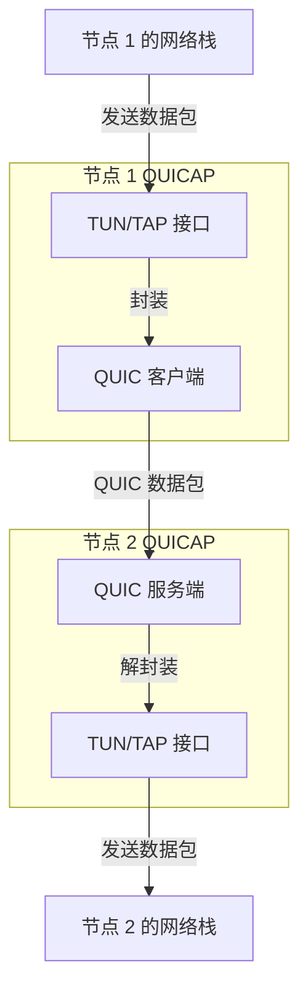

我们用到过很多种 VPN (和混淆) 的手段. WireGuard, Tinc, OpenVPN, SSLVPN, VMess, VLESS, Xray... 它们各自有各自的优势, 但又或多或少都有一些问题. 为了一些独特 (感觉并不独特) 的需求和一些人炫技的小心思 (反正不是我就对了), 我们提出了 QUICAP - 一个基于 QUIC 隧道的, 采用 PKI 系统鉴权的, 可以方便地进行修改和混淆的, 可以同时启用或选用二层隧道 / 三层隧道或应用层代理的, 能够自动优化路由以应对拓扑变更的网状 VPN 方案.

We have utilized a variety of VPN and obfuscation solutions, including WireGuard, Tinc, OpenVPN, SSLVPN, VMess, VLESS, and Xray. Each offers distinct advantages but also presents certain limitations. To address specific requirements and enhance flexibility, we introduce QUICAP—a mesh VPN solution built on QUIC tunneling, featuring PKI-based authentication. QUICAP is designed for easy modification and obfuscation, supports both Layer 2 and Layer 3 tunneling as well as application-layer proxying, and can automatically optimize routing in response to network topology changes.

<!-- more -->

## Other VPN solutions and their issues

### WireGuard

WireGuard is a modern VPN solution integrated into the Linux kernel, recognized for its simplicity and high performance. However, WireGuard packets are easily identified by their unique header (UDP leading bytes 0x01 0x00 0x00 0x00 during the initial handshake), making them susceptible to traffic analysis and blocking. There are numerous reports of ISPs blocking WireGuard traffic, resulting in unreliable connectivity—even when endpoints are simply routers at THU and at home.

WireGuard also lacks flexibility in network topology. For example, if you have two routers available as gateways, WireGuard only allows you to route 0.0.0.0/0 traffic through one at a time via configuration, limiting routing options. Using both routers requires running two separate WireGuard instances, which is inefficient and cumbersome.

### Tinc

While WireGuard is rigid in routing, Tinc offers a flexible Layer 2 VPN solution. Once the Layer 2 tunnel is established, it behaves like a physical network interface, enabling advanced policy routing. However, Tinc introduces significant encryption overhead and relies on a peer-to-peer authentication model. Nodes can only connect if each other's public keys are present in their respective configuration files. Adding a new node requires distributing its public key to all existing nodes, which is error-prone and inconvenient.

### OpenVPN

OpenVPN is a widely adopted VPN solution supporting both Layer 2 and Layer 3 tunneling. Nevertheless, it is easily identified by its TLS handshake. The introduction of Data Channel Offload (DCO) has improved its performance, but as a mature VPN protocol, OpenVPN remains susceptible to detection and blocking.

### VMess / VLESS / Xray

To mitigate blocking, various obfuscation techniques have been developed. However, these solutions do not provide true Layer 3 tunneling (their TUN mode typically supports TCP, some support UDP, but other protocols are not handled). They function as application-layer proxies, requiring application-specific proxy settings.

Additionally, these protocols are primarily designed to circumvent censorship, not for network flexibility. Most employ a client-server architecture.

## QUIC protocol and its advantages

According to RFC 9000, QUIC is a modern transport protocol designed for secure, low-latency communication over the internet. Operating over UDP, QUIC integrates features such as multiplexed connections, seamless connection migration, and robust encryption.

As a tunneling protocol, QUIC offers several distinct benefits:

### PKI Support

QUIC natively supports Public Key Infrastructure (PKI) for authentication, enabling secure and scalable identity management. Administrators can deploy a self-signed certificate authority (CA) to issue certificates for each node, simplifying secure communication and node lifecycle management. Integration with public CAs is also possible, allowing QUICAP to leverage existing PKI frameworks.

### Integrated Encryption

All data transmitted via QUIC is encrypted by default, ensuring confidentiality and integrity without the need for additional encryption layers. This reduces overhead and enhances performance.

### Multiplexing

QUIC allows multiple independent streams within a single connection, which is ideal for our use case. Data frames can carry Layer 2 or Layer 3 traffic, while dedicated streams can handle control messages. Application-layer proxies can also be implemented over QUIC streams, providing flexible and efficient communication.

### Connection Migration

QUIC supports connection migration, allowing sessions to persist even when a node's IP address changes (e.g., due to network transitions). This ensures continuous connectivity and resilience in dynamic network environments.

### Datagram Support

Although QUIC is primarily stream-oriented, it also supports datagrams. This capability enables the transmission of raw packets (such as ARP requests) without establishing a stream, and without flow control or retransmission. This is particularly advantageous for tunneling scenarios, as it avoids issues related to double congestion control.

### HTTP/3 Obfuscation

QUIC serves as the transport layer for HTTP/3, making it challenging for traffic analysis tools to distinguish between VPN tunneling and standard web traffic. By leveraging Server Name Indication (SNI), QUICAP can further emulate legitimate web traffic, significantly enhancing obfuscation and resistance to detection.

## QUICAP Name

The name QUICAP encompasses several concepts: QUIC-encapsulation, referring to the encapsulation of Layer 2 or Layer 3 traffic within QUIC; QUIC-TAP, denoting the use of TAP interfaces for Layer 2 tunneling; and QUIC UP, highlighting QUIC as a universal protocol for tunneling. This name reflects QUICAP’s core principles of encapsulation, flexibility, and performance.

(Note: The following specifications describe intended features and planned implementations. Actual development is ongoing, and these details represent our goals rather than completed work.)
(P.S. As a side project, chances are that QUICAP will stop being maintained actively if we lose interest.)

---

## QUICAP 点对点

首先, 我们考虑一个点对点的 QUICAP 方案. 我们先不管多节点间如何路由.

作为一个点对点的隧道, 我们需要解决的主要问题是认证和传输.

### mTLS 认证

QUICAP 使用 PKI 系统进行认证. 一个 QUICAP 网络由一个受信任的 CA 证书 (可以是自签名的, 也可以是在 PKI 系统中由受信任的 CA 颁发的) 作为根证书, 其为每个节点颁发一个节点证书. 在分发时, 每个节点生成自己的 CSR, 并将其发送给 CA 进行签名. 签名完成即代表获得入网权限.

每个节点都配置仅信任 CA 证书. 当建立连接时, QUICAP 会验证对方的证书是否由受信任的 CA 签发, 并检查证书的有效性 (包括过期时间和撤销状态). 只有通过验证的节点才能建立连接.

如果有混淆的需求, QUICAP 可以在连接未提供客户端证书时伪装成 HTTP/3 流量.

### TUN/TAP 接口

QUICAP 使用 TUN/TAP 接口接入 Linux 网络栈. 其中, 通过 TUN 接口, QUICAP 可以处理三层隧道的数据包, 而通过 TAP 接口, QUICAP 可以处理二层隧道的数据报.

### 双连接模式

为了简便起见, QUICAP 的两个节点之间会建立两个 QUIC 连接, 每个节点各自以自己为客户端向对方发起 QUIC 连接. 如果有一方的 IP 地址未知 (如在 NAT 后), 则建立一个 QUIC 连接.

若两个连接均建立, 则 QUICAP 偏好使用客户端连接进行数据传输; 否则若只有一个连接建立, 则使用该连接进行数据传输.

### No-Carrier 状态

若一个节点上的 QUIC 连接全部断开, 则该节点对应的 TUN/TAP 接口进入 No-Carrier 状态, 以防 Linux 网络栈继续发送数据包到该接口. 此功能可选开启.

### 数据包路由

在点对点模式下, 我们不需要处理多节点间的路由问题. QUICAP 只需将接收到的数据包直接发送到对端节点的 QUIC 连接上即可. 在整个过程中的数据包流向如下:

## 未完待续
