昨天? 开学代会, 但是我在做毕设的 PPT. 做到一半, 惊闻学生科协工作报告里面出现了我的名字, 然后有人给我发了拍照版本, 我看了一眼发现里面全是胡编乱造, 本来想写小作文喷他, 但是迫于 PPT 我没能很快写出小作文.

今天有人给我发了一份 [`file.tmpUUZPSS.pdf`](./SASTAnnualReport2026/file.tmpUUZPSS.pdf), 打开一看是这个报告的扫描+批注版本, 其内容令人忍俊不禁, 下面我就逐句点评一下这个报告到底写了什么.

后来得知这玩意是 [树洞](https://new-t.github.io/?##715291), 原来的名字叫 "某某大学计算机某某与某某系2025-2026学年度学生科协工作报告_重点学习版_深度学习版_重新学习版.pdf", 是不是还有好几个人分别批注了好几遍, 真绷不住.

<!-- more -->

> 各位代表，各位来宾，各位老师们: 下午好!我受某某大学计算[REDACTED]学生科协的委托，向[REDACTED]系2026-2027学年度学生代表大会报告过去一年的工作，并对下一阶段的工作提出建议，请各位代表审议。

可惜我不是代表, 不然多少行使下质询的权利.

> 在这一学年的时间里，[REDACTED]科协在系党委的领导下，在系团委的指导下，努力促进科学技术文化氛围的营造和繁荣发展，为同学在课外科创领域提供高质量服务，建设计算机系学生科协新局面。

经典套话, 但是他开创了什么新局面? 叫大四和研究生学长干活吗?

> 下面我将分两个部分进行工作报告，第一部分对过去一年的科协工作进行总结说明；第二部分对科协这一年工作进行反思，并以此为基础为今后工作提出建议。

## 第一部分：传承科协文化，建设技术氛围

> 过去一年中，科协结合过往组织经验，围绕科创赛事、技术氛围建设、生涯发展规划等方面进行了探索并取得了一定的成果，在此进行陈述。

没看出来科协有什么文化, 也没看出来今年有什么成果, 技术氛围建设更是一点没有, 连科协的大水群都没人说话了.

### 网络部

> 科协在技术培养方面的工作围绕着同学的需求，关注大家日常学习中的痛点，继承了以往建立的计算机系技术学习体系，并在此基础上加以完善：通过基础技能培训、暑期培训进行集中式的知识传授，提高同学们的技术素养；通过 Weekly9 周刊栏目，我们加强了与同学的互动性，并扩展了技术分享的内容范围；通过重整已有服务，传承科协的技术资产，牢固科协的技术历史底蕴。

Weekly9 在前年是 Weekly9, 去年是 Monthly9, 今年是 Seasonly9... 基础技能培训在下学期... 这些后面再说.

> 本学年，科协继续与计算机系教学实验室合作，面向大一的同学组织了基础技能培训，讲授学习生活中会用到的实用技能，包括 Git、Linux、CMake 工具链、Web 基础等。我们通过公众号推送、群聊转发等方式进行宣传。相比去年同学们展现了更高的参与热情，本年度共开展线上基础技能课程约二十次，多个视频播放破万；线下基础技能课程三次。课前讲师准备预习材料并发送到微信群供同学预习；所有培训内容都有会议录制以供同学课后查看。

你组织基础技能培训讲 Git 的时候大家的 OOP 都要上完了... 这时候讲真的有人听吗? "同学们展现了更高的参与热情" 吗? 真的吗?

我隐约记得今年 fuyuki 讲第三次基础技能培训的时候有 0 个人来参加, 然后对着空教室讲了一个小时, 这场景好似前两年哪个操作系统专题训练...

> 2025 年暑假，新的一期暑期培训登录哔哩哔哩平台，史无前例的获得了10万余次播放，获得了社会的广泛认可。此次暑期培训在内容上涵盖 python 等基础知识、前端、后端、AI、游戏与科研入门经验介绍，延续往年经验，提高院系技术氛围、发挥了技术交流的积极作用，帮助同学更好地过渡到高年级的学习生活的同时，回应了社会对计算机系本科生的期待，获得了良好的社会反响。

去年的暑培和前两年的内容感觉更 AI, 确实更贴近社会热点一些, 基础内容的质量也就那样. 去年暑培只有录播, 没有直播, 不知道是不是播放量增加的原因之一. 以及去年的 Linux & Git 有 2.1 万播放, 2 弹幕, 18 评论; 24 年我讲的的 2800 播放, 3 弹幕, 6 评论; 23 年的 1.5 万播放, 9 弹幕, 19 评论. 从评论的数据上, 今年的似乎 B 站给推流给了更多外校的同学, 有部分外校的同学评论和找暑培的网站资源. 不像前两年主要是本校的评论.

> 在本学年，我们继续推进科协周刊 Weekly9 项目更新，刊物内容包括技术与工具分享、课程知识延伸、科研心得等。Weekly9 对系内所有同学开放征稿，并辅以网络部部员供稿、外部约稿。我们希望 Weekly9 能给系内同学提供一个展示自己文章作品的平台，提升技术交流的氛围，扩展同学们的视野。目前 Weekly9 已经发布了32篇高质量内容，题材多元，涵盖 AI, MLSys, SpinalHDL,高性能计算，网络搭建等内容，合集的阅读量已经达到30000次，并收到了多位教师的认可与转发，获得了积极的评价、产生了显著的影响力。

目前 Weekly9 已经发布了 32 篇高质量内容, 其中 *今年 3 篇*. 这里面说的 SpinalHDL 是大前年的, 网络搭建是 , 都有悠久的历史了.

> 本学年网络部联合联创部，依托系内教学实验平台和阿里云对系内的大力技术支持，开发了计算机系AI辅助工具平台。该平台为计算机系自主开发的集成化AI工具，面向全系课程与科研项目提供服务，为系内师生提供了对话服务、API 转发服务等一系列核心功能。平台上线以来支持请求量近10万次，推进课内AI工具使用与监管，为新一届智能体大赛推理赛道提供了模型支持。

这平台是 wst 接的教学实验室的活, 听说小朋友们都没干活, 基本是 wst 一个人在做; 至于这个请求量, wst 说他自己都不知道, 不知道 xry 怎么拿到的大数字. 感谢 wst. 以及... 为什么他妈的是 wst? 他不是落选主席, 都大四了, 科协也没他的编制啊.

> 传承科协文化，势必需要关注科协多年积累的宝贵技术知识资产。在本年度，网络部继续维护和更新科协服务相关技术文档，对服务器基础硬件设施进行了若干次维护更新，进行部分服务迁移和更新，更新了相关文档。对这些服务和资料的保存重整，是传承科协文化、牢固人文底蕴的重要工作。

对, 详见 , 这事情 xry 也从未过问, 遇到什么问题就扔给 cyc, 然后我和 cyc 解决, 解决不了就 @harry, @jiegec, 我都不好意思

### 智能体部

> 智能体大赛是计算机系的品牌赛事，迄今为止已成功举办三十届。智能体大赛的基本形式是每年由计算机系学生科协的同学进行 AI 对抗游戏和比赛的筹备、策划、组织、开发和宣传工作，为选手提供编写人工智能程序提供接口和相应技术指导，选手提交代码到科协独立自主开发的 AI 对抗平台 Saiblo 中，与其他选手的 AI 进行对战，通过天梯积分或循环赛等赛制决出最终名次。为了能够吸引更多新生参与智能体大赛，本年度的比赛于2025年7月开始筹备，于2026年4月开赛，共有约300名选手报名参赛，较去年增长100余人，既吸引了来自计算机系、交叉信息学院系等传统院系的选手，也有诸如未央书院、法学院、人文学院、机械工程等非计科选手的参与，宣传范围广泛。

现在不品牌了

> 今年的智能体大赛赛事采用双赛道，分别开发了《AntWar》与《DeepClue》游戏。《AntWar》游戏采用了蚁群战争的背景故事，双方玩家需要在六边形的地图上获取资源升级能力来进行博弈，同时还有着科技道具等机制增添游戏深度。《DeepClue》赛道首次使用大模型驱动的智能体，通过AI 演绎剧本、AI 侦探探案的形式，鼓励参赛选手探索长上下文构建、复杂逻辑链推理、多智能体交互等科研前沿命题。本届智能体大赛继承了上届大赛的办赛理念，在赛事设计、赛事选题、培训 引导、组织规划等多个维度有所继承，致力于打造一个选手满意、组织者有收获的赛事。赛事设计方面，今年的智能体大赛与强化学习相结合，通过引入来自教学实验室的GPU 算力支持，对赛事平台和赛制进行了升级，让同学们可以使用新兴的 AI 算法训练智能体参与比赛，从而优化赛事体验，能学到更多有用的知识。赛事选题方面，我们在保持传统强化学习赛道的基础上，引入了Transformer驱动的大模型智能体，加深科研深度和可玩性。培训引导方面，我们继续组织了有关游戏策略、AI编写和往届优秀选手心得分享的培训环节，帮助智能体新手“初入茅庐”。我们同样对逻辑、SDK和规则等必要的说明内容准备了详实的文档，并有方便选手深入了解细节，并也组织了SDK讲解环节。此外，我们还在交流群和问题反馈表中及时接收选手反馈，对赛事进行不断优化。在组织规划方面，我们秉持“办好比赛”理念，吸取往届经验，为了提升开发质量与效率，我们与软件工程课程积极合作，将智能体开发与课程项目同步，最终出色并卓越地按照规划完成开发项目，完成了组织筹备工作，向选手交付了高质量的工程文件与指导文档，在寒假期间顺利开赛，游戏也得到了选手们的好评。开学后，我们在C楼门口筹办了智能体嘉年华路演，向更多同学宣传我 们的赛事，获得了许多人的关注。目前，智能体大赛已经顺利完赛，我们组织了线下决赛环节来展现选手的精彩表现，并吸引同学们持续关注我们的赛事。

我听说他们的开发一波三折, 我就放点东西在这里,

"我们与软件工程课程积极合作，将智能体开发与课程项目同步，最终出色并卓越地按照规划完成开发项目":

  

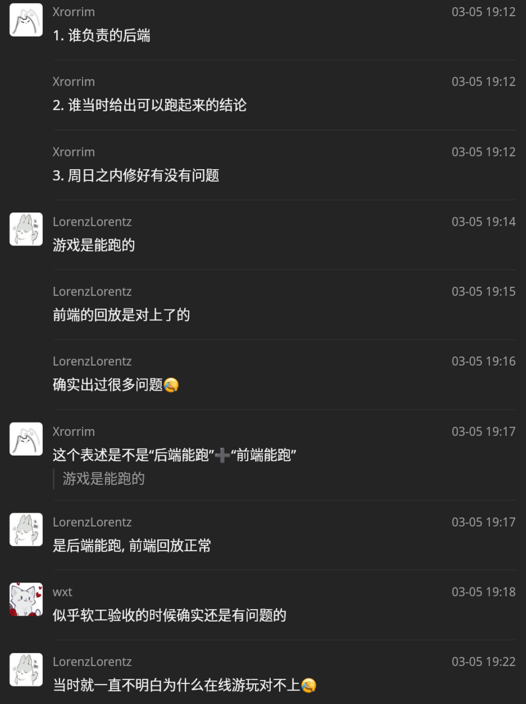

  

  

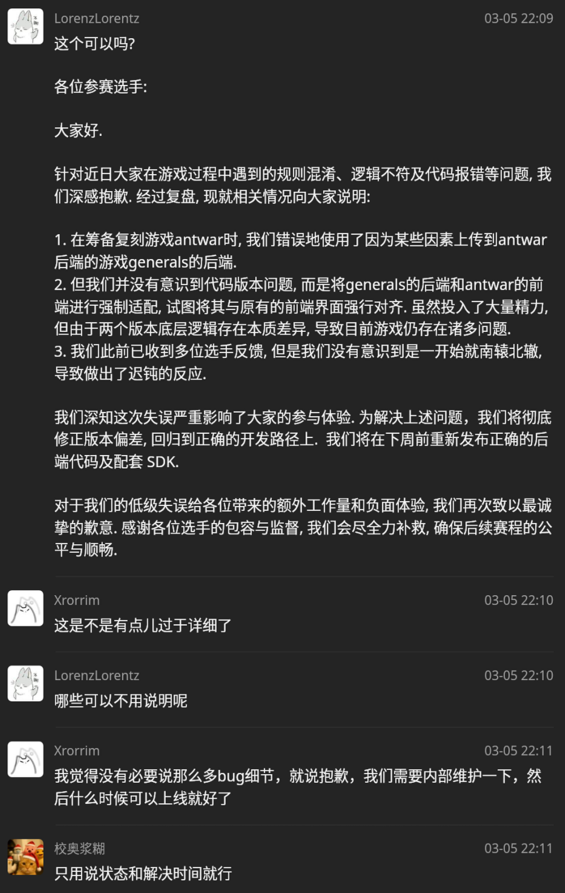

  

"致力于打造一个选手满意、组织者有收获的赛事":

  

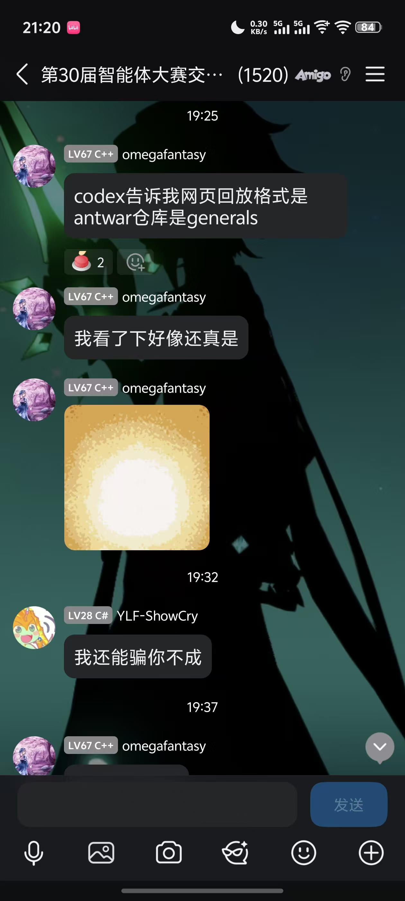

  

  

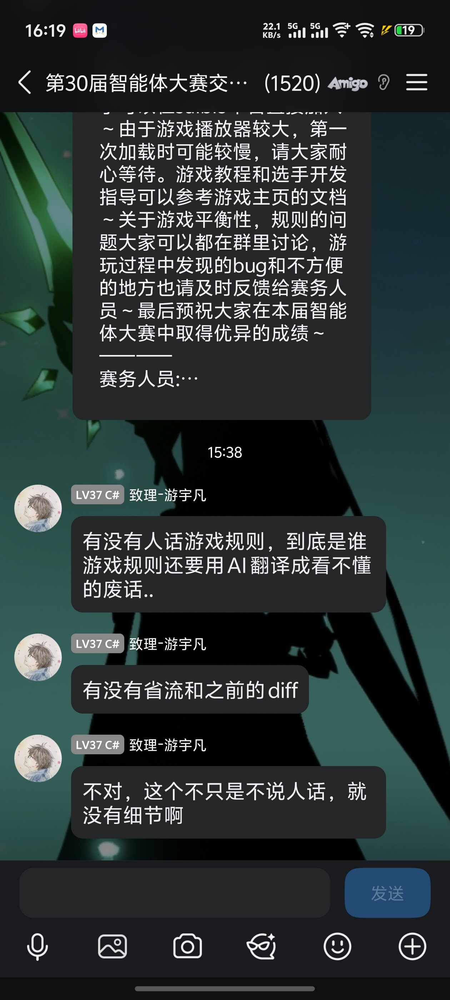

  

"开学后，我们在C楼门口筹办了智能体嘉年华路演" 你们是一堆人在 C 楼门口做筹办的吗

  

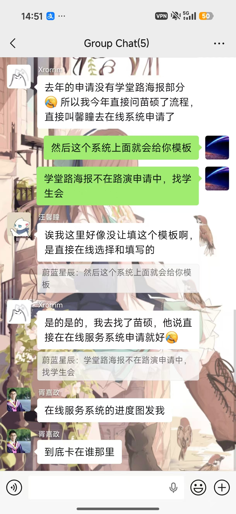

  

  

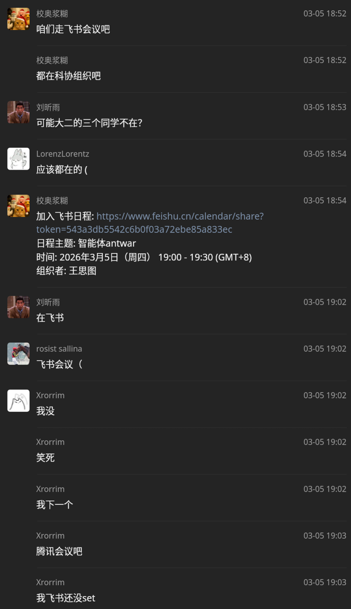

  

还有赛课结合,

  

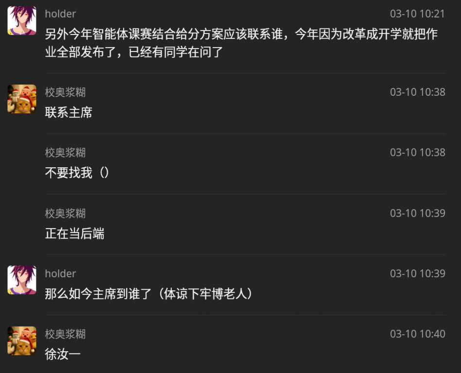

  

  

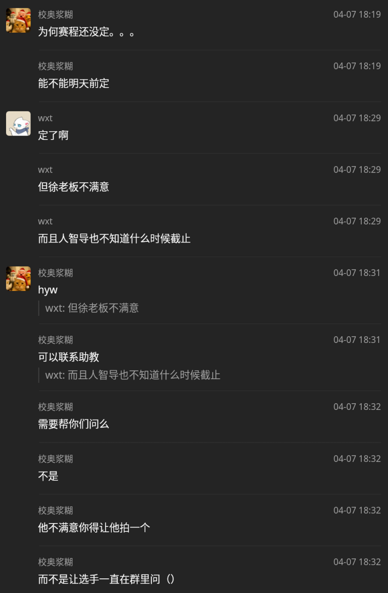

  

> 经与授课老师深度沟通确认，本届智能体大赛Antwar赛道正式纳入《人工智能导论》课程考核体系，可作为课程大作业成果。赛课结合的模式，不仅降低了同学们的参赛顾虑，更有效激发了全系同学的课程学习积极性和赛事参与热情，让竞赛成为AI知识实践的优质平台。

  

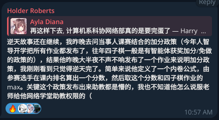

  

  

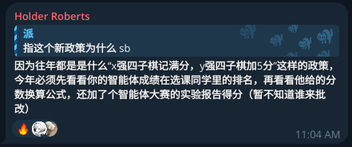
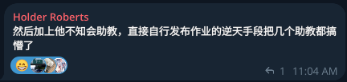

  

> Saiblo 是科协自主开发的智能体对战平台。在继续为《人工智能导论》四子棋作业提供评测服务以外,Saiblo团队也在跟进维护和改进平台。Saiblo的主力维护人员原本出身自科协历届的网络部或智能体部副主席，在团队成员的努力下，也逐渐拉找到感兴趣的外系同学参与，壮大团队。

Saiblo 的开发者, [孙迅学长](https://unidy.cn), 上个月跟我讨论, 说, "我感觉这个 Saiblo 平台快成为时代的眼泪了. 我已经没有管理它的积极性了，下面的小朋友也不太会搞，然后我就更不想管了，恶性循环. 感觉软件这东西，还是离不开人来维护, 我以前还想，Saiblo 会不会超越上一代智能体平台, 但估计还是摆脱不了几年过去重来一次的循环", 他们真的壮大了团队吗?

### 联创部

> 今年科协继续塑造系内科创土壤，向同学们介绍系里的科研资源，帮助同学们找到自己感兴趣的科研方向，本学年在学术交流和科创展示方面实现突破。本年度，联创部与学生会联合推出“新星OpenDay”,依托“学术新星计划”打造的系列学术交流活动。在本年度学术新星计划吸取去年的反馈，进一步扩大了项目邀请的范围，在秋季学期共有58个项目立项,95个同学报名。为了让同学们更好地了解各个项目，科协在新系馆地下B2开展了学术新星——海报交流会，共有15张海报参展，到场人数超过100人次，覆盖本科四个年级，与导师学长充分交流、反响较好.
>
> “新星OpenDay”系列讨论会致力于邀请计算机学科的前沿嘉宾学者，分享科研成果、学术心得、成长建议，助力同学们培养科研的志趣品味、拓宽生涯规划的视野。本年度共举办10余期，依托“学术新星计划”,面向同学搭建近距离接触前沿科研与产业实践的交流平台。从“隐空间”、大模型安全与对齐、扩散生成模型、视频 Diffusion Transformer、非 Transformer 范式，到高效多模态大模型、神经科学与人工智能交叉、具身智能、人形机器人，以及生成式 AI的技术演进与产品落地，系列推送呈现出清晰主线：围绕 AI 的基础理论、模型范式、能力边界和真实应用持续展开。每一期不仅介绍嘉宾研究方向与代表性成果，也引导同学从问题意识、方法选择和工程实现中理解科研路径。整体来看，新星Open Day既是高质量学术讲座的预告与回顾，也是帮助本科生拓宽视野、发现兴趣、建立科研品味的重要窗口。

这个是今年的新项目, 我完全没有关注, 无法评价.

> 本年度，科协开展了第二届“计算机系科创年会”活动，希望对计算机系本科生同学的科创成果进行总结与嘉奖，开拓同学视野，助力生涯规划。我们鼓励各种成果参与，科创赛事项目、个人科研项目，甚至优秀的课程大作业等均可在年会上进行展示。经过报名、筛选，年会现场最终展出了20余份海报，分属于大语言模型技术与应用、多媒体与多模态技术、系统与高性能计算、人机交互与学科交叉等多个专题，项目来源包括挑战杯、学推计划、学术新星计划、SRT项目以及课程大作业等，涵盖主题与领域十分广泛。计算机系学生科协也在现场设置展板，展示了“学术新星计划”、“Weekly9”、学生节Wifi搭建等计算机系特色科创工作，现场交流气氛热烈。

Wifi 搭建算什么科创? 而且这是网络部的活. 然后科创年会我印象里那些展品都是联创部求爷爷告奶奶让大家参加, 大家根本就没啥积极性.

> [REDACTED]大学“挑战杯”学生课外学术科技作品竞赛是一年一度的有导向性、示范性和群众性的竞赛盛事。本年度“挑战杯”中我系共有16个项目参赛。系科协在挑战杯筹备期间结合星火计划、学术新星等科创计划，充分进行参赛动员。本届挑战杯吸取往届经验，更加重视项目的交叉性和规范性，邀请系内辅导员、老师、以及若干位研究生同学对入围的挑战杯参赛项目和选手进行有参考性的指导，并多次打磨各项目材料。计算机系共有7份作品直接参与校级函评，其中民生赛道作品1份,“基础科学” 赛道作品1份,“信息技术”赛道作品3份,“人工智能”赛道作品3份。参与校级函评的7份作品共有4份成功晋级，进入到最后答辩环节。最终计算机系在本届挑战杯获得了1项二等奖、4项三等奖。再次祝贺各位参赛选手，感谢计算机系的领导、老师和各位高年级学长学姐的指导，感谢参与挑战杯工作的同学们的支持。

软件学院的同学们听到之后的第一反应: 计算机系连一个一等奖都没有?

## 第二部分：总结经验，重新出发

> 回首过去一年的工作，我想对一年前，纲领答辩时提出的问题一一做出回应：

他纲领答辩说了啥来着

> 如何服务全体同学，开拓个性化科研发展的道路?我们的回答是，丰富资源、人人有策。在联创部与学生会的精诚合作下,“新星OpenDay”应运而生，通过一节课的时间了解一个实验室的研究方向、学习一名学长的科研经验，为同学了解导师、入门科研提供了更轻松、更可执行的机会。在与多院系联合的新生讲座上，我们为每一名五字班的同学都提供了对多元未来的详细梳理，踩实进入大学的第一步。网络部持续通过微信公众号，每周推送技术文章，内容涵盖课程延伸、科研初探与技术实践等方向，有效促进了系内技术交流与知识传播。

详见上述评论

> 在AI飞速发展的时代，该如何让科协提供的科创平台与时俱进?我们的回答是，降本增效，大胆创新。网络部探索了“文档优先、线上传播”的基础技能培训工作模式，讲师以更多精力进行在线文档、讲稿的维护，通过在线平台，将科协的工作成果辐射到更广阔的社会当中。智能体部智能体传统赛道的同学，以往届3/10 的人员开发了2026《AntWar》,同时推出第二赛道《DeepClue》,展现了 AI 赋能科创工作后，效率的极大提升。

"往届 3/10 的人员" 的意思是今年找不着人了, 只能找 3/10 的人来开发了.

> 如何传承科协文化、维护网络服务，为同学提供更可靠的科研平台?我们的回应是：巩固传统，传承创新。在董业恺、王思图等优秀科协骨干的大力支持下，网络部的各位同学完成了9系列服务维护、对服务器基础硬件设施进行了若干次维护更新，进行部分服务迁移和更新，更新了相关文档。在下一年度，我们即将面临服务器搬迁等新挑战，关注科协多年积累的宝贵技术知识资产，是牢固科协人文底蕴的重要工作。

关我何事, 大四什么时候有科协骨干了? 现任主席致谢落选主席, 简直是倒翻天罡, 有一种, "活都是你干的, 奖都是我领的, 我感谢你一下" 的感觉.

然后他妈的服务器搬迁什么叫他妈的在下一年度我们将面临服务器搬迁, 他妈的上个月我们就已经把服务器搬完了, 他妈的这个主席半个字都没过问过, 也他妈的不参加, 有什么事情也他妈的不扛着, 就知道当传话筒, 不如 zyj 一点.

> 在2025-2026届科协全体同学的精诚合作下，我们获得了阶段性成果，更应总结经验，才能重新出发。希望新的一年，科协能够依靠不断的反思和总结，坚持优点，改进不足，在已有工作经验的基础上不断进行增量更新，迭代优化。

啥叫精诚合作, 感觉怪怪的呢, 而且后面一段还有一个.

> 感谢党委学生组和系团委的各位老师、辅导员对科协工作的指导和帮助，感谢校团委，校科协和兄弟院系科协给予我们的关心和支持，感谢学生会、宣传中心、研团研会对科协工作的帮助，感谢系里同学对科协工作的监督与肯定。
>
> 感恩 2025-2026 年度科协的每一位战友，科协的成果离不开各位的精诚合作，大家的成长离不开彼此的并肩支持。

谁跟你是战友, 你看这 "重点学习版_深度学习版_重新学习版.pdf" 的名字, 总觉得这份报告是被好几个人批注了好几遍的, 到底是招惹了多少人啊...

> 在此祝愿未来的科协主席团与各个部门工作顺利。
>
> 与君共勉！

与君共勉!

## 点评

总的来说, 这个报告应该就是让 AI 把前两年的报告东拼西凑糊出来了一个, 里面的东西正确性堪忧, 甚至都不能说是堪忧, 就没多少对的, 纯在胡说八道, 夸大其词, 生搬硬套, 避重就轻, 张冠李戴, 移花接木. 整篇报告不能反映科协的真实情况, 无法让人了解科协的真实工作, 我认为其有店大欺客, 仗势欺人之嫌, 因为其笃定在学生代表大会上学生代表一没有实际经验, 二不清楚实际情况, 三不愿意撕破脸皮, 所以就可以胡编乱造, 蒙混过关. 殊不知学代会还没开完, 这篇报告就已经在科协的老人群里流传甚广, 群情激愤, 都觉得这篇报告谎话连篇. 科协该倒闭倒闭, 造出一副花团锦簇, 欣欣向荣的景象给大家看, 其实也就是外面的架子虽未甚倒, 内囊却也尽上来了. Anyway, 现在又有一堆事情, 先跑路了.
