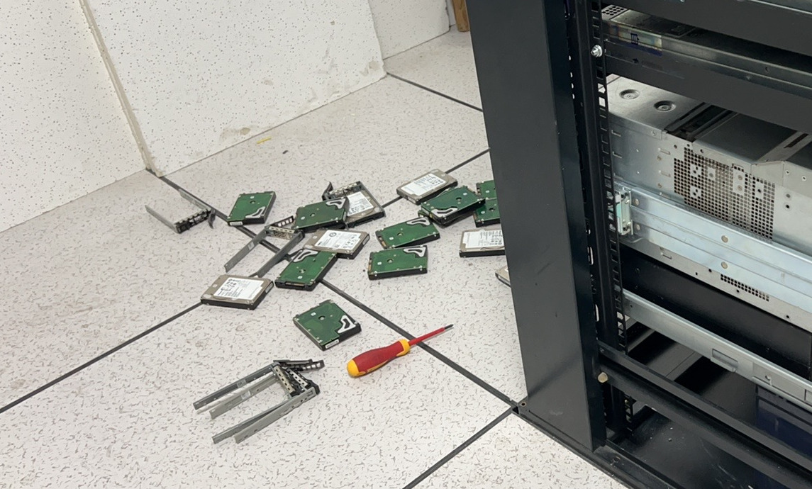
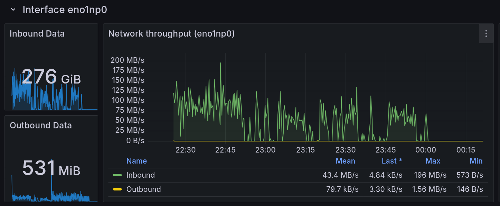
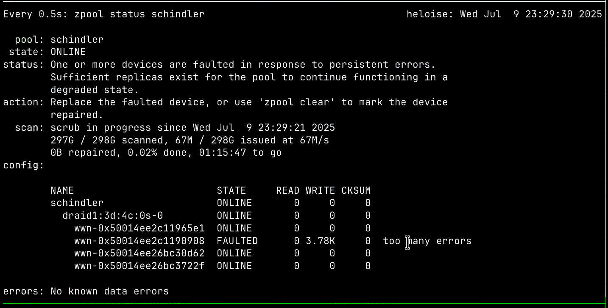
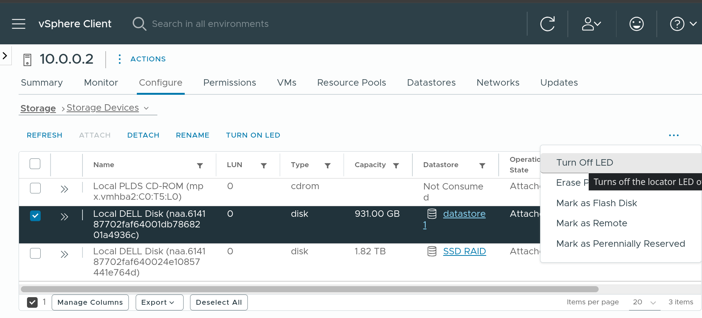

这两天重操旧业, 在学生兴趣团队机房进行了一些运维操作, 于是又产生了一些故逝. 写在这里让大家都笑笑.


<!-- more -->


## 8 块一块的 300G 2.5" SAS

[**我有一个朋友.jpg**](https://d0n2.in/), 她在闲鱼上看到了有人售卖 300G 的 2.5 英寸 SAS 盘, 8 块钱一个. 于是她十分心动, 大手一挥, 进行了如下 ~~冲动~~ 消费


细心的读者可能已经发现了问题: 8 块一块盘, 她怎么付款 232 元呢?

数学比较好的读者可能已经发现了问题: **她买了 29 块!!!**

当她购买时, 我调侃道, 这堆盘不一周炸一块, 天天起夜就不错了. 但是前几天, 为了批量检测盘的质量, 这堆盘到了我的手里.

机房有一台超微的 24 盘位 2.5 的服务器, 我们计划用那个服务器一把过测完. 于是我们:

- 把那台机器的盘架统统抽出来 (3min)
- 把放在里面占位用的 *虚拟磁盘* 统统拆掉 (拆了 24 * 4 = 96 颗螺丝, 还是 3.5 寸盘的螺丝... 不知道超微为啥不给它的占位的架子用 2.5 寸盘的螺丝) (15min)
- 又给 24 块盘装上架子然后上架 (15min)

之后发现:

*一块盘都没有识别到......*

此时 Donz 没绷住, 表示, 总不能所有盘都坏了吧. 于是我进行了一些 Debug (10min), 最终决定拆开机箱一探究竟.

结果是: Super Micro 的这个机器的 24 盘位背板 **只接了靠左的 8 块盘** 不说, 还是用 **Mini SAS 反向线** (把主板上的 SATA 口接到硬盘背板上), 只能用 SATA 盘.

于是我们只好把盘又乖乖拆下来... (15min) 换成 Dell 的盘架, 塞进 R630 里面去. 还成就了这番光景:



前前后后用了将近一个小时, 得出一个教训: 当看到某个服务器硬盘位很多的时候, **先想想为什么这么多**, *是不是有的不能用*, *是不是所有格式都支持*. 不能用手电筒看到硬盘背板有 SAS 针脚就认为能插 SAS 盘. 最好提前看一眼背板.

后来用 R630 测完了, 29 块盘里面有 3 块格外老, 它们有一些重分配记录; 其它的虽然通电有 40000+ 小时, 但是从未出过问题, 十分坚挺. (企业级真的和起夜级不一样啊!)

至于还有一块... 我听说有神人 (我朋友的同学, 但不是我) 用螺丝刀拆开检视了一圈并表示, "企业级的盘就是结实啊!".

于是, 黄了.


## 5TB 叠瓦蓝盘

在此之前, 工物系科协的神人买了 4 块 5TB 的 2.5 寸西数蓝盘 (叠瓦盘), 并组了 dRAIDz1, 没有加 metadata dev.

我和他们打赌说, 这玩意到时候绝对性能爆炸, 卡得要死. 没人信. 于是我当即决定采用 10Gb 内网下载 2TB 雨课堂数据的方式检验一下这个阵列.



于是, 我挂上了同步雨课堂的脚本. ylw 监测到了大流量, 于是有了以下对话

> 2025/07/09 23:12
>
> A: 我在试图证明那 4 * 5T 的阵列没有 sdev 是一坨
>
> A: 不过看上去还行（
>
> A: 网络速度现在大概 120MB/s?
>
> 2025/07/09 23:17
>
> Y: 我看刚刚怎么停住了
>
> A: zfs IOwait xs
>
> A: 刚刚卡 IO 了
>
> 2025/07/09 23:32
>
> A: [图片]
>
> A: 盘  挂  了
>
> Y: 啊？？？？？？？？？？？？？？？？？？？？？？？？？？？？？？？？

对, 你没有听错! 一块 5TB 的全新 (京东自营购入) WD Blue, 挂了.



后来更是大爆炸, Pending Sector 都有 200+ 了. 写的时候则直接超时掉盘.

```log
ID# ATTRIBUTE_NAME          FLAGS    VALUE WORST THRESH FAIL RAW_VALUE
  1 Raw_Read_Error_Rate     POSR-K   100   253   051    -    0
  3 Spin_Up_Time            POS--K   100   253   021    -    0
  4 Start_Stop_Count        -O--CK   100   100   000    -    3
  5 Reallocated_Sector_Ct   PO--CK   200   200   140    -    0
  7 Seek_Error_Rate         -OSR-K   100   253   000    -    0
  9 Power_On_Hours          -O--CK   099   099   000    -    1012
 10 Spin_Retry_Count        -O--CK   100   253   000    -    0
 11 Calibration_Retry_Count -O--CK   100   253   000    -    0
 12 Power_Cycle_Count       -O--CK   100   100   000    -    2
192 Power-Off_Retract_Count -O--CK   200   200   000    -    0
193 Load_Cycle_Count        -O--CK   200   200   000    -    37
194 Temperature_Celsius     -O---K   122   115   000    -    30
196 Reallocated_Event_Count -O--CK   200   200   000    -    0
197 Current_Pending_Sector  -O--CK   200   200   000    -    3
198 Offline_Uncorrectable   ----CK   100   253   000    -    0
199 UDMA_CRC_Error_Count    -O--CK   200   200   000    -    0
200 Multi_Zone_Error_Rate   ---R--   100   253   000    -    0
```

于是, 我获得了新盘杀手的称号 (雾), 现在这块盘已经保修换新去了.


## 我把正在运行的系统的 / 分区拔了

逝情是这样的... 我们新修好一台 R630, 把 ESXi 7 换成了 ESXi 8. 我知道机器里装了 8 块盘, 但是系统里只看到两个阵列盘. 一个 1T 机械, 一个 2T SSD. 从 iDRAC 看, 有一个写着 "*startup*" 的 1T RAID1, 一个单盘 1T RAID0, 一个 3*1T SSD RAID5, 还有两块盘闲置.

看到这里... 读者大概已经能猜到发生了什么了.

我 Mark 了单盘 RAID0 和两块闲置盘 (Set Blinking), 然后去机房把这三块盘拔了. *恰巧* 另外一块盘的盘架坏了我想给换一个, 遂进 Maintenance Mode 之后关机. 结果进去 ESXi, 提示某个 VMFS 不见了. 不管, 关机.

关不上. 遂用 iDRAC 直接断电. 此时我觉得不太对劲, 为啥我拔了 0 号盘和 6, 7 号盘呢? 谁家好人这么插盘啊. 换完盘架重启, *No Boot Device*.

于是我发现, 这个写着 *startup* 的阵列不是启动盘, 那个孤零零的 RAID0 才是...

后来发现, ESXi **可以在 vCSA 里面选择 Blink 对应的 Drive**.


