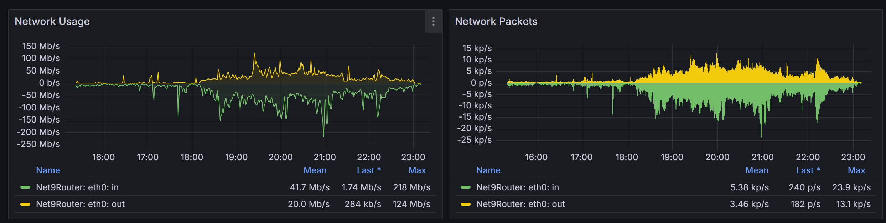

一年一度的学生节又来了, 由于计算机系再这样下去就要倒闭了, 显然是不太能找到接班人的, 于是今年的网也是我来弄. 在一年里面, 科协经历了风风雨雨 (什么), 去年的 WLC 现在已经没啦! (x), 学生节的网络也对应有一些调整.

<!-- more -->

## WLC

由于之前 , 我们的 5508 WLC 失去了公网地址, 后来干脆给关了. 我们从网上找了个 Cisco 9800 Series vWLC 的种子, 在服务器上部署了一个 vWLC. 9800 Series 和 5500 Series 的控制逻辑不太一样, 我找了亿点资料 (疑似没太看懂), 尝试配置了 vWLC. (Reference: [Cisco Docs](https://www.cisco.com/c/en/us/support/wireless/catalyst-9800-series-wireless-controllers/products-installation-and-configuration-guides-list.html))

CAPWAP 协议似乎希望隧道的两端是能够直接通信的. (i.e. 如果 WLC 的 IP 是 192.168.1.100 但是 DNAT 之后的公网 IP 实际上是 100.100.100.100, AP 的 IP 是 192.168.0.8, 那么 CAPWAP 实际上会汇报自己的私网 IP, 使得 AP 转而连接这个私网 IP. 因此需要一个隧道连接 WLC 与 AP, 否则 AP 连不上 WLC). 因此我们启用了部分 tinc 隧道, 打通了 AP 和 WLC.

## WLAN

鉴于之前大家都不怎么连接提供的 WiFi, 我们这次选择增加了 `Tsinghua-5G` 和 `Tsinghua-IPv4` 两个 SSID, 这样大部分的设备就可以无缝接入 "校园网" 了.

然后我试图手动调节信道, ~~不过由于我懒~~ 其实是因为 AP 不是我装的, 并没有记到底哪个 AP 被放在哪了, 所以信道调节纯靠瞎猜 (雾)

## Systemd-Networkd

在  的学生节网络配置里面, 我按照 *惯例* 使用了学长们的技术栈, 包括但不限于 `ifupdown` 等一众狗屎. 今年, 我找了个小朋友把这一套全改成 `Systemd-Networkd` 了. 同时我们的 tincd 也改成了只管 TAP 设备的建立, 不再管路由表的配置等事情, 而改由 systemd-networkd 接管.

## 交换机

去年把交换机分成了用户段, 内部段, 管理段三个段, 今年觉得好智障啊 --- 哪个用户来学生节啥的接网线啊 (x)

于是今年我们把它改成了内部段和管理段两个段, 管理段给 16 个接口, 也缓解了 6 个 AP 接 8 个口的有些挤的问题.

由于之前把交换机借给超算队用了, 我们推了交换机的配置重新配了一遍. 理论上的配置没有什么区别, 但是出现了一些我非常无法理解的问题:

去年的时候, 我们交换机之间连接的两条光纤可以 *自动链路聚合* (原因未知, 但是就是能用); 然而今年我这么试了一下然后就环路了...... 这使我十分无语, 我只好手动新建了 LAG 并配置了对应的 DHCP Snooping 等东西. 不过今年懒了一下, 上下两层之间我们只用了一根线, 反正也用不完.

## 实际情况

在学生节上面, 有同学抱怨部分位置有关联性问题. 我初步推测应该是 2.4GHz 信道干扰比较大导致的, 但是也没有什么好的解决方案. 今年我部署了 Grafana 监测, 画了一下曲线.

我们依然使用了 8 个 AP; 在峰值时用户数为 200 左右. 由于之前把某一个 AP 的发射功率调的比较高以覆盖台口, 在一段时间内这个 AP 承载了一半的用户. 当前的 TPC 是主要自动, 看上去可以手动拉高一些 (?) 效果会更好一点.

我们的两个假 Tsinghua 校园网上连接了一半的用户, 确实对很多同学做到了 "无缝接入校园网".

在总出口速度上, 看上去网络压力不大.

## 直播 & 弹幕

今年的弹幕机的工作模式跟去年不太一样. 今年我们采用了 **弹幕机直接输出, 由主投采集后去背景叠加** 的非常正确的工作模式. 这样取得了不错的效果.

今年的直播是请人来搞的. 学生会在学生节前一天注册了一个 B 站账号, 当天粉丝数没到 100 拿不到推流码, 差点播不出去 xs

他们请的人带了个推流的设备, 但是没有配套的软件, 在开始前一直在手输 150 字符的推流地址, 输进去还用不了; 而抖音则是干脆拿不到推流码, 只能用官方的推流. 后来学生节马上就要开始了, 他们还没调好, 我们紧急找了个小朋友的电脑 (幸亏上面恰巧有所有的软件) 开始推流, OBS 采集采集卡, 推流 + 录制 + 虚拟摄像头; 抖音用 OBS 虚拟摄像头推流. 推流码率 8Mbps + 3Mbps (又是用我们无线网推的, 绝了). 效果还不错.

学生节的直播回放如下:

<iframe src="//player.bilibili.com/player.html?isOutside=true&aid=113586651333680&bvid=BV1aazCYEE1W&cid=27155366088&p=1&autoplay=0" scrolling="no" border="0" frameborder="no" framespacing="0" allowfullscreen="true"></iframe>

虽然有些草台, 但是反正能用. 谁在乎呢?

## 工物学生节 (乐

工物他们今年也打算试行提供无线网. 不过物理系的同学给他们买了一个 TP-LINK **千兆 9 口 PoE AC 路由器三合一企业级网关*** *(\*: 带机量 100)* 当学生节无线网的路由器, 然后发现带机量不够, 遂找软院借了他们的祖传路由器当路由器, 把自己的当 PoE 交换机用, 顺面借了几个 AP, 又找我们借了写网线. 我去他们学生节, 一进去就发现他们弄了 8 个甚至 7 个 WiFi, 然后信道 *全是 161*. 遂让他们抓紧自动调信道. 没想到自动完了还是 *全是 161*. 我于是画了张草图, 把信道划分了一下, 让他们赶紧改, 没想到改到一半发现他们借的软院的 AP **不支持部分信道**. 于是又紧急改了个方案.

过了一段时间之后, 我发现完全上不去网, 实在受不了, 看了一眼信道, 发现 AP *全在 149 信道*...... 但是 **AC 上显示的 AP 信道都是按照我布置的方式错开的**, 即: 我们 **某厂商的起夜级设备存在跨代能搜索到但不兼容的现象**. 我可以理解要么跨代不兼容就完全不能用, 如思科的 3502 和 9800 WLC; 要么能搜到但是不允许使用部分功能, 给出明确的提示. 但是能搜到, 但是在无线信道分配这么 **基础的功能上出现显示的行为和实际行为不一致** 的原则性问题, 这是完全不能接受的. 后来我让他们把软院的 AP 都调到 149, 153, 157, 161 信道, 20MHz 频宽, 算是把信道错开了.

另外一个问题是他们自己的那两个大 AP 是从二楼直接往下打的, 这两个 AP 的信号远高于放在座位底下的祖传软院 AP. 因此尽管有 7 个 AP 是通电的, 80% 的设备都挤在两个 AP 上, 甚至出现了一个 AP 有 100 个设备的情况. 而当我们试图把这两个 AP 的设备数限制拉低的时候, 他们直接连接到了这两个 AP 的 2.4GHz 信道... 然后我们关掉了他们的 2.4GHz 信道, 然后设备全下线了 (难绷). 只能说, 不愧是起夜级设备.

由此可以推测, 三个放在二楼的 AP 就足以覆盖大礼堂的网了. 或许我们可以试试用 H3C 的设备更新换代一下呢?
