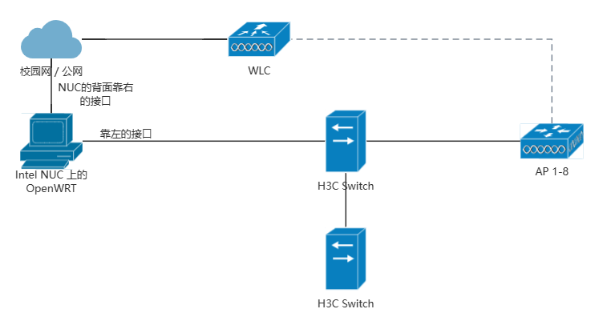

之前的几届用的都是学长留下来的方案. 我接手这个事情之后看了看学长的方案, 感觉有一些美中不足之处. 因此, 我在十一假期闲的没事的时候重做了一版路由方案, 在学生节前重做了一版 WiFi 方案, 在 ChaGPT 之前更新了一版方案.

这篇文章将尝试 (啊对, 我也说不准大家能不能看懂) 阐明, Ninetune 的网络是如何运作的.

<!-- more -->

## 前置知识

由于咱还没上网原, 所以这些知识大家不上网原也一定能看懂罢 (x

同样由于咱还没上网原, 很多东西讲的不一定对, 意思理解就行 (x

### NAT (Network Address Translation)

IPv4 地址是不够用的, 连接校园网也只能获取到 1 个 v4 地址. 底下有那么多设备要访问网络, 怎么办呢? 只有借助 NAT 技术. 我们用到的主要是 SNAT (源地址转换), 在向外请求的时候把内网地址转换为公网地址 (或者说, 上一级的地址), 维护这个流的状态信息, 使得相应的回包能够被正确转发给请求的设备.

学校只给一个 /128 的 IPv6 地址, 所以 v6 网也得 NAT.

### VLAN

有时候一根网线上希望走多个互不干扰的数据. VLAN 把一根网线分成若干根虚拟的网线, 同一个 VLAN 相当于互相连接的一张网.

## 网络架构

现在你已经知道这些前置知识了, 来看看活动网络的架构吧!



活动网的架构其实很简单. 有一个 NUC 充当路由器, 两台交换机互相连接, 下面挂着 8 个 AP (就是发射无线信号的东西). 是不是简单易懂啊 (x

接下来魔法要开始啦~

作为活动网络, 自然有一些特殊的需求. 

比如, 我们登录的账号是某位 *好心* 同学的账号. 如果有人在活动现场攻击学校的网, 导致被封号了怎么办? (bushi) 肯定有人要说, "除了你, 谁还干得出这种事情啊", 但是既然我都能干出这种事情那肯定会有别人这样干对不对 (bushi). 因此, 我们可能需要针对学校网做一些防护.

再比如, 在 Ninetune 的前一个小时左右, 如果你打开 login.tsinghua.edu.cn, 就会看到上面写着登录的咱的校园网账号, 还有一个叫做 "断开连接" 的按钮. 你按一下, **BOOM**!!! 学生节的弹幕下线了, 直播中断了, 所有人都没网了... 这种事情还是要避免的对不对.

再比如, 如果有人用学生节的网下载原神, 占用了大量的资源, 会不会导致直播出现卡顿? 因此, 我们需要给直播保障至少 50Mibps 的带宽......

因此, 经过一分钟的综合考量, 我划分了以下 VLAN:

- VLAN 10, Management. 192.168.0.0/24, 用于管理交换机和 AP
- VLAN 2, User, 192.168.32.0/21, 用于给用户上网
- VLAN 3, Faculty, 192.168.64.0/24, 用于承载弹幕, 直播等后台业务

## 路由配置

整个网络的路由是在 NUC 上面的一台 Debian 虚拟机上进行的.

### 转发

作为路由器, 最基础的功能至少要能把数据包转发出去. Linux 的 **默认行为** 是会 *吃掉* 所有与它无关的数据包. 为了满足路由的需要, 就要把IPv4, IPv6 的转发统统打开. 这样路由器才有最基础的交换功能.

```text
net.ipv4.ip_forward=1
net.ipv6.conf.all.forwarding=1
net.ipv6.conf.all.accept_source_route=1
net.ipv6.conf.all.accept_redirects=1
```

### 网口

然后就是网口的配置了. NUC 正好有两个物理接口, 一个接校园网一个接活动网刚刚好.

#### 上行

首先看接校园网的网口吧. 校园网 (有线) 的 IPv4 和 v6 地址都是 DHCP 分配的, 网口上相当于一个 DHCP Client. IPv4 的接口配置相当简单, 一行就完事了:

```text
iface eth0 inet dhcp
```

IPv6 的就复杂一些. ICMPv6 规定了 Router Announcement 报文用于通知数据包如何转发. 但由于 IPv6 转发是开启的, 为了防止自己的 IPv6 路由被绑架, 必须显式设置 `accept_ra=2`, 使得 Linux 接受学校的路由器给的路由. 而且, 由于 DHCP Client 的一些 Bug, 如果 IPv6 的子网变化很大 (比如我宿舍的宽带是 `240e:` 打头, 校园网是 `2402:` 打头), 那么 DHCP Server 不会回复 NAK 信息 (而是直接丢弃), 此时 Client 只会继续发 Confirmation, 不发送 Discover 消息, 多次 Confirmation 失败之后就停了. 所以有时候需要手动强制重新获取 IPv6 地址. (感觉讲的不甚清楚).

```text
iface eth0 inet6 dhcp
    accept_ra 2

    # 下面两行用来解决 ifdown 的时候 ipv6 地址依然保留导致获取不到新地址的问题
    post-up dhclient -6 eth0 -v
    pre-down dhclient -6 -r eth0 -v
```

#### 下行

往下走就比较麻烦了. 首先是 VLAN 的问题. 要把一个接口拆分成多个 VLAN 虚拟接口. 比如下面一行定义了 eth1 上 VLAN 10 的接口:

```text
auto eth1.10
```

然后是 IPv4 的地址设置, 使用静态 IP, 没有默认网关 (自己就是网关):

```text
iface eth1.10 inet static
    address 192.168.0.1
    netmask 255.255.255.0
```

然后是 IPv6:

```text
iface eth1.10 inet6 static
    address fd30:5341:5354:0::1
    netmask 64
```

以此类推定义三个 VLAN 的接口, 这部分就算完成了.

### DHCPD

如果到此为止, 那么你的手机电脑连上 WiFi 是没办法获取 IP 的, 需要手动设置. 因此对于 v4 网, 我们需要配置 DHCP Daemon (Server) 来使得设备能够自动获取到 IP 地址. (就像我们获取家里 WiFi 的 IPv4 一样)

我使用的 Server 是 `isc-dhcp-server`. 先告诉 ta 要为哪些网卡进行监听:

```text
INTERFACESv4="eth1.10 eth1.2 eth1.3"
```

