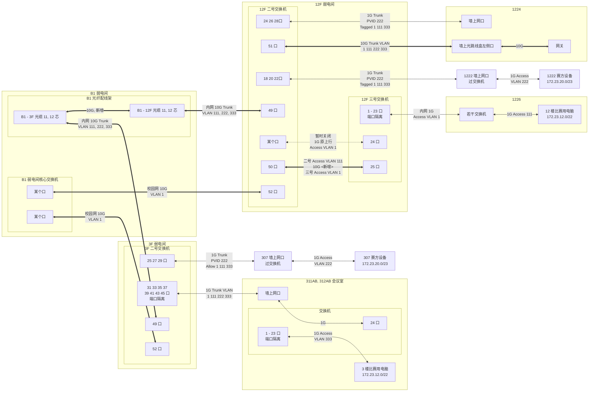
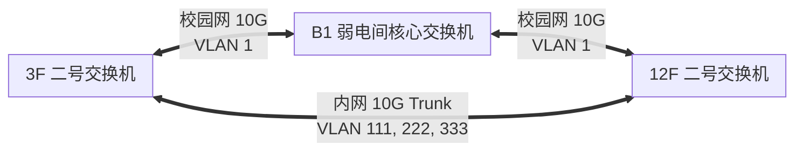

两三个星期前, 杨敬找到我, 问我有没有时间. 我当时就觉得不妙, ~~肯定没好事~~ 肯定又是什么东西要配网了 (我真不想用那一套老掉牙的思科了). 我没有拒绝 (这学期事情也不是太多吧, 你清可能也确实找不到另外一个有我这个资源, 经验和手段的人...), 于是我就糊里糊涂变成了网络负责人. THUPC *圆  满  结  束* 了, 是时候做一个总结了.

<!-- more -->

## 网络设计与施工



在这样的布局下, 我们可以以万兆的速度把 3 楼和 12 楼的设备都连接起来, 统一用一个网关管理. 不过在赛前网络调试的时候确乎是出现了一些问题. 最大的问题是自强楼的网络被系里认为是 , 说什么也不让我自己调 (不给权限), 整了个信息化的老师来 (不过到头来是两个人一起调, 交叉验证的), ~~但是我俩都菜~~, 配置有一些小问题只能远程让老师救火.

### Hybrid Port

一开始, 我想折腾一下 *Hybrid Port* (其实是被各种交换机的不同叫法搞混了), 于是把到 1224 的口配成了 Hybrid 模式. 但是我似乎错误地配置了 Hybrid 模式, 最后不通 (问题: 楼层交换机我没有权限) (但是我觉得我调的是对的).

```sh
interface Gi1/0/24
  port link-type hybrid
  port hybrid pvid vlan 222
  port hybrid vlan 1 111 333 tagged
```

后来我紧急跟老师打电话, 给改成了 Trunk 模式, 然后就通了 (但是为什么呢... 我觉得这两个是一样的啊?)

```sh
interface Gi1/0/24
  port link-type trunk
  port trunk pvid vlan 222
  port trunk permit vlan 1 111 222 333
```

### STP

这一段是更有意思的 (更具教育意义的). 我们回看上面的图, 会看到在物理连接上面实际上有个环.



根据配置, 这个 "环" 由于 VLAN 选通的缘故, 并不会造成任何逻辑上的环路. *但是*, 所有交换机都开了 MSTP, 核心交换机 (STP 根) 打开了 MSTP. 由于我听说 MSTP 可以 VLAN-aware, 因此我在一开始配置的时候忽略了 STP 可能导致的问题. 周五配网的时候发现 3 楼通不了一点, 和老师打电话远程调试的时候突然发现如此. (所以搞网络这事真的没有技术全是经验x)

补充: [MSTP 确实可以 VLAN-aware](https://www.h3c.com/en/Support/Resource_Center/HK/WLAN/Access_Controller/H3C_WX3000/Technical_Documents/Configure___Deploy/Configuration_Guides/H3C_WX3000_CG-6W103/201007/685284_294551_0.htm) 但是需要额外配置 (额外配置这个有全楼断网风险, 因此当时也没有考虑).

解决方案是确认了构型没有风险后将新接的这个线的两侧端口的 STP 给禁用了.

### 隔离

为了给选手的网保证安全性, 显然是不能让选手间互相访问的. 因此, 要给选手的机器间做二层隔离 (port-isolation). 然而非常不幸的问题是这个 *port*-isolation 顾名思义是以 port 为粒度的, 也就是说不能只给某一个 port 的某一个 VLAN 用. 因此我们没法对 3 层和 12 层间做端口隔离, 不然我们的内部 VLAN 就也遭殃了. 因此, 我干脆给 3 楼的选手单独开了一个 VLAN (333), 而 12 层的用 VLAN 111, 在网关上的 vlan-interface 之间做 isolation. 这个就满足了按 VLAN 粒度的隔离.

### 网关

我们这次勉为其难的用了光纤 + SFP+ 的万兆网关 (主要的 Concern 是电口会不会不稳定), 我找算协要了一个能插 PCIe 万兆网卡的机器. 然后这次比赛的锅就从这里开始了.

本来周五我去调试网络, 我的预期是花费时间最多的是调 12 楼的 14 台交换机. 然而, 实际上, 当我把 U 盘插进机器之后, 我发现机器的默认启动项是硬盘 (显然). 因此我决定进 BIOS 调启动顺序. 但是神奇的事情发生了! 进了 BIOS 之后一小段时间, USB 键盘就统统失灵了, 整个机器只有一个电源键能按, 而且 **两台电脑都是如此...** 后来我实在绷不住, 直接放弃了 BIOS, 按 F12 选 U 盘了. 这样的坏处就是没法自恢复, 万一断电需要手动介入 (Anyway, 反正我得搁这儿待着.).

在网关上照例配了 systemd-networkd, 用了 iptables (懒得写 nftables), 测试正确后就算大功告成了. 防火墙比起上次去 CodeLink 要简单些, 但是增加了源地址验证, 不允许互访, 只允许访问 OJ 的 IP (刚刚看到才发现我忘记 ctstate new 了, 因此除了网关, 管理网的其他人也访问不了选手的机器, 这下更安全了xs)



```sh
#! /bin/bash

ipt() {
	iptables $@
}

ipt -F
ipt -t nat -F

ipt -P FORWARD DROP
ipt -P INPUT DROP

# Reject private address space
iptables -N BLOCK_PRIVATE
iptables -F BLOCK_PRIVATE
iptables -A BLOCK_PRIVATE -d 10.0.0.0/8 -j REJECT --reject-with icmp-admin-prohibited
iptables -A BLOCK_PRIVATE -d 172.16.0.0/12 -j REJECT --reject-with icmp-admin-prohibited
iptables -A BLOCK_PRIVATE -d 192.168.0.0/16 -j REJECT --reject-with icmp-admin-prohibited
iptables -A BLOCK_PRIVATE -d 127.0.0.0/8 -j REJECT --reject-with icmp-admin-prohibited
iptables -A BLOCK_PRIVATE -d 169.254.0.0/16 -j REJECT --reject-with icmp-admin-prohibited
iptables -A BLOCK_PRIVATE -d 224.0.0.0/4 -j REJECT --reject-with icmp-admin-prohibited
# END

ipt -A INPUT -m conntrack --ctstate ESTABLISHED,RELATED -j ACCEPT

ipt -A INPUT -i inner-net -j ACCEPT
ipt -A INPUT -i enp2s0f1 -p tcp --dport 22 -j ACCEPT

# DHCP
ipt -A INPUT -p udp --dport 67 -j ACCEPT

# DNS
ipt -A INPUT -p udp --dport 53 -j ACCEPT

# TFTP, HTTP
ipt -A INPUT -p udp --dport 69 -j ACCEPT
ipt -A INPUT -p tcp --dport 80 -j ACCEPT

ipt -A INPUT -p icmp -j ACCEPT


ipt -A FORWARD -m conntrack --ctstate ESTABLISHED,RELATED -j ACCEPT

ipt -A FORWARD -i comp-net ! -s 172.23.12.0/22 -j DROP

# Competition firewall
ipt -A FORWARD -i comp-net ! -d 81.70.214.95 -j REJECT --reject-with icmp-admin-prohibited
ipt -t nat -A PREROUTING -i comp-net -p udp --dport 53 -j DNAT --to-destination 172.23.12.1

ipt -A FORWARD -s 172.23.12.0/22 -j BLOCK_PRIVATE
ipt -A FORWARD -s 172.23.12.0/22 -j ACCEPT 
ipt -A FORWARD -i inner-net -j ACCEPT


```



### 机器

然后就有人要问了, Ajax, 你哪找的这么多机器啊?

答: 我把科协办学生节的交换机薅来了 (24 口 * 2), 然后厚着脸皮找信息化中心的老师借了 4 台 8 口的网管交换机, 还白嫖了几根光纤; 又用上了之前想给自强楼机房的机器用的淘宝 30 一个的万兆光模块和从 Harry 学长那白嫖的万兆网卡 (乐). 主打一个到处借 xs

然后在周四的时候我突然想到他们租借机器的时候要的是 1.5m 的网线, 楼下可能不够长; 于是紧急京东自营购买了 25 根 5m 网线 (后来疑似用处还不小).

## 第〇天, 设备测试

### 选手的电脑

周五晚上, 租借的电脑和用来直播的手机都到了, 这时候管选手电脑系统的 cmf 突然跑来问我, "你作为服务器的管理员, 你有统一管理选手电脑的办法吗?". 我听完之后一脸问号. 我? 服务器? 控制选手电脑??? 我不就是把网调通就行了, 我怎么变成服务器的管理员了?

于是在一番问号之后, 我发现他认为我部署了网关, 就 *理应* 拥有控制网关下所有设备的方式. 对此我黑人问号脸.jpg . 要是这样那还得了? 再说了, 你管选手的电脑还是我管选手的电脑啊... 你自己做 ISO 的时候不把远控的东西上上去, 现在来问我要? (要是真有这样的手段, 你清校园网不就变成巨大 Botnet 了)

于是得出的解决方案是, 要么 PXE 统一给选手的电脑刷系统; 要么一个个给选手的电脑装 SSH Server. 本来他倾向于 PXE, 但是发现选手电脑的默认引导项是硬盘, 要是要 PXE 又得一个个改 BIOS. 但是他没有屈服, 而是义无反顾地让我调 PXE Server. 我问了一下 GPT 然后开始猛猛看 iPXE 的文档, 然后完全失败, 起不起来 NOI Linux 的 ISO. 这之后我就去 3 楼调网 + 喝奶茶了 (xs), 他继续义无反顾地调 PXE. 后来他放弃了, 转而让志愿者一个个起 SSH 了.

### 直播的手机

然后周五的时候负责直播的同学简要测试了 Zoom 直播, 觉得非常好!!! 然后就决定不测试了! 直接等周六.

## 第一天上午, 设备调试继续

### 选手的电脑

由于前一天晚上并没有把电脑调明白, 第二天上午, 我首先干的事情是找了几个志愿者, 一个个检查电脑的网线是否插紧了且接触良好, 把所有有接触问题的网线全换了. 这之后, 我就听到了 cmf 那边传来噩耗, 说他统一 SSH 操作的时候部分电脑没能操作成功. (这时候我们还没有每一台电脑具体的 IP 信息, 因此只能知道 "啊, 有 3 台电脑没成功", 但是具体是哪三台不知道.) 然后就是漫长的检查每一台电脑是否正确接受了下发的配置环节 (我有点绷不住这个). 后来他决定 reboot 电脑检查, 然后猛然发现自己让志愿者 `start` 了 SSH server 但没有 `enable`. (无敌了, 真的) 于是又统一下发命令 `systemctl enable ssh`; 他也不配置公钥登录和免密码 sudo, 就搁那一直输密码 (我是真的懒啊), 于是上午感觉十分低效.

最后在 12:30 的时候总算是确认了 93 台机器全部上线, 配置全部变更到位 (其实没有到位...) (使用了 [Ansible playbooks](https://docs.ansible.com/ansible/latest/playbook_guide/playbooks_intro.html)), 总算是能让选手用了.

这时我实在受不了了, 我让所有电脑切到 `tty2` (`chvt 2`), 然后往里面写了电脑的 IP (`bash -c 'ip a | grep 172.23 > /dev/tty2'`), 然后拿着布局图一个个把位置 - IP 给抄下来了. (cmf 表示, 你这是闲的)

### 直播

上午用 Zoom 的时候发现原来一个账号并不能同时登录太多设备, 于是他们紧急新建 Zoom 账号; 总之是一片混乱. 然后大家突然发现选手的电脑有摄像头, 但是这不重要了, 毕竟手机都租了.

## 第一天下午, 试机赛

### 选手的电脑......

下午我突然惊奇的发现, 选手的电脑有 Wi-Fi, 蓝牙和声音. 于是我又紧急搜索如何禁用这些东西. 蓝牙和 Wi-Fi 通过卸载响应的内核 Module 成功禁用; 然后通过 blacklist 对应的 module 实现了持久化; 而声音我至今没有调明白 (疑似是因为这些模块是内置的, 没法 blacklist? 反正 blacklist 没有生效.)

然后, 在选手试机的过程中, 我隐藏了内部账户的 GDM 登录选项, 打开了免密码 sudo 和 pubkey auth.

### 与此同时...

选手们发现自己并不能入校, 即便报备过了. 于是他们一团乱麻在门口接选手, 其他的事情全不管了.

### 打印机 & 气球

上午的时候 s 终于来了 (本来说周五晚上 7 点前弄好的, 但是我当时表示不能保证网能好; 后来网倒是好了, 打印服务没人管了) 把 12 楼的打印服务起起来了, 简单调试过后人就消失了. (他展现出了对自己写的服务的绝对自信, ~~出锅了一定是网的问题~~) 然后连接打印机失败, 打印机最后直接连接了内部网.

志愿者都去折腾入校了, 自然是没人管气球的事, 但是 Anyway.

## 第一天晚上, 调试直播

试机赛结束后, 晚上我们全部重启电脑, 删掉试机赛账户, 新建正赛账户. 过程中有一台电脑卡死了, 于是查IP 直接点名. (还是有点用).

晚上调试直播机位, 之后发现试机赛拍照的时候人和队伍没有直接对应, 只能靠 *人脸识别*. 于是一堆 *人工* *智能* 在考务室盯着电脑看, 一个一个找队伍. 期间我觉得网上的图片实在有些糊, 于是发挥了 *我最会爬了* 技能, 10min 搓了个爬虫, 把大图爬到本地来了. 后来我就回寝室开始写这篇博客的开头了 (然后就去研究 SEO 了xs).

## 第二天上午, 开赛!

于是转眼到了第二天, 过去之后检查了所有机器通网, 然后我就想坐着休息了.

但是好景不长, 开赛前, 抓紧吹签到题的气球; 然后打印服务没人看着, 只好我去看着打印机了. 期间经历了吹气球的人不够, 气球杆有粗有细等各种神奇问题; 然后又经历了打印机卡纸等诸多突发情况; 眼看着就中午了.

然后我们发现气球的单子上的东西怪怪的, 后来 s 跑过来重启服务, 表示这是因为忘记判断选手是否 AC 了, 扬言要把从头开始的所有气球都打一遍, 要我们依次核对, 被直接拒绝后放弃, 转而重启服务后仅获取较新的几分钟的数据, 算是收拾了这个烂摊子 (然后 cmf 和 s 就开始吵架了).

## 第二天中午, 开摆!

中午午饭来了, 选手们纷纷打印题目, 吃饭的时候看. 于是这个激光打印机啊, 他开始过热冷却了...... 我预感到事情不对, 抓人给 s 打电话时正巧打印机彻底爆炸重启, 打印功能失效, 于是不得不把打印任务都丢给 3 楼的打印机. 然后我重启了打印机, 打印了作业报告, 然后要求补齐中间漏掉的文件, 然后打印队列就继续排长队了. 一整下午, 打印机队列排了 15min 长, 我一整个开摆了.

## 第二天下午, 收拾东西

后面就没啥大事, 比赛结束后收拾了 3 楼和 12 楼的手机, 线, 插线板, 交换机; 清除配置, 恢复网络, blablabla. 网络没有出锅, 在我意料之中.

## 第二天晚上, 开吃!

本来说要开批斗会的, 但是疑似时间晚了, 于是快进到工作人员吃海底捞去了, 一边吃一边讨论为啥有这么多锅. 得出的结论疑似又是那个老生常谈的问题: 技术断代... (?)

But Anyway, 5 月份我也从科协退休了, 只要不倒闭在我手上, 关我何事?

## 不过呢

虽然看上去虽然我们觉得有一坨锅, 但是选手的评价还不错. 确实, 没断电, 没断网, 题目没出错, OJ 没崩, 所有的东西虽然一坨, 但是 it just works. 所以 anyway, 这依然是一次成功的比赛, 不是嘛?
