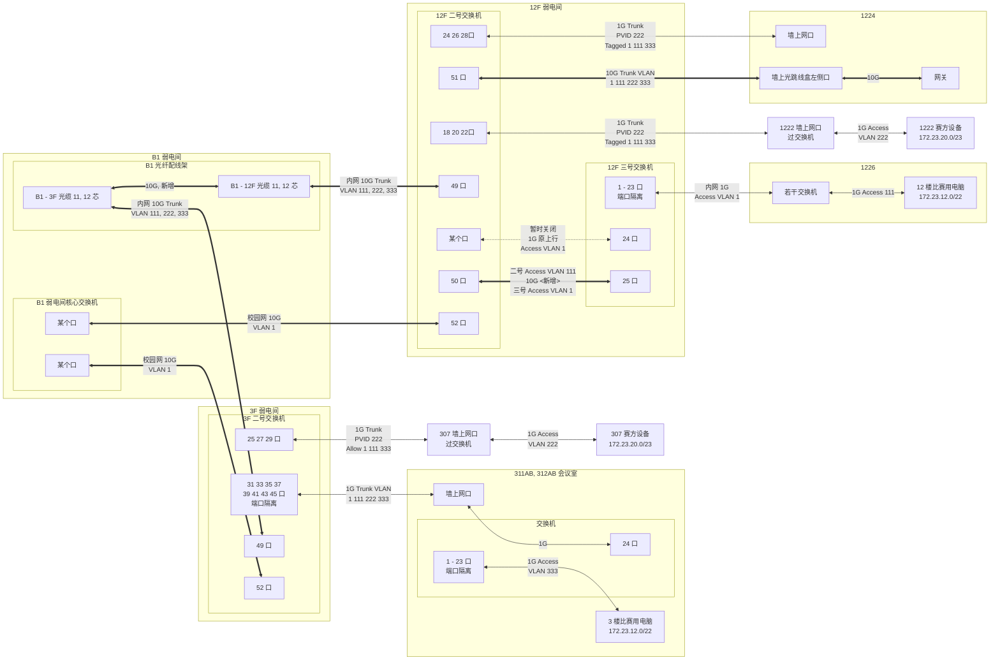
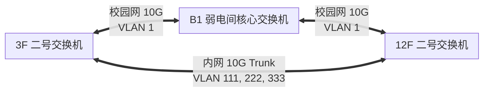

两三个星期前, 杨敬找到我, 问我有没有时间. 我当时就觉得不妙, ~~肯定没好事~~ 肯定又是什么东西要配网了 (我真不想用那一套老掉牙的思科了). 我没有拒绝 (这学期事情也不是太多吧, 你清可能也确实找不到另外一个有我这个资源, 经验和手段的人...), 于是我就糊里糊涂变成了网络负责人. THUPC *圆  满  结  束* 了, 是时候做一个总结了.

<!-- more -->

## 网络布局



在这样的布局下, 我们可以以万兆的速度把 3 楼和 12 楼的设备都连接起来, 统一用一个网关管理. 不过在赛前网络调试的时候确乎是出现了一些问题. 最大的问题是自强楼的网络被系里认为是 , 说什么也不让我自己调 (不给权限), 整了个信息化的老师来 (不过到头来是两个人一起调, 交叉验证的), ~~但是我俩都菜~~, 配置有一些小问题只能远程让老师救火.

### Hybrid Port

一开始, 我想折腾一下 *Hybrid Port* (其实是被各种交换机的不同叫法搞混了), 于是把到 1224 的口配成了 Hybrid 模式. 但是我似乎错误地配置了 Hybrid 模式, 最后不通 (问题: 楼层交换机我没有权限) (但是我觉得我调的是对的).

```sh
interface range Gi1/0/24
  port link-type hybrid
  port hybrid pvid vlan 222
  port hybrid vlan 1 111 333 tagged
```

后来我紧急跟老师打电话, 给改成了 Trunk 模式, 然后就通了 (但是为什么呢... 我觉得这两个是一样的啊?)

```sh
interface range Gi1/0/24
  port link-type trunk
  port trunk pvid vlan 222
  port trunk permit vlan 1 111 222 333
```

### STP

这一段是更有意思的 (更具教育意义的). 我们回看上面的图, 会看到在物理连接上面实际上有个环.



根据配置, 这个 "环" 由于 VLAN 选通的缘故, 并不会造成任何逻辑上的环路. *但是*, 所有交换机都开了 MSTP, 核心交换机 (STP 根) 打开了 MSTP. 由于我听说 MSTP 可以 VLAN-aware, 因此我在一开始配置的时候忽略了 STP 可能导致的问题. 周五配网的时候发现 3 楼通不了一点, 和老师打电话远程调试的时候突然发现如此. (所以搞网络这事真的没有技术全是经验x)

补充: [MSTP 确实可以 VLAN-aware](https://www.h3c.com/en/Support/Resource_Center/HK/WLAN/Access_Controller/H3C_WX3000/Technical_Documents/Configure___Deploy/Configuration_Guides/H3C_WX3000_CG-6W103/201007/685284_294551_0.htm) 但是需要额外配置 (额外配置这个有全楼断网风险, 因此当时也没有考虑).

解决方案是确认了构型没有风险后将新接的这个线的两侧端口的 STP 给禁用了.


<!--

批斗会

- 事前预案严重不足 <-- 我不管什么 DDL 啥的, 早干嘛去了
- 关键人员不在场 <-- 干啥去了?
- 试机赛管理完全混乱
- 自强楼纯纯傻逼


整体上:

- 网络没有锅
- 对机器到底长啥样的了解不够, 但是没啥大锅
- 气球有些抽象 (主要是 12 楼和 3 楼导致的) (外加激光打印机)
- 好吵 (x) 感觉脑袋大

-->