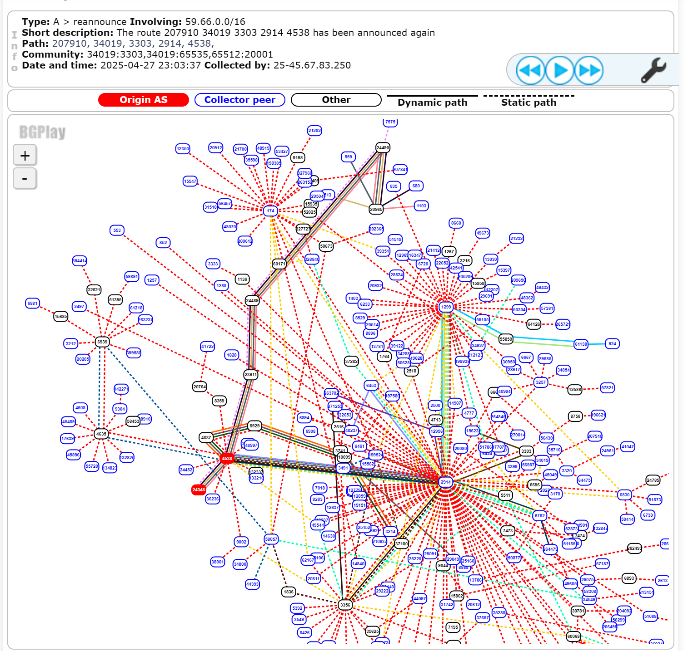

在过去的两个月里我系统性的对我 (其实是我们实验室) 感兴趣的部分目标进行了细致的网络测绘, 以期更好地理解其网络结构和运行方式, 找到潜在的问题, 指导未来的研究与工程实践. 在此过程中, 我写了一大坨功能各异的脚本, 使用了各种工具, 遇到了一大堆的问题, 积累了一些经验. 本文希望记录这些问题, 免得自己忘了. 此工作尚未发表, 因此这里隐去我们的实际的目标, 仅对方法和工具做讨论.

这篇文章可能会随着进一步的测绘工作而持续更新.

<!-- more -->

## 网络测绘的思路

所谓网络测绘, 首先我们希望弄清楚这个网络的拓扑结构, 也就是路由器 / 核心交换机之类设备在网络层的连接关系; 其次, 我们希望了解网络内的路由策略, 各个设备的特性; 再次, 我们希望了解网络的性能. 通过这些信息, 我们可以对网络的运行状态有一个大致的了解, 进而判断网络是否存在问题, 以及问题的性质. 当然, 这些信息也可以帮助我们更好地设计和优化网络.

由于我们在网络层, 很多时候看不到底下的物理连接, 因此有时候如果对方使用了一些神奇的操作 (比如看上去是公网的 IP 不唯一), 它可能使得网络测绘的结果看着不 Make Sense, 或者各个测量方式得到的结果无法相互印证, 产生冲突, 因而需要我们人为介入想出更好的方案.

网络测绘很多时候有一个 Aha Moment - 在得到了足够多的乱七八糟的结果后, 你突然灵光一现, 这时你发现之前的所有看上去难以理解的结果都能解释得通了. 这是一个充满成就感的时刻~

## 网络测绘的工具

### Traceroute

Traceroute 这是一组经典的网络测绘工具. 在 Linux 上, 有 `traceroute`, `tracepath` 和 `mtr` 三个常用的方案. 在我的使用经验看, mtr 由于可以输出格式化的数据, 写脚本的时候比 traceroute 和 tracepath 更为方便. `tracepath` 可以做 MTU 探测, 这个对部分使用场景是个很好的功能.

此外, `nmap`, `zmap` 等工具也有 traceroute 的功能, 后面说.

mtr 可以一次性接受多个目标地址, 但是 *不能太多 (<50)*. 我在给 mtr 扔了 1000+ 个地址之后 mtr 跑到一半炸了 (Too many open files), 到时候我尝试复现一下给个 Issue.

另外, mtr 默认用 ICMP 做 traceroute; tracepath (和 traceroute? 没研究, 待确认) 默认用 UDP. 这可能会导致不一样的结果表现. 比如某个路由器回复 ping 但丢弃 UDP 包, 这时候用 mtr 能正确看到目标, 但是用 tracepath 就会卡在倒数第二跳, 后面全是 `* * *`.

另外, mtr 的 interactive 界面会显示一些额外的信息, 比如如果收到了 No Route to Host 的回复, 只有 interactive 界面能看出来, 其他的输出格式都看不到.

### Nmap

Nmap 可以说是赫赫有名的端口扫描器. 不过在这里我们不用它扫端口, 而是用它做 Traceroute 和 ping 测试.

通过 `--min-rate`, `-n`, `--min-parallelism` 等参数我们可以将 Nmap 的扫描速度拉高, 来快速获得结果. 但是需要注意的是如果速度太高, Nmap 的结果可能不准确.

可以通过 `--traceroute` 来指定让 Nmap 做 traceroute. 可以通过 `-sn` 和 `-n` 来让 Nmap 只做 traceroute. 这里其实有亿点大坑:

>     --traceroute (Trace path to host)
>
>         Traceroutes are performed post-scan using information from the scan results to determine the port and protocol most likely to reach the target. It works with all scan types except connect scans (-sT) and idle scans (-sI). All traces use Nmap's dynamic timing model and are performed in parallel.
>
>         Traceroute works by sending packets with a low TTL (time-to-live) in an attempt to elicit ICMP Time Exceeded messages from intermediate hops between the scanner and the target host. Standard traceroute implementations start with a TTL of 1 and increment the TTL until the destination host is reached. Nmap's traceroute starts with a high TTL and then decrements the TTL until it reaches zero. Doing it backwards lets Nmap employ clever caching algorithms to speed up traces over multiple hosts. On average Nmap sends 5–10 fewer packets per host, depending on network conditions. If a single subnet is being scanned (i.e. 192.168.0.0/24) Nmap may only have to send two packets to most hosts.

这是 Nmap 的文档. 可以看到, Nmap 的 traceroute 有以下特点:

- 根据 scan type 的不同, Nmap 可能用 ICMP, UDP 或 TCP 进行 traceroute.
- 首先, 它是从 TTL 高到 TTL 低进行 trace 的, 它的计算方式类似于, 我用一个 TTL=255 的包, 看返回的包的 TTL 是多少; 然后由于大部分设备的返回的包的 Initial TTL 是 64, 128 或 255, 我可以算出这个设备距离我有多远. 然后我用这个算出来的值再依次向下 ping, 直到得到完成的路由.
- 这样一来, 由于我是从远到近进行 traceroute, 如果我在途中遇到了和之前一样的跳, 那我就可以认为这之前的跳都是相同的了, 因此我不再需要继续 trace 了.

是不是觉得 Nmap 很聪明? 然后我就被坑了一大把.

#### 我想知道那些不活跃的 IP 的 Trace 怎么办?

一开始的时候, 我在 IPv4 里面, 我想着反正就那么几千个地址, 直接全 trace 了就完了. 因此我使用了 `-Pn` (No Ping, Assume Alive) 参数. 结果 Nmap 扫了一万年... 这是因为如果一个设备 *不响应* ping 请求, 那么 Nmap 就会从 TTL=255 开始依次往下发包 (具体的 Sequence 没有研究), 每一个包都得等超时, 因此巨慢无比, 还不如正常做 trace.

#### 我的结果怎么和我想象的不一样?

我们发现 IPv4 的此目标存在好几层 NAT, 而 IPv6 的都是 GUA. 因此我们选择了用 v6 测绘, 以期得到更好的效果. 其中 IPv4 的长这样:

IPv6 的对应路由大概长这样

我们注意到了这个倒数第二跳的 IPv6 是通过 IPv4 的直接映射. 这个网段虽然是 GUA 地址, 但是 **并不是全球可达的**.

我在使用 Nmap 进行大规模扫描并 Traceroute 归类时, 出现了意料之外的现象, 有些 IP 看上去被错误归类了, Nmap 扫描结果的路由与 mtr 得到的路由相去甚远, 甚至在地球相对的两级, 一个说在非洲, 一个说在北美. 后来发现, Nmap 在 Traceroute 得到类似 `2001:db8:ffff:172:16:250:1/127` 的一跳之后, 由于此地址在全球 *不唯一*, Nmap 没有继续扫描前一跳, 而是与之前看到的路由进行了合并, 造成了错误.

即: 在大批量使用 Nmap 进行 Traceroute 时, **必须确保所有可能出现的中间跳地址在整个样本中是唯一的**. 即, 假如你的样本中包含 10 个簇, 每个簇之间可能存在 IP 地址的不唯一性, 而簇内的 IP 是唯一的, 那么你应当 **对每一个簇进行一个独立的 Traceroute**, 而非对整体进行一个 Traceroute.

#### 我的结果怎么看上去缺少一些细节?

基于同样的道理, 如果存在以下形状的拓扑:

如果实际的路由 (常常由于负载均衡导致) 是: `A1 -> B1 -> C1, A1 -> B2 -> D1, A2 -> B1 -> C2, A2 -> B2 -> D2`

那么 Nmap 的结果将是 (假设扫描顺序是 `C1, C2, D1, D2`): `A1 -> B1 -> C1, A1 -> B1 -> C2, A1 -> B2 -> D1, A1 -> B2 -> D2`, 即:

可以看到这个拓扑甚至可以说是 *不正确* 的, 因为看上去 IP 数量都变少了. 也就是说, 并不建议使用 Nmap 对网络的精确拓扑进行扫描, 它只能看个大致.

### ZMap

[ZMap](https://zmap.io/) 是一个研究性的网络探测的工具, 由于这个 "研究性" 的特性, 它实际上做得有些粗糙. ZMap 可以越过 Linux 的网络栈, 直接操纵接口, 往上面发数据, 因此可以达到远超 Nmap 等工具的扫描速度. 官方介绍其可以 "吃满千兆链路在 1h 内扫完 IPv4 的整个地址空间". 但是当你把它 clone 下来编译好 (或者使用包管理器安装) 之后就会发现... ZMap 不支持很多 IPv6 功能. 于是又有团队把 Zmap 往 v6 上 port 了 ~~水了一篇论文~~ [ZMapv6](https://github.com/tumi8/zmap), 但是依然有很多问题 (比如我家的宽带是 PPPoE, 上面走的是 IP 包而不是 Ethernet 包, 然后 ZMap 就无法正常运行)

由于以上的原因, 我并不经常使用 ZMap, 因此这里到此为止 (

### Python ... ?

为什么要把 Python 放在这里呢? 因为当所有工具都多多少少有些奇怪的问题的时候, 是时候手搓工具了! Python 有一个叫 Scapy 的包, 可以手动发任意包, 也可以收对应的回包, 因此可以自行实现 Traceroute 的功能.

此外, 把 100000 条 Traceroute 数据处理成人能看懂的样子也不得不使用 Python.

## 网络测绘的平台和网站

### RIPE Atlas

[RIPE Atlas](https://atlas.ripe.net/) 是一个可以用于网络测绘的网站, 可以很方便地用上面的全球各地的 Probe 做 ping, traceroute, DNS Lookup 等等, 也可以找上面已有的公开数据来使用. 它有 API 文档, 可以看.

### RIPEstat

[RIPEstat](https://stat.ripe.net/) 是 RIPE NCC 的用于研究 BGP 协议的 Looking Glass, 从这里可以看到几乎实时的 BGP 情况, 它的 [BGPlay](https://stat.ripe.net/widget/bgplay) 工具提供了简单直观的检查 BGP 路由的方式.

### PeeringDB

[PeeringDB](https://www.peeringdb.com/) 记录了大量 IXP (Internet eXchange Provider) 的信息和连接了哪些 AS.

## 一些问题与经验

### 网络测绘是以设备 (逻辑设备) 为中心的

这件事很重要. 网络测绘的中心是设备, 而非 IP 地址. 我们期望看出的是每一个 *设备* 的功能和每一个设备关联了哪些 IP. 尤其在骨干网上, IPv4 常常成 /31 出现而 IPv6 常常成 /127 出现, 这时更需要我们搞清楚 IP 与 *设备* 的关系. 一个经典的例子是:

如果按照 IP 的特征来分辨, 很容易把 `2001:db8:bfe::/64` 归为一类, 进而分不清网络功能; 必须认识到**要以设备为中心**, 画出设备图, 才能明确拓扑.

### Traceroute 究竟能看到多少东西?

其实从 Traceroute 这件事里面我们能看到很多东西 (真的很多!) 最基础的:

- 每一跳的地址. 一般来说, 网络设备在发现 TTL 不够之后会以 *数据包的入口地址* 为源地址返回 TTL Expired 消息, 因此一个单向的 Traceroute 可以获知去程路径上的所有入口的 IP.
- 每一跳的 RTT. 其实并不准确, 因为对于那些很忙的核心路由器, 它的 ping 和 TTL Expired 的处理优先级很低, 因此一个包可能在路由器上停留相当长时间才会返回.

但是实际上 Traceroute 能提供的不止这些, 还有:

- ICMP Extensions, 如 MPLS. 在 MPLS 隧道中 Expire 的那些包, 其 TTL Expired 信息最后会附带 MPLS 隧道的 Lbl (Label) 等附加信息.
- 回程 TTL, 可以检查收到的 TTL Expired 消息的 TTL, 以检查路由是否对称. 大部分设备都以 64, 128 或 255 作为发送包时候的 TTL, 因此 Traceroute 的一跳不仅可以知道从测试者到这台设备有几跳, 也可以知道这台设备回到测试者有几跳. 两者可能并不相等.
- 如果没能到达目的地址, 还可能返回注入 Destination Unreachable, Admin Prohibited 等状态, 这常常代表着更多的信息.

可以说, 我折腾了这么久, 90% 的数据是 Traceroute (太好用了, 也没啥别的可以用)

### MPLS 是什么东西

[Cloudflare 对 MPLS 有一个解释](https://www.cloudflare.com/learning/network-layer/what-is-mpls/), MPLS 在 IP 层下, MAC 层上, 是一个轻量级的路由协议, MPLS 包直接按照 MPLS 头来选择转发的出口.

[Cisco 也有文档](https://www.cisco.com/c/en/us/td/docs/switches/lan/catalyst9500/software/release/17-4/configuration_guide/mpls/b_174_mpls_9500_cg/multiprotocol_label___switching__mpls_.html), 看上去还挺麻烦...

所以 MPLS 到底是什么东西啊

### 如何确定某些 IP 是否是一个设备

这个问题可以从以下几个角度入手:

#### /127 带来的好处

考虑如果是一个 /127 的网段 (在骨干网中常常如此), 则:

在这种情况下, 我们可以推断 `2001:db8:0:1::1/127` 是中间的设备靠左的接口, 则 `2001:db8:0:1::/127` 应该是左侧的设备靠右的端口. 即:

需要注意的是此方法有两个前提条件, 一是 **/127 的网段**, 二是 **不能是最后一跳**. 这是因为在最后一跳返回 ICMP Response 时, IP 对应的接口不一定是那个数据包进入的接口. 如:

则 Traceroute 任何 B 中的地址, 包括 `2001:db8::3/127` 都是 0 跳. 显然如果按照上方的说法归类, 则会产生错误.

#### 得到成对结果以确定设备情况

形如以下的情况:

则可以认为 B 和 X 两个 IP 属于同一个设备. 这常常在 C 是最后一跳时用到.

### 针对某些节点不回复 Ping / Traceroute 的方法

如果有某些节点在特定情况下不回复 ping (而在另一些情况下回复), 这其实可以用于确认节点的类型.

### 确定分流策略的方法

很多时候在骨干网上会有按某些方式分流的情况, 常见的包括 按源地址+目的地址 Hash; 按 TCP 五元组 Hash 等. 其作用是在保证单个连接的路径稳定的前提下 (但我要批评部分运营商出去的连接路径甚至都不稳定...) 做多个链路的负载均衡.

因此我们可以首先使用 traceroute / tracepath 做一个自动的 UDP Trace, 这时候它们会使用不同的目的端口和源端口, 获得部分结果.

如果结果是一致的, 则可以在 /64 中找若干个不同的目的地址用 ICMP Trace, 看看是否路由模式一致.

如果遇到了不一致的情况, 则同样可以通过多个连续源地址 (如果有足够多的话), 多个连续目的地址去做 Trace, 最后综合分析 (说不定机器学习是好方法呢?).

### 很多时候你是对的, 数据是错的

因为有大量的数据, 而且 Traceroute 本身不很稳定 (谁知道他 ** 的路上有多少幺蛾子), 你拿到的数据可能包含奇怪的问题. 如果出现了与预期不符的现象, 记得先复现一下, 看看是不是当时的网络波动或者奇怪的问题导致的 (我真的被坑死了).
