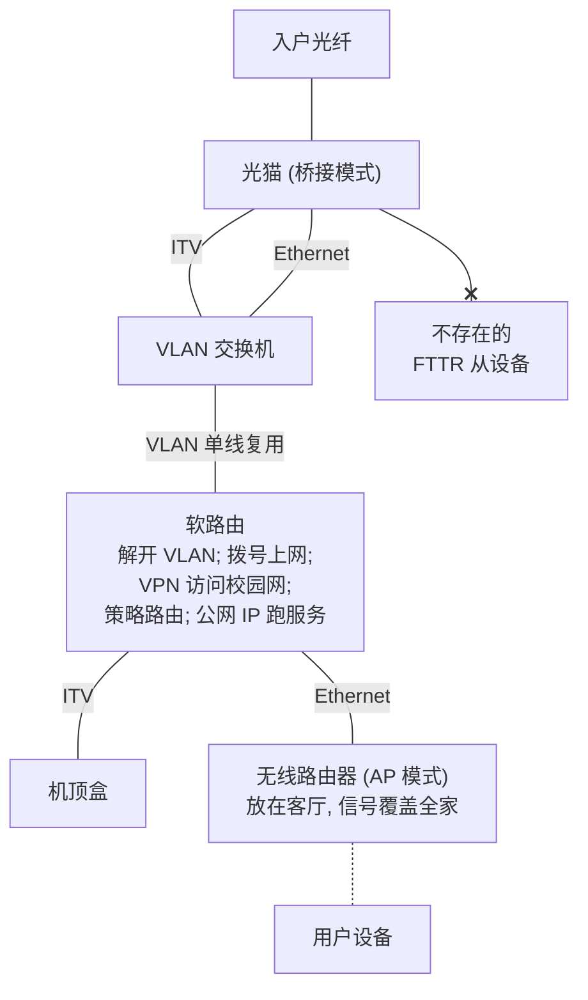
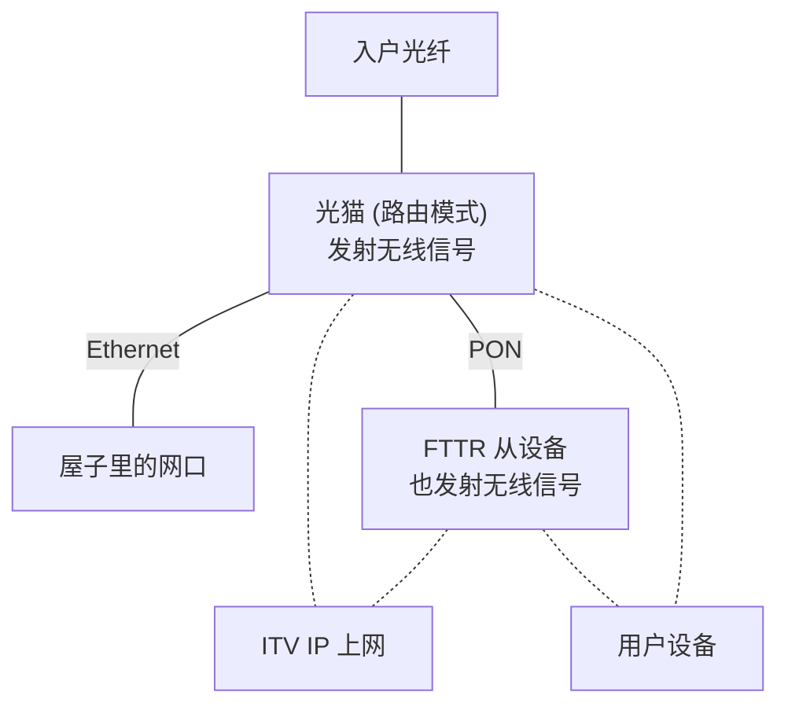
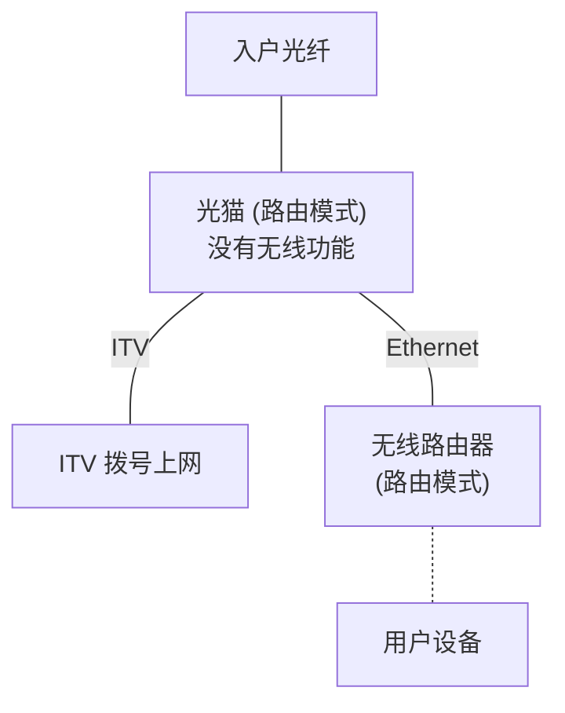

期末考完试之后, [hash](https://land.hash.moe/) 从国外交换回来了, 邀请咱去她家乡旅游. 说是旅游, 其实主要是学习交流活动. 她是一个前端先进技术的追随者 (而咱是写 jQuery 的 xd) 因此我怀抱着学习的心态欣然接受了邀请. 在几天的时间里, 我确实增长了一些见闻, 也有了一些新的思考, 写在这里.

<!-- more -->

## 狼狈的开始

咱应该是 18 号的火车去. 之前 hash 委托 ada 委托咱去 ada 寝室拿个拓展坞 (对, 就是这么乱x) 让咱给忘了, 那天早上跑去发现不开放访客进去 (还没到 8 点). 紧接着咱收拾完东西突然想起找身份证, 发现找不着, 火急火燎地找了 15min 后放弃, 决定用临时身份证明上车. 去车站的路上很赶, 背包带卷进了共享单车的链条, 扯出来之后糊了我一手的链条油. 好在到了车站离检票还有几分钟时间, 咱去厕所狠狠洗了洗书包带.

在车上咱认真研读了如何线上挂失身份证, 如何线上申请补办身份证, 身份证丢失了如何解决, 如何在北京地铁报失身份证, 如何在派出所挂失身份证... 然后我发现没啥用, 身份证丢了还得去户籍地补办. 后面又针对二代身份证为何无法挂失在网上搜索了一番并展开了辩论. 后来得出结论摆烂之后, 快要下火车了, 我把我的电脑装回书包, 然后被什么东西卡住了... 一看发现是身份证 (此时的心情: 不知道是喜是悲)

不管怎样, 至少咱成功来到了四川. ada 的车比咱的早十几分钟到, 已经在站台等咱了. 下车的时候我拿起我的包, 发现被绞进链条的肩带当时受到了太大的力, 用来调节松紧的塑料扣不堪重负已经断掉了. 我不得不决定把双肩包当单肩包用了.

## 出去玩!

四川明显不同于北京东南部的平原, 地势以山地和丘陵为主. 与之相映的是其路网多高架, 纵向跨度大, 结构复杂. 城里由好几座小山组成, 高铁线沿山脚绕过, 多条河流溪径穿城而过.

咱相当喜欢这种工业感 -- 一桥飞架南北, 天堑变通途.

hash 的妈妈很热情地招待了我们. 在这几天的时间里, 我们去简单爬了个山, 简单看了个湖, 简单划了个船 (为什么说是简单呢... 那就不得不提和咱爸妈出去玩的时候搞得跟特种兵负重夜袭似的x), hash 家附近有好多餐馆, 各种当地的吃的, 物价不贵, 量大管饱. 和北京比真是天上地下! (北京物价好贵! (小声))

不过由于咱不太喜欢拍照, 所以这里没有图.

## 关于 hash 家的网...

作为网工 (x), 每到一个地方, 第一件事总是折腾网. 到同学家也不例外.

hash 家是典型的 FTTR (Fiber To The Room) 网络, 弱电箱里面有一个光猫+路由器, 卧室里有一个路由器, 设备是华为的, 接电信, 和咱家的状况类似. 不同的是, 咱家在咱的大刀下变成了这样:

而 hash 家就十分常规 (甚至过于常规):

然后众所周知运营商的光猫这玩意为了节省成本偷工减料相当严重, 动不动就有奇怪的稳定性问题, 加上主设备还在法拉第笼 (弱电箱) 里, 家里的网就时好时坏. 不过吧... 也无可指摘, 毕竟电信就希望你这么用, 要是像咱这么折腾, 坏了都不知道找谁说理去. 万一再被用户投诉就更头大了.

隔日, hash 带咱去了她舅舅 (?, 存疑) 家. 她当时在折腾网, 然后发现那里没有 IPv6, 让咱试着救一下. 咱就照例研究了一下那里的网. 不看不知道, 一看吓一跳: 那里的网有公网 IPv4! 但是网络的层次结构却让这个宝贵的 IPv4 无法发挥用处:

于是我使用了改桥接大法, 给光猫改成了桥接模式, 用路由器拨号, 路由器可以做 DMZ 和端口转发, 这样就可以用他的 v4 地址了. (不过目前用途不明就是.)

## hash 家的... 全屋智能?

其实 "全屋智能" 这个词之前一直只是活跃在电视 / 广告 / 宣传片里面, 咱从来没有真正意义上见过全屋智能的实际例子. hash 家算是最接近全屋智能的一个.

hash 家里用的是小米 (米家) 的智能设备. 包括了灯, 摄像头, 音箱... 总共十个左右的设备. 音箱可以识别基本的指令并完成标准化的工作, 比如开关灯, 开关电视, 播报天气啥的. 十分可惜的是, 她家里的小爱音箱还不支持接入大模型 (当咱写到这里的时候, 咱突然意识到这个功能理应受到支持. 那么为什么没法用呢? 我搜索了一下并发现了一些大模型功能, 但是需要更新的固件才能支持. 于是我和 hash check 了一下是不是固件版本问题导致了无法使用. 结果是:)

> 你给的教程说，可以让小爱写一个关于小猫的睡前故事
>
> 实测这个是可以的
>
> 但是别的方面继续是智障
>
> 然后我正在测试，家母听到了，说我是婴儿，说你请我测试这个功能你也是婴儿（

可以理解为, 小爱确实接入了大模型, 但是其只能以文本对话的形式存在, 而利用大模型的强大理解力解析复杂指令并完成操作的能力有限. 我理解这有一部分安全上的考量; 或许也有成本上的因素.

在这样的情景下, 我认为全屋智能远远未能达到其最大的作用, 而停留在了开灯关灯这种事情上. 而全屋智能在目前看来, 其先决条件是全屋传感器与嵌入式设备, 不同厂商的设备并不互通, 生态绑定相当严重. (讲到这里就要说了, 加快发展 OpenHarmony, 要用统一的操作系统内核规范各个物联网设备, 构建兼容的物联网生态!)

## 辩经

其实可以发现我们去了之后没有真正到多少地方玩. 那么剩下的时间都在干嘛呢? 第一件事是辩经 (笑

ada, hash, hash 妈妈和咱在不同的事情上常常持有不同的观点, 或者说, 政见. 于是我们时常在遇到分歧的时候开始辩经. 但是由于涉及政治问题, 我就不在此叙述了.

## 修博客

咱已经不记得这件事因何而起了, 兴许应该是 hash 给咱展示她的 [博客里的游戏](https://land.hash.moe/connections) 并希望咱提一些建议? 于是咱提出了作为一个含有物理引擎, 碰撞等的 "游戏", 其碰撞是完全塑性的 (碰撞之后两个碰撞体以相同速度向前运动), 看着有些奇怪. 咱在 VSCode 的代码补全里面翻翻找找, 找到了代表弹性碰撞后恢复系数的变量. 后来 hash 又表示她当时的小球与大球之间的吸引力是单向的 (只有大球吸引小球), 反向的力加上去就全乱了. 咱又经过了一些 Debug, 指出了她用的物理引擎同时添加了力和力矩, 而她在每一帧重算力的时候没有重置力矩, 导致多帧的力矩叠加.

其实都是一行代码解决的小问题, 之前一直得不到解决的原因是 hash 没用过物理引擎, 或者说, hash 对物理并不了解, 因而压根没有往正确的方向想过. 这是所谓跨学科培养的益处, 也是为什么大家觉得咱很厉害的原因? 咱什么都知道一点, 因此看很多问题的时候都能以独特的角度切中要点.

再比如昨天 ada 在部署本地 Docker registry, 表示无法添加认证. 它的文档不好找, 但是因为咱有 "可以添加认证" 的正确印象, 因此咱直接选择了翻找 registry 的文档, 果然找到了方法.

## 一些碎碎念

hash 妈妈似乎很喜欢咱 (乐), 可能和咱的温文尔雅 (大雾) (不对) 的性格有关系. 但咱想说温文尔雅的性格有时候来源于被 ~~生活~~ 科协磨平了棱角, 见过太多物种多样性因而选择了兼收并蓄.

此外, 如果有人无意中翻看了 hash 的博客, 可能会看到 hash 是一位特别的女孩子. 鉴于博客的性质和其开放的特征, 我不便在此多做评论. 支持或者反对或者如何, 从字里行间自见分晓.

但是咱还是要说咱羡慕 hash 妹妹!

## 关于博客

hash 推荐过 [Metaphors We Web By](https://maggieappleton.com/metaphors-web/), 讲的是互联网 / 网站的隐喻. 咱问过她, 她对 hashland 何种看法. 她说, 她觉得 hashland 首先是一个日记本, 是一个用于记录的平台. 因此她首先在意的就是博客的排版 --- 不应该有任何的错误或明显的异常. 其次, 她希望博客在成为书面体 (打印) 时能够以文章的形式打印出来.

那咱的博客应该是怎样的隐喻呢?

咱的博客之所以建立, 大约是因为当时整了一些活, 而当时学长觉得有个博客没什么不好, 可以记录下这些事情与其他人分享. 而咱呢... 咱记性不太好, 很多整活的细节隔几天就给忘了, 因此博客很多时候是一个以备后续查找的手段. [Ada 的笔记](https://note.adamanteye.cc/%E8%AE%A1%E7%AE%97%E6%9C%BA%E7%A7%91%E5%AD%A6/Linux/) 或许更加具有这样的属性, 里面事无巨细记录了大量的学习笔记与心得; 而咱的这个就略显单薄.

博客需要其受众, 我遇到的奇怪的问题的解决方案我也期望能影响到更多人. 因此对我来说, 博客的形式并不太重要, 但博客的 SEO 很重要, 否则写的东西不就白写了 (). 基于这样的考量, 我的博客更像是一个交流技术心得体会的平台. 其主要作用是向世界传递我的观点与立场, 因此我做了 canonical, 做了 description 等.

而 hash 对我的博客提出了部分问题, 包括但不限于深色模式, 较低的选中对比度, 部分直引号等. 关于打印, 或许我也应当进行一些改动.

博客用了一个 Hexo 的主题, hash 嫌弃其 "技术栈过于陈旧". 咱也觉得, 毕竟 dependabot 上面还有几个 vuln 天天叫, 但是懒了. 博客只是一个平台, 能用就行 ()

## 返程

咱要被系里发配去 360 打白工, 因此不得不于 22 号返回北京了. ada 找到了一份实习 (羡慕有工资), 于是和咱一块回北京. 愉快的假期结束了w 🥹

## 关于出去玩

本来我对出去玩并没有那么期待. 不过在四川的几天我确实感觉到了休假的好 (x) 既不用操心学习, 又不用操心科研, 也不用担心闲得没事干, 可以爱干啥干啥, 还能极大地增长知识与学问, 真好啊! (就是辩经有点头大)

哎哎但是每当这时候就觉得咱怎么什么都不会啊呜呜

