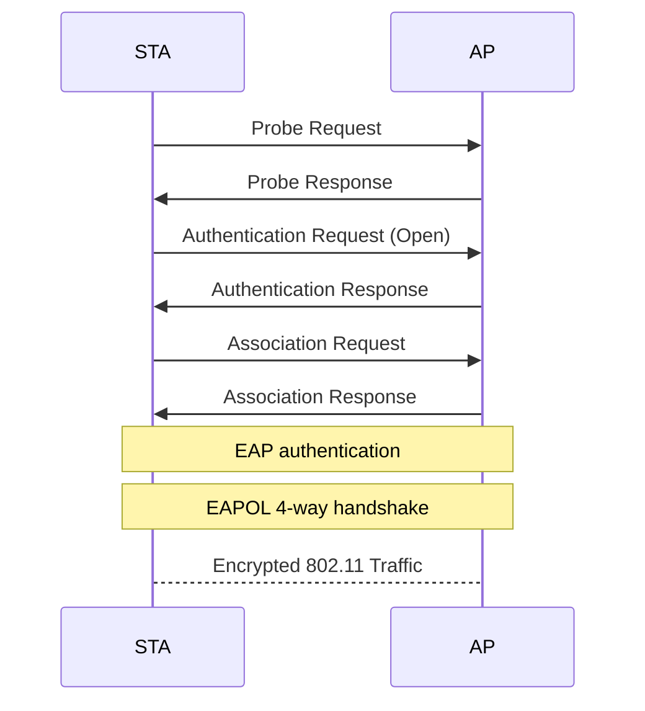
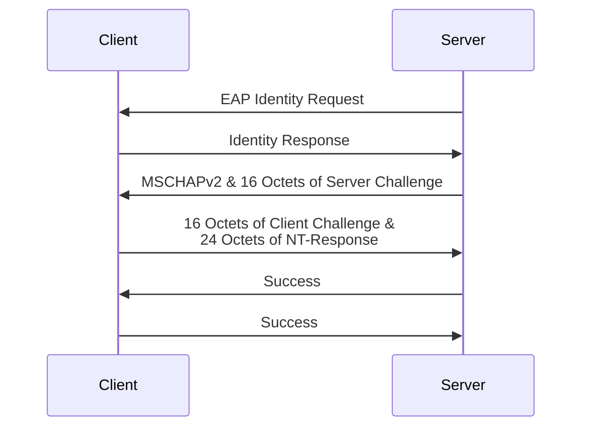
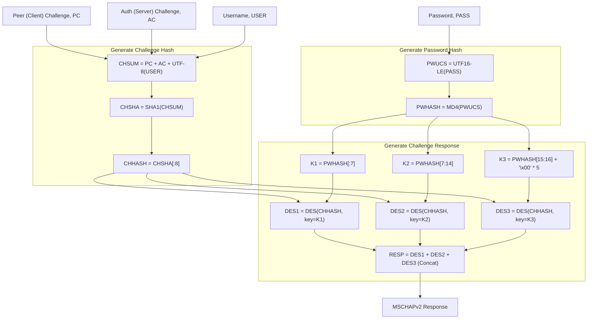

这篇博客的前面一段是流水账, 是与学校推送有关的. 后面是对 Tsinghua-Secure 有关的攻击的探讨.

<!-- more -->

---

## 校园无线网发展的历史

早在2011年，以 “Tsinghua” 为标识的清华校园无线网就首次出现，以笔记本电脑为主要用户，覆盖了教学科研区的一百栋楼，安装了 2250 个无线热点，WiFi-4，典型设备是思科 AIR-CAP3502I-H-K9。

2016 年，随着不断提升的智能手机保有量和日益增长的同学们在宿舍使用无线网的需求，学校进一步扩展了无线网络的覆盖范围，学生宿舍区也迎来了无线网络的覆盖。50 栋宿舍楼被纳入覆盖范围，安装了 6300 个无线接入点。学生宿舍区使用了 Tsinghua 和 Tsinghua-5G 作为无线网络标识，使用 WiFi5 新技术，有了更快更便捷的上网体验。典型设备是将要被换掉的华为 AP4030DN-S。

2018 年，学校启动了 “校园无线网全覆盖升级工程”，不仅扩容了主干网带宽，还升级了旧有网络，增加了楼宇覆盖数量，并建设了无线网室外热点。这一系列举措使得无线网覆盖范围更广，上网速率更快。同时，新增了 Tsinghua-IPv4，Tsinghua-IPv6，Tsinghua-Secure 无线网标识，为师生们提供了更多选择。这些设备都是新华三的。在这之后基本确立了宿舍区华为，教学区华三的格局。后续新建的楼就使用了多种不同的华三设备。

从 2023 年开始的 “学生宿舍区无线网升级工程” 正在如火如荼地进行中。工程的目标是一屋一颗 AP 全覆盖，有线网千兆到桌面，主干网 100G。

## 不同的校园无线网之间的区别

### Tsinghua

作为从第一代校园无线网开始就存在的无线网标识，Tsinghua 无线网是学校最早推出的无线网标识之一。Tsinghua 采用 portal 认证方式，用户接入之后会自动跳转到认证页面，输入用户名和密码即可上网。在第一代校园网中，Tsinghua 标识仅使用 2.4GHz 频段；在升级后，Tsinghua 标识同时支持 2.4GHz 和 5GHz 频段，用户设备会根据自身的偏好自动选择频段接入使用。

### Tsinghua-5G

在 2016 年的校园网升级中，学校推出了 Tsinghua-5G 无线网标识。Tsinghua-5G 采用了 WiFi5 技术，且仅支持 5GHz 频段。这是为了防止部分同时支持 2.4GHz 和 5GHz 的设备由于策略问题选择了 2.4GHz 频段而无法获得更好的上网体验。Tsinghua-5G 无线网标识在宿舍区使用较多，是同学们上网的首选。现在逐渐被弃用了，应该是由于单 SSID 多频段的切换策略越来越正常了。

### Tsinghua-IPv4 和 Tsinghua-IPv6

在 2018 年的升级中，为了响应国家推广 IPv6 的号召，学校推出了 Tsinghua-IPv4 和 Tsinghua-IPv6 两个无线网标识。Tsinghua-IPv4 仅支持 IPv4 协议，而 Tsinghua-IPv6 仅支持 IPv6 协议。用户可以根据自己的网络环境选择接入。同时，新部署的无线网系统能引导用户优先选择 5GHz 频段，提高上网速率。

### Tsinghua-Secure

以上的无线标识都是采用 portal 认证方式，用户每次连接的时候都需要输入用户名和密码才能上网。为了提供更加便捷安全的上网体验，学校推出了 Tsinghua-Secure 无线网标识。Tsinghua-Secure 采用了 802.1X PEAP 认证方式，在传输安全、地址验证、身份认证等方面具有更坚实的保障，让网络使用更加安心。此外，Tsinghua-Secure 只需在设备上正确配置后，在覆盖区域内便能自动连接上网，无需再次登录。

### Tsinghua-Guest

Tsinghua-Guest 是学校为来访人员提供的无线网标识，需要审批后付费使用。

### IVI，DIVI，DIVI-2，Tsinghua-IPv6-SAVA

IVI，DIVI，DIVI-2，Tsinghua-IPv6-SAVA 是科研性质的网络。IVI 中，“IV” 代表 IPv4，“VI” 代表 IPv6。IVI 提供了一种 IPv4 无状态融入 IPv6 的机制。而 DIVI 是 “Double” IVI，提供了一种在纯 IPv6 骨干网环境下实现 IPv4 子网间互联的机制。SAVA 是 “真实原地址验证” 的简写；Tsinghua-IPv6-SAVA 是实现了 SAVA 机制的 IPv6 无线网标识。这些网络主要用于科研工作，连接后可能无法访问互联网；也不属于校园无线网范畴。

### eduroam

eduroam 是一个全球性的无线网络服务，旨在为全球研究和教育机构提供无线网络服务。清华大学是 eduroam 服务的提供方之一，学校的师生可以通过 eduroam 无线网标识在全球范围内连接到 eduroam 服务。同时，来自全球的 eduroam 用户也可以通过 eduroam 无线网标识在清华大学连接到 eduroam 服务。同样的，eduroam 无法访问校园内部资源，清华大学的师生也无法在本校使用 eduroam 服务。

---

**以上是校园网简介.** 

在 *一段时间之前*, Portal 认证方式是 HTTP 的, 没有加密. 加之 Tsinghua 啥的这一坨的网络也是开放的 (Open), 这直接导致了可以 Monitor Mode 侦听直接抓到明文校园网用户名密码.

后来学校强制启用了对登录接口的 HTTP -> HTTPS 跳转, 一定程度上解决了开放 Portal 带来的问题. 但是要想让 Open System 的安全性进一步提高, 看上去 WPA3 OWE 是一个很好的解决方案 ([AOSP Docs](https://source.android.com/docs/core/connect/wifi-wpa3-owe)).

后面就是 Tsinghua-Secure 横空出世了. 作为 802.1X PEAP MSCHAPv2 的企业级热点, 它的安全性比 Portal 模式的好不少. 但是其依然存在不少问题.

## 802.1X PEAP



首先我们观察 PEAP 架构整体的认证过程:

在 STA 发现 AP 后, 首先以 "Open" 方式进行认证和关联. 之后, AP 向 Client 发起 EAP Authentication Request, 要求给出 Anonymous Identity. 然后, AP 发起 PEAP 请求, 建立 TLS 连接握手, 进入第二阶段.

在第二阶段中, 我们使用了 MSCHAPv2 的方式进行了认证. 若认证成功, 则 TLS Session Key 会进行运算后成为用于握手的 PMK.

在协议中, 客户端会对服务器的 TLS 证书进行验证, 以确保 AP 的真实性. 之后, TLS 握手保证了里面所有内容对窃听者保密. 匿名身份可以不填, 这使得用户名和密码都不会明文传输. *在这样的情况下*, WPA2-Enterprise 是安全的.

既然说了 *在这样的情况下*, 那么必然有 *但是* 了: Tsinghua-Secure 的证书并没有以任何官方的方式传递给用户; 官方的连接教程也引导用户 *"不校验证书"*.

## MSCHAPv2

这使得 "伪基站" 的攻击成为了可能: 既然客户端不校验证书, 那么我随便造一个证书, 不就可以欺骗 STA 建立连接, 从而获取 TLS 隧道里面的信息了嘛? 那么 TLS 隧道里面是什么呢? 是 [MSCHAPv2 协议](https://datatracker.ietf.org/doc/html/rfc2759). 这是一个 [已知的不太安全的协议](https://msrc.microsoft.com/blog/2012/08/weaknesses-in-ms-chapv2-authentication/), [Aruba Community](https://community.arubanetworks.com/discussion/ms-chapv2-des3-cracked-in-1-day). 其可以通过 Challenge 和 Response 解析得到用户密码的 MD4 Hash (此时即可通过此 Hash 进行认证从而仿冒用户的身份), 进而通过字典爆破的方式得到用户的明文密码.

## 伪基站

从而我们可以通过伪基站的方式, 自己设置一个 AP 和 RADIUS Server, 进而获取 ID 和密码 Hash. 我首先尝试了 [hostapd](https://w1.fi/hostapd/), 通过把它的 Log Level 打到最高并使用 `-K` 参数要求其在 log 里面打印密码, 我成功拿到了一些 Hex String 但并不知道如何解析. 我还抓了 802.11 Raw 包, 试图通过已知的 Server Key 解析 TLS 连接, 但是由于 Wireshark 的原生支持太差而倒闭了 (懒, 其实也是因为在搜索的过程中找到了更好的解决方案).

之后我在查如何解析这些 Hex String 的时候找到了 [**hostapd-wpe**](https://github.com/OpenSecurityResearch/hostapd-wpe) 这个仓库, 它完美符合我的想象: 通过 patching hostapd 可以伪造一个 RADIUS server, 其作用就是在用户连接到它的时候把 Challenge 和 Response 给打出来. 不过在编译的时候我遇到了亿点问题, 主要是对 `openssl-1.0-dev` 这个老掉牙现在在仓库里找不着了的库的引用导致的. 后来了解到 Kali 源上面有这个玩意的 Binary (不愧是 Kali), 我就小小用了一下. 他还支持另一个很有潜力 (x) 的功能: 它允许在用户给任何密码的时候都接受, 这样就可以监控连进来的用户的流量了.

折腾了半天 (literally), 感觉还行, 故作此 ()

---

## 在 Arch 上的安装与调试

**Update 2025-02-09**: 由于我的笔记本电脑疑似有些太新了 (Ultra 200V), 需要 Linux Kernel 6.12 才能用, 所以我实际使用了 Arch Linux.

Arch Linux 上面的 hostapd-wpe 作为一个 [AUR](https://aur.archlinux.org/packages/hostapd-wpe) 出现, 但是这个 AUR 安装之后并不像 Arch 一样带有全套的配置, 这些配置啥的需要自己生成. 简单地说:

### 配置文件 hostapd-wpe.conf

这有一份示例文件:



```ini
interface=wlo1

logger_syslog=0
logger_stdout=-1
logger_stdout_level=2

country_code=CN
ieee80211d=1
ssid=PKU Secure
hw_mode=g
channel=11
beacon_int=90
#rts_threshold=2048
#fragm_threshold=2048
supported_rates=10 20 55 110 60 90 120 180 240 360 480 540
basic_rates=20 55 110
preamble=1
wmm_enabled=1

ieee80211n=1
ht_capab=[SHORT-GI-20]
require_ht=0

auth_algs=1
ap_isolate=1
ieee8021x=1
eapol_version=1
wpa=2
wpa_key_mgmt=WPA-EAP
wpa_pairwise=CCMP
rsn_pairwise=CCMP
pac_key_lifetime=604800
pac_key_refresh_time=86400
pac_opaque_encr_key=000102030405060708090a0b0c0d0e0f


eap_server=1
eap_fast_a_id=8485454491921910bcb70b0a01020000
eap_fast_a_id_info=Huawei
eap_fast_prov=3
eap_user_file=eap_user
ca_cert=ca.pem
server_cert=server.pem
private_key=server.prv
private_key_passwd=whatever
```



我们需要做的主要是修改这个文件以做到两件事:

其一是让客户端能正常尝试连接以获取 Hash; 这件事较为简单, 这份配置文件就能用.

其二是 *如何伪装自己使得客户端觉得你比真正的 AP 更好, 而优先选择连接你*. 这件事就比较麻烦了, 为了这事我又折腾了半天 (然后还没成功).

在这份配置文件里面 (配置文件的具体格式见 [官方文档](https://w1.fi/cgit/hostap/plain/hostapd/) ), 我们设置了使用内建的 RADIUS Server, 设置了使用的证书文件 (都是自签名的), 配置了 AP 的信道为 2.4GHz CH11, 把该开的东西都开了. 里面有两行注释掉的内容, 这两个是为了... *理论上* 是在干扰较严重的情况下用短帧提高 Wi-Fi 传输成功率; 但 *实际上* 如果压到太低, 会导致 PEAP 握手包 (尤其是 TLS Handshake 里面要传输证书) 被分片, 最后导致 Association Failure. <u>应该限制 A-MPDU 长度来提高成功率.</u>

而客户端 **常常 Prefer 更高级的热点** - 也就是说如果你能用 Wi-Fi 7 发射信号 (打开 HT, VHT, EHT 啥的) 并打开 80MHz 频宽, 那么客户端就很喜欢你 (x). 如果能用 5GHz 频段发射信号, 那就比 2.4GHz 优先级高得多. 因此我尝试在我的电脑上开 5GHz 热点 ~~然后大败而归~~, 这个后面说.

这个文件里面引用了好几个文件.

### eap_user

这个文件是用来配置内置 RADIUS Server 的凭据的. 由于 Patch 了这个 Server, 我们只需要一个 Dummy One 就行:

```
# WPE - DO NOT REMOVE - These entries are specifically in here 
*		PEAP,TTLS,TLS,FAST
"t"	    TTLS-PAP,TTLS-CHAP,TTLS-MSCHAP,MSCHAPV2,MD5,GTC,TTLS,TTLS-MSCHAPV2  "t"	[2]
```

允许任何用户用 PEAP 认证, 随便塞点能用的就行.

### 一堆私钥和证书

使用以下方式来生成这一坨证书:

```sh
# 私钥
openssl genpkey -algorithm RSA -out /etc/hostapd/server.prv -aes256
# 服务器证书
openssl req -new -x509 -key /etc/hostapd/server.prv -out /etc/hostapd/server.pem -days 3650
# CA 签名请求
openssl req -new -newkey rsa:2048 -days 3650 -nodes -keyout /etc/hostapd/ca.key -out /etc/hostapd/ca.csr
# CA 自签名证书
openssl x509 -req -in /etc/hostapd/ca.csr -signkey /etc/hostapd/ca.key -out /etc/hostapd/ca.pem -days 3650
```

这样就完活了.

## 5G AP?

这之后我尝试发射 5G 信号, 然后发现所有信道都是 `No-IR` 状态, 用不了. 我上网查了半天, 最后决定看来只能先 Patch 一下 `iwlwifi` module, 把 `No-IR` 给删了 ( 比如 [这个 Patch](https://github.com/CristianVladescu/5ghz-ap-driver-patches/blob/main/iwlwifi_no_ir.patch) ). 在折腾了一番之后完全失败, 即便删掉了 No-IR 还是没法发射信号, 遂暂时作罢, 下单了 MTK 的 USB *免驱* 网卡, 择日再战 (x)

TUNA 的群友对 "有人用过 intel 网卡的热点吗" 评论道:

> 不存在的, 建议换 mtk

## Hostapd 的一些坑

我在调试 hostapd 的时候被坑惨了, 主要原因是 hostapd 的不少设置项的文档都写着

> If this field is not included in hostapd.conf, hostapd will not control RTS threshold and 'iwconfig wlan# rts \<val\>' can be used to set it.

这句话有一个隐含的意思: 如果 hostapd 更改了这个配置, 在停止的时候他 *不会帮你改回去*. 我尝试通过注释掉一些设置来 Debug 的时候, 这个行为实际导致了某个设置项一旦写上去, 那么就 *半永久* 地生效了, 注释掉也没用... 直到我打开另一台电脑的 Monitor Mode 抓包看到了异常的 Fragmented Frame 才反应过来.

## MSCHAPv2 (2)

**UPDATE 2025-02-12:** 我的新 WiFi 网卡到了, 我又研究了一下:

首先是关于 MSCHAPv2 哈希解密有关的, 我们研究 MSCHAPv2 的流程:



具体使用 Server Challenge, Peer Challenge 和 username, password 计算 NT-Response 的方式如下:



(这个图花了我 20 min) 可以看出来的是这里从 Response 可以直接逆向得到各个 DES 块的 Plaintext 和 Ciphertext, 进而可以利用 Known Plaintext Attack 得到 PWHASH; 不过更好的方式还是得到大量的 Hash 然后爆破弱密码.

此外, 由于 Client Challenge 的缘故, 我们没办法把盐 (这里的 DES 明文) 固定, 所以比较可惜.

## 5G AP (2)

新网卡是 MTK 的, 但是默认情况下依然是大量信道 No-IR. 还得 Patch 驱动 (). 不过我用 36 信道的 HT40+ 试过了, 确实是可以用并获得哈希的.

## 5G AP (3)

**UPDATE 2025-02-17:** 开学了, 终于可以实地实验了! 我又研究了一下究竟如何才能正确发射 5GHz 信号, 外加得到了一些短期的成果. 首先是关于 No-IR 的问题: 我终于是看懂了到底是怎么一回事.

是否 PASSIVE-SCAN 取决于 Regulatory DB 怎么说. 对于内嵌的这张 Intel 的网卡, 其 RegDB 是写死在固件里面的 (`iw reg get` 显示 `self-managed`, 不由系统统一管理), 是 "CN, DFS-UNSET", 且同时在所有信道都要求 Passive Scan. 因此, Linux Driver 也遵照这个固件指引的 RegDB 去执行. 之前 Patch Driver 的时候虽然删掉了这段逻辑, 但是网卡的固件没变, 不 Passive Scan 就尝试发射信号进入 AP 模式的命令会被固件直接 Reject 掉 (太安全了!).

而 MTK 的卡确实没有这个问题, 其 Regulatory Domain 就是系统的. 然而, Arch 默认没有安装 RegDB (crda), 系统 Fallback 到了 `00` Domain, 此时只允许大部分国家都有的那些 channel, 且都要 Passive Scan.

我在一圈搜索之后终于意识到了这一点, 安装了 CRDA 并修改了 Config 文件, 将地区设置为 CN. 重启之后的默认地区就是 CN 了, 这时的符合中国无线电标准的那些频率就不需要 Passive-Scan 了, 可以直接发射信号.

我这张卡支持的规格不高, 只有 802.11ac, 40MHz 频宽. 在教学楼里面竞争不过校园网 AP (没办法喽), 不过在户外没有 Tsinghua-Secure 信号的地方还是很有效的.

## 实地攻击

我在几段时间和地点进行了测试:

- 刚下课, 教学楼门口
- 已经上课了, 学堂路
- 饭点, 某没有校园网的食堂
- 饭点, 某有校园网的食堂
- 晚上, 操场

在各个地方我都能收到一些连接请求和哈希. 人越多, 用手机的人越多, 校园网越差, 尝试连接我的伪基站的人越多. 比起 2.4GHz 的热点, 客户端倾向于先连接 5GHz 的. 不少客户端能观测到连续连接两次的特征, 应该是第一次用于测试是否可连接, 第二次正式连接.

同时, **对各个系统的观测如下**:

- Android
  - "不校验证书": 直接连接
  - "使用系统证书" + "tsinghua.edu.cn 域名": 安全的. 会 SSL Alert 后退出
- iOS
  - 会弹出提示, 新的证书与老的不同, 可以查看证书. 至于用户会不会点确认, 我不好说
- Windows
  - 与 iOS 相似, 但 Windows 不会告诉用户当前的证书是啥, 只会问用户 "你是否认为你应该在此处看到此 SSID"
- Linux
  - 与 Android 相似 (?) 未测试

这告诉我们 **信任系统证书 + 校验域名是安全的做法**. *应当* 让 its 出一版新的 Tsinghua-Secure 教程, 指导大家这么用.

**对所有哈希的观测如下**:

我们总共拿到了近 2000 次登录尝试的 Hash, 属于 367 个不同的用户 (包括我自己). 如果用 DES 强行解密的方式, 解出所有的 MD4 哈希 (这等同于知道了认证凭据) 需要 4 年 (爆破工具为 1 张 4070s). 因此我还是选择了 *ROCKYOU.txt* 的方式.

使用 Kali 的 Rockyou + 一些 Rules, 总时间在 4h 以内, 截至写下这段话的时候跑了 60% 左右

````
Guess.Base.......: File (../wordlists/rockyou.txt)
Guess.Mod........: Rules (../wordlists/OneRuleToRuleThemLong.rule)
Speed.#1.........: 23522.3 MH/s (40.10ms) @ Accel:512 Loops:256 Thr:128 Vec:1
Recovered........: 58/367 (15.80%) Digests (total)
````

Quite Good (?)
