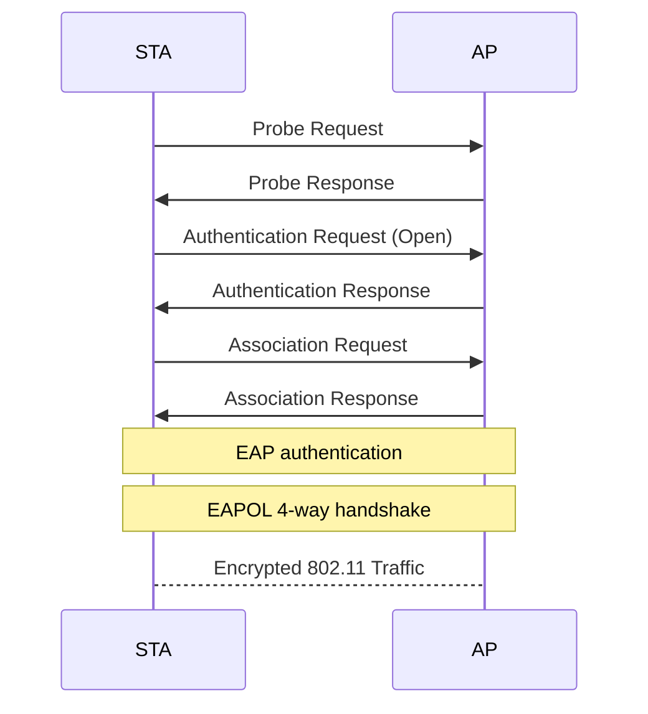
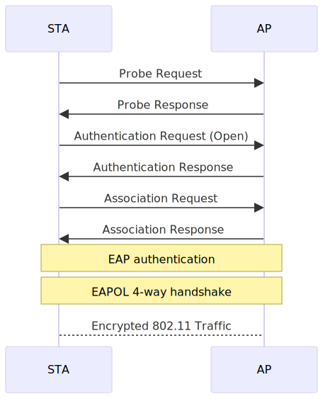

这篇博客的前面一段是流水账, 是与学校推送有关的. 后面是对 Tsinghua-Secure 有关的攻击的探讨.

<!-- more -->

---

## 校园无线网发展的历史

早在2011年，以 “Tsinghua” 为标识的清华校园无线网就首次出现，以笔记本电脑为主要用户，覆盖了教学科研区的一百栋楼，安装了 2250 个无线热点，WiFi-4，典型设备是思科 AIR-CAP3502I-H-K9。

2016 年，随着不断提升的智能手机保有量和日益增长的同学们在宿舍使用无线网的需求，学校进一步扩展了无线网络的覆盖范围，学生宿舍区也迎来了无线网络的覆盖。50 栋宿舍楼被纳入覆盖范围，安装了 6300 个无线接入点。学生宿舍区使用了 Tsinghua 和 Tsinghua-5G 作为无线网络标识，使用 WiFi5 新技术，有了更快更便捷的上网体验。典型设备是将要被换掉的华为 AP4030DN-S。

2018 年，学校启动了 “校园无线网全覆盖升级工程”，不仅扩容了主干网带宽，还升级了旧有网络，增加了楼宇覆盖数量，并建设了无线网室外热点。这一系列举措使得无线网覆盖范围更广，上网速率更快。同时，新增了 Tsinghua-IPv4，Tsinghua-IPv6，Tsinghua-Secure 无线网标识，为师生们提供了更多选择。这些设备都是新华三的。在这之后基本确立了宿舍区华为，教学区华三的格局。后续新建的楼就使用了多种不同的华三设备。

从 2023 年开始的 “学生宿舍区无线网升级工程” 正在如火如荼地进行中。工程的目标是一屋一颗 AP 全覆盖，有线网千兆到桌面，主干网 100G。

## 不同的校园无线网之间的区别

### Tsinghua

作为从第一代校园无线网开始就存在的无线网标识，Tsinghua 无线网是学校最早推出的无线网标识之一。Tsinghua 采用 portal 认证方式，用户接入之后会自动跳转到认证页面，输入用户名和密码即可上网。在第一代校园网中，Tsinghua 标识仅使用 2.4GHz 频段；在升级后，Tsinghua 标识同时支持 2.4GHz 和 5GHz 频段，用户设备会根据自身的偏好自动选择频段接入使用。

### Tsinghua-5G

在 2016 年的校园网升级中，学校推出了 Tsinghua-5G 无线网标识。Tsinghua-5G 采用了 WiFi5 技术，且仅支持 5GHz 频段。这是为了防止部分同时支持 2.4GHz 和 5GHz 的设备由于策略问题选择了 2.4GHz 频段而无法获得更好的上网体验。Tsinghua-5G 无线网标识在宿舍区使用较多，是同学们上网的首选。现在逐渐被弃用了，应该是由于单 SSID 多频段的切换策略越来越正常了。

### Tsinghua-IPv4 和 Tsinghua-IPv6

在 2018 年的升级中，为了响应国家推广 IPv6 的号召，学校推出了 Tsinghua-IPv4 和 Tsinghua-IPv6 两个无线网标识。Tsinghua-IPv4 仅支持 IPv4 协议，而 Tsinghua-IPv6 仅支持 IPv6 协议。用户可以根据自己的网络环境选择接入。同时，新部署的无线网系统能引导用户优先选择 5GHz 频段，提高上网速率。

### Tsinghua-Secure

以上的无线标识都是采用 portal 认证方式，用户每次连接的时候都需要输入用户名和密码才能上网。为了提供更加便捷安全的上网体验，学校推出了 Tsinghua-Secure 无线网标识。Tsinghua-Secure 采用了 802.1X PEAP 认证方式，在传输安全、地址验证、身份认证等方面具有更坚实的保障，让网络使用更加安心。此外，Tsinghua-Secure 只需在设备上正确配置后，在覆盖区域内便能自动连接上网，无需再次登录。

### Tsinghua-Guest

Tsinghua-Guest 是学校为来访人员提供的无线网标识，需要审批后付费使用。

### IVI，DIVI，DIVI-2，Tsinghua-IPv6-SAVA

IVI，DIVI，DIVI-2，Tsinghua-IPv6-SAVA 是科研性质的网络。IVI 中，“IV” 代表 IPv4，“VI” 代表 IPv6。IVI 提供了一种 IPv4 无状态融入 IPv6 的机制。而 DIVI 是 “Double” IVI，提供了一种在纯 IPv6 骨干网环境下实现 IPv4 子网间互联的机制。SAVA 是 “真实原地址验证” 的简写；Tsinghua-IPv6-SAVA 是实现了 SAVA 机制的 IPv6 无线网标识。这些网络主要用于科研工作，连接后可能无法访问互联网；也不属于校园无线网范畴。

### eduroam

eduroam 是一个全球性的无线网络服务，旨在为全球研究和教育机构提供无线网络服务。清华大学是 eduroam 服务的提供方之一，学校的师生可以通过 eduroam 无线网标识在全球范围内连接到 eduroam 服务。同时，来自全球的 eduroam 用户也可以通过 eduroam 无线网标识在清华大学连接到 eduroam 服务。同样的，eduroam 无法访问校园内部资源，清华大学的师生也无法在本校使用 eduroam 服务。

---

**以上是校园网简介.** 

在 *一段时间之前*, Portal 认证方式是 HTTP 的, 没有加密. 加之 Tsinghua 啥的这一坨的网络也是开放的 (Open), 这直接导致了可以 Monitor Mode 侦听直接抓到明文校园网用户名密码.

后来学校强制启用了对登录接口的 HTTP -> HTTPS 跳转, 一定程度上解决了开放 Portal 带来的问题. 但是要想让 Open System 的安全性进一步提高, 看上去 WPA3 OWE 是一个很好的解决方案 ([AOSP Docs](https://source.android.com/docs/core/connect/wifi-wpa3-owe)).

后面就是 Tsinghua-Secure 横空出世了. 作为 802.1X PEAP MSCHAPv2 的企业级热点, 它的安全性比 Portal 模式的好不少. 但是其依然存在不少问题.

## 802.1X PEAP

首先我们观察 PEAP 架构整体的认证过程:

在 STA 发现 AP 后, 首先以 "Open" 方式进行认证和关联. 之后, AP 向 Client 发起 EAP Authentication Request, 要求给出 Anonymous Identity. 然后, AP 发起 PEAP 请求, 建立 TLS 连接握手, 进入第二阶段.

在第二阶段中, 我们使用了 MSCHAPv2 的方式进行了认证. 若认证成功, 则 TLS Session Key 会进行运算后成为用于握手的 PMK.

在协议中, 客户端会对服务器的 TLS 证书进行验证, 以确保 AP 的真实性. 之后, TLS 握手保证了里面所有内容对窃听者保密. 匿名身份可以不填, 这使得用户名和密码都不会明文传输. *在这样的情况下*, WPA2-Enterprise 是安全的.

既然说了 *在这样的情况下*, 那么必然有 *但是* 了: Tsinghua-Secure 的证书并没有以任何官方的方式传递给用户; 官方的连接教程也引导用户 *"不校验证书"*.

## MSCHAPv2

这使得 "伪基站" 的攻击成为了可能: 既然客户端不校验证书, 那么我随便造一个证书, 不就可以欺骗 STA 建立连接, 从而获取 TLS 隧道里面的信息了嘛? 那么 TLS 隧道里面是什么呢? 是 [MSCHAPv2 协议](https://datatracker.ietf.org/doc/html/rfc2759). 这是一个 [已知的不太安全的协议](https://msrc.microsoft.com/blog/2012/08/weaknesses-in-ms-chapv2-authentication/), [Aruba Community](https://community.arubanetworks.com/discussion/ms-chapv2-des3-cracked-in-1-day). 其可以通过 Challenge 和 Response 解析得到用户密码的 MD4 Hash (此时即可通过此 Hash 进行认证从而仿冒用户的身份), 进而通过字典爆破的方式得到用户的明文密码.

## 伪基站

从而我们可以通过伪基站的方式, 自己设置一个 AP 和 RADIUS Server, 进而获取 ID 和密码 Hash. 我首先尝试了 [hostapd](https://w1.fi/hostapd/), 通过把它的 Log Level 打到最高并使用 `-K` 参数要求其在 log 里面打印密码, 我成功拿到了一些 Hex String 但并不知道如何解析. 我还抓了 802.11 Raw 包, 试图通过已知的 Server Key 解析 TLS 连接, 但是由于 Wireshark 的原生支持太差而倒闭了 (懒, 其实也是因为在搜索的过程中找到了更好的解决方案).

之后我在查如何解析这些 Hex String 的时候找到了 [**hostapd-wpe**](https://github.com/OpenSecurityResearch/hostapd-wpe) 这个仓库, 它完美符合我的想象: 通过 patching hostapd 可以伪造一个 RADIUS server, 其作用就是在用户连接到它的时候把 Challenge 和 Response 给打出来. 不过在编译的时候我遇到了亿点问题, 主要是对 `openssl-1.0-dev` 这个老掉牙现在在仓库里找不着了的库的引用导致的. 后来了解到 Kali 源上面有这个玩意的 Binary (不愧是 Kali), 我就小小用了一下. 他还支持另一个很有潜力 (x) 的功能: 它允许在用户给任何密码的时候都接受, 这样就可以监控连进来的用户的流量了.

折腾了半天 (literally), 感觉还行, 故作此 ()
