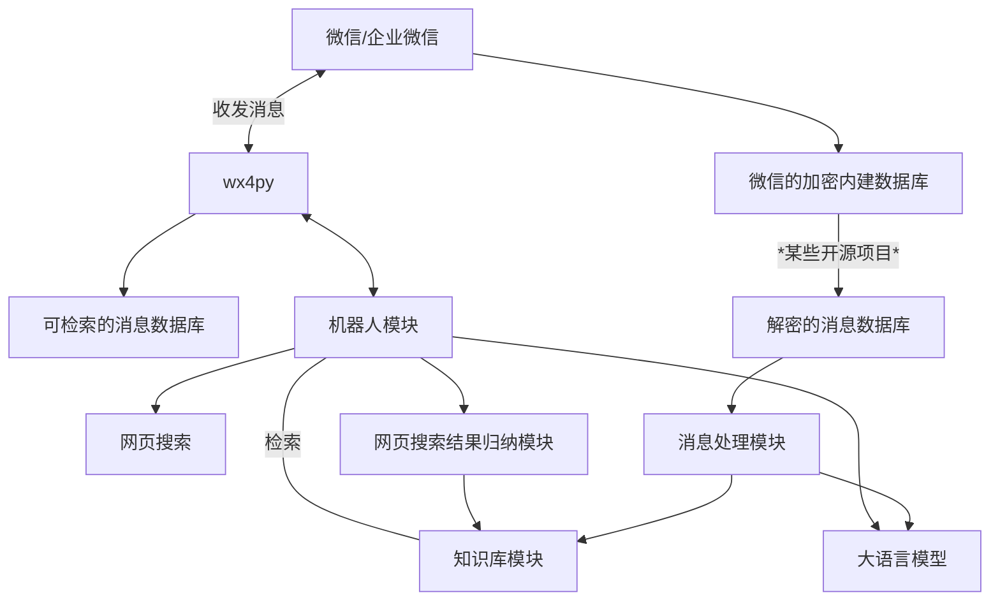

这几天 OpenClaw 实在是有点火, 正好提到可以接入企业微信, 我就萌生了一个把机器人接入企业微信的想法 (其实科服的其他老人应该有这个想法很久了). 调研一番之后发现 sb 企业微信的机器人没办法获取群聊的消息内容, 我于是整了点花活. 一部分的前置工作在  这篇文章里, 这篇文章主要是软件工程系统的需求构思和设计.

<!-- more -->

---

好吧... 等到我再次打算写这篇文章已经是 7 月了. OpenClaw 感觉已经火过去了, 但是让 AI 机器人 / AI 助手总结企业微信群聊, 当一个 Assistant 的需求还是存在的. 但是... 微信的 *$%#@&#$@$#! 封闭的生态和不允许使用第三方工具介入的政策还是很 *&*#%$@&%$!!@*

上句话写于 7.1, 过了两天, 科服的黄先生发现了一个叫 [wx4py](https://github.com/claw-codes/wx4py) 的项目, 思路和我那个不太一样, 它通过 Qt 的 Accessibility 接口获取 UI 上面的信息 (但是只有 UI 上面的信息, 就不能一键看到诸如 wxid 之类的好东西了). 然后, 对于发送消息, 它模拟键盘和鼠标, 通过粘贴 + 回车的方式发送.

这样一来其实解决了收发消息的问题. 或者说, 至少解决了发消息的问题. 但是非常不幸, 这玩意得在 Windows 上面跑 (没有人给它写 Linux 的支持, 或许我可以试一试?)

---

然后我们来构思整个企业微信助手的需求. 其希望解决的问题自然是 ~~把线上班优化掉~~ ~~赶紧把来问 SB 问题的客户打发走~~ 使得线上班更加高效. 这可以拆分为几个部分.



## 机器人部分

这部分黄先生基本已经实现了, 让 Codex 搓了一个简易的 Agent 框架, 在收到信息的时候检查是否有 @ mention, 如果有, 根据 /operation 调用 function, 包括清除上下文, 自动回复, 网页搜索等, 用的 DeepSeek V4 Flash 模型.

当然这个 Agent 现在还有问题. 他现在无法处理交叠的 Session, 如果一个群里有两个并行的对话, 那么 Agent 经常把对话弄混 (好吧考虑到 V4 现在是个预览版, 或许半个月后发的正式版会正常一些). 当然这个的主要问题应该是, 框架目前无法返回消息的发送者, 因此不能简单的通过发送者来分组. 另外, 知识库尚未完整实现, Agent 无法记住过去的状态.

## 知识库部分

每次都上网查显然是低效的. 因此, 机器人模块在进行网页搜索之后应该有一个专用的模块用于把搜索结果进行总结归纳, 形成知识. 同时, 客户群里面的问题本身也是很好的知识来源. 由于客户的 session 其实不算多, 在线处理把 session 变成知识库似乎没那么必要. 因此, 我计划找一个解密微信数据库的工具, ~~定期~~ ~~偶尔~~ 一两个月一次把微信的数据库 dump 出来, 然后根据时间切分, 弄个 Agent 对所有的对话记录进行分类整理为 Session, 然后总结每一个 Session 形成知识库.

对于提取数据库, 网上有大把的工具.... 都被鹅厂 DMCA Takedown / 发律师函了. 因此, 在博客上分享如何做可能也会发律师函, 所以鉴于他是南山必胜客, 我觉得还是小心为妙. 但是我听说网上一直会涌现新的工具, 所以或许读者自己去找找也不是不能找到.

提取的流程大致是, 微信在登录后会下发数据库的解密密钥, 这个密钥存储在内存中, 由于内存对齐, 可以扫描整个微信的 RW 内存空间的所有 32B, 尝试解密 SQLCipher. 如果成功那么那就是密钥, 密钥是不时变的, 存下来就行.

由于我去年 10 月被误操作踢出了科服的企业微信, 我本地的数据中只有将近一年的数据 (好吧也够了) (好吧我是今年 2 月被误操作踢出去的, 看来 25 年 10 月是因为我当时换成了 native 的 Linux 微信).

数据包含, 约 17k 条消息, 约 1.4k 张图片.

---

## 智能体参考

对于一次回复, 我期望的上下文包括:

- Session 信息和会话
- 用户的历史消息
- 当前时刻群里其他 session 的简要概述

---

昨天晚上我给黄先生的 NUC 装了 Codex, 让他给我把整个 UIA 树给 dump 下来了. 发现, 微信压根就没有把消息的发送者信息放进这棵树. 那么这样一来, 机器人没办法区分到底哪条消息是谁发的了, 就相当倒闭. 离线的数据库我倒是让他形成了比较好的分离 Sess 的结果, 类似:

```markdown
## 笔记本液金更换与清灰咨询

### Keywords
- Problem category: Hardware
- Sub-category: Fan/Cooling, Liquid Metal, Dust Cleaning
- Brand: ROG, 魔霸7p
- Solve status: Answered

- Session: `sess-xxx`
- Group: 科技服务队服务③群
- Time: 2025-11-19T13:02:34+00:00 to 2025-11-19T13:07:07+00:00
- Requester: ???@微信
- Status: media_required
- Issue: 用户询问能否将笔记本液金更换为相变片，并提及魔霸7p异常关机；随后询问单独清灰服务。
- Diagnosis/cause: 液金更换因缺乏处理条件被拒绝；异常关机可能与散热或液金状态有关，但未深入诊断。
- Advice/resolution: 液金更换无法提供；清灰服务可行，建议直接到线下处理。
- Evidence: *some message refs*
- Attachments: att

用户???咨询笔记本液金更换为相变片及清灰服务，提及魔霸7p异常关机。服务方<1>表示无法处理液金，<2>确认清灰可行并邀请线下办理。用户发送图片，需视觉审查以确认具体问题。
```

并且, 那个通过 UIA 获取信息的仓库的 Issue 里面发现, 更新微信之后 UIA 树里面啥也没了, 搞了半天 tmd 鹅厂一天到晚不干人事就想着堵这些自动化的门...